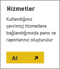
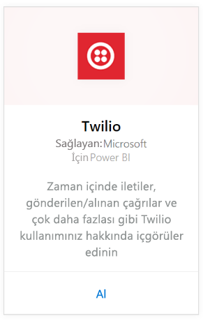
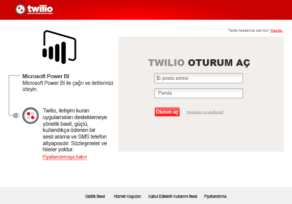
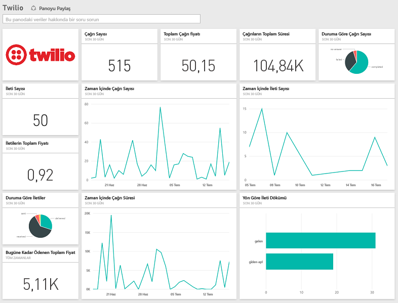

# Power BI ile Twilio'ya bağlanma
Power BI için Microsoft Twilio içerik paketi, verilerinizi Power BI'a çekmenize olanak sağlar ve verilerinize ilişkin öngörüleri gösteren, kullanıma hazır bir [Twilio panosu](https://powerbi.microsoft.com/integrations/twilio) ile bir rapor oluşturur. Ayrıca, Power BI'ın oluşturduğu veri kümesinde özel raporlar ve pano oluşturabilirsiniz. Veriler günde bir kez yenilenir ve sürekli güncel kalır.

Power BI için [Twilio içerik paketine](https://app.powerbi.com/getdata/services/twilio) bağlanın.

## Bağlanma
1. Sol gezinti bölmesinin alt kısmında bulunan **Veri Al**'ı seçin.
   
    
2. **Hizmetler** kutusundaki **Al** seçeneğini belirleyin.
   
    
3. **Twilio** \> **Al**'ı seçin.
   
   
4. **Kimlik doğrulama yöntemi** için **OAuth2** \> Oturum Aç'ı seçin. İstendiğinde Twilio kimlik bilgilerinizi girin ve verilerinize erişmesi için Power BI uygulamasını yetkilendirin.
   
   
5. Bu işlemin ardından, Twilio hesabınızdaki verileri içeri aktarma işlemi başlatılır ve panonuz son 30 güne ilişkin çağrı ve mesaj kullanımınıza göre doldurulur. 
   
   

**Sırada ne var?**

* Panonun üst tarafındaki [Soru-Cevap kutusunda soru sormayı](consumer/end-user-q-and-a.md) deneyin
* Panodaki [kutucukları değiştirin](service-dashboard-edit-tile.md).
* Bağlantılı raporu açmak için [bir kutucuk seçin](consumer/end-user-tiles.md).
* Veri kümeniz günlük olarak yenilenecek şekilde zamanlanır ancak yenileme zamanlamasında değişiklik yapabilir veya **Şimdi Yenile** seçeneğini kullanarak istediğinizde veri kümenizi kendiniz de yenileyebilirsiniz.

## Neleri kapsar?
Son 30 gün boyunca yapılan tüm çağrı ve mesaj işlemleri ile ilgili ayrıntılı bilgiler. Bu veriler üzerinde her türlü analiz ve toplama işlemi gerçekleştirebilirsiniz.

Takip etmek isteyebileceğiniz, önceden toplanmış bir dizi istatistik. Şunları kapsar:

        All Time Calls Count  
        All Time Calls Duration  
        All Time Calls Price  
        All Time Messages Price  
        All Time Messages Count  
        All Time Count of Phone Numbers  
        All Time Price of Phone Numbers  
        All Time Twilio Client Calls Price  
        All Time Twilio Client Calls Duration  
        All Time Twilio Client Calls Count  
        All Time Total Price  
        All Time Inbound Calls Price  
        All Time Inbound Calls Duration  
        All Time Inbound Calls Count  
        All Time Outbound Calls Price  
        All Time Outbound Calls Duration  
        All Time Outbound Calls Count  
        This Month Calls Price  
        This Month Calls Duration  
        This Month Calls Count  
        This Month Messages Count  
        This Month Messages Price  
        This Month Count of Phone Numbers  
        This Month Price of Phone Numbers  
        This Month Twilio Client Calls Price  
        This Month Twilio Client Calls Duration  
        This Month Twilio Client Calls Count  
        This Month Total Price  
        This Month Inbound Calls Price  
        This Month Inbound Calls Duration  
        This Month Inbound Calls Count  
        This Month Outbound Calls Price  
        This Month Outbound Calls Duration  
        This Month Outbound Calls Count  
        This Month Inbound Messages Price  
        This Month Inbound Messages Count  
        This Month Outbound Messages Price  
        This Month Outbound Messages Count

## Sorun giderme
Son 30 güne ilişkin veri miktarı çok fazlaysa (yüz binlerce işlem) veri alma adımı başarısız olabilir. Bu sorunun farkındayız ve sorunu gidermeye çalışıyoruz. Bu sorunla karşılaşırsanız bizi bilgilendirmek için lütfen Power BI sayfasının üst kısmında bulunan destek bağlantısını kullanın. Böylece daha fazla araştırma yapmak için sizinle irtibata geçebiliriz.

## Sonraki adımlar
[Power BI ile çalışmaya başlama](service-get-started.md)

[Power BI'da veri alma](service-get-data.md)

