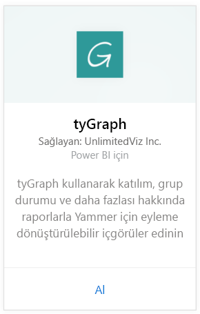
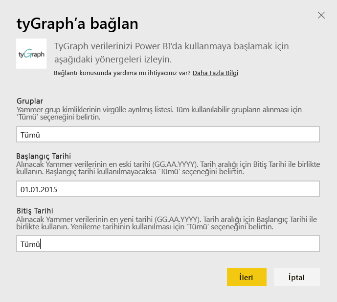
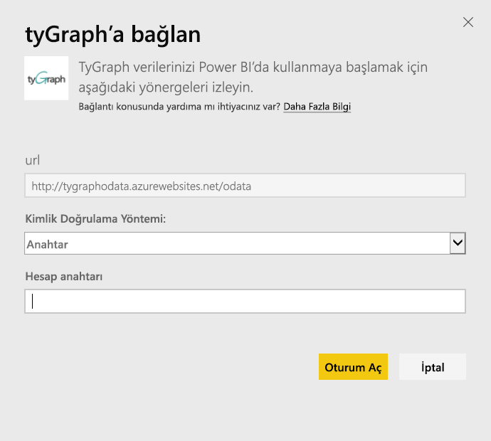
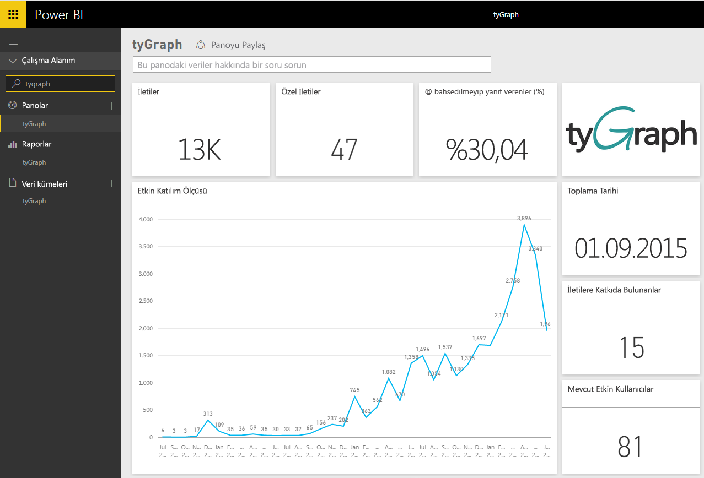
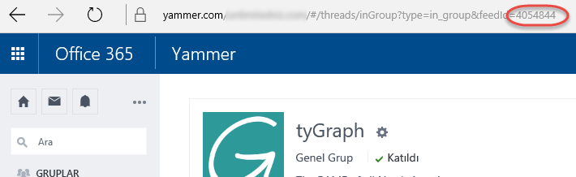

# Power BI ile tyGraph'e bağlanma
Power BI içerik paketiyle tyGraph verilerinizi Power BI'da görselleştirin ve araştırın. tyGraph hesabınıza bağlanıp panoyu, raporları ve veri kümesini yükleyerek başlayın. Kullanıma hazır olarak sunulan içerik paketinde, MAE puanı olarak da bilinen Measure of Active Engagement (Etkin Katılım Ölçeği) ve En Çok Katkıda Bulunanlar gibi öngörüler yer alır. En çok önem verdiğiniz bilgileri vurgulamak için daha fazla özelleştirme gerçekleştirin.  Veriler, ayarladığınız bir zamanlamaya göre otomatik olarak yenilenir.

[Power B için tyGraph](https://app.powerbi.com/getdata/services/tygraph)'e bağlanın.

## Bağlanma
1. Sol gezinti bölmesinin alt kısmında bulunan **Veri Al**'ı seçin.
   
   
2. **Hizmetler** kutusundaki **Al** seçeneğini belirleyin.
   
   
3. **tyGraph** \> **Al**'ı seçin.
   
   
4. Bağlanmak istediğiniz grupları ve zaman aralığını belirtin veya "All" (Tümü) seçeneğini belirleyerek tüm verileri içeri aktarın. Beklenen biçimin (YYYY/AA/GG) olduğunu göz önünde bulundurun. Aşağıda bulunan, [parametreleri bulma](#FindingParams) bölümünde ayrıntılara ulaşabilirsiniz.
   
   
5. Bağlanmak için tyGraph anahtarınızı girin. Bu değeri bulmaya ilişkin ayrıntılar için aşağıya bakın.
   
    **Doğrulanmış bir Yammer Yöneticisiyseniz**  
    API anahtarınız, tyGraph hesabınız başarılı bir şekilde oluşturulduğunda size gönderilir. Anahtarınızı bulamıyorsanız support@unlimitedviz.com adresine e-posta göndererek yeni bir tane isteyebilirsiniz. Henüz bir tyGraph hesabınız yoksa [http://www.tygraph.com/](http://www.tygraph.com/) sayfasına giderek bir deneme sürümü başlatabilirsiniz. 
   
    **Doğrulanmış bir Yammer yöneticisi değilseniz**
   
    tyGraph içerik paketi için, doğrulanmış bir Yammer yöneticisi tarafından oluşturulmuş bir tyGraph hesabı gerekir. Hesap oluşturulduktan sonra aynı kuruluştaki kullanıcılara ek anahtarlar verilebilir. Doğrulanmış yöneticiniz henüz bir tyGraph hesabı oluşturmadıysa bunu gerçekleştirmesi için onunla iletişime geçin. Bu hesap oluşturulduysa <support@unlimitedviz.com> adresine bir e-posta göndererek anahtar isteyebilirsiniz.
   
    
6. Kimlik doğrulaması başarılı olduğunda, içeri aktarma işlemi otomatik olarak başlar. İşlem tamamlandığında Gezinti Bölmesinde yeni bir pano, rapor ve model görünür. İçeri aktarılan verilerinizi görüntülemek için panoyu seçin.
   
    

**Sırada ne var?**

* Panonun üst tarafındaki [Soru-Cevap kutusunda soru sormayı](consumer/end-user-q-and-a.md) deneyin
* Panodaki [kutucukları değiştirin](service-dashboard-edit-tile.md).
* Bağlantılı raporu açmak için [bir kutucuk seçin](consumer/end-user-tiles.md).
* Veri kümeniz günlük olarak yenilenecek şekilde zamanlanır ancak yenileme zamanlamasında değişiklik yapabilir veya **Şimdi Yenile** seçeneğini kullanarak istediğinizde veri kümenizi kendiniz de yenileyebilirsiniz.

## Parametreleri bulma
Erişiminizin bulunduğu tüm gruplara veri getirebilir veya bir alt küme belirtmeyi tercih edebilirsiniz. Tarihe göre de bir veri alt kümesi oluşturabilirsiniz. Belirli grupları ve/veya tarihleri izlemek için birden çok tyGraph panosu oluşturabilirsiniz. Bu parametrelere ilişkin ayrıntılar aşağıda verilmiştir.

**Groups** (Gruplar)

tyGraph API, verileri belirli bir grup kimliğine göre filtreleyebilir. Bunlar içerik paketine virgülle ayrılmış liste ile girilir. 

    Example: 2427647,946595,1154464

Grup akışına gidip URL'yi inceleyerek, Yammer'daki belirli bir gruba ilişkin grup kimliğini tanımlayabilirsiniz.

Yukarıdaki örnekte, Yammer Grup Kimliği 4054844'tür

**From Date** (Başlangıç Tarihi)

From Date (Başlangıç Tarihi), döndürülen verilerin en erken hangi tarihli değeri içereceğini belirlemenizi sağlar. Yalnızca bu tarihte veya bu tarihten sonra oluşturulan veriler içerik paketine yüklenir. From Date (Başlangıç Tarihi), YYYY/AA/GG biçimindedir. 

    Example: 2013/10/29

Yukarıdaki örnekte, 29 Ekim 2013 tarihindeki veya bu tarihten sonraki tüm veriler içerik paketine yüklenir. 

**To Date** (Bitiş Tarihi), döndürülen verilerin en geç hangi tarihli değeri içereceğini belirlemenizi sağlar. Belirli bir tarih aralığından veri yüklemek üzere From Date (Başlangıç Tarihi) ile birlikte kullanılabilir. Yalnızca bu tarihte veya bu tarihten önce oluşturulan veriler içerik paketine yüklenir. To Date (Bitiş Tarihi), YYYY/AA/GG biçimindedir. 

    Example: 2014/10/20

Yukarıdaki örnekte, 20 Ekim 2014 tarihindeki veya bu tarihten önceki tüm veriler içerik paketine yüklenir. 

## Sonraki adımlar
[Power BI ile çalışmaya başlama](service-get-started.md)

[Power BI'da veri alma](service-get-data.md)

