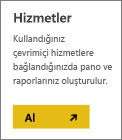
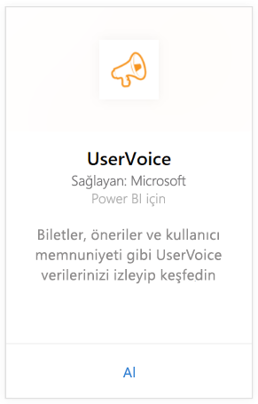
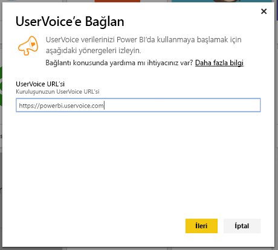
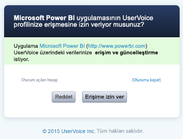
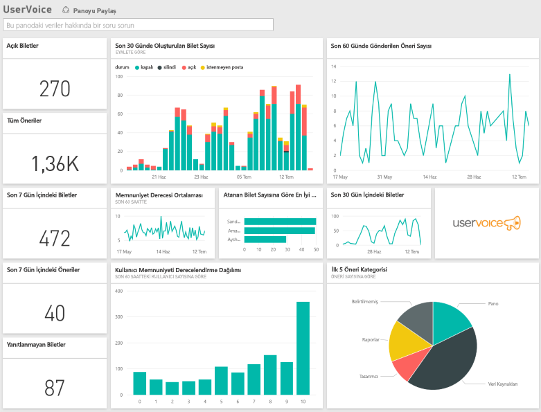

# Power BI ile UserVoice'e bağlanma
Power BI ve UserVoice içerik paketi ile UserVoice verilerinizi izlemek ve araştırmak çok kolay. Power BI; biletler, öneriler ve memnuniyet derecelendirmeleri de dahil olmak üzere verilerinizi alıp bu verilere dayalı, kullanıma hazır pano ve raporlar oluşturur.

Power BI için [UserVoice içerik paketine](https://app.powerbi.com/getdata/services/uservoice) bağlanın.

>[!NOTE]
>Power BI içerik paketine bağlanmak için bir yönetici hesabı gereklidir. İçerik paketi aynı zamanda UserVoice API'sinden yararlanır ve UserVoice sınırlarına uygun kullanıma katkıda bulunur. Aşağıda daha fazla ayrıntı bulabilirsiniz.

## Bağlanma
1. Sol gezinti bölmesinin alt kısmında bulunan **Veri Al**'ı seçin.
   
   
2. **Hizmetler** kutusundaki **Al** düğmesini seçin.
   
    
3. **UserVoice** ve ardından **Al** seçeneğini belirleyin.
   
   
4. İstendiğinde UserVoice URL'nizi girin. URL tam olarak şu desende olmalıdır: https://fabrikam.uservoice.com; "fabrikam" yerine ürün veya hizmetinizin adı gelecektir.
   
   >[!NOTE]
   >Sonda eğik çizgi yoktur ve bağlantı http**s** biçimindedir.
   
   
5. İstendiğinde UserVoice kimlik bilgilerinizi girin ve UserVoice kimlik doğrulama işlemindeki diğer adımları uygulayın. (Tarayıcınızda önceden UserVoice oturumu açtıysanız kimlik bilgileriniz istenmeyebilir.) "Erişime izin ver" düğmesine tıklayarak Power BI uygulamasının, verilerinize erişmesine izin verin.
   
   >[!NOTE]
   >UserVoice hesabınızın yönetici kimlik bilgileri gereklidir.
   
   
6. Power BI, UserVoice verilerinizi alıp sizin için kullanıma hazır bir pano ve rapor oluşturur. Power BI şu verileri alır: tüm önerileriniz, tüm açık biletleriniz; kapatılanlar da dahil olmak üzere son 30 gün içinde oluşturulan tüm biletler ve tüm kullanıcı memnuniyet derecelendirmeleri.
   
   

**Sırada ne var?**

* Panonun üst tarafındaki [Soru-Cevap kutusunda soru sormayı](power-bi-q-and-a.md) deneyin
* Panodaki [kutucukları değiştirin](service-dashboard-edit-tile.md).
* Bağlantılı raporu açmak için [bir kutucuk seçin](service-dashboard-tiles.md).
* Veri kümeniz günlük olarak yenilenecek şekilde zamanlanır ancak yenileme zamanlamasında değişiklik yapabilir veya **Şimdi Yenile** seçeneğini kullanarak istediğinizde veri kümenizi kendiniz de yenileyebilirsiniz

## Sorun giderme
**"Parametre doğrulaması başarısız oldu. Lütfen tüm parametrelerin geçerli olduğundan emin olun"**

UserVoice URL'nizi girdikten sonra bu hatayla karşılaşırsanız Aşağıdaki gereksinimlerin yerine getirildiğinden emin olun:

* URL tam olarak "https://fabrikam.uservoice.com" deseninde olmalı ve "fabrikam" yerine doğru UserVoice URL'si ön eki gelmelidir.
* Tüm harfler küçük olmalıdır.
* URL "http**s**" biçiminde olmalıdır.
* URL'nin sonunda eğik çizgi olmamalıdır.

**"Oturum açma başarısız oldu"**

Oturum açmak için UserVoice kimlik bilgilerinizi kullandıktan sonra "oturum açma başarısız oldu" hatası ile karşılaşırsanız, kullandığınız hesap, hesabınızda bulunan UserVoice verilerini alma izinlerine sahip değildir. Bir yönetici hesabı kullandığınızı doğrulayın ve yeniden deneyin.

"**Hata, bir sorun oluştu**"

Veriler yüklenirken bu hata iletisini görürseniz UserVoice hesabınızın, aylık API kullanım kotasını aşmadığından emin olun. Her şey yolunda görünüyorsa tekrar bağlanmayı deneyin. Sorun devam ederse lütfen [https://community.powerbi.com](https://community.powerbi.com/) adresi üzerinden Power BI destek ekibiyle iletişime geçin.

**Diğer**  

Power BI UserVoice içerik paketi, verilerinizi almak için UserVoice API'leri kullanır. Sınırı aşmamak için API kullanımınızı takip ettiğinizden emin olun. UserVoice hesabınızda çok fazla veri varsa API kullanımınızı azaltmak için, geçerli varsayılan yenileme sıklığını (günde bir kez) ihtiyaçlarınız doğrultusunda yalnızca hafta içi günlerde veya her iki günde bir yenileme yapılacak şekilde değiştirmenizi öneririz. Kullanımı azaltmaya ilişkin diğer bir önerimiz de içerik paketinin kuruluşunuzdaki her yönetici tarafından değil, bir yönetici tarafından oluşturulup ekibin diğer üyeleriyle paylaşılmasını ve böylece birden fazla yöneticinin API'ler üzerinde gereksiz yük oluşturmamasını sağlamaktır

## Sonraki adımlar
[Power BI ile çalışmaya başlama](service-get-started.md)

[Power BI'da veri alma](service-get-data.md)

