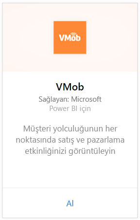
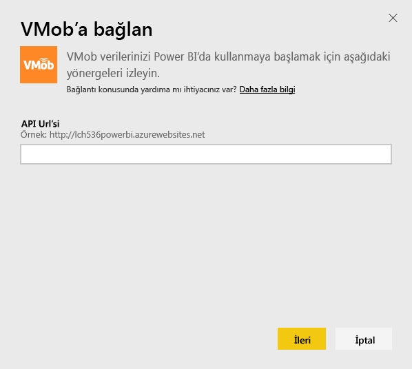
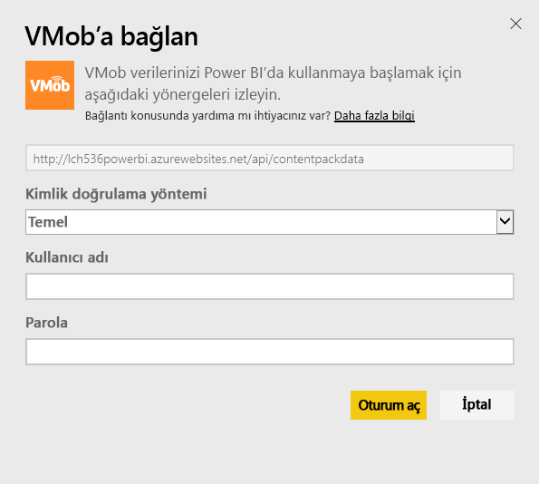
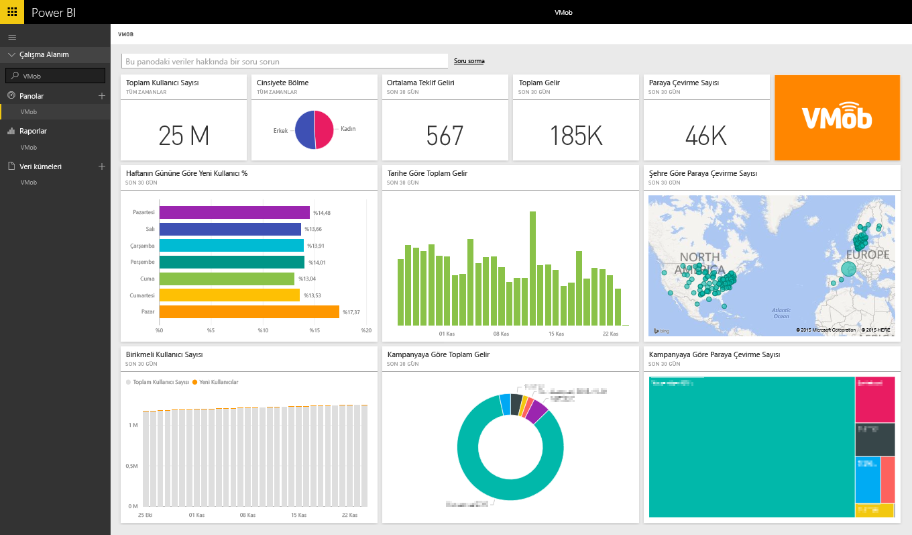

# Power BI ile VMob'a bağlanma
Power BI ve VMob içerik paketi ile VMob verilerinizi izlemek ve araştırmak çok kolay. Power BI şu verileri alır: tüm zamanlara ve son 30 güne ait Kullanıcı İstatistikleri, son 30 güne ait Perakende KPI'si ve son 30 güne ait Kampanya Performansı.

Power BI için [VMob içerik paketine](https://app.powerbi.com/getdata/services/vmob) bağlanın.

## Bağlanma
1. Sol gezinti bölmesinin alt kısmında bulunan **Veri Al**'ı seçin.
   
    
2. **Hizmetler** kutusundaki **Al** düğmesini seçin.
   
   
3. **VMob** \> **Al** seçeneğini belirleyin.
   
   
4. İstendiğinde VMob URL'nizi girin ve Sonraki düğmesine tıklayın. Bu URL, VMob tarafından ayrı olarak sağlanır.
   
    
5. Kimlik doğrulama yöntemi açılan listesinde **Temel** seçeneğini belirleyin, VMob kullanıcı adınızı ve parolanızı girin ve **Oturum aç**'a tıklayın.
   
    
6. İçeri aktarma işlemi otomatik olarak başlar ve Power BI, sizin için kullanıma hazır bir pano ve rapor oluşturmak üzere VMob verilerinizi alır.
   
   

**Sırada ne var?**

* Panonun üst tarafındaki [Soru-Cevap kutusunda soru sormayı](power-bi-q-and-a.md) deneyin
* Panodaki [kutucukları değiştirin](service-dashboard-edit-tile.md).
* Bağlantılı raporu açmak için [bir kutucuk seçin](service-dashboard-tiles.md).
* Veri kümeniz günlük olarak yenilenecek şekilde zamanlanır ancak yenileme zamanlamasında değişiklik yapabilir veya **Şimdi Yenile** seçeneğini kullanarak istediğinizde veri kümenizi kendiniz de yenileyebilirsiniz

## Sonraki adımlar
[Power BI ile çalışmaya başlama](service-get-started.md)

[Power BI'da veri alma](service-get-data.md)

