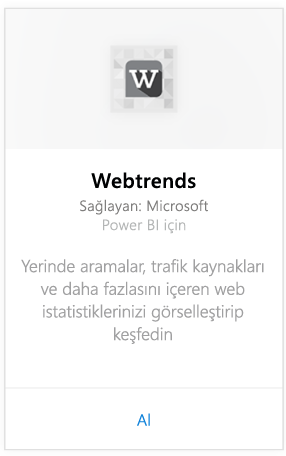
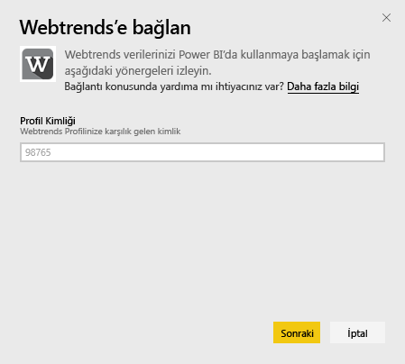
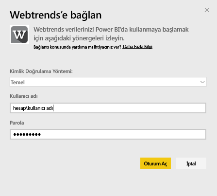
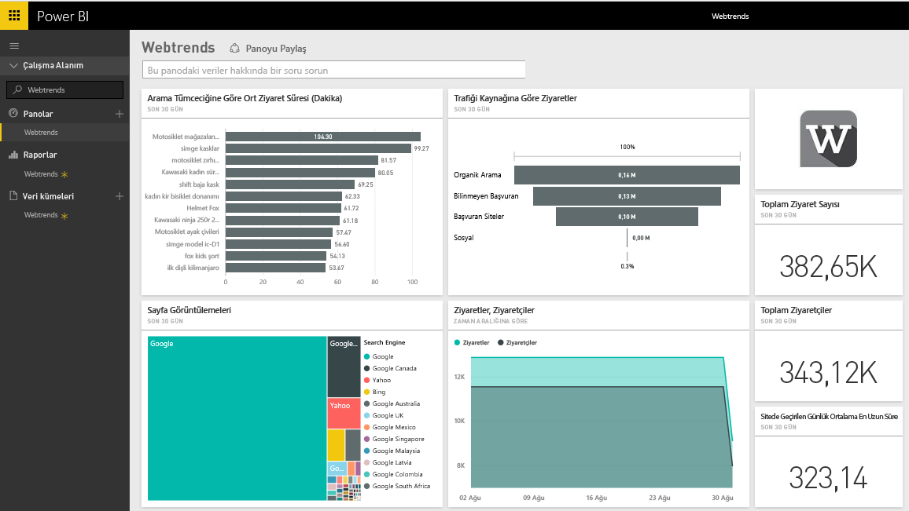
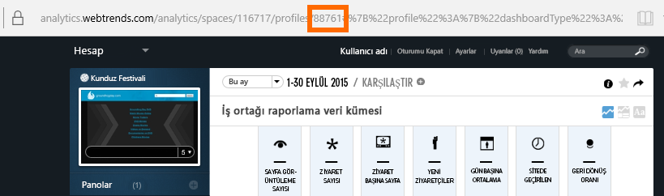
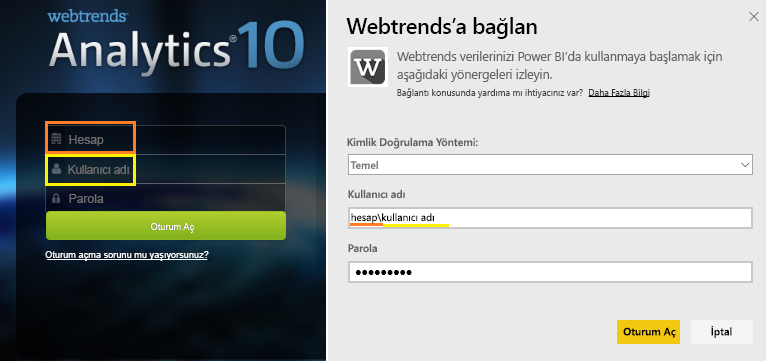

# Power BI ile Webtrends'e Bağlanma
Power BI için Webtrends içerik paketi, toplam sayfa görüntüleme sayısı ve trafik kaynağına göre ziyaretler gibi kullanıma hazır ölçümler içerir. Webtrends verilerinizi Power BI'da görselleştirmeye başlamak için, Webtrends hesabınıza bağlanmanız gerekir. Sağlanan panoyu ve raporları kullanabilir veya bunları, en çok önem verdiğiniz bilgileri öne çıkaracak şekilde özelleştirebilirsiniz.  Veriler günde bir kez otomatik olarak yenilenir.

[Power BI için Webtrends içerik paketine](https://app.powerbi.com/getdata/services/webtrends) bağlanın.

## Bağlanma
1. Sol gezinti bölmesinin alt kısmında bulunan **Veri Al**'ı seçin.
   
   
2. **Hizmetler** kutusundaki **Al** seçeneğini belirleyin.
   
   
3. **Webtrends** \> **Al**'ı seçin.
   
   
4. İçerik paketi, belirli bir Webtrends profil kimliğine bağlanır. [Bu parametreyi bulma](#FindingParams) ile ilgili ayrıntılar için aşağıya bakın.
   
   
5. Bağlanmak için Webtrends kimlik bilgilerinizi girin. Kullanıcı adı alanına, hesap ve kullanıcı adınızı girmeniz gerektiğini unutmayın. [Ayrıntıları](#FindingParams) aşağıda bulabilirsiniz.
   
   
6. Onay vermenizin ardından, içeri aktarma işlemi otomatik olarak başlar. İşlem tamamlandığında Gezinti Bölmesinde yeni bir pano, rapor ve model görünür. İçeri aktarılan verilerinizi görüntülemek için panoyu seçin.
   
   

**Sırada ne var?**

* Panonun üst tarafındaki [Soru-Cevap kutusunda soru sormayı](power-bi-q-and-a.md) deneyin
* Panodaki [kutucukları değiştirin](service-dashboard-edit-tile.md).
* Bağlantılı raporu açmak için [bir kutucuk seçin](service-dashboard-tiles.md).
* Veri kümeniz günlük olarak yenilenecek şekilde zamanlanır ancak yenileme zamanlamasında değişiklik yapabilir veya **Şimdi Yenile** seçeneğini kullanarak istediğinizde veri kümenizi kendiniz de yenileyebilirsiniz

## Neleri kapsar?

Webtrends içerik paketi, aşağıdaki raporlardan veri çeker:  

| Rapor Adı | Rapor Kimliği |
| --- | --- |
| Ana Ölçümler | |
| Sitedeki Aramalar |34awBVEP0P6 |
| Çıkış Sayfaları |7FshY8eP0P6 |
| Sonraki Sayfalar |CTd5rpeP0P6 |
| Önceki Sayfalar |aSdOeaUgnP6 |
| Site Sayfaları |oOEWQj3sUo6 |
| Sitedeki Reklamlar için Geçişli Tıklamalar |41df19b6d9f |
| Şehirler |aUuHskcP0P6 |
| Ülkeler |JHWXJNcP0P6 |
| Ziyaretçiler |xPcmTDDP0P6 |
| Ziyaret Süresi |U5KAyqdP0P6 |
| Arama Tümcecikleri |IKYEDxIP0P6 |
| Trafik Kaynakları |JmttAoIP0P6 |
| Arama Motorları |yGz3gAGP0P6 |
| Giriş Sayfaları |i6LrkNVRUo6 |

>[!NOTE]
>SharePoint profilleri için ölçüm adları, Webtrends kullanıcı arabiriminde görünenlerden biraz farklı olabilir. SharePoint ve Web profilleri arasında tutarlılık sağlamak için aşağıdaki eşleme yapılmıştır:   

    - Oturumlar = Ziyaretler  
    - Yeni Kullanıcılar = Yeni Ziyaretçiler  
    - Oturum başına Görüntülemeler = Ziyaret başına Sayfa Görüntülemeleri  
    - Günlük Ortalama Kullanıcı Süresi = Sitedeki Ziyaretçi başına Ortalama Süre  

## Sistem gereksinimleri
İçerik paketinin, [doğru rapor kümesine](#Included) sahip bir Webtrends profiline erişmesi gerekir.

## Parametreleri bulma
Profil seçtikten sonra Webtrends profil kimliğiniz URL'de bulunabilir:

Kimlik bilgileriniz Webtrends'de oturum açmak için kullandıklarınızla aynıdır, ancak hesap ve kullanıcı adınızın aynı satırda ve ters eğik çizgiyle bölünerek yazılması beklenir:

## Sorun giderme
Kimlik bilgilerinizi sağladıktan sonra içerik paketi yüklenirken bir sorunla karşılaşabilirsiniz. Yükleme sırasında "Hata" iletisini görürseniz, lütfen aşağıdaki sorun giderme önerilerini gözden geçirin. Sorun yaşamaya devam ediyorsanız lütfen https://support.powerbi.com'da bir destek bileti oluşturun.

1. Doğru profil kimliğinin kullanıldığından emin olun, daha fazla ayrıntı için [Parametreleri bulma](#FindingParams) bölümüne bakın.
2. Kullanıcının ["Neleri kapsar?"](#Included) bölümünde listelenen raporlara erişiminin bulunduğundan emin olun.

## Sonraki adımlar
[Power BI ile çalışmaya başlama](service-get-started.md)

[Power BI - Temel Kavramlar](service-basic-concepts.md)

