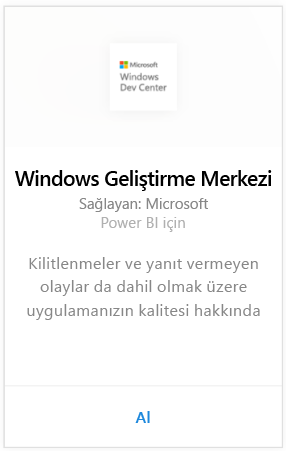
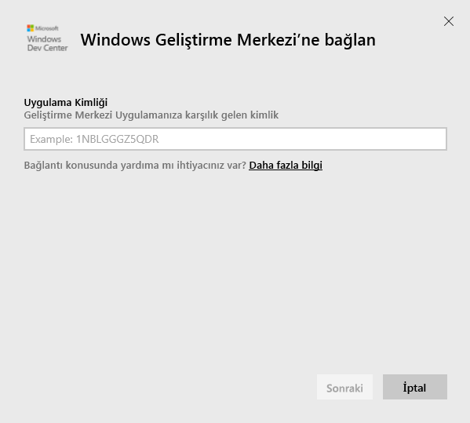
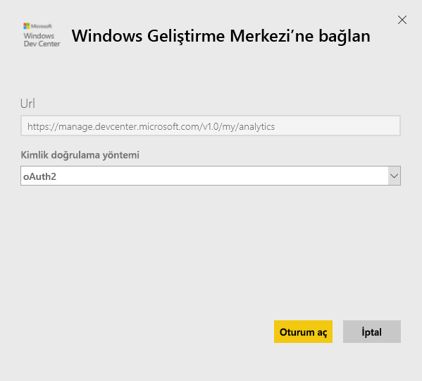
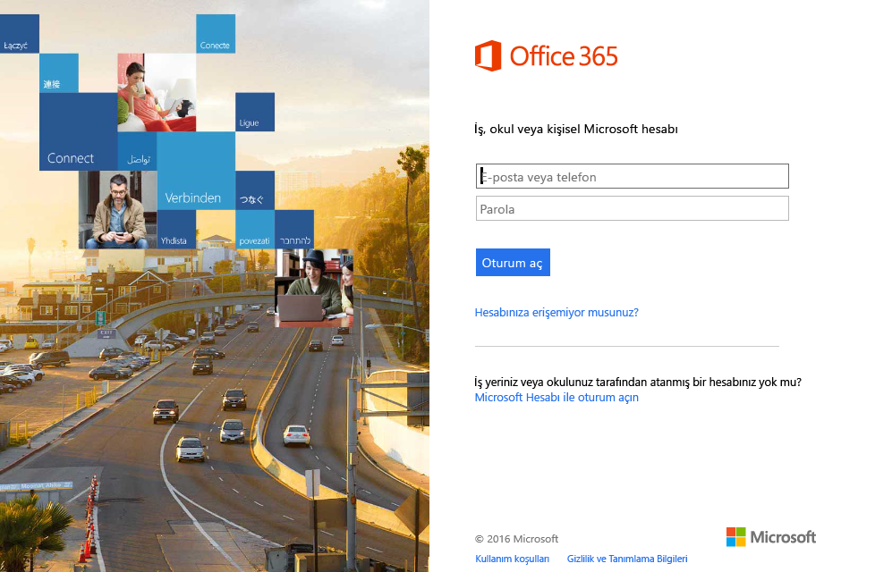
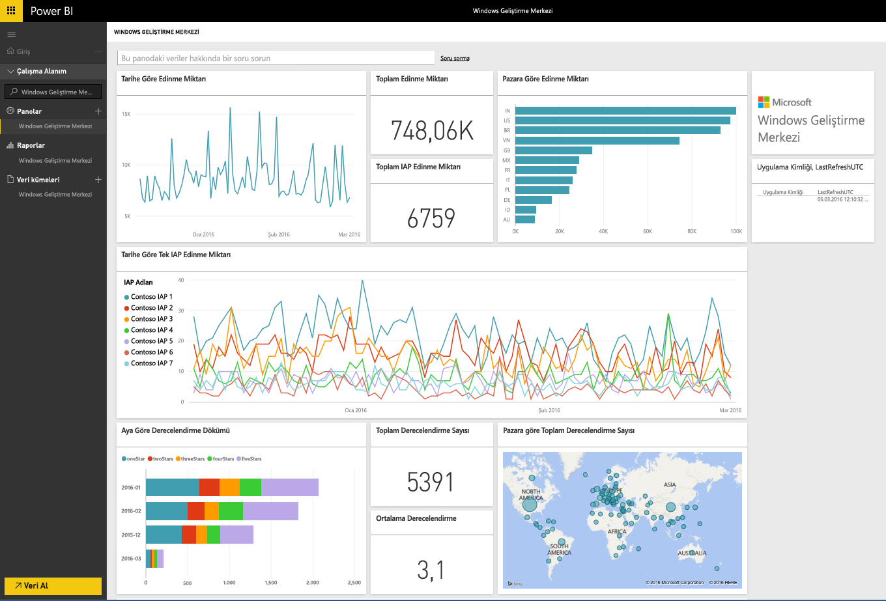
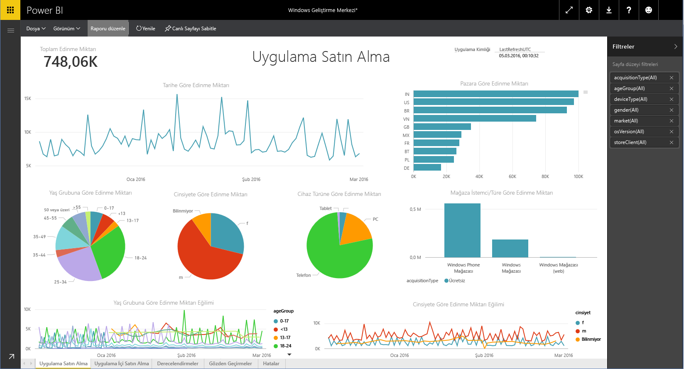

# Power BI ile Windows Dev Center'a bağlanma
Power BI içerik paketi ile Power BI'daki Windows Dev Center uygulama analizi verilerini araştırın ve izleyin. Veriler, günde bir kez otomatik olarak yenilenir.

Power BI için [Windows Dev Center içerik paketine](https://app.powerbi.com/getdata/services/devcenter) bağlanın.

## Bağlanma
1. Sol gezinti bölmesinin alt kısmında bulunan **Veri Al**'ı seçin.
   
   
2. **Hizmetler** kutusundaki **Al** seçeneğini belirleyin.
   
   
3. **Windows Dev Center** \>  **Al**'ı seçin.
   
   
4. Sahip olduğunuz uygulama kimliğini girin ve Sonraki seçeneğine tıklayın. [Bu parametreleri bulma](#FindingParams) konusundaki ayrıntılı bilgileri aşağıda bulabilirsiniz.
   
   
5. **Kimlik doğrulama yöntemi** için **OAuth2** \> **Oturum aç** seçeneklerini belirleyin. İstendiğinde, Windows Geliştirme Merkezi hesabınızla ilişkili Azure Active Directory kimlik bilgilerinizi girin ([Sistem Gereksinimleri](#Requirements) bölümünde daha fazla ayrıntıya ulaşabilirsiniz).
   
    
   
    
6. Onayladıktan sonra içeri aktarma işlemi otomatik olarak başlar. İşlem tamamlandığında Gezinti Bölmesinde yeni bir pano, rapor ve model görünür. İçeri aktarılan verilerinizi görüntülemek için panoyu seçin ve bir kutucuk seçerek bağlantılı raporlara gidin.
   
    
   
    

**Sırada ne var?**

* Panonun üst tarafındaki [Soru-Cevap kutusunda soru sormayı](power-bi-q-and-a.md) deneyin
* Panodaki [kutucukları değiştirin](service-dashboard-edit-tile.md).
* Bağlantılı raporu açmak için [bir kutucuk seçin](service-dashboard-tiles.md).
* Veri kümeniz günlük olarak yenilenecek şekilde zamanlanır ancak yenileme zamanlamasında değişiklik yapabilir veya **Şimdi Yenile** seçeneğini kullanarak istediğinizde veri kümenizi kendiniz de yenileyebilirsiniz

## Neleri kapsar?
Dev Center Power BI içerik paketi, uygulamanızın yanı sıra IAP edinimlerine, derecelendirmelere, incelemelere ve uygulama durumuna yönelik analiz verileri içerir. Veriler son 3 ayla sınırlıdır. Bu değişken bir aralık olduğundan, dahil edilen tarihler veri kümesi yenilendikçe güncelleştirilir.

## Sistem gereksinimleri
Bu içerik paketi, Microsoft Store'da yayımlanmış en az bir uygulama ve Windows Geliştirme Merkezi Hesabı gerektirir ([burada](https://msdn.microsoft.com/windows/uwp/publish/manage-account-users) daha fazla ayrıntıya ulaşabilirsiniz).

## Parametreleri bulma
Bir uygulamaya ilişkin uygulama kimliğini, App identity (Uygulama kimliği) sayfasındaki App management (Uygulama yönetimi) bölümünde bulabilirsiniz.

Uygulama kimliği, Windows 10 Mağazası'na yönelik URL'nizin sonunda yer alır, https://www.microsoft.com/store/apps/ **{applicationId}**

## Sonraki adımlar
[Power BI ile çalışmaya başlama](service-get-started.md)

[Power BI'da veri alma](service-get-data.md)

