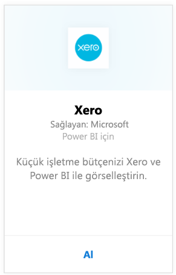
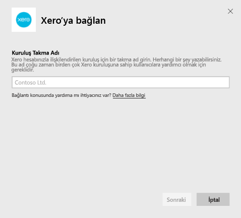
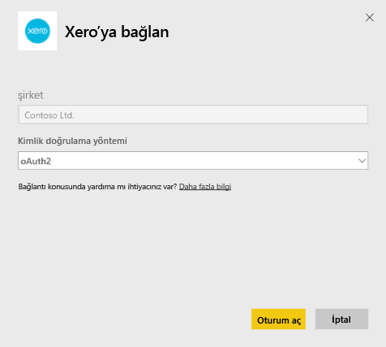
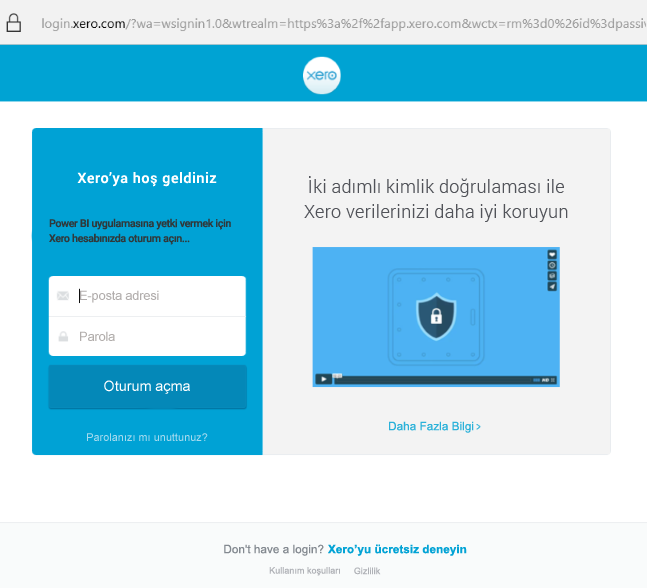
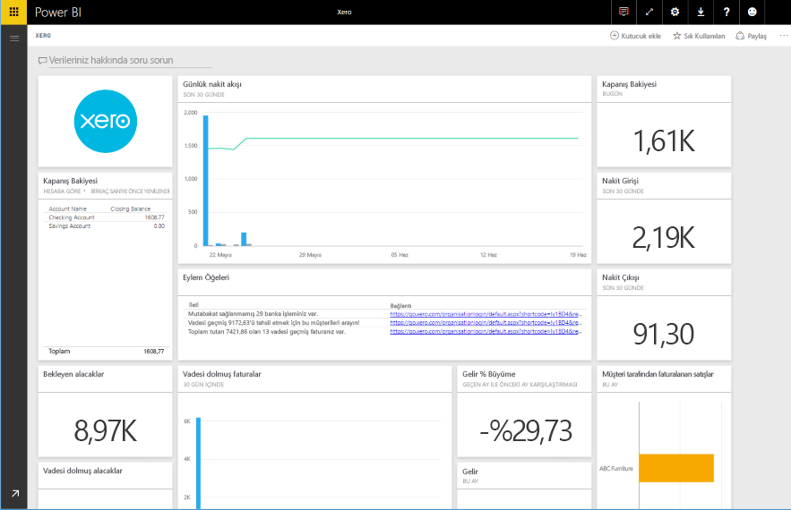

# Power BI ile Xero'ya bağlanma
Xero, özellikle küçük ölçekli işletmeler için tasarlanmış kullanımı kolay bir çevrimiçi muhasebe yazılımıdır. Bu Power BI içerik paketiyle, Xero finansal bilgilerinizi temel alan ilgi çekici görselleştirmeler oluşturun. Varsayılan panonuz nakit pozisyonu, geliri ve giderleri, kâr zarar eğilimi, borçlu günleri ve yatırım getirisi gibi çok sayıda küçük işletme ölçümleri içerir.

Power BI için [Xero içerik paketine](https://app.powerbi.com/getdata/services/xero) bağlanın veya [Xero ve Power BI](https://help.xero.com/Power-BI) tümleştirmesi hakkında daha fazla bilgi edinin.

## Bağlanma
1. Sol gezinti bölmesinin alt kısmında bulunan **Veri Al**'ı seçin.
   
   
2. **Hizmetler** kutusundaki **Al**'ı seçin.
   
   
3. **Xero** \>  **Al**'ı seçin.
   
   
4. Xero hesabınızla ilişkilendirilen kuruluş için bir takma ad girin. Herhangi bir şey yazabilirsiniz; bu, birden çok Xero kuruluşuna sahip kullanıcılara yardımcı olmak için yapılmaktadır. [Aşağıda](#FindingParams) ayrıntılara göz atabilirsiniz.
   
   
5. **Kimlik Doğrulama Yöntemi** için **OAuth** seçeneğini belirleyin ve istendiğinde Xero hesabınızda oturum açıp bağlanacağınız kuruluşu seçin. Oturum açma tamamlandığında, yükleme işlemini başlatmak için **Oturum Aç**'ı seçin.
   
    
   
    
6. Onayladıktan sonra içeri aktarma işlemi otomatik olarak başlar. İşlem tamamlandığında Gezinti Bölmesinde yeni bir pano, rapor ve model görünür. İçeri aktarılan verilerinizi görüntülemek için panoyu seçin.
   
     

**Sırada ne var?**

* Panonun üst tarafındaki [Soru-Cevap kutusunda soru sormayı](power-bi-q-and-a.md) deneyin
* Panodaki [kutucukları değiştirin](service-dashboard-edit-tile.md).
* Bağlantılı raporu açmak için [bir kutucuk seçin](service-dashboard-tiles.md).
* Veri kümeniz günlük olarak yenilenecek şekilde zamanlanır ancak yenileme zamanlamasında değişiklik yapabilir veya **Şimdi Yenile** seçeneğini kullanarak istediğinizde veri kümenizi kendiniz de yenileyebilirsiniz

## Neleri kapsar?
İçerik paketi panosu çeşitli alanlarda kutucuklar ve ölçümler ile bunlar hakkında daha fazla bilgi edinmek için raporlar içerir:  

| Alan | Pano Kutucukları | Rapor |
| --- | --- | --- |
| Cash |Daily cash flow  Cash in  Cash out  Closing balance by account  Closing balance today |Bank Accounts |
| Customer |Invoiced sales  Invoiced sales by customer  Invoiced sales growth trend  Invoices due  Outstanding receivables  Overdue receivables |Customer  Inventory |
| Supplier |Billed purchases  Billed purchases by supplier  Billed purchases growth trend   Bills due  Outstanding payables  Overdue payables |Suppliers  Inventory |
| Inventory |Monthly sales amount by product |Inventory |
| Profit and loss |Monthly profit and loss  Net profit this fiscal year  Net profit this month  Top expense accounts |Profit and Loss |
| Balance sheet |Total assets  Total liabilities  Equity |Balance Sheet |
| Health |Current ratio  Gross profit percentage   Return on total assets  Total liabilities to equity ratio |Health  Glossary and Technical Notes |

Veri kümesi, raporlarınızı ve panolarınızı özelleştirmek için şu tabloları da içerir:  

* Addresses  
* Alerts  
* Bank Statement Daily Balance  
* Bank Statements  
* Contacts  
* Expense Claims  
* Invoice Line Items  
* Invoices  
* Items  
* Month End  
* Organisation  
* Trial Balance  
* Xero Accounts

## Sistem Gereksinimleri
Xero içerik paketine erişmek için şu roller gereklidir: "Standard + Reports" (Standart + Raporlar) veya "Advisor" (Danışman).

## Parametreleri bulma
Kuruluşunuza Power BI'da izlemek için bir ad sağlayın. Bu, birden çok farklı kuruluşa bağlanmanıza olanak sağlar. Zamanlanmış yenilemeyi etkileyeceğinden birden çok kez aynı kuruluşa bağlanamayacağınızı unutmayın.   

## Sorun giderme
* Xero kullanıcılarının Power BI için Xero içerik paketine erişmeleri için şu rollere sahip olması gerekir: "Standard + Reports" (Standart + Raporlar) veya "Advisor" (Danışman). İçerik paketi, Power BI aracılığıyla raporlama verilerine erişmek için kullanıcı temelli izinler kullanır.  
* Yüklemeden sonra bir süre boyunca hata alırsanız ilgili hata iletisini görene kadar geçen süreyi doğrulayın. Xero tarafından sağlanan erişim belirtecinin yalnızca 30 dakika geçerli olduğunu ve bu nedenle, bu süre içerisinde yüklenebilenden fazla veriye sahip hesapların başarısız olacağını unutmayın. Bu sorunu iyileştirmek için etkin bir şekilde çalışıyoruz.
* Yükleme sırasında panodaki kutucuklar genel yükleme durumunda olacaktır. Tam yükleme tamamlanana kadar bu durumun değişmesi beklenmez. Yüklemenizin tamamlandığı ancak kutucukların yüklenmeye devam ettiğiyle ilgili bir bildirim alırsanız panonuzun en üst sağında bulunan ... simgesini kullanarak pano kutucuklarını yenilemeyi deneyin.
* İçerik paketiniz yenilenmezse Power BI'da aynı kuruluşa birden fazla kez bağlanıp bağlanmadığınızı kontrol edin. Xero bir kuruluşa yalnızca tek bir etkin bağlantı kurulmasına izin verir ve aynı kuruluşa birden fazla kez bağlanırsanız kimlik bilgilerinizin geçersiz olduğunu belirten bir hata görebilirsiniz.  
* Hata iletileri veya oldukça yavaş yükleme süreleri gibi, Power BI için Xero içerik paketleriyle bağlantı kurma konusundaki sorunlar için, ilk olarak önbelleği / tanımlama bilgilerini temizleyin ve tarayıcıyı yeniden başlayıp Power BI'a yeniden bağlanın.  

Sorun devam ederse diğer sorunlar için http://support.powerbi.com adresinde bir bilet oluşturun.

## Sonraki adımlar
[Power BI ile çalışmaya başlama](service-get-started.md)

[Power BI'da veri alma](service-get-data.md)

