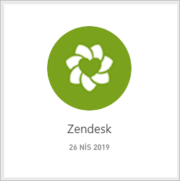
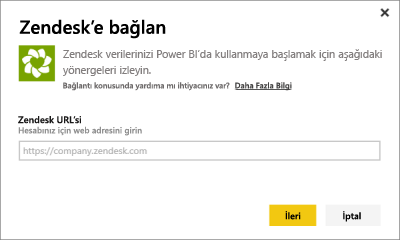
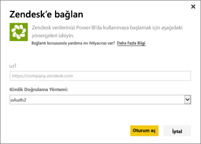
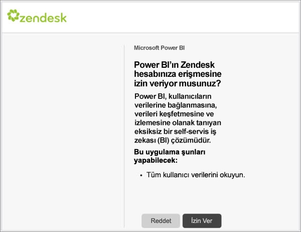
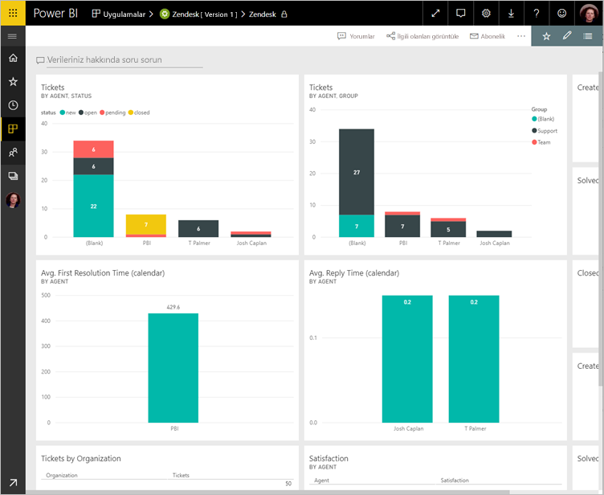
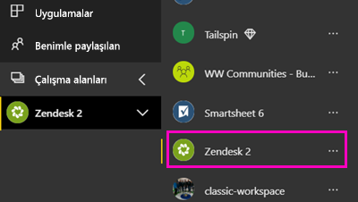
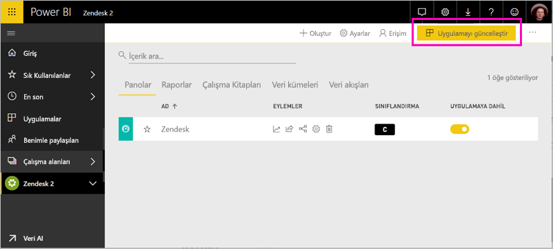

# Power BI ile Zendesk'e bağlanma

Bu makalede, verilerinizi Power BI şablon uygulama ile Zendesk hesabınızdan çekme gösterilmektedir. Zendesk uygulamasında, bir Power BI panosu ve bilet hacimleriniz ve aracı performansı hakkında Öngörüler sağlayan Power BI rapor kümesi sunar. Veriler günde bir kez otomatik olarak yenilenir. 

Şablon uygulamayı yükledikten sonra en çok önem verdiğiniz bilgileri vurgulamak için rapor ve Pano özelleştirebilirsiniz. Ardından, bu iş arkadaşlarınıza bir uygulama olarak, kuruluşunuzda dağıtabilirsiniz.

[Zendesk içerik paketine](https://app.powerbi.com/getdata/services/zendesk) bağlanın veya Power BI ile [Zendesk tümleştirmesi](https://powerbi.microsoft.com/integrations/zendesk) hakkında daha fazla bilgi edinin.

Şablon uygulamayı yükledikten sonra panoyu ve raporu değiştirebilirsiniz. Ardından, bu iş arkadaşlarınıza bir uygulama olarak, kuruluşunuzda dağıtabilirsiniz.

>[!NOTE]
>Bağlanmak için bir Zendesk yönetici hesabı gerekir. Aşağıda, [gereksinimler](#system-requirements) ile ilgili daha ayrıntılı bilgi verilmiştir.

## Bağlanma

[!INCLUDE [powerbi-service-apps-get-more-apps](./includes/powerbi-service-apps-get-more-apps.md)]

3. Seçin **Zendesk** \> **şimdi edinin**.
4. İçinde **bu Power BI uygulaması yükleme?** seçin **yükleme**.
4. İçinde **uygulamaları** bölmesinde **Zendesk** Döşe.

    

6. İçinde **yeni uygulamanızı ile çalışmaya başlama**seçin **verilere**.

    

4. Hesabınızla ilişkili URL'yi girin. URL formundadır **https://company.zendesk.com** . [Bu parametreleri bulmaya](#finding-parameters) ilişkin ayrıntılı bilgi için aşağıya bakın.
   
   

5. İstendiğinde Zendesk kimlik bilgilerinizi girin.  Kimlik doğrulama yöntemi olarak **OAuth2**'yi seçin ve **Oturum Aç**'a tıklayın. Zendesk kimlik doğrulaması akışını takip edin. (Zaten Zendesk'e tarayıcınızda oturum açmadıysanız, sizin için kimlik bilgilerini istenmeyebilir.)
   
   > [!NOTE]
   > Bu içerik paketi, bir Zendesk yönetici hesabı ile bağlanmanız gerekir. 
   > 
   
   
6. Power BI'ın, Zendesk verilerinize erişmesine izin vermek için **İzin ver**'e tıklayın.
   
   
7. İçeri aktarma işlemini başlatmak için **Connect**'e (Bağlan) tıklayın. 
8. Verileri Power BI tarafından içeri aktarıldıktan sonra Zendesk uygulamanız için içerik listesine bakın: yeni bir pano, rapor ve veri kümesi.
9. Araştırma işlemi başlatmak için panoyu seçin.

    
   
## Değiştirme ve uygulamanızı dağıtın

Zendesk şablon uygulaması yüklediniz. Zendesk uygulama çalışma alanı da oluşturmuş olduğunuz anlamına gelir. Çalışma alanında, rapor ve Pano değiştirebilir ve ardından olarak dağıtmak bir *uygulama* kuruluşunuzdaki iş arkadaşlarınıza. 

1. Sol gezinti çubuğunda yeni Zendesk çalışma alanınızda, tüm içeriğini görüntülemek için seçin **çalışma alanları** > **Zendesk**. 

    

    Bu görünüm çalışma alanı için içerik listesidir. Sağ üst köşedeki gördüğünüz **uygulamayı Güncelleştir**. İş arkadaşlarınız için uygulamanızı dağıtmaya hazır olduğunuzda nereden başlayacaksınız olmasıdır. 

    

2. Seçin **raporları** ve **veri kümeleri** çalışma alanındaki diğer öğeleri görmek için.

    Hakkında bilgi edinin [uygulama dağıtmaya](service-create-distribute-apps.md) iş arkadaşlarınıza önerilmesini sağlayın.

## Sistem Gereksinimleri
Zendesk içerik paketine erişmek için bir Zendesk Yönetici hesabı gereklidir. Bir aracı veya bir son kullanıcıysanız ve Zendesk verilerinizi görüntülemek istiyorsanız, bir öneri ekleyip Zendesk bağlayıcısını gözden geçirin [Power BI Desktop](desktop-connect-to-data.md).

## Parametreleri bulma
Zendesk URL'niz, Zendesk hesabınızda oturum açmak için kullandığınız URL ile aynı olacaktır. Zendesk URL'nizin ne olduğundan emin değilseniz Zendesk [oturum açma yardımını](https://www.zendesk.com/login/) kullanabilirsiniz.

## Sorun giderme
Bağlanma sorunu yaşıyorsanız, Zendesk URL'nizi kontrol edin ve bir Zendesk yönetici hesabı kullandığınızı onaylayın.

## Sonraki adımlar

* [Power BI'da yeni çalışma alanları oluşturma](service-create-the-new-workspaces.md)
* [Power BI'da uygulamaları yükleme ve kullanma](consumer/end-user-apps.md)
* [Dış hizmetler için Power BI uygulamaları bağlanma](service-connect-to-services.md)
* Sorularınız mı var? [Power BI Topluluğu'na sorun](http://community.powerbi.com/)

