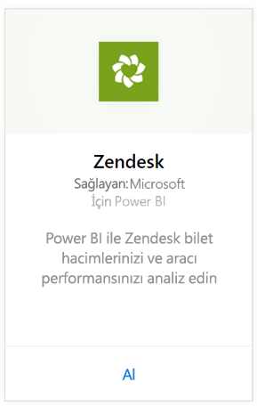
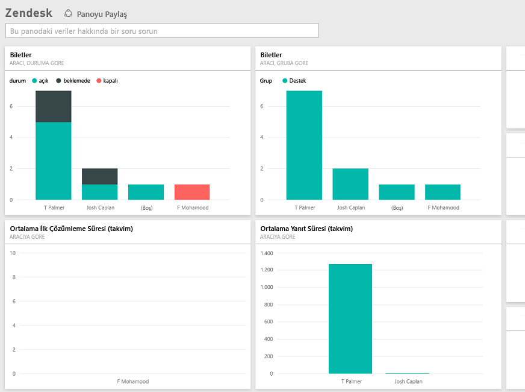

# Power BI ile Zendesk'e bağlanma
Zendesk içerik paketi, bilet hacimleriniz ve temsilci performansınızla ilgili bilgiler sunan bir Power BI panosunun yanı sıra bir dizi Power BI raporu sağlar. Sağlanan panoyu ve raporları kullanabilir veya bunları, en çok önem verdiğiniz bilgileri öne çıkaracak şekilde özelleştirebilirsiniz.  Veriler, otomatik olarak günde bir kez yenilenir. 

[Zendesk içerik paketine](https://app.powerbi.com/getdata/services/zendesk) bağlanın veya Power BI ile [Zendesk tümleştirmesi](https://powerbi.microsoft.com/integrations/zendesk) hakkında daha fazla bilgi edinin.

>[!NOTE]
>Bağlanmak için bir Zendesk yönetici hesabı gerekir. Aşağıda, [gereksinimler](#Requirements) ile ilgili daha ayrıntılı bilgi verilmiştir.

## Bağlanma
1. Sol gezinti bölmesinin alt kısmındaki **Veri Al**'ı seçin.
   
   
2. **Hizmetler** kutusundaki **Al** seçeneğini belirleyin.
   
    
3. **Zendesk** \> **Al**'ı seçin.
   
   
4. Hesabınızla ilişkili URL'yi girin. URL, **https://şirket.zendesk.com** biçiminde olmalıdır. Aşağıda, [bu parametreleri bulma](#FindingParams) ile ilgili ayrıntılı bilgi verilmiştir.
   
   
5. İstendiğinde Zendesk kimlik bilgilerinizi girin.  Kimlik doğrulama yöntemi olarak **OAuth2**'yi seçin ve **Oturum Aç**'a tıklayın. Zendesk kimlik doğrulaması akışını takip edin. (Tarayıcınızda daha önce Zendesk'te oturum açtıysanız kimlik bilgileriniz istenmeyebilir.)
   
   > [!NOTE]
   > Bu içerik paketi için bir Zendesk Yönetici hesabı ile bağlanmanız gereklidir. 
   > 
   > 
   
   
6. Power BI'ın, Zendesk verilerinize erişmesine izin vermek için **İzin ver**'e tıklayın.
   
   
7. İçeri aktarma işlemini başlatmak için **Connect**'e (Bağlan) tıklayın. Veriler Power BI tarafından içeri aktarıldıktan sonra sol gezinti bölmesinde yeni bir pano, rapor ve veri kümesi görürsünüz. Yeni öğeler sarı yıldız işareti \* ile gösterilir.
   
   

**Sırada ne var?**

* Panonun üst kısmındaki [Soru-Cevap kutusunu kullanarak bir soru sormayı](service-q-and-a.md) deneyin
* Panodaki [kutucukları değiştirin](service-dashboard-edit-tile.md).
* Bağlantılı raporu açmak için [bir kutucuk seçin](service-dashboard-tiles.md).
* Veri kümeniz günlük olarak yenilenecek şekilde zamanlanır ancak yenileme zamanlamasında değişiklik yapabilir veya **Şimdi Yenile** seçeneğini kullanarak istediğinizde veri kümenizi kendiniz de yenileyebilirsiniz

## Neleri kapsar?
Power BI içerik paketi şunlarla ilgili verileri içerir:  

* Kullanıcılar (son kullanıcılar ve temsilciler)  
* Kuruluşlar  
* Gruplar  
* Biletler  

Ayrıca, Average Wait Time (Ortalama Bekleme Süresi) ve Tickets Solved in the Last 7 days (Son 7 Günde Kapatılan Biletler) gibi hesaplanan ölçüler de vardır. Tam liste içerik paketinde mevcuttur.

## Sistem gereksinimleri
Zendesk içerik paketine erişmek için bir Zendesk Yönetici hesabı gereklidir. Temsilci veya son kullanıcıysanız ve Zendesk verilerinizi görüntülemek istiyorsanız lütfen bir öneri ekleyip [Power BI Desktop](desktop-connect-to-data.md)'ta Zendesk bağlayıcısını gözden geçirin.

## Parametreleri bulma
Zendesk URL'niz, Zendesk hesabınızda oturum açmak için kullandığınız URL ile aynı olacaktır. Zendesk URL'nizin ne olduğundan emin değilseniz Zendesk [oturum açma yardımını](https://www.zendesk.com/login/) kullanabilirsiniz.

## Sorun giderme
Bağlanmayla ilgili sorunlar yaşıyorsanız Lütfen Zendesk URL'nizi kontrol edin ve bir Zendesk yönetici hesabı kullandığınızı onaylayın.

## Sonraki adımlar
* [Power BI ile çalışmaya başlama](service-get-started.md)
* [Veri alma](service-get-data.md)

