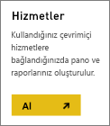
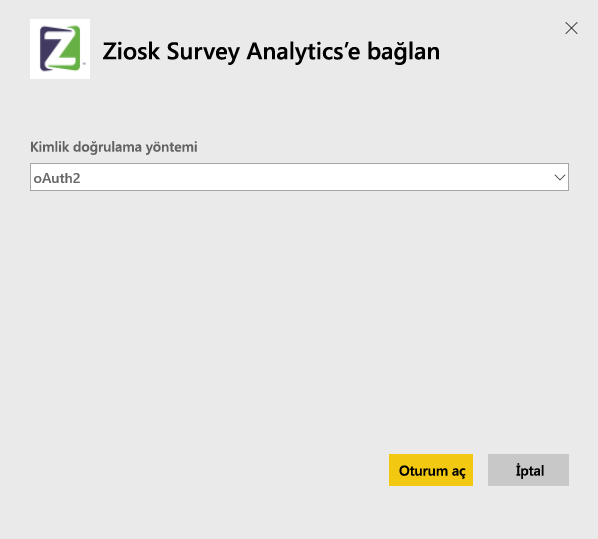
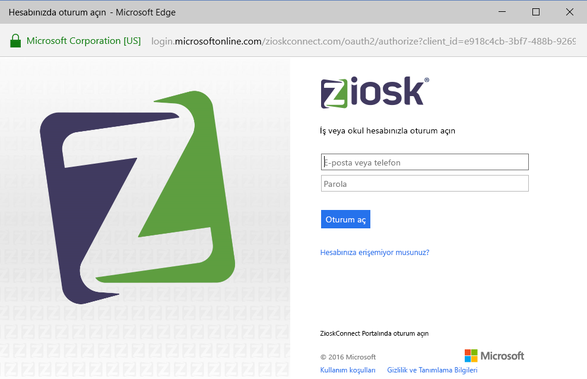
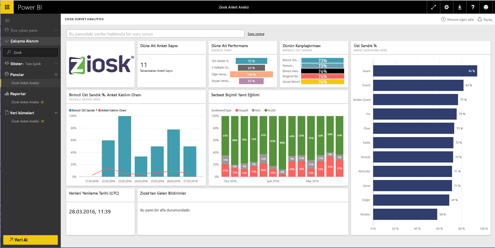

# Power BI ile Ziosk Survey Analytics'e bağlanma
Power BI için Ziosk Survey Analytics içerik paketi, Ziosk tabletli restoranlar için gün, konum, çalışan ve daha fazlasına göre segmentasyon dahil olmak üzere Ziosk anket verileri ile sağlanan öngörülere rakipsiz erişim fırsatı sunar.

Power BI için [Ziosk Survey Analytics içerik paketine](https://app.powerbi.com/getdata/services/ziosk-survey-analytics) bağlanın.

## Bağlanma
1. Sol gezinti bölmesinin alt kısmında bulunan **Veri Al**'ı seçin.  
   
    
2. **Hizmetler** kutusundaki **Al** düğmesini seçin.  
   
    
3. **Ziosk Survey Analytics** ve **Al** seçeneğini belirleyin.  
   
    
4. **OAuth2**'yi ve ardından **Oturum Aç** seçeneğini belirleyin. İstendiğinde, Ziosk kimlik bilgilerinizi girin.
   
    
   
    
5. Bağlandıktan sonra otomatik olarak bir pano, rapor ve veri kümesi yüklenir. İşlem tamamlandığında kutucuklar Ziosk hesabınızdaki verilerle güncelleştirilir.
   
    

**Sırada ne var?**

* Panonun üst tarafındaki [Soru-Cevap kutusunda soru sormayı](power-bi-q-and-a.md) deneyin
* Panodaki [kutucukları değiştirin](service-dashboard-edit-tile.md).
* Bağlantılı raporu açmak için [bir kutucuk seçin](service-dashboard-tiles.md).
* Veri kümeniz günlük olarak yenilenecek şekilde zamanlanır ancak yenileme zamanlamasında değişiklik yapabilir veya **Şimdi Yenile** seçeneğini kullanarak istediğinizde veri kümenizi kendiniz de yenileyebilirsiniz

## Neleri kapsar?
İçerik paketi şu tablolardaki verileri içerir:  

    - Alcohol Category  
    - Appetizer Category  
    - CommentKeywords  
    - Date  
    - Daypart  
    - Dessert Category  
    - FreeForm  
    - Kids Category  
    - Messages  
    - Premium Content Category  
    - Question  
    - Store  
    - Surveys  
    - Weekday  

## Sistem gereksinimleri
Bu içerik paketinin bir örneğini oluşturmak için yukarıdaki tabloların izinlerine sahip bir Ziosk hesabı gereklidir.

## Sonraki adımlar
[Power BI ile çalışmaya başlama](service-get-started.md)

[Power BI - Temel Kavramlar](service-basic-concepts.md)

