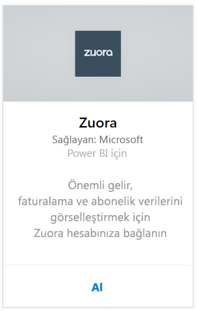
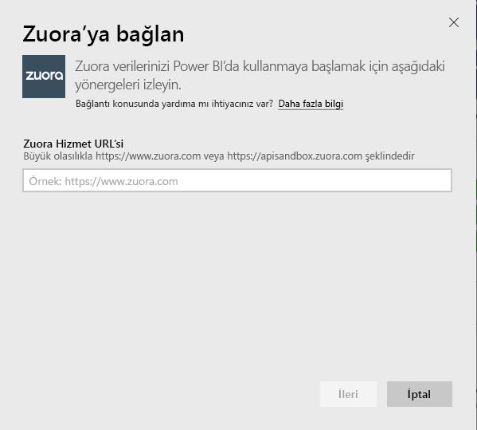
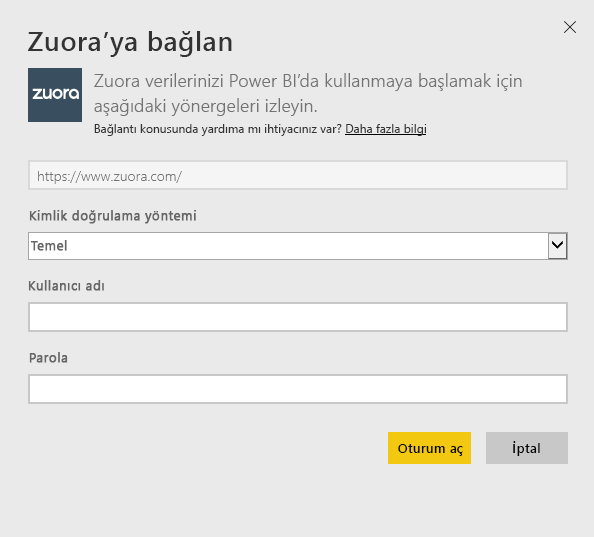
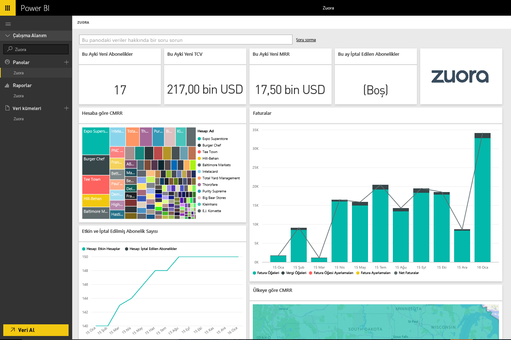

# Power BI ile Zuora'ya bağlanma
Power BI için Zuora; önemli gelir, faturalandırma ve abonelik verilerini görselleştirmenizi sağlar. Kullanım eğilimlerini çözümlemek, fatura ve ödemeleri takip etmek ve yinelenen geliri izlemek için varsayılan pano ve raporları kullanın veya bunları kendi benzersiz pano ve raporlama ihtiyaçlarınızı karşılayacak şekilde özelleştirin.

Power BI için [Zuora](https://app.powerbi.com/getdata/services/Zuora)'ya bağlanın.

## Bağlanma
1. Sol gezinti bölmesinin alt kısmında bulunan **Veri Al**'ı seçin.

   
2. **Hizmetler** kutusundaki **Al** seçeneğini belirleyin.

   
3. **Zuora** \> **Al** seçeneğini belirleyin.

   
4. Zuora URL'nizi belirtin. Bu genellikle "https://www.zuora.com" dur, aşağıdaki [bu parametreleri bulma](#FindingParams) başlığından ayrıntıları bulabilirsiniz.

   
5. **Kimlik Doğrulama Yöntemi** için **Temel** seçeneğini belirleyin ve kullanıcı adınızı ve parolanızı sağlayın (büyük/küçük harfe duyarlıdır), ardından **Oturum aç**'ı seçin.

    
6. Onaylamanızın ardından, içeri aktarma işlemi otomatik olarak başlar. İşlem tamamlandığında Gezinti Bölmesinde yeni bir pano, rapor ve model görünür. İçeri aktarılan verilerinizi görüntülemek için panoyu seçin.

     

**Sırada ne var?**

* Panonun üst tarafındaki [Soru-Cevap kutusunda soru sormayı](power-bi-q-and-a.md) deneyin
* Panodaki [kutucukları değiştirin](service-dashboard-edit-tile.md).
* Bağlantılı raporu açmak için [bir kutucuk seçin](service-dashboard-tiles.md).
* Veri kümeniz günlük olarak yenilenecek şekilde zamanlanır ancak yenileme zamanlamasında değişiklik yapabilir veya **Şimdi Yenile** seçeneğini kullanarak istediğinizde veri kümenizi kendiniz de yenileyebilirsiniz

## Neleri kapsar?
İçerik paketi, Zuora AQUA API'sini kullanarak şu tabloları çeker:

| Tablolar |  |  |
| --- | --- | --- |
| Account |InvoiceItemAdjustment |Refund |
| AccountingCode |Payment |RevenueSchedule |
| AccountingPeriod |PaymentMethod |RevenueScheduleItem |
| BillTo |Product |Subscription |
| DateDim |ProductRatePlan |TaxationItem |
| Invoice |ProductRatePlanCharge |Usage |
| InvoiceAdjustment |RatePlan | |
| InvoiceItem |RatePlanCharge | |

İçerik paketi aynı zamanda şu hesaplanmış ölçüleri içerir:

| Ölçü | Açıklama | Sözde Hesaplama |
| --- | --- | --- |
| Account: Payments |Ödeme geçerlilik tarihlerini temel alan, bir zaman dönemi içindeki toplam ödeme tutarlarıdır. |SUM (Payment.Amount)  WHERE Payment.EffectiveDate =< TimePeriod.EndDate AND    Payment.EffectiveDate >= TimePeriod.StartDate |
| Account: Refunds |İade tarihini temel alan, bir zaman dönemi içindeki toplam iade tutarlarıdır. Tutar negatif bir sayı olarak bildirilir. |-1*SUM(Refund.Amount) WHERE Refund.RefundDate =< TimePeriod.EndDate AND    Refund.RefundDate >= TimePeriod.StartDate |
| Account: Net Payments |Bir zaman dönemi içindeki Account Payments (Hesap Ödemeleri) ile Account Refunds (Hesap İadeleri) toplamıdır. |Account.Payments + Account.Refunds |
| Account: Active Accounts |Bir zaman dönemi içinde etkin olan hesapların sayısıdır. Abonelikler zaman dönemi başlangıç tarihinden önce (veya başlangıç tarihinde) başlamış olmalıdır. |COUNT (Account.AccountNumber) WHERE     Subscription.Status != "Expired" AND    Subscription.Status != "Draft" AND    Subscription.SubscriptionStartDate <= TimePeriod.StartDate AND    (Subscription.SubscriptionEndDate > TimePeriod.StartDate OR Subscription.SubscriptionEndDate = null) –evergreen subscription |
| Account: Average Recurring Revenue |Bir zaman dönemi içindeki etkin hesap başına Gross MRR (Aylık Yinelenen Gelir) anlamına gelir. |Gross MRR / Account.ActiveAccounts |
| Account: Cancelled Subscriptions |Bir zaman dönemi içinde bir aboneliği iptal eden hesapların sayısıdır. |COUNT (Account.AccountNumber) WHERE Subscription.Status = "Cancelled" AND    Subscription.SubscriptionStartDate <= TimePeriod.StartDate AND    Subscription.CancelledDate >= TimePeriod.StartDate |
| Account: Payment Errors |Ödeme hatalarının toplam değeridir. |SUM (Payment.Amount) WHERE Payment.Status = "Error" |
| Revenue Schedule Item: Recognized Revenue |Bir hesap dönemi içindeki toplam tanınan gelirdir. |SUM (RevenueScheduleItem.Amount) WHERE AccountingPeriod.StartDate = TimePeriod.StartDate |
| Subscription: New Subscriptions |Bir zaman dönemi içindeki yeni aboneliklerin sayısıdır. |COUNT (Subscription.ID) WHERE Subscription.Version = "1" AND    Subscription.CreatedDate <= TimePeriod.EndDate AND    Subscription.CreatedDate >= TimePeriod.StartDate |
| Invoice: Invoice Items |Bir zaman dönemi içindeki toplam fatura madde gideri tutarlarıdır. |SUM (InvoiceItem.ChargeAmount) WHERE     Invoice.Status = "Posted" AND    Invoice.InvoiceDate <= TimePeriod.EndDate AND    Invoice.InvoiceDate >= TimePeriod.StartDate |
| Invoice: Taxation Items |Bir zaman dönemi içindeki toplam vergilendirme maddesi vergi tutarlarıdır. |SUM (TaxationItem.TaxAmount) WHERE Invoice.Status = "Posted" AND    Invoice.InvoiceDate <= TimePeriod.EndDate AND    Invoice.InvoiceDate >= TimePeriod.StartDate |
| Invoice: Invoice Item Adjustments |Bir zaman dönemi içindeki toplam fatura maddesi ayarlama tutarlarıdır. |SUM (InvoiceItemAdjustment.Amount)  WHERE     Invoice.Status = "Posted" AND    InvoiceItemAdjustment.AdjustmentDate <= TimePeriod.EndDate AND    InvoiceItemAdjustment.AdjustmentDate >= TimePeriod.StartDate |
| Invoice: Invoice Adjustments |Bir zaman dönemi içindeki toplam fatura ayarlama tutarlarıdır. |SUM (InvoiceAdjustment.Amount)  WHERE     Invoice.Status = "Posted" AND    InvoiceAdjustment.AdjustmentDate <= TimePeriod.EndDate AND    InvoiceAdjustment.AdjustmentDate >= TimePeriod.StartDate |
| Invoice: Net Billings |Bir zaman dönemi içindeki fatura maddelerinin, vergilendirme maddelerinin, fatura maddesi ayarlamalarının ve fatura ayarlamalarının toplamıdır. |Invoice.InvoiceItems + Invoice.TaxationItems + Invoice.InvoiceItemAdjustments + Invoice.InvoiceAdjustments |
| Invoice: Invoice Aging Balance |Deftere nakledilen fatura bakiyelerinin toplamıdır. |SUM (Invoice.Balance)  WHERE     Invoice.Status = "Posted" |
| Invoice: Gross Billings |Bir zaman dönemi içinde, deftere nakledilen faturalar için fatura madde gideri tutarlarının toplamıdır. |SUM (InvoiceItem.ChargeAmount)  WHERE     Invoice.Status = "Posted" AND    Invoice.InvoiceDate <= TimePeriod.EndDate AND    Invoice.InvoiceDate >= TimePeriod.StartDate |
| Invoice: Total Adjustments |Deftere nakledilen faturalarla ilişkili işlenen fatura ayarlamalarının ve fatura maddesi ayarlamalarının toplamıdır. |SUM (InvoiceAdjustment.Amount)  WHERE     Invoice.Status = "Posted" AND    InvoiceAdjustment.Status = "Processed" + SUM (InvoiceItemAdjustment.Amount)  WHERE     Invoice.Status = "Posted" AND    invoiceItemAdjustment.Status = "Processed" |
| Rate Plan Charge: Gross MRR |Bir zaman dönemi içindeki aboneliklere yönelik aylık yinelenen gelirin toplamıdır. |SUM (RatePlanCharge.MRR)  WHERE     Subscription.Status != "Expired" AND    Subscription.Status != "Draft" AND    RatePlanCharge.EffectiveStartDate <= TimePeriod.StartDate AND        RatePlanCharge.EffectiveEndDate > TimePeriod.StartDate     OR    RatePlanCharge.EffectiveEndDate = null --evergreen subscription |

## Sistem gereksinimleri
Zuora API erişimi gereklidir.

## Parametreleri bulma
Genellikle Zuora verilerinize erişmek için kullandığınız oturum açma URL'sini sağlayın. Geçerli seçenekler şunlardır:  

* https://www.zuora.com  
* https://www.apisandbox.zuora.com  
* Hizmet örneğinize ilişkin URL  

## Sorun giderme
Zuora içerik paketi, Zuora hesabınızın birçok farklı özelliğini çeker. Belirli özellikleri kullanmazsanız ilişkili kutucukları/raporları boş olarak görebilirsiniz. Yüklemede herhangi bir sorunla karşılaşırsanız lütfen Power BI Destek ekibi ile iletişime geçin.

## Sonraki adımlar
[Power BI ile çalışmaya başlama](service-get-started.md)

[Power BI'da veri alma](service-get-data.md)
