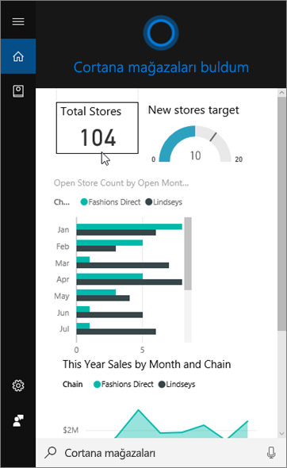
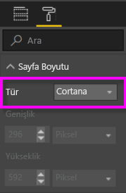
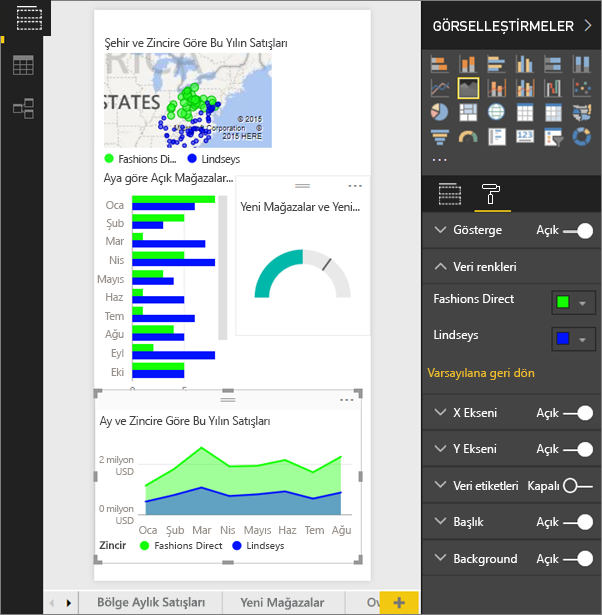
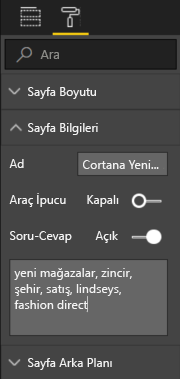
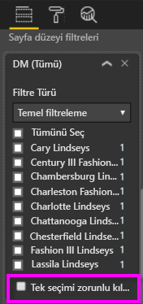

# Power BI hizmetini veya Power BI Desktop'ı kullanarak Cortana için özel bir Yanıt Sayfası oluşturma
Power BI'ı kullanarak *Cortana yanıt sayfaları* (ve bazı durumlarda *Cortana yanıt kartları*) adı verilen ve Cortana sorularını cevaplamak için tasarlanmış özel rapor sayfaları oluşturun.

> [!IMPORTANT]
> Cortana ve Power BI **panosu** önizlemesini kullanıyorsanız bu makalenin geri kalan kısmını okumanıza gerek yoktur. Cortana'nın, Power BI panolarınızda arama yapabilmesi için herhangi bir kurulum gereksinimi bulunmaz.
> 
> 

## Başlamadan önce
Power BI için Cortana'yı kurma ve kullanma konularında size rehberlik edecek dört belge mevcuttur. Henüz başlamadıysanız birinci makaleyi okuyarak başlamanızı öneririz. Cortana yanıt sayfalarını kullanmaya başlamadan önce yapmanız gerekenlerin açıklandığı ikinci makale özellikle önemlidir.

**1. Makale**: [Cortana ve Power BI'ın birlikte nasıl çalıştığını öğrenin](service-cortana-intro.md)

**2. Makale**: [Power BI raporlarında arama yapmak için: Cortana'yı etkinleştirme, Power BI - Windows tümleştirmesi](service-cortana-enable.md)

**3. Makale**: Bu makale

**4. Makale**: [Sorun giderme](service-cortana-troubleshoot.md)

## Cortana için tasarlanmış bir Cortana yanıt sayfası oluşturma
Bir rapordaki *Cortana yanıt sayfası*, Cortana için özel olarak boyutlandırılır; böylece, Cortana bu sayfayı bir sorunun cevabı olarak ekranda görüntüleyebilir. Cortana'ya ilişkin bir yanıt sayfası oluşturmak için:

1. [Boş rapor sayfası](power-bi-report-add-page.md) ile başlamanızı öneririz.
2. **Görsel Öğeler** bölmesinde boya rulosu simgesini seçip **Sayfa Boyutu** > **Tür** > **Cortana** seçeneğini belirleyin.
   
    
3. Belirli bir soruya (veya soru dizisine) cevap olarak Cortana türünde görünmesini istediğiniz bir görsel veya görsel dizisi oluşturun.
4. Tüm görsellerin, sayfa kenarlıklarına sığdığından emin olun. İsteğe bağlı olarak görüntü ayarlarını, veri etiketlerini, renkleri ve arka planı değiştirebilirsiniz.  
   
    
5. Sayfayı adlandırın ve alternatif adlar ekleyin. Cortana, sonuçları ararken bu adları kullanır. **Görsel Öğeler** bölmesinde boya fırçası simgesini seçip **Sayfa Bilgileri** seçeneğini belirleyin. Kaydırıcıyı **Açık** duruma getirerek bu görselleştirme için Soru-Cevap özelliğini etkinleştirin.
   
    
   
   > [!TIP]
   > İyileştirilmiş sonuçlar elde etmek için aynı zamanda sütun adı olarak da bulunan sözcükler kullanmaktan kaçının.
   > 
   > 
6. İsteğe bağlı olarak, rapor sayfanız sayfa düzeyi filtreleri içeriyorsa **Tek bir seçim yapılmasını zorunlu kıl** seçeneğini belirleyebilirsiniz. Cortana, soruda filtre öğelerinden sadece biri belirtilirse bu raporu yalnızca bir cevap olarak görüntüler. **Tek bir seçim yapılmasını zorunlu kıl** seçeneği **Filtreler** bölmesinin en altında yer alır.
   
   > [!NOTE]
   > Cortana'nın sayfa düzeyi filtreleri içeren bir raporu görüntülemesi için **Tek bir seçim yapılmasını zorunlu kıl** seçeneğini belirlemeniz gerekmez. Örneğin, "show sales for Charlotte Lindseys" (Charlotte Lindseys için satışları göster) sorusu sorulduğunda, Tek bir seçim yapılmasını zorunlu kıl ayarına bakılmaksızın yanıt sayfası görüntülenir.
   > 
   > 
   
     
   
      Örneğin Cortana'ya;
   
   * "show sales by store name" (mağaza adına göre satışları göster) sorusunu sorarsanız gerekli sayfa düzeyi filtresindeki herhangi bir öğeyi eklemediğiniz için bu yanıt sayfası görüntülenmez.
   * "show sales for Cary Lindseys and Charlotte Lindseys" (Cary Lindseys ve Charlotte Lindseys için satışları göster) sorusunu sorarsanız gerekli sayfa düzeyi filtresinden birden çok öğe belirttiğiniz için bu yanıt sayfası görüntülenmez.
   * "show sales for Charlotte Lindseys" (Charlotte Lindseys için satışları göster) sorusunu sorarsanız bu yanıt sayfası görüntülenir.
     
     "show sales" (satışları göster) sorusunu sorarsanız gerekli sayfa düzeyi filtresindeki herhangi bir öğeyi eklemediğiniz için bu yanıt sayfası görüntülenmez.

> [!IMPORTANT]
> Cortana yanıt sayfasına Cortana tarafından erişilebilmesi için [Cortana için veri kümesini etkinleştirmeniz](service-cortana-enable.md) gerekir.
> 
> 

## Cortana, sonuçları nasıl sıralar?
Yüksek puanlı cevaplar (belirtilen bir sayfa adının tam eşleşmesi gibi), Cortana'da *en iyi eşleşme* olarak ilk sırada görünür. Power BI'da birden çok Cortana yanıt sayfası varsa birden çok en iyi eşleşme görünebilir. Bir yanıt sayfasının adına veya Power BI tarafından anlaşılmayan sözcükler içeren bir soruya dayalı cevaplar gibi orta veya daha düşük puanlı cevaplar, Cortana'da en iyi eşleşmelerin altında bağlantı olarak listelenir.

> [!NOTE]
> Power BI'a yeni bir veri kümesi veya özel Cortana yanıt sayfası eklenip Cortana özelliği etkinleştirildiğinde sonuçların Cortana'da görünmeye başlaması 30 dakika kadar sürebilir. Windows 10'da oturumu kapatıp tekrar açmak veya Windows 10'daki Cortana işlemini başka bir şekilde yeniden başlamak yeni içeriğin anında görünür hale gelmesini sağlar.
> 
> 

## Sonraki adımlar
[Power BI'da Cortana özelliğini kullanma](service-cortana-intro.md)

Hâlâ Cortana'yı Power BI ile birlikte çalıştıramıyor musunuz?  [Cortana ile ilgili sorunları giderme](service-cortana-troubleshoot.md) makalesine bakın.

Başka bir sorunuz mu var? [Power BI Topluluğu'na başvurun](http://community.powerbi.com/)

