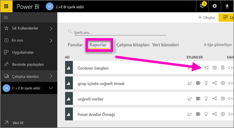
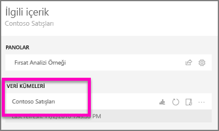
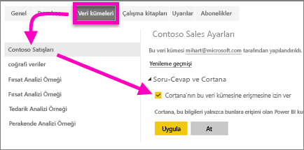
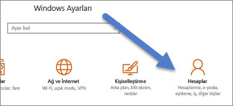
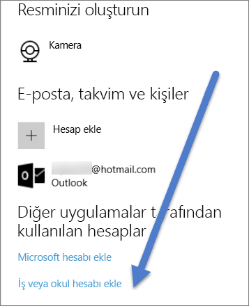

# Cortana'nın, Power BI raporlarına (ve bağlantılı veri kümelerine) erişebilmesini sağlama
[Cortana ve Power BI'a Giriş](service-cortana-intro.md) konulu makaleyi okudunuz. (Henüz okumadıysanız öncelikle bu makaleyi okumak isteyebilirsiniz.) Şimdi söz konusu işlemleri kendiniz gerçekleştirmek istiyorsunuz.  Cortana'da doğal dilde sorular sorup Power BI ***raporlarında*** depolanan verilerden yanıtlar elde edebilmeniz için karşılamanız gereken birkaç gereksinim mevcuttur. Aşağıdakileri yapmanız gerekir.

> [!IMPORTANT]
> Cortana tümleştirmesi Power BI’da kullanım dışı bırakılıyor. Cortana, 11 Haziran'dan itibaren artık pano ve raporlar için çalışmayacak.

Power BI hizmetinde

* Cortana için bir veya daha fazla veri kümesi etkinleştirin (raporlar veri kümeleri temel alınarak oluşturulduğundan Cortana'nın bu veri kümelerine erişebilmesi gerekir)

Microsoft Windows'da

* Windows 10'un 1511 veya sonraki bir sürümüne sahip olduğunuzdan emin olun
* Power BI ile Windows'un "iletişim kurabildiğinden" emin olun. Bu, hesabınızla Windows arasında bağlantı kuracağınız anlamına gelir.

## Power BI hizmetini kullanarak Cortana'nın Power BI'daki rapor sayfalarına erişebilmesini sağlama
Cortana'nın Power BI'daki raporlara erişimini sağlamak basit bir işlemdir.  Tüm yapmanız gereken "Bu veri kümesine erişebilmesi için Cortana'yı etkinleştirin" seçeneğini belirleyerek ilgili raporun bağlantılı veri kümesini etkinleştirmektir. Bu işlemin ardından, Power BI'daki veri kümesine normal Power BI paylaşımı, uygulamalar ve içerik paketi özellikleri aracılığıyla erişimi olan tüm kullanıcılar Windows 10 işletim sistemi yüklü bir cihazda Cortana'yı kullanarak raporla ilgili sorularına yanıtlar alabilir.

Power BI hizmetinde (Power BI Desktop değil) oturum açıp Cortana'nın erişebilmesini istediğiniz her veri kümesi için bu adımları yinelemeniz gerekir.

1. Hangi veri kümelerinin etkinleştirileceğini belirleyin. Rapor içerik listesinde, Cortana'nın erişmesini istediğiniz raporu ve ardından **İlişkilileri görüntüle** simgesini  seçin.
   
    
2. Bu raporla ilişkilendirilen veri kümesi **Contoso Sales**'dir.
   
    
3. Veri kümesi adının sağında **Diğer seçenekler** (...) > Ayarlar** öğesini seçin.  
   
    
4. **Soru-Cevap ve Cortana** > **Cortana'nın bu veri kümesine erişmesine izin ver** > **Uygula** seçeneğini belirleyin.
   
   
   
   Bu örnekte, Contoso Sales veri kümesinde Cortana'yı etkinleştiriyoruz.
   
   > [!NOTE]
   > Yeni bir veri kümesi veya Cortana yanıt kartı Power BI'a eklenip Cortana için etkinleştirildiğinde sonuçların Cortana'da görünmeye başlaması 30 dakika sürebilir. Windows 10 oturumunu kapatıp tekrar açtığınızda veya Windows 10'daki Cortana işlemini başka bir şekilde yeniden başlattığınızda yeni içerik anında görünür hale gelir.
   > 
   > Cortana için etkinleştirdiğiniz bir veri kümesi, sahip olduğunuz bir içerik paketine veya uygulamaya aitse iş arkadaşlarınızın da Cortana ile kullanabilmesi için veri kümesini yeniden yayımlamanız gerekir.
   > 
   > 

## Windows'a Power BI kimlik bilgilerinizi ekleme
Windows 10'un 1511 veya sonraki bir sürümünün yüklü olması gerekir.

1. Windows 10'un hangi sürümünü kullandığınızı belirleyin. **Ayarlar**'ı açın.
    

    **Sistem > Hakkında**'yı seçin. Ekranın alt tarafında **Windows özellikleri > Sürüm** seçeneğini göreceksiniz

   * Windows 10'un 1511 (Windows 10 Kasım 2015 Güncelleştirmesi) ila 1607 arası bir sürümüne sahipseniz iş yeri veya okul hesabınızı ve Microsoft hesabınızı ekleyin. (Aşağıdaki 2. ve 3. adımları tamamlayın.)
   * Windows 10'un 1607 (Windows 10 Temmuz 2016 Güncelleştirmesi) veya sonraki bir sürümüne sahipseniz iş yeri veya okul hesabınızı ekleyin. (Aşağıdakiler arasından yalnızca 2. adımı tamamlayın.)
1. Cortana için iş yeri veya okul hesabınızı ekleyin.
   
   * **Ayarlar** > **Hesaplar**'ı açın.
     
       
   * Sayfanın en altına gidin ve **İş yeri veya okul hesabı ekle** seçeneğini belirleyin. Öte yandan **Hesaplar** sayfasından **İş yeri veya okula eriş > Bağlan**'ı da seçebilirsiniz.
     
     

Cortana, Cortana'daki sorularınıza olası yanıtlar bulmak için Power BI'ı kontrol etmek üzere bu iş yeri veya okul hesabınızı kullanır.

## Sonraki adımlar
[Power BI'da Cortana *yanıt kartları* oluşturma](service-cortana-answer-cards.md)

[Cortana ve Power BI tümleştirmesi ile ilgili sorunlarını giderme](service-cortana-troubleshoot.md)

Başka bir sorunuz mu var? [Power BI Topluluğu'na başvurun](https://community.powerbi.com/)

