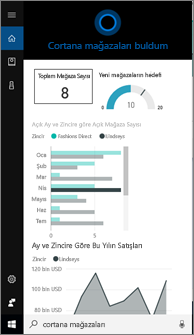
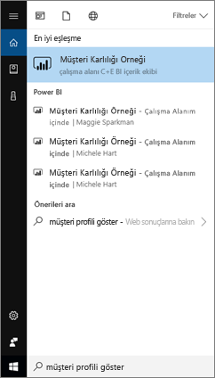
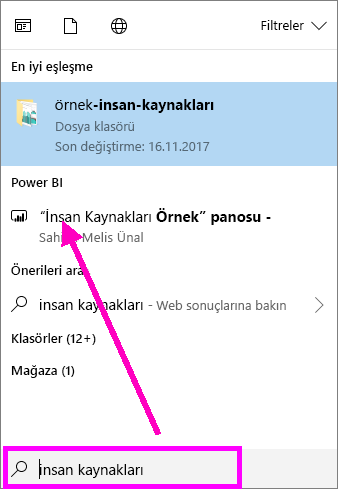
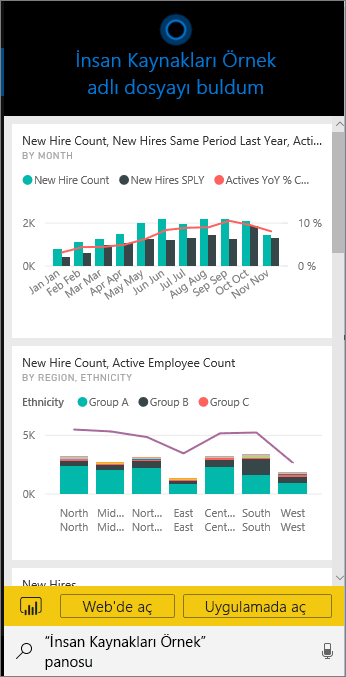
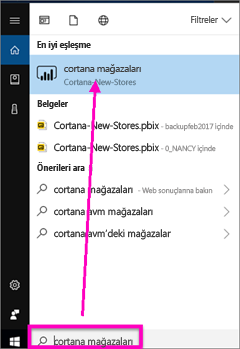
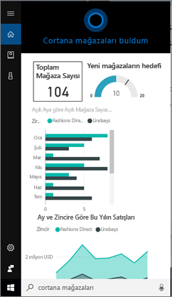
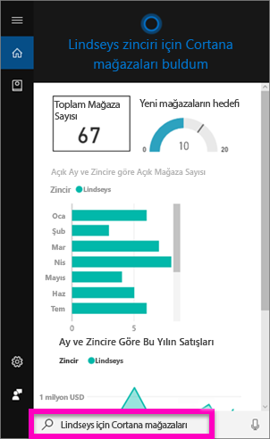
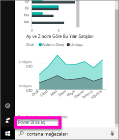
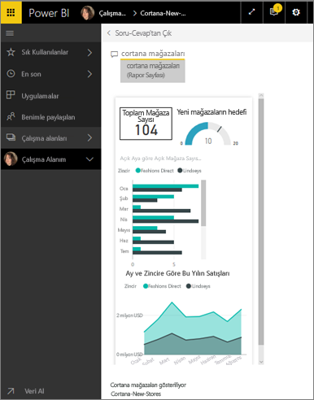

# Power BI için Cortana'yı kullanarak Power BI verilerinizi hızla bulma ve görüntüleme
Windows 10 cihazlarınızda Cortana'yı kullanarak işletmenizle ilgili önemli sorulara anında cevap alabilirsiniz. Cortana, Power BI ile tümleştirildiğinde Power BI panolarındaki ve raporlarındaki önemli bilgilere doğrudan ulaşabilir. İhtiyacınız olanlar Windows 10 Kasım 2015 veya sonrası sürümü, Cortana, Power BI ve en az bir veri kümesine erişimdir.

## Windows 10'daki yeni Cortana *pano* arama deneyimini önizleme
Bir süredir [Cortana'yı kullanarak belirli türdeki rapor sayfalarını alma](service-cortana-answer-cards.md) özelliğini kullanıyordunuz. Eklediğimiz **yeni deneyim** sayesinde artık panoları da alma olanağı sunuyoruz. Lütfen bu yeni özelliği deneyin ve [bize geri bildirim gönderin](mailto:pbicortanasg@microsoft.com). İlerleyen zamanlarda *yeni deneyim* genişletilerek raporların da Cortana aramasına dahil edilmesi sağlanacak.  Yeni deneyimin başlıca avantajlarından biri, kurulum için herhangi bir işlem yapmanıza gerek olmamasıdır. Cortana'yı etkinleştirmenize veya Windows 10'u yapılandırmanıza gerek kalmadan sistem çalışır duruma gelir.

> [!NOTE]
> Çalışmazsa yardım almak için [Sorun giderme makalesini](service-cortana-troubleshoot.md) inceleyebilirsiniz.
> 
> 

Kullanılan teknoloji [Microsoft Azure Search Hizmeti]()'nden faydalanır. Bu arama hizmeti akıllı sıralama, hata düzeltme ve otomatik tamamlama gibi ek özellikler sunar.

İki Cortana deneyimi de birlikte kullanılabilir durumda olacaktır.

## Power BI için Cortana belgeleri
Power BI için Cortana'yı kurma ve kullanma aşamasında size rehberlik edecek 4 belge mevcuttur. Bu makale serisi aşağıdaki adımları uygulamanızı sağlayacaktır

**1. Makale** (bu makale): Cortana ve Power BI'ın birlikte nasıl çalıştığını anlama

**2. Makale**: [Power BI raporlarında arama yapma: Raporlar için Cortana - Power BI - Windows tümleştirmesini etkinleştirme](service-cortana-enable.md)

**3. Makale**: [Power BI raporlarında arama yapma: özel *Cortana yanıt kartları* oluşturma](service-cortana-answer-cards.md)

**4. Makale**: [Sorun giderme](service-cortana-troubleshoot.md)

## Cortana ve Power BI birlikte nasıl çalışır?
Cortana'ya bir soru sorduğunuzda cevap aradığı yerlerden biri Power BI olabilir. Cortana, Power BI'da raporlardan (*Cortana yanıt kartı* olarak adlandırılan özel rapor türüne sahip olanlardan) ve panolardan gelen zengin veri kaynaklı cevaplar bulabilir.

Cortana bir eşleşme bulduğunda panonun veya rapor sayfasının adını doğrudan Cortana ekranınızda görüntüler. Pano veya rapor sayfasını Power BI'da açabilirsiniz. Ayrıca, rapor sayfaları etkileşimli olduğu için bunları doğrudan Cortana'da inceleyebilirsiniz.

### Cortana ve Panolar (*yeni deneyim*)
Cortana, size ait olan ve sizinle paylaşılmış olan panolarda cevap bulabilir. Cortana'ya soru sorarken başlıkları, anahtar sözcükleri, içerik sahibi adlarını, çalışma alanı adlarını, uygulama adlarını ve çok daha fazlasını kullanabilirsiniz.

Cortana'nın cevap bulabilmesi için sorunuzda en az 2 kelime olması gerekir. Bu nedenle, adı tek kelimeden (Marketing) oluşan bir panoda arama yapmak için sorunuza "show", "Power BI" veya "<owner name>" ekleyerek "show Marketing" ya da "michele hart sample" gibi bir ifadeye dönüştürün. 

Panonuzun başlığı birden fazla kelimeden oluşuyorsa Cortana ilgili panoyu yalnızca en az iki kelimesi aramanızla veya kelimelerden biri panoyla ve pano sahibinin adıyla eşleştiğinde döndürür. "Customer Profitability Sample" adlı bir pano için: 

* "show me customer" ifadesi bir Power BI panosu sonucu *döndürmez*.   
* "show me customer profitability", "customer p", "customer s", "profitability sample", "michele hart sample", "show customer profitability sample" ve "show me customer p" gibi ifadeler bir Power BI sonucu *döndürür*.
* "powerbi" kelimesini eklediğinizde gerekli 2 kelimeden biri olarak sayılır ve bu nedenle "powerbi sample" ifadesi bir Power BI sonucu *döndürür*. 
  
    

### Cortana ve Raporlar
 Cortana, [Cortana tarafından görüntülenmek üzere tasarlanmış özel sayfalara](service-cortana-answer-cards.md) sahip olan raporlarda cevap bulabilir. Bu özel rapor sayfalarının başlığını veya içinde geçen anahtar sözcükleri kullanarak soru sorabilirsiniz.  

Raporlar için kullanılan teknoloji, [Microsoft Power BI Soru-Cevap](power-bi-q-and-a.md) hizmetinden faydalanır.

Cortana'ya bir soru sorduğunuzda Power BI, Cortana için özel olarak hazırlanmış olan rapor sayfalarını kullanarak cevap verir. Olası cevaplar Cortana tarafından Power BI'da önceden oluşturulmuş olan Cortana *yanıt kartları* kullanılarak belirlenir.  Bir cevap hakkında daha fazla bilgi edinmek için sonucu Power BI'da açabilirsiniz.

> [!NOTE]
> Cortana'nın soruların cevabını Power BI raporlarında arayabilmesi için [Power BI hizmetini kullanarak bu özelliği etkinleştirmeniz ve Windows'u Power BI ile iletişim kuracak şekilde ayarlamanız](service-cortana-enable.md) gerekir.  
> 
> 

## Cortana'yı kullanarak Power BI'dan cevap alma
1. Cortana'dan başlayın. Cortana'yı *açmak* için kullanabileceğiniz birçok farklı yöntem vardır. Görev çubuğundaki Cortana simgesini (aşağıda gösterilmiştir) seçin, sesli komutları kullanın veya Windows mobil cihazınızdaki arama simgesine dokunun.
   
     
2. Cortana hazır duruma geldikten sonra sorunuzu Cortana arama çubuğuna yazın veya söyleyin. Cortana kullanılabilir sonuçları görüntüler. Soruyla eşleşen bir Power BI panosu varsa **En iyi eşleşme** veya **Power BI** bölümünde gösterilir.
   
     
   
   > [!NOTE]
   > Şu anda yalnızca İngilizce dili desteklenmektedir.
   > 
   > 
3. Cortana'da açmak istediğiniz panoyu seçin.

    

    Düzeni değiştirmek için [panonun *telefon görünümünü* düzenleyebilirsiniz](service-create-dashboard-mobile-phone-view.md). 

1. Cortana'da ayrıca panoyu Power BI hizmetinde veya Power BI mobil uygulamasında açma seçenekleri de mevcuttur. Panoyu Power BI hizmetinde açmak için **Web'de aç**'ı seçin. 
   
      
4. Şimdi Cortana'yı kullanarak bir rapor arayalım. [Raporda Cortana yanıt kartı içeren bir sayfa olduğundan](service-cortana-answer-cards.md) emin olmamız gerekir. Bu örnekte "cortana stores" adlı bir yanıt kartı sayfasına sahip olan "Cortana-New-Stores" adlı bir raporu kullanıyoruz.  
   
     Sorunuzu Cortana arama çubuğuna yazın veya söyleyin. Cortana kullanılabilir sonuçları görüntüler. Soruyla eşleşen bir Power BI rapor sayfası varsa **En iyi eşleşme** veya **Power BI** bölümünde gösterilir. Bu örnekte yanıt kartını oluşturmak için kullanılan .pbix dosyası (ve yedeği) **Belgeler** bölümünde gösterilmektedir.
   
      
5. **Cortana stores** rapor sayfasını seçerek Cortana penceresinde açılmasını sağlayabilirsiniz.
   
       
   
    *Yanıt kartının* bir veri kümesi sahibi tarafından oluşturulmuş olan özel bir Power BI rapor sayfası türü olduğunu unutmayın.  Daha fazla bilgi için bkz. [Cortana yanıt kartı oluşturma](service-cortana-answer-cards.md).
6. Özellikler bu kadarla sınırlı değil. Yanıt kartlarındaki görselleştirmelerle Power BI'da yaptığınız gibi etkileşim kurabilirsiniz.
   
   * Örneğin görselleştirmedeki öğelerden birini seçerek çapraz filtre uygulayabilir, yanıt kartındaki diğer görselleştirmeleri vurgulayabilirsiniz.
     
     
   * İsterseniz sonuçları filtrelemek için doğal dil de kullanabilirsiniz.  Örneğin "Cortana stores for Lindseys" sorusunu yönelttiğinizde kart yalnızca Lindseys mağaza zincirine ait verileri gösterecek şekilde filtrelenir.
     
     
7. Keşfetmeye devam edin. Cortana penceresinin alt kısmına gidin ve **Power BI'da aç**'ı seçin.
   
     
8. Rapor sayfası Power BI'da açılır.    
     

## Önemli noktalar ve sorun giderme
* Cortana, [Power BI için etkinleştirilmiş](service-cortana-enable.md) olmayan Cortana kartlarına erişemez.
* Cortana'yı Power BI ile birlikte çalıştıramadınız mı?  [Cortana ile ilgili sorunları giderme](service-cortana-troubleshoot.md) makalesine bakın.
* Power BI için Cortana şu anda yalnızca İngilizce dilinde kullanılabilir.
* Power BI için Cortana yalnızca Windows mobil cihazlarında kullanılabilir.

Başka bir sorunuz mu var? [Power BI Topluluğu'na başvurun](http://community.powerbi.com/)

## Sonraki adımlar
[Raporlar için Cortana - Power BI - Windows tümleştirmesini etkinleştirme](service-cortana-enable.md)

