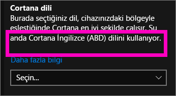
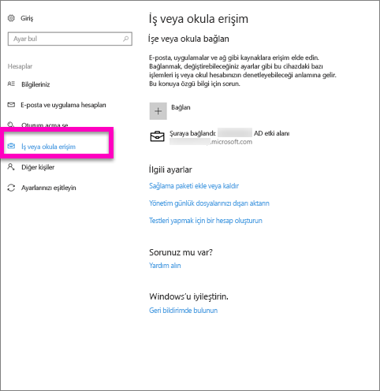
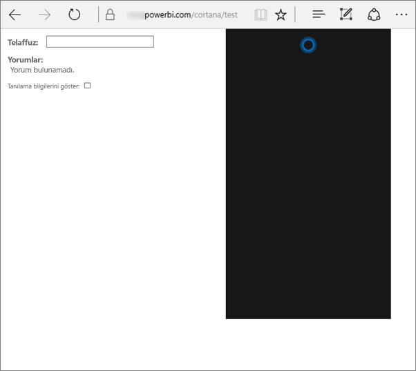
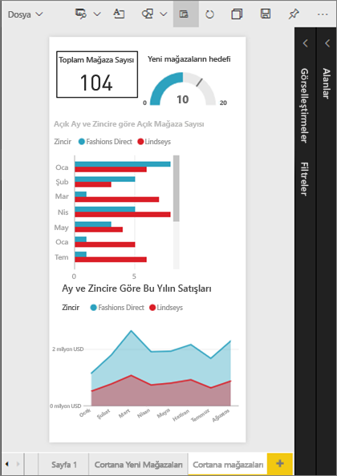
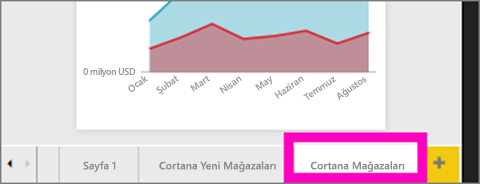
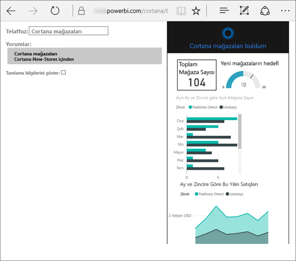
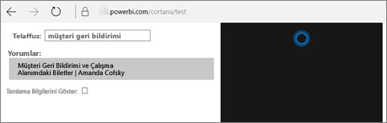

# Power BI için Cortana ile ilgili sorunları giderme
Bu makale bir serinin parçasıdır. 

> [!IMPORTANT]
> Cortana tümleştirmesi Power BI’da kullanım dışı bırakılıyor. Cortana, 11 Haziran'dan itibaren artık pano ve raporlar için çalışmayacak.

Cortana'yı Power BI ile tümleştirme konusunda sorun yaşıyorsanız doğru yerdesiniz. Sorunu tanılamak ve gidermek için aşağıdaki adımları uygulayın.

## Cortana neden Power BI raporlarımdan veya panolarımdan yanıt getirmiyor?
1. Power BI hesabınız var mı?  Yoksa [ücretsiz deneme için kaydolun](https://powerbi.microsoft.com/get-started/).
2. Cortana çalışıyor mu?  Görev çubuğunuzda Cortana simgesini görüyor musunuz?

    

    Bu simgeyi seçtiğinizde Cortana içine yazabileceğiniz bir alanla birlikte açılıyor mu?
3. Aramanıza en az 2 kelime yazdınız mı? Cortana, Power BI'da yanıt bulmak için en az 2 kelimelik ifadelere ihtiyaç duyar. Sorunuzun başına "show" ifadesini eklemeyi deneyin.
4. Panonuzun başlığı birden fazla kelimeden oluşuyorsa Cortana ilgili panoyu yalnızca en az iki kelimesi aramanızla eşleştiğinde döndürür. "Sales FY16" adlı bir pano için:

   * "show sales" ifadesi Power BI sonucu *döndürmez*.   
   * "show me sales fy16", "sales fy16", "show fy16" ve "show me sales f" ifadeleri bir Power BI sonucu *döndürür*.    
   * "powerbi" kelimesini eklediğinizde gerekli 2 kelimeden biri olarak sayılır ve bu nedenle "powerbi sales" ifadesi bir Power BI sonucu *döndürür*.
5. Herhangi bir raporda veya panoda erişim ya da düzenleme izniniz var mı? Raporlar için aramaya çalıştığınız içeriğin bir [yanıt kartına](service-cortana-answer-cards.md) sahip olduğundan emin olun.  Panolar için aramaya çalıştığınız içeriğin **Benimle paylaşılan**, uygulama çalışma alanı veya **Çalışma alanım** bölümlerinden birinde olduğundan emin olun. Sorunu tanımlama konusunda yardım almak için [sorun giderme aracını kullanın](#try-the-cortana-troubleshooting-tool).
6. Mobil cihaz mı kullanıyorsunuz?  Şu anda Power BI ve Cortana tümleştirmesini yalnızca Windows mobil cihazlarda destekliyoruz.
7. Cortana İngilizce için mi yapılandırılmış?  Cortana-Power BI tümleştirmesi şu an için yalnızca İngilizce dilini desteklemektedir. Cortana'yı açın ve ayarlarını görüntülemek için dişli simgesini seçin. Aşağıdaki **Cortana dili** bölümüne kaydırın ve İngilizce seçeneklerinden birine ayarlanmış olduğundan emin olun.

   
8. Cortana'nın etkinleştirilmiş olduğu 100'den fazla rapor mu var?  Cortana yalnızca 100 rapora kadar arama yapar.  Aramaya dahil edildiğinden emin olmak için raporunuzu **Çalışma Alanım** bölümüne taşıyın veya kopyalayın. Cortana ilk olarak bu konumda arama yapar.
9. İşlemin tamamlanması için biraz zaman tanımanız gerekebilir. Bir sorguyu ilk kez yazdığınızda model henüz *hazırlanmamış* olabilir. Verilerin belleğe yüklenmesi için birkaç saniye bekleyip tekrar deneyin.
10. Panoların Cortana tarafından erişilebilir duruma gelmesi 24 saat sürebilir.    
11. Raporlarda yeni bir veri kümesi veya özel yanıt kartı Power BI'a eklenip Cortana özelliği etkinleştirildiğinde sonuçların Cortana'da görünmeye başlaması 30 dakika sürebilir. Windows 10 oturumunu kapatıp tekrar açtığınızda veya Windows 10'daki Cortana işlemini başka bir şekilde yeniden başlattığınızda yeni rapor içeriği anında görünür hale gelir.  
12. Power BI Yöneticiniz bu özelliği "iptal edebilir". Durumun bu olup olmadığını görmek için yöneticinizle iletişime geçin.

## Yalnızca raporlar: Cortana neden Power BI raporlarımdan yanıt getirmiyor?
1. Raporların içinde yanıt arıyorsanız kendinize şu soruyu sormanız gerekir: Cortana **yanıt kartı** bulunan raporum var mı? Cortana'nın Power BI raporlarınızda yanıt bulması için yanıt kartları gereklidir.  Yanıt kartını nasıl oluşturacağınızı öğrenmek için bkz. [Power BI hizmetinde ve Power BI Desktop'ta Cortana yanıt kartları oluşturma](service-cortana-answer-cards.md).
2. Windows sürüm 1511 veya sonrası ile mi çalışıyorsunuz?  Öğrenmek için Windows Ayarları'nı açıp **Sistem > Hakkında** bölümüne gidin. Gerekirse Windows sürümünüzü güncelleştirin.
3. Windows ve Power BI hesaplarınız birbirine bağlı mı? Bu konu kafa karıştırıcı olabilir. [Power BI için Cortana'yı etkinleştirme](service-cortana-enable.md#add-your-power-bi-credentials-to-windows) sayfasındaki yönergeleri uygulayın.
4. Temel alınan veri kümeleri Cortana için etkinleştirilmiş mi? Belki de iş arkadaşlarınızdan biri önceden Cortana için etkinleştirilen bir veri kümesini paylaşmıştır. Durum bu değilse [veri kümelerini Cortana için nasıl etkinleştireceğinizi öğrenin](service-cortana-enable.md). Bu hızlı ve kolay bir işlemdir.

## Yalnızca panolar: Cortana neden Power BI panolarımdan yanıt getirmiyor?
1. İş hesabınıza bağlı olduğunuzdan emin olun. Power BI, verilere erişim izninizi belirlemek amacıyla kimlik doğrulaması gerçekleştirebilmek için bu bağlantıya ihtiyaç duyar. Bağlı olup olmadığınızı kontrol etmek ve bağlı değilseniz iş hesabınıza bağlanmak için Windows arama kutusunu kullanarak "İş yerine veya okula bağlan" sayfasına gidin.  

    
2. Cortana'ya erişiminiz var mı? Windows arama kutusunu seçin ve Cortana'ya bilgilerinize erişim izni verin.

## Cortana sorun giderme aracını kullanmayı deneyin
Sorun devam mı ediyor?  O halde Cortana sorun giderme aracını çalıştırarak olası sorunlarla ilgili eleme yapmanın tam zamanı.

### Raporlardan yanıt alma konusunda sorun mu yaşıyorsunuz?
1. Raporlar için sorun giderme aracını çalıştırmadan önce Cortana yanıt kartlarınızdaki **Sayfa düzeyi** filtrelerini **Tek bir seçim yapılmasını zorunlu kıl** olarak ayarladığınızdan emin olun. Bunu yapma konusunda yardım almak için bkz. [Cortana yanıt kartları oluşturma](service-cortana-answer-cards.md).
2. Power BI hizmeti URL'nizin sonuna "/cortana/test" ekleyerek sorun giderme aracını açın. URL'niz şuna benzer olmalıdır:

   app.powerbi.com/cortana/test

   
3. Raporlarla ilgili sorunları gidermek için **Utterance** (Söyleyiş) alanına bir Cortana yanıt kartının adını ***tam olarak Power BI sekmesinde göründüğü şekilde*** yazın.

   

    

   
4. Bazen **Utterance** (Söyleyiş) alanına giriş yaptığınızda hiçbir işlem gerçekleşmez. İlk girişi sistemi harekete geçirmek olarak düşünün. Bu işlemle sorun giderme aracına çalışmaya başlama zamanının geldiğini bildirmiş olursunuz. Kes ve yapıştır komutlarıyla veya yazarak **Utterance** (Söyleyiş) alanına tekrar giriş yapın. Bu örnekte yanıt kartımızın adı **Cortana stores**. Araca **Cortana stores** ifadesini yapıştırdığımızda veya yazdığımızda **Interpretations** (Yorumlar) alanında görüntülenen tek bir sonuç oluşturulur. Cortana penceresinde görüntülenen yanıt kartını (bu örnekte **Cortana stores**) görmek için tıklayın.

   

   Bir sonuç elde ettiğimiz için Cortana'nın Power BI'da **etkin olduğunu** biliyoruz. Bu durumda sorunun nedenleri Windows tarafı, Cortana dil ayarı veya Cortana için 100'den fazla veri kümesinin etkinleştirilmiş olması seçeneklerine kalıyor.

### Panolardan yanıt alma konusunda sorun mu yaşıyorsunuz?
Sizinle paylaşılmış olan bir panoyu mu arıyorsunuz?  Power BI > **Benimle paylaşılan** sayfasını açın ve panonun adını bulun.  Daha sonra söz konusu adı **Utterances** (Söyleyiş) alanına girin.

#### Sorun giderme aracıyla ilgili bilinen sorunlar
* Araç sonuçları ilk seferde getirmezse sorguyu Utterance (Söyleyiş) metin kutusuna yapıştırın.
* İşlevin tasarımı nedeniyle sorgunun 2 veya daha fazla kelimeden oluşması gerekir.  Sorgunuz çok kısaysa "show" kelimesini ekleyin.
* Edat içeren bazı sorgu dizeleri (ör. sales by item) sonuç döndürmeyebilir. Edat içermeyen, anlamlı ve benzersiz sorgu terimleri kullanmayı deneyin.

Başka bir sorunuz mu var? [Power BI Topluluğu'na başvurun](http://community.powerbi.com/)
