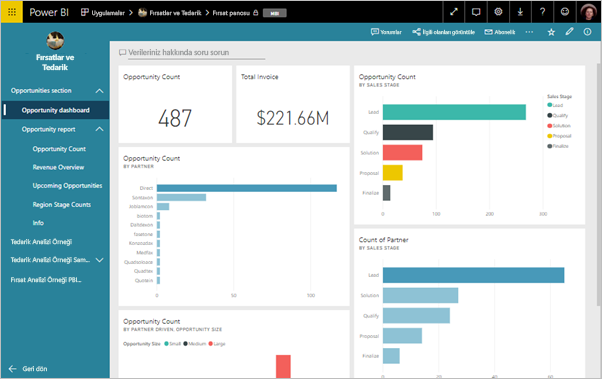
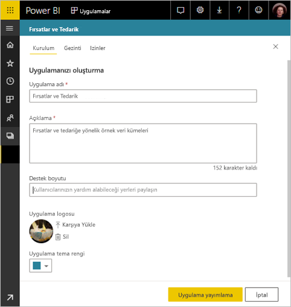
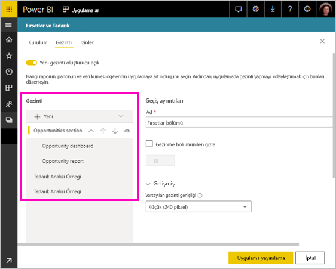
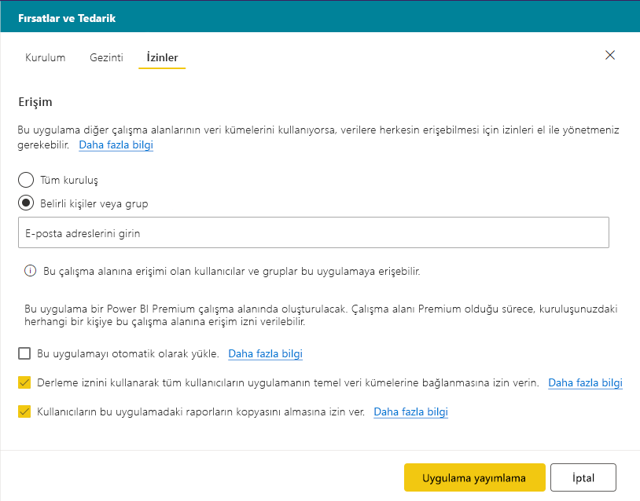
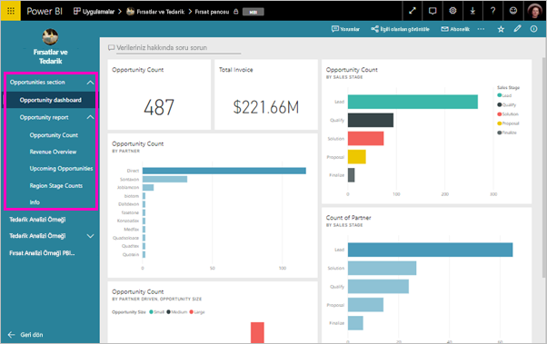

# Power BI'da bir uygulama yayımlama

Power BI'da, paketlenmiş resmi içerik oluşturma sonra geniş bir kitleye dağıtmak bir *uygulama*. İş arkadaşlarınızla Power BI içeriği üzerinde işbirliği yapabildiğiniz bir yer olan *uygulama çalışma alanlarında* uygulama oluşturabilirsiniz. Ardından tamamlanmış uygulamaları kuruluşunuzdaki büyük kullanıcı gruplarına yayımlayabilirsiniz. 

İş kullanıcılarınız işlerini yürütmek için sıklıkla birden fazla Power BI panosu ve raporuna ihtiyaç duyar. Power BI uygulamalarıyla, pano ve rapor koleksiyonları oluşturabilir, bu uygulamaları ister bütün kuruluşunuza, ister belirli kişi ve gruplara yayımlayabilirsiniz. Bir rapor oluşturucusu veya yönetici olarak sizin için uygulamalar, bu koleksiyonlarda izin yönetimini kolaylaştırır.

İş kullanıcıları, uygulamalarınızı birkaç farklı yolla alın:

- Bulma ve uygulamanızı Microsoft Appsource'tan yükleyebilir.
- Bunları doğrudan bağlantı gönderebilirsiniz.
- Power BI yöneticiniz izin verirse, uygulamayı otomatik olarak iş arkadaşlarınızın Power BI hesaplarına yükleyebilirsiniz.

Kullanıcılarınızın içeriğinizi kendi kullanacağınızı kolayca bulabilmek için yerleşik kendi gezinme ile uygulama oluşturabilirsiniz. Uygulamanın içeriğini değiştiremez. Bu Power BI hizmetinde veya bir mobil uygulama - ile etkileşim kurabilir – filtreleme, vurgulama ve verileri sıralama. Güncelleştirmeleri otomatik olarak alırlar ve verinin ne sıklıkla yenileneceğini denetleyebilirsiniz. [İş kullanıcıları için uygulama deneyimiyle](consumer/end-user-apps.md) ilgili daha fazla bilgi edinin.

## Uygulamalar için lisanslar
Oluşturmak veya bir uygulamayı güncelleştirmek için bir Power BI Pro lisansı gereklidir. Uygulama için *tüketiciler*, iki seçenek vardır.

* 1. Seçenek: Tüm iş kullanıcılarının uygulamanızı görüntülemek için **Power BI Pro** lisansına ihtiyacı vardır. 
* 2. Seçenek: Uygulama çalışma alanınız bir Power BI Premium kapasitesinde yer alıyorsa, kuruluşunuzdaki ücretsiz sürüm kullanıcıları uygulama içeriğini görüntüleyebilir. Ayrıntılar için [Power BI Premium nedir?](service-premium.md) makalesini okuyun.

## Uygulamanızı yayımlama
Çalışma alanınızdaki panolar ve raporlar hazır olduğunda, hangi panoları ve raporları yayımlamak istediğinizi seçer ve ardından bunları bir uygulama olarak yayımlarsınız. 

1. Çalışma alanı liste görünümünde, hangi panoları ve raporları istediğiniz karar **uygulamaya dahil edilen**.

     

     İlişkili Panoya sahip bir rapor eklememeyi seçerseniz, raporun yanında bir uyarı görürsünüz. Yine de uygulamayı yayımlayabilirsiniz ancak ilişkili Panoda söz konusu raporun kutucukları olmaz.

     

2. Seçin **uygulamayı Yayımla** oluşturma ve uygulama çalışma alanından yayımlama işlemini başlatmak için sağ üst köşedeki düğmesi.
   
     

3. Üzerinde **Kurulum**, adı ve uygulamayı bulmasını kolaylaştıracak bir açıklama girin. Bunu özelleştirmek için bir Tema rengi ayarlayabilirsiniz. Ayrıca, bir destek sitesi için bir bağlantı ekleyebilirsiniz.
   
     

4. Üzerinde **Gezinti**, uygulamanın bir parçası yayımlanacak içeriği seçin. Ardından bölümlerde içeriği düzenlemek için gezintisini, ekleyin. Bkz: [uygulamanız için gezinti deneyimini tasarlamak](#design-the-navigation-experience-for-your-app) Ayrıntılar için bu makaledeki.
   
     

5. Üzerinde **erişim**, uygulamaya kimlerin erişebildiğini karar verin. 
    - İçinde [Klasik çalışma alanları](service-create-workspaces.md): Herkes kuruluşunuz, belirli kişiler veya Azure Active Directory (AAD) güvenlik grupları.
    - İçinde [yeni deneyimi çalışma alanları](service-create-the-new-workspaces.md): belirli kişiler, AAD güvenlik grupları ve dağıtım listeleri ve Office 365 grupları.

6. İzinleriniz varsa, uygulamanın alıcılara otomatik olarak yükleyebilirsiniz. Bu ayar bir Power BI yöneticisi tarafından Power BI Yönetim Portalı’ndan etkinleştirilebilir. Daha fazla bilgi edinin [otomatik olarak uygulama yükleme](#automatically-install-apps-for-end-users) bu makaledeki.

     

7. Seçtiğinizde, **uygulamayı Yayımla**, onu yayımlamaya hazır olduğunu doğrulayan bir ileti görürsünüz. İçinde **bu uygulamayı paylaşın** iletişim kutusunda, bu uygulamaya doğrudan bir bağlantıdır URL'sini kopyalayabilir.
   
     

Kişilere doğrudan bağlantısını sizinle paylaştığı ile veya onlar giderek uygulamalar sekmesinde uygulamanızı bulabilirsiniz gönderebilirsiniz **indirin ve Appsource'tan daha fazla uygulama keşfedin**. [İş kullanıcıları için uygulama deneyimiyle](consumer/end-user-apps.md) ilgili daha fazla bilgi edinin.

## Yayımlanmış uygulamanızı değiştirme
Uygulamanızı yayımladıktan sonra değiştirmek veya güncelleştirmek isteyebilirsiniz. Bir yönetici veya yeni bir uygulama çalışma alanı üyesi olduğunuz uygulamayı güncelleştirmek kolaydır. 

1. Uygulamaya karşılık gelen uygulama çalışma alanını açın. 
   
     

2. Pano veya rapor için istediğiniz değişiklikleri yapın.
 
     Uygulama çalışma alanı sizin hazırlama alanınızdır. Dolayısıyla değişiklikleriniz, uygulamayı tekrar yayımlamadığınız sürece geçerlilik kazanmaz. Böylece yayımlanmış uygulamaları etkilemeden değişiklik yapabilirsiniz.  
 
    > [!IMPORTANT]
    > Bir raporu Kaldır ve uygulamaya yeniden rapor ekleme bile uygulama güncelleştirme, kullanıcıların yer işaretleri, yorumlar, vb. gibi tüm özelleştirmeleri kaybedersiniz.  
 
3. İçeriği seçin ve uygulama çalışma alanı listesinde dönün **uygulamayı Güncelleştir** sağ üst köşedeki.
   
1. Güncelleştirme **Kurulum**, **Gezinti**, ve **izinleri**gerekir ve ardından seçin, **uygulamayı Güncelleştir**.
   
Uygulamayı yayımladığınız kişiler, otomatik olarak uygulamanın güncelleştirilmiş sürümünü görür. 

## Tasarım uygulamanız için Gezinti deneyimi
**Yeni gezinti Oluşturucu** seçenek, uygulamanız için özel bir gezinti oluşturmanıza olanak tanır. Özel gezinti bulup uygulama içeriği kullanma, kullanıcılarınızın kolaylaştırır. Var olan uygulamalar, bu seçenek devre dışı bırakılmış ve seçeneğine üzerinde olan yeni uygulamalar varsayılan sahiptir.

Seçeneği kapalıyken, seçebileceğiniz **uygulama giriş sayfası** ya da **belirli içerik**örnek bir Pano veya rapor ya da seçin, **hiçbiri** temel bir listesini göstermek için kullanıcı içeriği.

Ne zaman açmanız **yeni gezinti Oluşturucu**, özel bir gezinti tasarlayabilirsiniz. Varsayılan olarak, tüm raporlar, panolar ve Excel çalışma kitapları, uygulamaya dahil edilen bir düz liste olarak listelenir. 

Daha fazla gezintisini tarafından da özelleştirebilirsiniz:
* Yukarı kullanarak öğelerinin yeniden sıralanmasını / aşağı okları. 
* Öğeleri yeniden adlandırma **rapor ayrıntıları**, **Pano ayrıntıları**, ve **çalışma kitabının ayrıntılarını**.
* Gezinti bölmesinden belirli öğeleri gizleme.
* Kullanarak **yeni** ekleme seçeneği **bölümleri** grubuna ilişkili içerik.
* Kullanarak **yeni** ekleme seçeneği bir **bağlantı** için sol gezinti bölmesinde bir dış kaynağa. 

Eklediğinizde bir **bağlantı**, **bağlantı ayrıntıları** seçebileceğiniz nerede bağlantı açar. Varsayılan olarak bağlantı açma **geçerli sekme**, ancak seçebilirsiniz **yeni sekme**, veya **içerik alanının**. 

### Yeni Gezinti Oluşturucusu seçeneğini kullanma konuları
Yeni Gezinti oluşturucuyu kullanırken akılda tutulması gereken genel noktalar şunlardır:
* Rapor sayfaları uygulama gezinti alanında genişletilebilir bir bölümü gösterilir.
* Yeni Gezinti Oluşturucu Kapat ve yayımlama veya uygulamanızı güncelleştirin, yaptığınız özelleştirmelerin kaybedersiniz. Örneğin, bölümler, sıralama, bağlantılar ve özel adlar gezinti öğeleri için tüm kaybolur.

Bağlantılar, uygulama gezinti ve içerik alanı seçeneğini belirleyerek eklerken:
* Bağlantı eklenebilir emin olun. Bazı hizmetler, Power BI gibi üçüncü taraf sitelerinin içeriklerini katıştırma engelleyin.
* Power BI hizmet içeriğinizin raporlar veya panolar gibi diğer çalışma alanları ekleme desteklenmiyor. 
* Power BI rapor sunucusu ekleme aracılığıyla kendi yerel içerik URL'si içeriği şirket içi dağıtımından ekleme. İçindeki adımları kullanın [Power BI rapor sunucusu URL'si oluşturma](https://docs.microsoft.com/power-bi/report-server/quickstart-embed#creating-the-power-bi-report-server-report-url) URL'sini alabilirsiniz. Böylece şirket içi sunucunun bir VPN bağlantısı gerektirir ve içeriği görüntüleyen normal kimlik doğrulama kurallarını uyguladığınız dikkat edin. 
* Bir güvenlik uyarısı, Power BI'da içerik değil belirtmek için katıştırılmış içeriği üst kısmında gösterilir.

## Son kullanıcılar için uygulamaları otomatik olarak yükleme
Bir yönetici izin veriyorsa, uygulamaları otomatik olarak yükleyebilirsiniz *gönderme* son kullanıcıların onları. Bu anında iletme işlevleri doğru kişilere veya gruplara doğru uygulamaları dağıtmayı kolaylaştırır. Uygulamanızı otomatik olarak son kullanıcılarınızın uygulama içerik listesinde görünür. Bunlar Microsoft Appsource'tan bulmak veya bir yükleme bağlantısı izleyin gerekmez. Yöneticiler nasıl imkan tanıdığını öğrenin [son kullanıcılara uygulama gönderme](service-admin-portal.md#push-apps-to-end-users) Power BI Yönetici portalı makaledeki.

### Uygulama, son kullanıcılara otomatik olarak gönderilmesi nasıl
Yöneticiniz size izinleri verdikten sonra, **uygulamayı otomatik olarak yüklemek** için yeni bir seçeneğiniz olur. Ne zaman kutuyu işaretleyin ve seçin **uygulamayı Yayımla** (veya **uygulamayı Güncelleştir**), uygulamanın tüm kullanıcılara gönderilir veya tanımlı gruplar **izinleri** uygulamanınbirbölümünü**Erişim** sekmesi.

### Kullanıcılar'ın, gönderdiğinizde uygulamalarını nasıl alır
Bir uygulamayı gönderdikten sonra bunların uygulamalar listesinde otomatik olarak gösterilir. Bu yolla, uygulamaları, belirli kullanıcılar ya da iş roller kuruluş gereksinimlerinize parmaklarının ucunda olması, seçki olarak sunabilirsiniz.

### Uygulamaları otomatik olarak yüklemeye ilişkin dikkat edilmesi gereken noktalar
Aşağıda, son kullanıcılara uygulama gönderirken göz önünde bulundurmanız gereken noktalar verilmiştir:

* Kullanıcılar için bir uygulamayı otomatik olarak yüklemek zaman alabilir. Çoğu uygulama kullanıcılar, ancak uygulama göndermeyi için hemen yükleme zaman alabilir.  Bu, uygulamadaki öğelerin ve erişim verilen kişilerin sayısını bağlıdır. Uygulamaları, çalışma saatleri dışında ve kullanıcılar bunlara ihtiyaç duymadan önce yeterince zaman varken göndermenizi öneririz. Uygulamaların kullanılabilirliği hakkında genel bilgilendirme göndermeden önce birkaç kullanıcı ile bunu doğrulayın.

* Tarayıcıyı yenileyin. Kullanıcının, gönderilen uygulamayı Uygulamalar listesinde görebilmek için önce tarayıcısını yenilemesi veya kapatıp yeniden açması gerekebilir.

* Kullanıcılar uygulamayı uygulamalar listesinde hemen görmüyorsanız, bunlar yenileyin veya kapatın ve kullanıcının tarayıcıyı açın.

* Kullanıcılara zahmet vermemeye çalışın. Kullanıcılarınızın önceden yüklenen uygulamaların onlar için kullanışlı olduğu algısına kapılmaması için çok fazla sayıda uygulama göndermemeye dikkat edin. İdeal yaklaşım, zamanlamayı koordine edebilmek açısından son kullanıcılara kimlerin uygulama gönderebileceğini denetlemektir. Bir son kullanıcılara gönderilen kuruluşunuzdaki uygulamaları alma iletişim noktası oluşturun.

* Konuk kullanıcılar davet kabul etmediğiniz için bunları otomatik olarak yüklenen uygulamalar elde etmezsiniz.  

## Bir uygulamayı yayımdan kaldırma
Uygulama çalışma alanının herhangi bir üyesi uygulamayı yayımdan kaldırabilir.

>[!IMPORTANT]
>Uygulamayı yayımdan kaldırdığınızda uygulama kullanıcıları özelleştirmelerini kaybederler. Bunlar, kişisel yer işaretleri, yorum veya uygulama içeriği ile ilişkilendirilmiş abonelik kaybedersiniz. Yalnızca kaldırmanız gereken uygulamaları yayımdan kaldırın.
> 
> 

* Bir uygulama çalışma alanında sağ üst köşedeki üç nokta ( **...** ) simgesini ve **Uygulamayı yayımdan kaldır**ı seçin.
  
     

Bu eylem uygulamayı yayımladığınız herkesten uygulamayı kaldırır ve bu kullanıcılar artık uygulamaya erişemez. Uygulama çalışma alanı veya içerikleri silinmez.

## Yayımlanan uygulamanızı görüntülemek

Kullanıcıların uygulamanızı açtığınızda, yerine standart Power BI sol gezinti bölmesinde oluşturduğunuz Gezinti görürler. Raporlar ve panolar tanımladınız bölümlerde gezintisini listeler. Ayrıca her bir rapor, bunun yerine, yalnızca tek tek sayfaları listeler rapor adı.

## Sonraki adımlar
* [Uygulama çalışma alanı oluşturma](service-create-workspaces.md)
* [Power BI'da uygulamaları yükleme ve kullanma](consumer/end-user-apps.md)
* [Dış hizmetler için Power BI uygulamaları](service-connect-to-services.md)
* [Power BI Yönetici Portalı](https://docs.microsoft.com/power-bi/service-admin-portal)
* Sorularınız mı var? [Power BI Topluluğu'na sorun](http://community.powerbi.com/)
