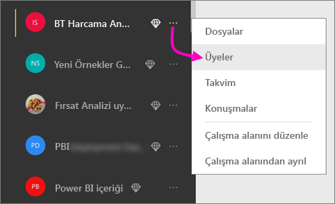
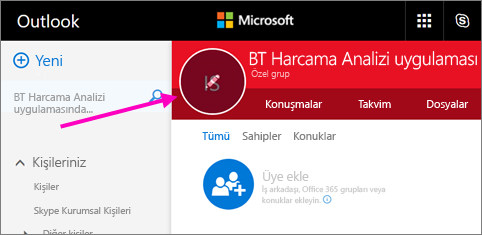
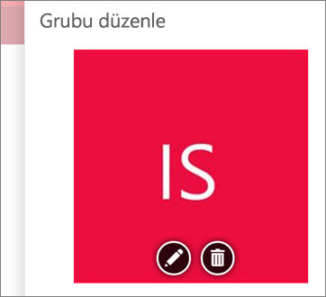
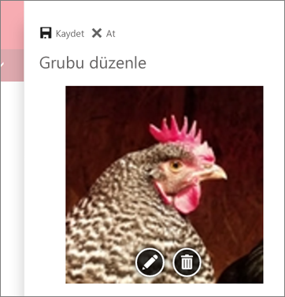
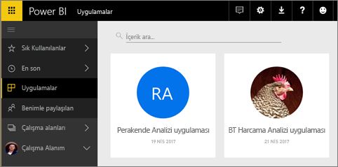

# Power BI'da panolar ve raporlar içeren uygulamalar oluşturma ve yayımlama

Power BI'da, ilişkili pano ve raporları bir araya getirip kuruluşunuzda kalabalık gruplara yayımlamak için *uygulamalar* oluşturabilirsiniz. Ayrıca, Google Analytics ve Microsoft Dynamics CRM gibi [dış hizmetler için Power BI uygulamalarına](service-connect-to-services.md) da bağlanabilirsiniz.

İş kullanıcılarınız işlerini yürütmek için sıklıkla birden fazla Power BI panosu ve raporuna ihtiyaç duyar. Uygulamalar bu parçaları bir araya getirir. Böylece tüm bu panoların adını ve konumunu hatırlamalarına gerek kalmaz. Power BI uygulamalarıyla, pano ve rapor koleksiyonları oluşturabilir, bu uygulamaları ister bütün kuruluşunuza, ister belirli kişi ve gruplara yayımlayabilirsiniz. Bir rapor oluşturucusu veya yönetici olarak sizin için uygulamalar, pano koleksiyonlarında izin yönetimini kolaylaştırır.

İş kullanıcıları, uygulamalarınızı birkaç farklı yöntemle alabilir. Power BI yöneticinizin izin vermesi durumunda bir uygulamayı otomatik olarak iş arkadaşlarınızın Power BI hesaplarına yükleyebilirsiniz. Buna alternatif olarak, iş arkadaşlarınız, uygulamalarınızı Microsoft AppSource'tan yükleyebilir veya iş arkadaşlarınıza bir doğrudan bağlantı gönderebilirsiniz. Hepsi tek bir yerde olduğu için içeriğinizi kolayca bulabilir ve içeriğinize geri dönebilirler. Güncelleştirmeleri otomatik olarak alırlar ve verinin ne sıklıkla yenileneceğini denetleyebilirsiniz. [İş kullanıcıları için uygulama deneyimiyle](service-install-use-apps.md) ilgili daha fazla bilgi edinin.

### Uygulamalar için lisanslar
Bir uygulama oluşturucusu olarak Power BI Pro lisansına ihtiyacınız vardır. Uygulama kullanıcılarınız için, uygulamanızı görüntülemeye yönelik iki seçenek vardır.

* 1. Seçenek: Bir uygulama kullanıcısına **Power BI Pro** lisansı atanmıştır. 
* 2. Seçenek: Bir uygulama kullanıcısına **Power BI Pro** lisansı atanmıştır, ama uygulama Power BI Premium kapasitesinde durur. Ayrıntılar için [Power BI Premium nedir?](service-premium.md) makalesini okuyun.

### Uygulamalar ve kurumsal içerik paketleri
Uygulamalar, kurumsal içerik paketlerinin gelişmiş halidir. Zaten kurumsal içerik paketleriniz varsa bu paketler, uygulamalarla yan yana çalışmaya devam ederler.

Uygulamalara genel bakış yaptığımıza göre, uygulamaları oluşturduğumuz yer olan *uygulama çalışma alanlarından* bahsedelim. 

## Video: Uygulamalar ve uygulama çalışma alanları
<iframe width="640" height="360" src="https://www.youtube.com/embed/Ey5pyrr7Lk8?showinfo=0" frameborder="0" allowfullscreen></iframe>

## Uygulama çalışma alanları
*Uygulama çalışma alanları*, uygulamaları oluşturduğunuz yerdir, diğer bir deyişle, bir uygulama oluşturmadan önce uygulama çalışma alanı oluşturmanız gerekir. Daha önce Power BI'da bir grup çalışma alanında çalıştıysanız uygulama çalışma alanları size tanıdık gelecektir. Bunlar grup çalışma alanlarının gelişmiş halidir. Uygulama içeriği için hazırlama alanları ve kapsayıcılardır. 

Bu çalışma alanlarına iş arkadaşlarınızı üye veya yönetici olarak ekleyebilirsiniz. Uygulama çalışma alanlarının tüm üyelerine ve yöneticilerine Power BI Pro lisansları gerekir. Çalışma alanında hep birlikte panolar, raporlar ve daha geniş bir kitleye, hatta tüm kuruluşunuza dağıtmayı planladığınız diğer makaleler üzerinde işbirliği yapabilirsiniz. 

İçerik hazır olduğunda, yayımlamak istediğiniz panoları ve raporları seçin, ardından uygulamayı yayımlayın. İstediğiniz geniş kitleye doğrudan bağlantı gönderebilirsiniz veya uygulamanızı, **daha fazla uygulama indirmek ve keşfetmek üzere AppSource'taki Uygulamalar** sekmesine giderek kendileri indirebilir. Diğer kişiler uygulamanın içeriğini değiştiremez ancak ister Power BI hizmetinde ister mobil uygulamalardan birinde içerikle etkileşim kurarak verileri filtreleyebilir, vurgulayabilir ve sıralayabilir. 

## Uygulama çalışma alanı oluştur
[!INCLUDE [powerbi-service-create-app-workspace](./includes/powerbi-service-create-app-workspace.md)]

Şu anda boş. Bu nedenle şimdi içerik ekleyeceğiz. Çalışma alanını ilk oluşturduğunuzda, Office 365'e yayılması için yaklaşık bir saat beklemeniz gerekebileceğini unutmayın. 

İçerik eklemek tıpkı Çalışma Alanım bölümünüze içerik eklemeye benzer ancak çalışma alanındaki diğer kişiler de bu içeriği görüp onunla çalışabilir. İçeriği tamamladığınızda bir uygulama olarak yayımlayabilecek olmanız büyük bir farktır. Uygulama çalışma alanındayken, tıpkı Çalışma Alanım bölümünüzde olduğu gibi dosyaları karşıya yükleyebilir veya dosyalara ya da aynı şekilde üçüncü taraf hizmetlere de bağlanabilirsiniz. Örneğin:

* Microsoft Dynamics CRM, Salesforce veya Google Analytics gibi [hizmetlere bağlanın](service-connect-to-services.md).
* Excel, CSV veya Power BI Desktop (PBIX) gibi [dosyalardan veri alın](service-get-data-from-files.md).

Bir uygulama çalışma alanının içeriğini görüntülediğinizde, içerik sahibi uygulama çalışma alanının adı olarak gösterilir.

## Uygulamanıza bir görüntü ekleme (isteğe bağlı)
Varsayılan olarak Power BI, uygulamanız için uygulamanın baş harflerini içeren küçük ve renkli bir daire oluşturur. Ancak, bunu bir görüntüyle özelleştirmek isteyebilirsiniz. Bir görüntü eklemek için Exchange Online lisansı gerekir.

1. **Çalışma Alanı**'nı ve ardından çalışma alanı adının yanındaki üç nokta (...) simgesiyle **Üyeler**'i seçin. 
   
     
   
    Çalışma alanı için Office 365 Outlook hesabı yeni bir tarayıcı penceresinde açılır.
2. Sol üstteki renkli dairenin üzerine gelirseniz daire bir kalem simgesine dönüşür. Kalem simgesini seçin.
   
     
3. Kalem simgesini yeniden seçin ve kullanmak istediğiniz görüntüyü bulun.
   
     
4. **Kaydet**'i seçin.
   
     
   
    Görüntü, Office 365 Outlook penceresindeki renkli dairenin yerine geçer. 
   
     
   
    Birkaç dakika sonra Power BI'daki uygulamada da görünecektir.
   
     

## Uygulamanızı yayımlama
Uygulama çalışma alanınızdaki panolar ve raporlar hazır olduğunda, bunları bir uygulama olarak yayımlayabilirsiniz. Unutmayın, çalışma alanındaki tüm raporları ve panoları yayımlamanıza gerek yoktur. Yalnızca hazır olanları yayımlamanız yeterlidir.

1. Çalışma alanı liste görünümünde, hangi panoları ve raporları uygulamaya eklemek istediğinize karar verin.

     

     Bir raporu yayımlamamaya karar verirseniz raporun ve ilişkili panonun yanında bir uyarı görürsünüz. Yine de uygulamayı yayımlayabilirsiniz ancak ilişkili panoda söz konusu raporun kutucukları eksik olacaktır.

     

2. Sağ üstteki **Uygulamayı yayımla** düğmesini seçtiğinizde tüm içeriğin söz konusu çalışma alanında paylaşılma süreci başlar.
   
     

3. **Ayrıntılar** alanına kullanıcıların uygulamayı bulmasını kolaylaştıracak bir açıklama girin. Bunu özelleştirmek için bir arka plan rengi ayarlayabilirsiniz.
   
     

4. **İçerik**'te uygulamanın parçası olarak yayımlanacak içeriği, diğer bir deyişle söz konusu çalışma alanında seçtiğiniz her şeyi görebilirsiniz. Ayrıca, uygulama giriş sayfasını, başka bir deyişle kullanıcıların uygulamanıza girdiğinde göreceği ilk pano veya raporu da ayarlayabilirsiniz. **Hiçbiri**'ni seçebilirsiniz. Bu durumda giriş sayfası uygulamadaki bütün içeriklerin bir listesi olacaktır. 
   
     

5. **Erişim** bölümünde uygulamaya kimin erişebileceğine (kuruluşunuzdaki herkes, belirli kişiler veya Active Directory güvenlik grupları) karar verin. İzinleriniz varsa uygulamanın alıcılara otomatik olarak yüklenmesine karar verebilirsiniz. Bu ayarı [Power BI Yönetim Portalı](#how-to-enable-pushing-apps)’nda etkinleştirebilirsiniz. [Bir uygulama göndermeye](#how-to-enable-pushing-apps) ilişkin dikkate alınması gereken diğer noktalarla ilgili daha fazla bilgi edinebilirsiniz.

    

6. **Son**'u seçtiğinizde, uygulamanın yayımlamaya hazır olduğunu doğrulayan bir ileti göreceksiniz. Başarılı iletişim kutusundaki URL'yi kopyalayabilirsiniz. Bu, uygulamaya doğrudan bir bağlantıdır ve bunu uygulamayı paylaştığınız kişilere gönderebilirsiniz.
   
     

Uygulamayı yayımladığınız iş kullanıcıları, söz konusu uygulamayı birkaç farklı yolla bulabilir. Otomatik olarak yükleyebiliyorsanız, Power BI hesabında Uygulamalar altında görünür. Uygulamanın doğrudan bağlantısını gönderebilirsiniz veya kullanıcılar, erişimleri olan her uygulamayı görebildiği Microsoft AppSource'ta uygulamayı arayabilir. Nasıl edindiklerine bakılmaksızın, daha sonra Uygulamalar'a her gittiklerinde, bu uygulamayı listelerinde görürler.

[İş kullanıcıları için uygulama deneyimiyle](service-install-use-apps.md) ilgili daha fazla bilgi edinin.

## Yayımlanmış uygulamanızı değiştirme
Uygulamanızı yayımladıktan sonra değiştirmek veya güncelleştirmek isteyebilirsiniz. Uygulama çalışma alanının yöneticisi veya üyesiyseniz uygulamayı güncelleştirmek kolaydır. 

1. Uygulamaya karşılık gelen uygulama çalışma alanını açın. 
   
     
2. Raporu veya panoyu açın. İstediğiniz değişikliği yapabileceğinizi göreceksiniz.
   
     Uygulama çalışma alanı sizin hazırlama alanınızdır. Değişiklikleriniz, uygulamayı tekrar yayımlamadığınız sürece uygulamada kullanıma alınmaz. Böylece yayımlanmış uygulamaları etkilemeden değişiklik yapabilirsiniz.  
 
3. Uygulama çalışma alanı içerik listesine geri dönün ve **Uygulamayı güncelleştir**'i seçin.
   
     

4. Gerektiği durumda **Ayrıntılar**, **İçerik** ve **Erişim**'i güncelleştirin, daha sonra **Uygulamayı güncelleştir**'i seçin.
   
     

Uygulamayı yayımladığınız kişiler, otomatik olarak uygulamanın güncelleştirilmiş sürümünü görür. 

# Son kullanıcılar için uygulamaları otomatik olarak yükleme
Uygulamaları, son kullanıcılar için otomatik olarak yükleyebilirsiniz. Böylece doğru kişilere veya gruplara doğru uygulamaları dağıtmanız kolaylaşır.

Uygulamalar, son kullanıcılarınızın işlerini yapmak için ihtiyaç duyduğu verileri sunar. Artık uygulamaları Microsoft AppSource’tan bulmak veya bir yükleme bağlantısını izlemek yerine söz konusu uygulamaları Uygulamalar içerik listesinden otomatik olarak yükleyebilirsiniz. Bu, standart Power BI içeriğini kullanıcılarınıza sunmanızı kolaylaştırır.

## Bir uygulama, son kullanıcılar için otomatik olarak nasıl yüklenir?
Yönetici, özelliği etkinleştirdikten sonra uygulama yayımcıları **uygulamayı otomatik olarak yüklemek** için kullanılabilecekleri yeni bir seçeneğe sahip olur. Kutu ***işaretli*** olduğunda ve uygulama yayımcısı **Son** (veya mevcut uygulamalar için **Uygulamayı güncelleştir**) seçeneğini belirlediğinde uygulama, **Erişim** sekmesinde uygulamanın **İzinler** bölümünde tanımlanmış tüm kullanıcılara veya gruplara gönderilir.

## Kullanıcılar kendilerine gönderilen uygulamaları nasıl alır?
Bir uygulamayı göndermenizin ardından uygulama otomatik olarak Uygulamalar listesinde görünür. Kuruluşunuzdaki bir kullanıcının veya iş rolünün parmaklarının ucunda olması gereken uygulamaları seçki olarak sunabilirsiniz.

### Uygulamaları otomatik olarak yüklemeye ilişkin dikkat edilmesi gereken noktalar
Aşağıda, son kullanıcılara uygulama gönderirken göz önünde bulundurmanız gereken bazı hususlar verilmiştir:

* Kullanıcılar için bir uygulamayı otomatik olarak yüklemek zaman alabilir. Uygulamaların birçoğu kullanıcılar için hemen yüklenir ancak uygulamaları göndermek zaman alabilir.  Bu, uygulamadaki öğelerin ve erişim verilen kişilerin sayısını bağlıdır. Uygulamaları, çalışma saatleri dışında ve kullanıcılar bunlara ihtiyaç duymadan önce yeterince zaman varken göndermenizi öneririz. Uygulamaların kullanılabilirliği hakkında genel bilgilendirme göndermeden önce birkaç kullanıcı ile bunu doğrulayın.

* Tarayıcınızı yenileyin. Kullanıcının, gönderilen uygulamayı Uygulamalar listesinde görebilmek için önce tarayıcısını yenilemesi veya kapatıp yeniden açması gerekebilir.

* Kullanıcı, uygulamayı Uygulamalar listesinde hemen görmüyorsa tarayıcısını yenilemeli veya kapatıp yeniden açmalıdır.

* Kullanıcılara zahmet vermemeye çalışın. Kullanıcılarınızın önceden yüklenen uygulamaların onlar için kullanışlı olduğu algısına kapılmaması için çok fazla sayıda uygulama göndermemeye dikkat edin. İdeal yaklaşım, zamanlamayı koordine edebilmek açısından son kullanıcılara kimlerin uygulama gönderebileceğini denetlemektir. Kuruluşunuzda, son kullanıcılara gönderilen uygulamaları alacak bir irtibat kişisi belirleyebilirsiniz.

* Bir daveti kabul etmeyen konuk kullanıcılar için uygulamalar otomatik olarak yüklü gelmez.  

## Bir uygulamayı yayımdan kaldırma
Uygulama çalışma alanının herhangi bir üyesi uygulamayı yayımdan kaldırabilir.

* Bir uygulama çalışma alanında sağ üst köşedeki üç nokta (**...**) simgesini ve **Uygulamayı yayımdan kaldır**ı seçin.
  
     

Bu eylem uygulamayı yayımladığınız herkesten uygulamayı kaldırır ve bu kullanıcılar artık uygulamaya erişemez. Uygulama çalışma alanı veya içerikleri silinmez.

## Power BI uygulamaları hakkında SSS
### Uygulama çalışma alanlarının grup çalışma alanlarından farkı nedir?
Bu sürümde, tüm grup çalışma alanlarını uygulama çalışma alanları olarak yeniden adlandırdık. Bu çalışma alanlarının herhangi birinden uygulama yayımlayabilirsiniz. İşlevsellik, çoğunlukla grup çalışma alanlarıyla aynı düzeyde sabit kalmıştır. Önümüzdeki birkaç ay içinde uygulama çalışma alanlarını aşağıdaki gibi iyileştirmeyi planlıyoruz: 

* Uygulama çalışma alanları oluşturmak, grup çalışma alanlarının yaptığı gibi Office 365'te kendilerine karşılık gelen varlıklar oluşturmaz. Bu nedenle, arka planda farklı Office 365 gruplarının oluşturulmasından endişe duymaksızın istediğiniz sayıda uygulama çalışma alanı oluşturabilirsiniz (dosyalarınızı depolamak için hâlâ bir Office 365 grubunun OneDrive İş'ini kullanabilirsiniz). 
* Şu anda üyeler ve yöneticiler listesine sadece bireyleri ekleyebilirsiniz. Yakın zamanda yönetimin kolaylaşması için bu listelere birden çok AD güvenlik grubu ya da modern grup ekleyebileceksiniz.  

### Uygulamalarla kurumsal içerik paketlerinin farkı nedir?
Uygulamalar, içerik paketlerinin evrim geçirmiş, basitleşmiş ve birkaç önemli farklılığı olan halleridir. 

* İş kullanıcıları bir içerik paketi yükledikten sonra paket, gruplandırılmış kimliğini kaybeder: Başka panolar ve raporlara karışmış bir pano ve rapor listesinden ibaret olur. Buna karşın uygulamalar, gruplandırılmış halleri ve kimliklerini yüklemeden sonra bile korur. Böylece iş kullanıcıları zaman geçtikten sonra bile uygulamalara kolayca gidebilir.
* Herhangi bir çalışma alanında birden çok içerik paketi oluşturabilirsiniz ancak bir uygulamanın çalışma alanıyla bire bir ilişkisi vardır. Böylece uygulamaların anlaşılmasının ve korunmasının uzun vadede kolaylaştığına inanıyoruz. Bu alanı nasıl iyileştirmeyi planladığımızla ilgili daha çok bilgi için Power BI blogunun "roadmap" (yol haritası) bölümüne başvurun. 
* Zaman içinde kurumsal içerik paketlerini kullanımdan kaldırmayı planlıyoruz. Bu nedenle bundan sonra uygulama oluşturmanızı öneririz.  

### Gruplardaki salt okunur kullanıcılara ne olacak?
Gruplara, yalnızca içeriği görüntüleyebilen salt okunur üyeler ekleyebilirsiniz. Bu yaklaşımdaki ana problem, güvenlik gruplarının üye olarak eklenememesiydi. 

Uygulamalarda ise, uygulama çalışma alanınızın salt okunur bir sürümünü güvenlik grupları dahil olmak üzere geniş kitlelere yayımlayabilirsiniz. Uygulamanın içindeki panolarda ve raporlarda yapacağınız değişiklikleri, son kullanıcıyı etkilemeden hazırlayabilirsiniz. Gelecekte uygulamaları bu şekilde kullanmanızı öneriyoruz. Uzun vadede, çalışma alanlarının salt okunur kullanıcılarını da kullanımdan kaldırmayı planlıyoruz.  

## Sonraki adımlar
* [Power BI'da uygulamaları yükleme ve kullanma](service-install-use-apps.md)
* [Dış hizmetler için Power BI uygulamaları](service-connect-to-services.md)
* [Power BI Yönetici Portalı](https://docs.microsoft.com/en-us/power-bi/service-admin-portal)
* Sorularınız mı var? [Power BI Topluluğu'na sorun](http://community.powerbi.com/)
