# Power BI'da panolar ve raporlar içeren uygulamalar yayımlama

Power BI'da, ilgili panolar ve raporlar koleksiyonunu içeren *uygulamaları* yayımlayabilirsiniz. İş arkadaşlarınızla Power BI içeriği üzerinde işbirliği yapabildiğiniz bir yer olan *uygulama çalışma alanlarında* uygulama oluşturabilirsiniz. Ardından tamamlanmış uygulamaları kuruluşunuzdaki büyük kullanıcı gruplarına yayımlayabilirsiniz. [Uygulama çalışma alanları oluşturma](service-create-workspaces.md) hakkında daha fazla bilgi edinin.

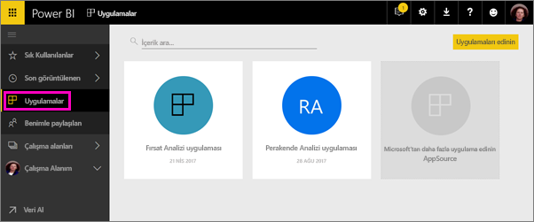

İş kullanıcılarınız işlerini yürütmek için sıklıkla birden fazla Power BI panosu ve raporuna ihtiyaç duyar. Power BI uygulamalarıyla, pano ve rapor koleksiyonları oluşturabilir, bu uygulamaları ister bütün kuruluşunuza, ister belirli kişi ve gruplara yayımlayabilirsiniz. Bir rapor oluşturucusu veya yönetici olarak sizin için uygulamalar, bu koleksiyonlarda izin yönetimini kolaylaştırır.

İş kullanıcıları, uygulamalarınızı birkaç farklı yöntemle alabilir. Power BI yöneticinizin izin vermesi durumunda uygulamaları otomatik olarak iş arkadaşlarınızın Power BI hesaplarına yükleyebilirsiniz. Buna alternatif olarak, iş arkadaşlarınız, uygulamalarınızı Microsoft AppSource'tan yükleyebilir veya iş arkadaşlarınıza bir doğrudan bağlantı gönderebilirsiniz. Hepsi tek bir yerde olduğu için içeriğinizi kolayca bulabilir ve içeriğinize geri dönebilirler. Uygulamanın içeriğini değiştiremezler ancak ister Power BI hizmetinde ister mobil uygulamalardan birinde içerikle etkileşim kurarak verileri filtreleyebilir, vurgulayabilir ve sıralayabilirler. Güncelleştirmeleri otomatik olarak alırlar ve verinin ne sıklıkla yenileneceğini denetleyebilirsiniz. [İş kullanıcıları için uygulama deneyimiyle](service-install-use-apps.md) ilgili daha fazla bilgi edinin.

**Biliyor muydunuz?** Power BI yeni bir çalışma alanı deneyiminin önizlemesini sunuyor. Çalışma alanlarının gelecekte nasıl bir değişim geçireceğini görmek için [Yeni çalışma alanları oluşturma (önizleme)](service-create-the-new-workspaces.md) konusunu okuyun. 

## Uygulamalar ve kurumsal içerik paketleri
Uygulamalar, kurumsal içerik paketlerinin gelişmiş halidir. Yeni çalışma alanı deneyimi önizlemesinde içerik paketleri yoktur. Yeni çalışma alanı deneyimi genel kullanıma sunulduktan sonra, yeni oluşturulan çalışma alanlarında artık içerik paketlerini kullanamayacaksınız. Henüz yapmadıysanız, içerik paketlerinizi uygulamalara geçirmeye başlayın.

## Video: Uygulamalar ve uygulama çalışma alanları
<iframe width="640" height="360" src="https://www.youtube.com/embed/Ey5pyrr7Lk8?showinfo=0" frameborder="0" allowfullscreen></iframe>

## Uygulamalar için lisanslar
Uygulama çalışma alanının her üyesinin Power BI Pro lisansına ihtiyacı vardır. Uygulama kullanıcıları için iki seçenek sağlanır.

* 1. Seçenek: Tüm iş kullanıcılarının uygulamanızı görüntülemek için **Power BI Pro** lisansına ihtiyacı vardır. 
* 2. Seçenek: Uygulamanız Power BI Premium kapasitesinde yer alıyorsa, kuruluşunuzdaki ücretsiz kullanıcılar uygulama içeriğini görüntüleyebilir. Ayrıntılar için [Power BI Premium nedir?](service-premium.md) makalesini okuyun.

## Uygulamanızı yayımlama
Çalışma alanınızdaki panolar ve raporlar hazır olduğunda, hangi panoları ve raporları yayımlamak istediğinizi seçer ve ardından bunları bir uygulama olarak yayımlarsınız. İstediğiniz geniş kitleye doğrudan bağlantı gönderebilirsiniz veya uygulamanızı, **daha fazla uygulama indirmek ve keşfetmek üzere AppSource'taki Uygulamalar** sekmesine giderek kendileri indirebilir. 

1. Çalışma alanı liste görünümünde, hangi panoları ve raporları uygulamaya eklemek istediğinize karar verin.

     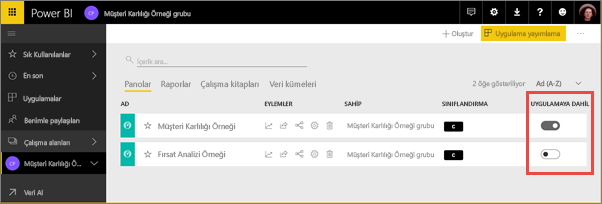

     Bir raporu yayımlamamaya karar verirseniz raporun ve ilişkili panonun yanında bir uyarı görürsünüz. Yine de uygulamayı yayımlayabilirsiniz ancak ilişkili panoda söz konusu raporun kutucukları eksik olacaktır.

     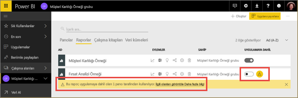

2. Sağ üstteki **Uygulamayı yayımla** düğmesini seçtiğinizde tüm içeriğin söz konusu çalışma alanında paylaşılma süreci başlar.
   
     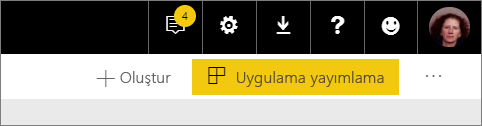

3. **Ayrıntılar** alanına kullanıcıların uygulamayı bulmasını kolaylaştıracak bir açıklama girin. Bunu özelleştirmek için bir arka plan rengi ayarlayabilirsiniz.
   
     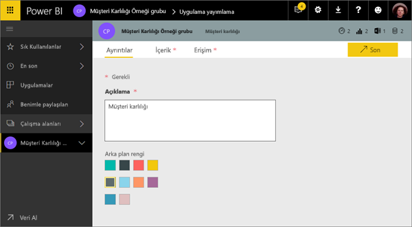

4. **İçerik**'te uygulamanın parçası olarak yayımlanacak içeriği, diğer bir deyişle söz konusu çalışma alanında seçtiğiniz her şeyi görebilirsiniz. Ayrıca, uygulama giriş sayfasını, başka bir deyişle kullanıcıların uygulamanıza girdiğinde göreceği ilk pano veya raporu da ayarlayabilirsiniz. **Hiçbiri**'ni seçebilirsiniz. Bu durumda giriş sayfası uygulamadaki bütün içeriklerin bir listesi olacaktır. 
   
     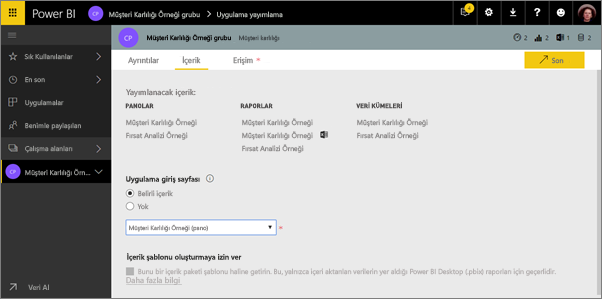

5. **Erişim** bölümünde uygulamaya kimin erişebileceğine (kuruluşunuzdaki herkes, belirli kişiler veya Active Directory güvenlik grupları) karar verin. İzinleriniz varsa uygulamanın alıcılara otomatik olarak yüklenmesine karar verebilirsiniz. Bu ayarı [Power BI Yönetim Portalı](#how-to-enable-pushing-apps)’nda etkinleştirebilirsiniz. [Bir uygulama göndermeye](#how-to-enable-pushing-apps) ilişkin dikkate alınması gereken diğer noktalarla ilgili daha fazla bilgi edinebilirsiniz.

    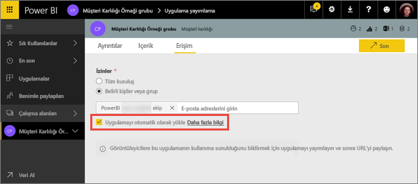

6. **Son**'u seçtiğinizde, uygulamanın yayımlamaya hazır olduğunu doğrulayan bir ileti göreceksiniz. Başarılı iletişim kutusundaki URL'yi kopyalayabilirsiniz. Bu, uygulamaya doğrudan bir bağlantıdır ve bunu uygulamayı paylaştığınız kişilere gönderebilirsiniz.
   
     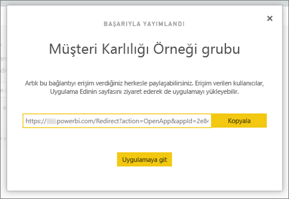

[İş kullanıcıları için uygulama deneyimiyle](service-install-use-apps.md) ilgili daha fazla bilgi edinin.

## Yayımlanmış uygulamanızı değiştirme
Uygulamanızı yayımladıktan sonra değiştirmek veya güncelleştirmek isteyebilirsiniz. Uygulama çalışma alanının yöneticisi veya üyesiyseniz ya da yeni uygulama çalışma alanına katkıda bulunanlardan biriyseniz, uygulamayı güncelleştirmek kolaydır. 

1. Uygulamaya karşılık gelen uygulama çalışma alanını açın. 
   
     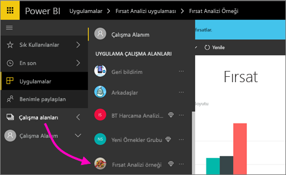
2. Raporu veya panoyu açın. İstediğiniz değişikliği yapabileceğinizi göreceksiniz.
   
     Uygulama çalışma alanı sizin hazırlama alanınızdır. Dolayısıyla değişiklikleriniz, uygulamayı tekrar yayımlamadığınız sürece geçerlilik kazanmaz. Böylece yayımlanmış uygulamaları etkilemeden değişiklik yapabilirsiniz.  
 
3. Uygulama çalışma alanı içerik listesine geri dönün ve **Uygulamayı güncelleştir**'i seçin.
   
     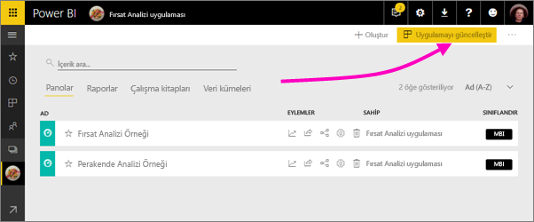

4. Gerektiği durumda **Ayrıntılar**, **İçerik** ve **Erişim**'i güncelleştirin, daha sonra **Uygulamayı güncelleştir**'i seçin.
   
     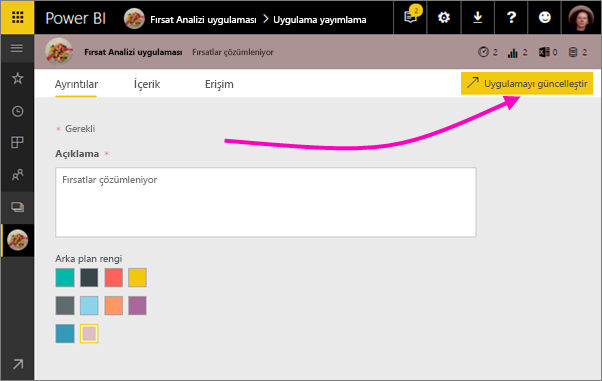

Uygulamayı yayımladığınız kişiler, otomatik olarak uygulamanın güncelleştirilmiş sürümünü görür. 

## Son kullanıcılar için uygulamaları otomatik olarak yükleme
Uygulamalar, son kullanıcılarınızın işlerini yapmak için ihtiyaç duyduğu verileri sunar. Yöneticiniz size gerekli izinleri verirse, uygulamaları son kullanıcılar için otomatik olarak yükleyebilirsiniz. Böylece doğru kişilere veya gruplara doğru uygulamaları dağıtmanız kolaylaşır. Uygulamanız otomatik olarak son kullanıcılarınızın Uygulama içerik listesinde gösterilir ve bu sayede son kullanıcıların Microsoft AppSource'tan uygulamayı bulması veya bir yükleme bağlantısını izlemesi gerekmez. Bu, standart Power BI içeriğini kullanıcılarınıza sunmanızı kolaylaştırır.

### Bir uygulama, son kullanıcılar için otomatik olarak nasıl yüklenir?
Yöneticiniz size izinleri verdikten sonra, **uygulamayı otomatik olarak yüklemek** için yeni bir seçeneğiniz olur. Kutuyu işaretlediğinizde ve **Son**'u (veya mevcut uygulamalar için **Uygulamayı güncelleştir**'i) seçtikten sonra, uygulama **Erişim** sekmesinin **İzinler** bölümünde tanımlanan tüm kullanıcılara veya gruplara gönderilir.

### Kullanıcılar kendilerine gönderilen uygulamaları nasıl alır?
Bir uygulamayı göndermenizin ardından uygulama otomatik olarak Uygulamalar listesinde görünür. Kuruluşunuzdaki belirli bir kullanıcının veya iş rolünün el altında bulundurması gereken uygulamaları seçki olarak sunabilirsiniz.

### Uygulamaları otomatik olarak yüklemeye ilişkin dikkat edilmesi gereken noktalar
Aşağıda, son kullanıcılara uygulama gönderirken göz önünde bulundurmanız gereken noktalar verilmiştir:

* Kullanıcılar için bir uygulamayı otomatik olarak yüklemek zaman alabilir. Uygulamaların birçoğu kullanıcılar için hemen yüklenir ancak uygulamaları göndermek zaman alabilir.  Bu, uygulamadaki öğelerin ve erişim verilen kişilerin sayısını bağlıdır. Uygulamaları, çalışma saatleri dışında ve kullanıcılar bunlara ihtiyaç duymadan önce yeterince zaman varken göndermenizi öneririz. Uygulamaların kullanılabilirliği hakkında genel bilgilendirme göndermeden önce birkaç kullanıcı ile bunu doğrulayın.

* Tarayıcınızı yenileyin. Kullanıcının, gönderilen uygulamayı Uygulamalar listesinde görebilmek için önce tarayıcısını yenilemesi veya kapatıp yeniden açması gerekebilir.

* Kullanıcı, uygulamayı Uygulamalar listesinde hemen görmüyorsa tarayıcısını yenilemeli veya kapatıp yeniden açmalıdır.

* Kullanıcılara zahmet vermemeye çalışın. Kullanıcılarınızın önceden yüklenen uygulamaların onlar için kullanışlı olduğu algısına kapılmaması için çok fazla sayıda uygulama göndermemeye dikkat edin. İdeal yaklaşım, zamanlamayı koordine edebilmek açısından son kullanıcılara kimlerin uygulama gönderebileceğini denetlemektir. Kuruluşunuzda, son kullanıcılara gönderilen uygulamaları alacak bir irtibat kişisi belirleyebilirsiniz.

* Bir daveti kabul etmeyen konuk kullanıcılar için uygulamalar otomatik olarak yüklü gelmez.  

## Bir uygulamayı yayımdan kaldırma
Uygulama çalışma alanının herhangi bir üyesi uygulamayı yayımdan kaldırabilir.

* Bir uygulama çalışma alanında sağ üst köşedeki üç nokta (**...**) simgesini ve **Uygulamayı yayımdan kaldır**ı seçin.
  
     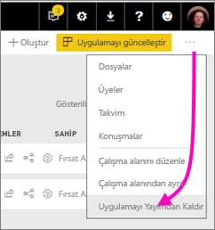

Bu eylem uygulamayı yayımladığınız herkesten uygulamayı kaldırır ve bu kullanıcılar artık uygulamaya erişemez. Uygulama çalışma alanı veya içerikleri silinmez.

## Sonraki adımlar
* [Uygulama çalışma alanı oluşturma](service-create-workspaces.md)
* [Power BI'da uygulamaları yükleme ve kullanma](service-install-use-apps.md)
* [Dış hizmetler için Power BI uygulamaları](service-connect-to-services.md)
* [Power BI Yönetici Portalı](https://docs.microsoft.com/power-bi/service-admin-portal)
* Sorularınız mı var? [Power BI Topluluğu'na sorun](http://community.powerbi.com/)
