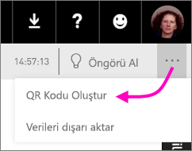
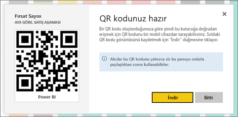

# Mobil uygulamalarda kullanmak üzere Power BI'daki bir kutucuk için QR kodu oluşturma
Power BI'daki QR kodları ile gerçek dünyadaki her şey ilgili BI bilgilerine gezinti ve arama gerekmeden doğrudan bağlanılabilir.

Herhangi bir panodaki (düzenleyemediğiniz panolardakiler de dahil) kutucuklar için Power BI hizmetinde QR kodu oluşturabilirsiniz. Ardından QR kodunu önemli bir konuma yerleştirebilirsiniz. Örneğin, kodu bir e-postaya yapıştırabilir veya yazdırıp belirli bir konuma yerleştirebilirsiniz. 

Panoyu paylaştığınız iş arkadaşlarınız [QR kodunu tarayarak doğrudan mobil cihazlarından kutucuğa erişebilir](mobile-apps-qr-code.md). Power BI uygulamasında yer alan QR kodu tarayıcısını veya cihazlarında yüklü olan diğer herhangi bir QR tarayıcısını kullanabilirler.

## Bir kutucuk için QR kodu oluşturma
1. Power BI hizmetinde bir panoyu açın.
2. Kutucuğun sağ üst köşesindeki üç nokta (...) simgesini ve **Odak modu** simgesini  seçin.
3. Sağ üst köşedeki üç nokta (...) simgesini seçin ve **QR kodu oluştur** seçeneğini belirleyin. 
   
    
4. QR kodunu içeren bir iletişim kutusu görünür. 
   
    
5. Burada QR kodunu tarayabilir veya aşağıdaki işlemleri gerçekleştirmek için indirip kaydedebilirsiniz: 
   
   * Bir e-postaya veya başka bir belgeye ekleme ya da 
   * yazdırıp belirli bir konuma yerleştirme. 

## QR kodunu yazdırma
Power BI, QR kodunu, JPG dosyası olarak yazdırılmaya hazır bir şekilde oluşturur. 

1. **İndir**'i seçin ve ardından yazıcıya bağlı bir bilgisayarda JPG dosyasını açın.  
   
   > [!TIP]
   > JPG dosyası kutucukla aynı ada sahiptir. Örneğin, "Opportunity Count - by Month, Sales Stage.jpg".
   > 
   > 
2. Dosyayı %100 oranında veya "gerçek boyutu" ile yazdırın.  
3. QR kodunu kesin ve kutucukla ilgili bir yere yapıştırın. 

## Sonraki adımlar
* Mobil uygulamalarla [gerçek dünyadan Power BI verilerine bağlanma](mobile-apps-data-in-real-world-context.md)
* [Scan a Power BI QR code from your mobile device (Mobil cihazınızdan Power BI QR kodu tarama)](mobile-apps-qr-code.md)
* [Bir rapor için QR kodu oluşturma](service-create-qr-code-for-report.md)
* Sorularınız mı var? [Power BI Topluluğu'na sorun](http://community.powerbi.com/)

