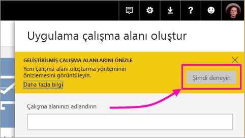
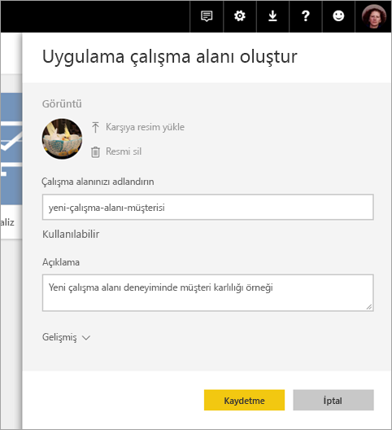
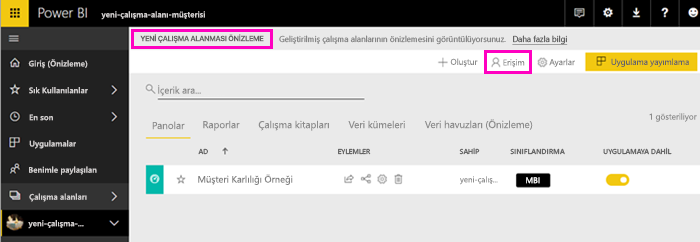
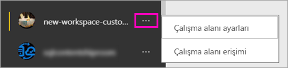

# Power BI'da yeni çalışma alanları oluşturma (önizleme)

Power BI yeni bir çalışma alanı deneyimini önizleme olarak sunuyor. Çalışma alanları hala iş arkadaşlarıyla işbirliği yapıp pano ve rapor koleksiyonları oluşturma yeridir. Bu pano ve raporları *uygulamalarınızın* içinde paketleyebilir ve kuruluşunuzun tamamına ya da belirli kişi veya gruplara dağıtabilirsiniz. 

Yeni çalışma alanları önizlemesiyle şimdi şunları yapabilirsiniz:

- Çalışma alanı rollerini kullanıcı gruplarına atayabilirsiniz: güvenlik grupları, dağıtım listeleri, Office 365 grupları ve bireyler.
- Office 365 grubu oluşturmadan Power BI'da bir çalışma alanı oluşturabilirsiniz.
- Çalışma alanında daha esnek bir izin yönetimi için daha ayrıntılı çalışma alanı rolleri kullanabilirsiniz.

Daha fazla arka plan bilgisi için, [yeni çalışma alanları (önizleme)](service-new-workspaces.md) makalesine bakın.

## Yeni uygulama çalışma alanlarından birini oluşturma

1. İşe uygulama çalışma alanını oluşturarak başlayın. **Çalışma alanları** > **Uygulama çalışma alanı oluşturma**'yı seçin.
   
     

2. **Geliştirilmiş çalışma alanlarını önizle** altında **Şimdi dene**'yi seçin.
   
     

2. Çalışma alanına bir ad verin. Ad kullanılamıyorsa, düzenleyerek benzersiz bir kimlik haline getirin.
   
     Uygulamanın adı çalışma alanının adıyla aynı olur.
   
1. İsterseniz bir resim ekleyin. Dosya boyutu 45 KB'tan küçük olmalıdır.
 
    

1. **Kaydet**'i seçin.

    Burada, yeni çalışma alanınızın **Hoş Geldiniz** ekranında verileri ekleyebilirsiniz. 

    

1. Örneğin, **Örnekler** > **Müşteri Kârlılığı Örneği**'ni seçin.

    Şimdi çalışma alanı içerik listesinde **Yeni çalışma alanları önizleme**'yi görürsünüz. Yönetici olduğunuz için yeni **Erişim** eylemini de görürsünüz.

    

1. **Erişim**'i seçin.

1. Bu çalışma alanlarına güvenlik gruplarını, dağıtım listelerini, Office 365 gruplarını veya kişileri üye, katkıda bulunan veya yönetici olarak ekleyin. Farklı rollerin açıklamaları için bu makalenin devamındaki [Yeni çalışma alanlarındaki roller](#roles-in-the-new-workspaces) bölümüne bakın.

    

9. **Ekle** > **Kapat**'ı seçin.

1. Power BI çalışma alanını oluşturur ve açar. Üyesi olduğunuz çalışma alanlarının listesinde bunu görürsünüz. Yönetici olduğunuz için üç nokta (…) simgesini seçerek geri gidebilir, çalışma alanı ayarlarında değişiklik yapabilir, yani yeni üye ekleyebilir veya üye izinlerini değiştirebilirsiniz.

     

## Uygulama çalışma alanınıza içerik ekleme

Yeni stilde bir uygulama çalışma alanı oluşturduktan sonra, buna içerik eklemenin zamanı gelir. Yeni ve eski stil çalışma alanlarına içerik ekleme işlemi, tek bir özel durum dışında aynıdır. Her iki uygulama çalışma alanında da, tıpkı Çalışma Alanım bölümünüzde olduğu gibi dosyaları karşıya yükleyebilir veya dosyalara bağlanabilirsiniz. Yeni çalışma alanlarında, kurumsal içerik paketlerine ya da Microsoft Dynamics CRM, Salesforce veya Google Analytics gibi üçüncü taraf içerik paketlerine bağlanamazsınız. Geçerli çalışma alanlarında içerik paketlerine bağlanabilirsiniz.

Uygulama çalışma alanının içerik listesinde içeriği görüntülediğinizde, uygulama çalışma alanının adı içerik sahibi olarak listelenir.

### Yeni çalışma alanlarında (önizleme) üçüncü taraf hizmetlere bağlanma

Yeni çalışma alanları deneyiminde, uygulamalara *odaklanmak* için bir değişiklik yapıyoruz. Üçüncü taraf hizmetlerine yönelik uygulamalar, kullanıcıların kullandıkları Microsoft Dynamics CRM, Salesforce veya Google Analytics gibi hizmetlerden veri almasını kolaylaştırır.
Kurumsal uygulamalar kullanıcılarınıza ihtiyaçları olan şirket içi verilerini getirir. Kurumsal uygulamalara, kullanıcıların uygulama içinde buldukları içeriği özelleştirebilmelerine olanak tanıyan özellikler eklemeyi planlıyoruz. Bu özellikler, içerik paketlerine duyulan ihtiyacı ortadan kaldıracaktır. 

Yeni çalışma alanı önizlemesiyle, kurumsal içerik paketleri oluşturamaz veya kullanamazsınız. Bunun yerine, üçüncü taraf hizmetlere bağlanmak için sağlanan uygulamaları kullanabilir veya şirket içindeki ekiplerinizden şu anda kullandığınız tüm içerik paketleri için uygulamalar sağlamalarını isteyebilirsiniz. 

## Uygulamayı dağıtma

İçerik hazır olduğunda, yayımlamak istediğiniz panoları ve raporları seçer ve ardından bunu bir *uygulama* olarak yayımlarsınız. Her çalışma alanından bir uygulama oluşturabilirsiniz. İş arkadaşlarınız uygulamanızı birkaç farklı yolla alabilir. Power BI yöneticiniz izin verirse, uygulamayı otomatik olarak iş arkadaşlarınızın Power BI hesaplarına yükleyebilirsiniz. Buna alternatif olarak, iş arkadaşlarınız, uygulamanızı Microsoft AppSource'tan bulabilir ve yükleyebilir veya iş arkadaşlarınıza bir doğrudan bağlantı gönderebilirsiniz. Güncelleştirmeleri otomatik olarak alırlar ve verinin ne sıklıkla yenileneceğini denetleyebilirsiniz. Ayrıntılar için bkz. [Power BI'da panolar ve raporlar içeren uygulamalar yayımlama](service-create-distribute-apps.md).

## Eski uygulama çalışma alanlarını yeni uygulama çalışma alanlarına dönüştürme

Önizleme döneminde, eski uygulama çalışma alanlarınızı otomatik olarak yenilerine dönüştüremezsiniz. Öte yandan yeni bir uygulama çalışma alanı oluşturabilir ve içeriğinizi yeni konumda yayımlayabilirsiniz. 

Yeni çalışma alanları genel kullanıma sunulduğunda, eskilerin otomatik olarak geçirilmesini tercih edebilirsiniz. Genel kullanıma sunulduktan sonra, bir noktada bunları geçirmeniz gerekecektir.

## Sonraki adımlar
* [Power BI'da yeni çalışma alanlarında çalışmayı düzenleme (önizleme)](service-new-workspaces.md) makalesini okuyun.
* [Geçerli çalışma alanlarını oluşturma](service-create-workspaces.md)
* [Power BI'da uygulamaları yükleme ve kullanma](service-create-distribute-apps.md)
* Sorularınız mı var? [Power BI Topluluğu'na sorun](http://community.powerbi.com/)
