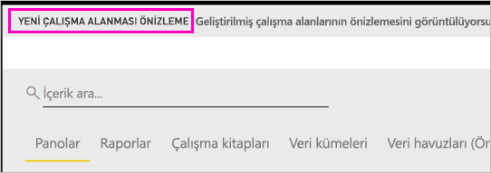
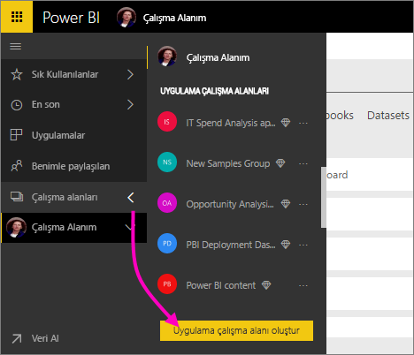
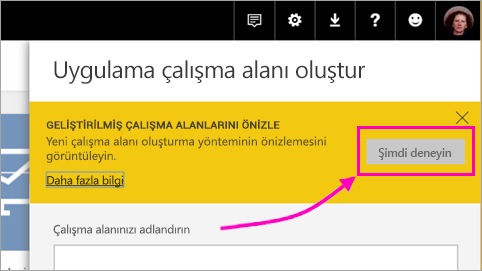
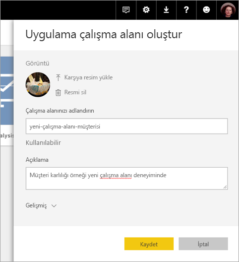
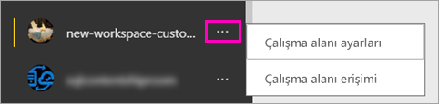

# Power BI'da yeni çalışma alanları oluşturma (önizleme)

Power BI yeni bir çalışma alanı deneyimini önizleme olarak sunuyor. Çalışma alanları hala iş arkadaşlarıyla işbirliği yapıp pano ve rapor koleksiyonları oluşturma yeridir. Bu pano ve raporları *uygulamalarınızın* içinde paketleyebilir ve kuruluşunuzun tamamına ya da belirli kişi veya gruplara dağıtabilirsiniz. 

Yeni çalışma alanları önizlemesiyle şimdi şunları yapabilirsiniz:

- Çalışma alanı rollerini kullanıcı gruplarına atayabilirsiniz: güvenlik grupları, dağıtım listeleri, Office 365 grupları ve bireyler.
- Office 365 grubu oluşturmadan Power BI'da bir çalışma alanı oluşturabilirsiniz.
- Çalışma alanında daha esnek bir izin yönetimi için daha ayrıntılı çalışma alanı rolleri kullanabilirsiniz.
 
Yeni çalışma alanlarından birini oluşturduğunuzda, temel, ilişkili bir Office 365 grubu oluşturmuş olmazsınız. Çalışma alanı yönetiminin tamamı Office 365'te değil Power BI'dadır. Yine çalışma alanına Office 365 grubu ekleyebilir ve içeriğe kullanıcı erişimini Office 365 grupları aracılığıyla yönetmeye devam edebilirsiniz. Öte yandan, ek olarak güvenlik gruplarını, dağıtım listelerini kullanabilir ve doğrudan Power BI'ın içinden kişileri ekleyebilirsiniz. Bu özellik, çalışma alanı erişimini yönetmek için daha esnek bir yol sağlar. Artık çalışma alanı yönetimi Power BI'da olduğundan, kuruluşta çalışma alanlarını kimlerin oluşturabileceğine Power BI yöneticileri karar verir. Ayrıntılar için [Power BI yönetim portalı makalesi, Çalışma alanları bölümüne](service-admin-portal.md#workspace-settings) bakın. 

Yeni çalışma alanlarına kullanıcı gruplarını ve kişileri üye, katkıda bulunan veya yönetici olarak eklersiniz. Kullanıcı grubundaki herkes tanımladığınız rolü alır. Bir kişi birden çok kullanıcı grubunda yer alıyorsa, rol tarafından sağlanan en yüksek izin düzeyine sahip olur.  Farklı rollerin açıklamaları için bu makalenin devamındaki [Yeni çalışma alanlarındaki roller](#roles-in-the-new-workspaces) bölümüne bakın.

Bir uygulama çalışma alanına eklediğiniz herkesin Power BI Pro lisansına ihtiyacı vardır. Bu kullanıcılar çalışma alanında hep birlikte, daha geniş bir kitleye, hatta tüm kuruluşunuza dağıtmayı planladığınız panolar ve raporlar üzerinde işbirliği yapabilir. Kuruluşunuzun içindeki diğer kişilere içerik dağıtmak istiyorsanız, söz konusu kullanıcılara Power BI Pro lisansları atayabilir veya çalışma alanını Power BI Premium kapasitesine getirebilirsiniz.

Yeni çalışma alanlarıyla, bazı özellikleri yeniden tasarlıyoruz. Önizlemeyle birlikte kalıcı olmasını bekleyebileceğiniz değişikliklerin açıklaması için bu makalenin devamındaki [Farklı çalışan uygulama çalışma alanı özellikleri](#app-workspace-features-that-work-differently) bölümüne bakın. Bu bir önizleme özelliği olduğundan, bilmeniz gereken bazı sınırlamalar vardır. Geçerli sınırlamaların açıklaması için bu makalenin devamındaki [Bilinen sorunlar](#known-issues) bölümüne bakın. 

## Yeni uygulama çalışma alanlarının dağıtımı

Önizleme döneminde, eski ve yeni çalışma alanları birlikte yan yana bulunabilir ve bunlardan herhangi birini oluşturabilirsiniz. Yeni çalışma alanlarının önizlemesi sona erdiğinde ve bunlar genel kullanıma sunulduğunda, eski çalışma alanları bir süre daha kullanımda kalabilir. Artık bunları oluşturamazsınız ve çalışma alanlarınızı yeni çalışma alanı altyapısına geçirme hazırlığı yapmanız gerekir. Endişelenmeyin; geçişi tamamlamak için birkaç ayınız olacaktır.

## Yeni uygulama çalışma alanlarından birini oluşturma

1. İşe uygulama çalışma alanını oluşturarak başlayın. **Çalışma alanları** > **Uygulama çalışma alanı oluşturma**'yı seçin.
   
     

2. **Geliştirilmiş çalışma alanlarını önizle** altında **Şimdi dene**'yi seçin.
   
     

2. Çalışma alanına bir ad verin. Ad kullanılamıyorsa, düzenleyerek benzersiz bir kimlik haline getirin.
   
     Uygulamanın adı çalışma alanının adıyla aynı olur.
   
1. İsterseniz bir resim ekleyin. Dosya boyutu 45 KB'tan küçük olmalıdır.
 
    

1. **Kaydet**'i seçin.

    Burada, yeni çalışma alanınızın **Hoş Geldiniz** ekranında verileri ekleyebilirsiniz. 

    

1. Örneğin, **Örnekler** > **Müşteri Kârlılığı Örneği**'ni seçin.

    Şimdi çalışma alanı içerik listesinde **Yeni çalışma alanları önizleme**'yi görürsünüz. Yönetici olduğunuz için yeni **Erişim** eylemini de görürsünüz.

    

1. **Erişim**'i seçin.

1. Bu çalışma alanlarına güvenlik gruplarını, dağıtım listelerini, Office 365 gruplarını veya kişileri üye, katkıda bulunan veya yönetici olarak ekleyin. Farklı rollerin açıklamaları için bu makalenin devamındaki [Yeni çalışma alanlarındaki roller](#roles-in-the-new-workspaces) bölümüne bakın.

    

9. **Ekle** > **Kapat**'ı seçin.

1. Power BI çalışma alanını oluşturur ve açar. Üyesi olduğunuz çalışma alanlarının listesinde görünür. Yönetici olduğunuz için üç nokta (…) simgesini seçerek geri gidebilir, çalışma alanı ayarlarında değişiklik yapabilir, yani yeni üye ekleyebilir veya üye izinlerini değiştirebilirsiniz.

     

## Uygulama çalışma alanınıza içerik ekleme

Yeni stilde bir uygulama çalışma alanı oluşturduktan sonra, buna içerik eklemenin zamanı gelir. Yeni ve eski stil çalışma alanlarına içerik ekleme işlemi, tek bir özel durum dışında aynıdır. Her iki uygulama çalışma alanında da, tıpkı Çalışma Alanım bölümünüzde olduğu gibi dosyaları karşıya yükleyebilir veya dosyalara bağlanabilirsiniz. Yeni çalışma alanlarında, kurumsal içerik paketlerine ya da Microsoft Dynamics CRM, Salesforce veya Google Analytics gibi üçüncü taraf içerik paketlerine bağlanamazsınız. Geçerli çalışma alanlarında içerik paketlerine bağlanabilirsiniz.

Uygulama çalışma alanının içerik listesinde içeriği görüntülediğinizde, uygulama çalışma alanının adı içerik sahibi olarak listelenir.

### Yeni çalışma alanlarında (önizleme) üçüncü taraf hizmetlere bağlanma

Yeni çalışma alanları deneyiminde, uygulamalara odaklanmak için bir değişiklik yapıyoruz. Üçüncü taraf hizmetlerine yönelik uygulamalar, kullanıcıların kullandıkları Microsoft Dynamics CRM, Salesforce veya Google Analytics gibi hizmetlerden veri almasını kolaylaştırır.
Kurumsal uygulamalar kullanıcılarınıza ihtiyaçları olan şirket içi verilerini getirir. Kurumsal uygulamalara, kullanıcıların uygulama içinde buldukları içeriği özelleştirebilmelerine olanak tanıyan özellikler eklemeyi planlıyoruz. Bunlar, içerik paketlerine duyulan ihtiyacı ortadan kaldıracaktır. 

Yeni çalışma alanı önizlemesiyle, kurumsal içerik paketleri oluşturamaz veya kullanamazsınız. Bunun yerine, üçüncü taraf hizmetlere bağlanmak için sağlanan uygulamaları kullanabilir veya şirket içindeki ekiplerinizden şu anda kullandığınız tüm içerik paketleri için uygulamalar sağlamalarını isteyebilirsiniz. 

## Yeni çalışma alanlarındaki roller

Roller çalışma alanında kimlerin neler yapabileceğini yönetmenizi sağlar ve bu sayede ekipler işbirliği yapabilir. Yeni çalışma alanları kişilere ve kullanıcı gruplarına (güvenlik grupları, Office 365 grupları ve dağıtım listeleri) roller atamanıza olanak tanır. 

Bir kullanıcı grubuna roller atadığınızda, gruptaki kişiler içeriğe erişim sahibi olur. İç içe kullanıcı gruplarınız varsa, kapsam içinde yer alan tüm kullanıcıların izni olur. Farklı rollere sahip birden çok kullanıcı grubunda yer alan bir kullanıcı, kendisine verilen en yüksek izin düzeyine sahip olur. 

Yeni çalışma alanları üç rol sunar: yöneticiler, üyeler ve katkıda bulunanlar.

**Yöneticiler şunları yapabilir:**

- Çalışma alanını güncelleştirebilir ve silebilir. 
- Diğer yöneticiler de dahil olmak üzere kişileri ekleyebilir/kaldırabilir.
- Üyelerin yapabildiği her şeyi yapabilir.

**Üyeler şunları yapabilir:** 

- Üyeleri ve düşük izinlere sahip diğer kişileri ekleyebilir.
- Uygulama yayımlayabilir ve güncelleştirebilir.
- Öğe veya uygulama paylaşabilir.
- Diğer kişilerin öğeleri yeniden paylaşmasına izin verebilir.
- Katkıda bulunanların yapabildiği her şeyi yapabilir.

**Katkıda Bulunanlar şunları yapabilir:** 

- Çalışma alanında içerik oluşturabilir, düzenleyebilir ve silebilir. 
- Çalışma alanında rapor yayımlayabilir, içeriği silebilir.
- Yeni kişilere içerik erişimi veremez; yeni içerik paylaşamaz ama çalışma alanının, öğenin veya uygulamanın önceden paylaşıldığı biriyle paylaşabilir. 
- Grup üyelerini değiştiremez.
 
Erişimi olmayan kullanıcıların erişim isteyebilmesi için hizmet genelinde Erişim İsteme iş akışları oluşturuyoruz. Erişim İsteme iş akışları şu anda panolar, raporlar ve uygulamalar için sağlanıyor.

## Uygulamayı dağıtma

İçerik hazır olduğunda, yayımlamak istediğiniz panoları ve raporları seçer ve ardından bunu bir *uygulama* olarak yayımlarsınız. Her çalışma alanından bir uygulama oluşturabilirsiniz. İş arkadaşlarınız uygulamanızı birkaç farklı yolla alabilir. Power BI yöneticiniz izin verirse, uygulamayı otomatik olarak iş arkadaşlarınızın Power BI hesaplarına yükleyebilirsiniz. Buna alternatif olarak, iş arkadaşlarınız, uygulamanızı Microsoft AppSource'tan bulabilir ve yükleyebilir veya iş arkadaşlarınıza bir doğrudan bağlantı gönderebilirsiniz. Güncelleştirmeleri otomatik olarak alırlar ve verinin ne sıklıkla yenileneceğini denetleyebilirsiniz. Ayrıntılar için bkz. [Power BI'da panolar ve raporlar içeren uygulamalar yayımlama](consumer/end-user-create-apps.md).

## Eski uygulama çalışma alanlarını yeni uygulama çalışma alanlarına dönüştürme

Önizleme döneminde, eski uygulama çalışma alanlarınızı otomatik olarak yenilerine dönüştüremezsiniz. Öte yandan yeni bir uygulama çalışma alanı oluşturabilir ve içeriğinizi yeni konumda yayımlayabilirsiniz. 

Yeni çalışma alanları genel kullanıma sunulduğunda, eskilerin otomatik olarak geçirilmesini tercih edebilirsiniz. Genel kullanıma sunulduktan sonra, bir noktada bunları geçirmeniz gerekecektir.

## Power BI uygulamaları hakkında SSS

### Yeni uygulama çalışma alanlarıyla geçerli uygulama çalışma alanları arasın ne fark vardır?
* Uygulama çalışma alanları oluşturmak, geçerli uygulama çalışma alanlarının yaptığı gibi Office 365'te kendilerine karşılık gelen varlıklar oluşturmaz. (Office 365 grubuna bir rol atayarak bunu çalışma alanınıza yine ekleyebilirsiniz). 
* Geçerli uygulama çalışma alanlarında, üyeler ve yöneticiler listesine sadece bireyleri ekleyebilirsiniz. Yeni uygulama çalışma alanlarında, kullanıcı yönetimini kolaylaştırmak için bu listelere birden çok AD güvenlik grubu, dağıtım listesi veya Office 365 grubu ekleyebilirsiniz. 
- Geçerli uygulama çalışma alandan bir kurumsal içerik paketi oluşturabilirsiniz. Yeni uygulama çalışma alanında oluşturamazsınız.
- Geçerli uygulama çalışma alanından kurumsal içerik paketini kullanabilirsiniz. Yeni uygulama çalışma alanlarından kullanamazsınız.
- Önizleme sırasında, yeni uygulama çalışma alanları için bazı özellikler henüz etkinleştirilmemiştir. Ayrıntılar için sonraki bölüme ([Planlanan diğer yeni çalışma alanı özellikleri](service-create-the-new-workspaces.md#other-planned-new-app-workspace-preview-features)) bakın.

## Planlanan yeni uygulama çalışma alanı önizlemesi özellikleri

Yeni uygulama çalışma alanı önizlemesi özelliklerinden bazıları hala geliştirme aşamasındadır ve önizlemeyi tanıttığımızda bunlar henüz kullanıma sunulmamıştır:

- **Çalışma alanından ayrıl** düğmesi yok.
- Kullanım ölçümleri henüz desteklenmiyor.
- Premium'un işleyişi: Premium kapasitede çalışma alanlarını atayabilir ve oluşturabilirsiniz ama çalışma alanını kapasiteler arasında taşımak için çalışma alanının ayarlarına gidin.
- SharePoint web bölümü ekleme işlemi henüz desteklenmiyor.
- Verileri/Dosyaları Al altında Office 365 grupları için **OneDrive** düğmesi yok.

## Farklı çalışan uygulama çalışma alanı özellikleri

Yeni uygulama çalışma alanlarındaki bazı özellikler geçerli uygulama çalışma alanlarından farklı çalışır. Bu farklılıklar, müşterilerden aldığınız geri bildirimler temelinde isteyerek yapılmıştır ve çalışma alanlarıyla işbirliğine daha esnek bir yaklaşım getirecektir:

- Üyeler yeniden paylaşabilir veya paylaşamaz: bunun yerini Katkıda Bulunan rolü almıştır
- Salt okunur çalışma alanları: Kullanıcılara bir çalışma alanı için salt okunur erişim vermek yerine çalışma alanındaki içeriğe benzer salt okunur erişim sunan ve hazırlanmakta olan Görüntüleyici rolünü atarsınız.

## Bilinen sorunlar

Aşağıdaki sorunlar bilinmektedir ve bunların düzeltmeleri geliştirme aşamasındadır:

- E-postalara aboneliklerin alıcısı olarak eklenen ücretsiz kullanıcılar veya kullanıcı grupları, almaları gerekirken e-postaları alamıyor. Yeni çalışma alanları deneyiminin çalışma alanı Premium kapasitedeyken, aboneliği oluşturan kullanıcıya ait Çalışma Alanım Premium kapasitede olmadığında, bu sorunla karşılaşılıyor. Çalışma Alanım Premium kapasiteyse, ücretsiz kullanıcılar ve kullanıcı grupları e-postaları alacaktır.
- Çalışma alanı Premium kapasiteden paylaşılan kapasiteye taşındığında, bazı durumlarda ücretsiz kullanıcılar ve kullanıcı grupları, almamaları gerekirken e-postaları almaya devam edecektir. Aboneliği oluşturan kullanıcıya ait Çalışma Alanım Premium kapasitede olduğunda, bu sorunla karşılaşılıyor.

## Sonraki adımlar

- [Geçerli çalışma alanlarını oluşturma](service-create-workspaces.md)
* [Power BI'da uygulamaları yükleme ve kullanma](consumer/end-user-apps.md)
* Sorularınız mı var? [Power BI Topluluğu'na sorun](http://community.powerbi.com/)
