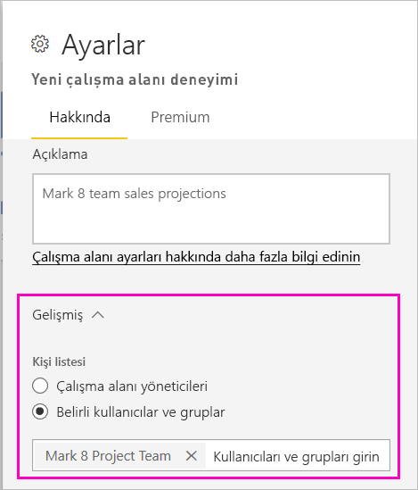
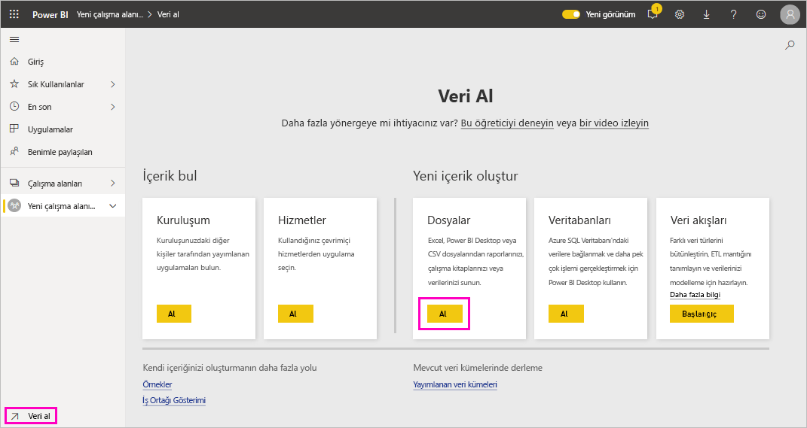
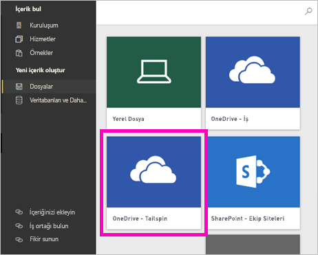
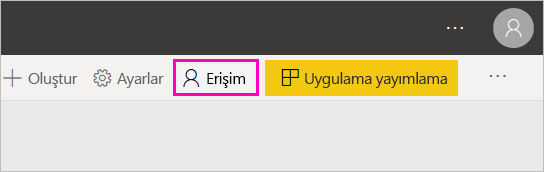
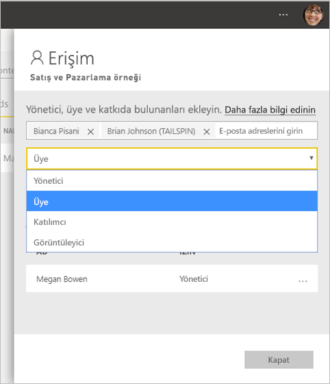

# Power BI'da yeni çalışma alanları oluşturma

Power BI yeni bir çalışma alanı deneyimi sunuyor. Çalışma alanları hala çalışma arkadaşlarınızla işbirliği yaparak pano, rapor ve sayfalandırılmış rapor koleksiyonları oluşturabildiğiniz yerlerdir. Sonra, bu koleksiyonları bir *uygulamanın* içinde paketleyebilir ve kuruluşunuzun tamamına veya belirli kişi veya gruplara dağıtabilirsiniz. 

Farkı aşağıda anlatılmıştır. Yeni çalışma alanlarında şunları yapabilirsiniz:

- Çalışma alanı rollerini kullanıcı gruplarına atayabilirsiniz: güvenlik grupları, dağıtım listeleri, Office 365 grupları ve bireyler.
- Office 365 grubu oluşturmadan Power BI'da bir çalışma alanı oluşturabilirsiniz.
- Çalışma alanında daha esnek bir izin yönetimi için daha ayrıntılı çalışma alanı rolleri kullanabilirsiniz.

> [!NOTE]
> Çalışma alanındaki içeriğe göz atan Power BI Pro kullanıcılarında satır düzeyi güvenliği (RLS) zorunlu tutmak için kullanıcılara Görüntüleyici Rolü atayın.

Daha fazla arka plan bilgisi için [yeni çalışma alanları](service-new-workspaces.md) makalesine bakın.

## Yeni çalışma alanlarından birini oluşturma

1. İşe çalışma alanını oluşturarak başlayın. **Çalışma alanları** > **Çalışma alanı oluştur**'u seçin.
   
     

2. **Klasik sürüme geri al**'ı seçmediğiniz müddetçe otomatik olarak yükseltilmiş bir çalışma alanı oluşturacaksınız.
   
     
     
     **Klasik sürüme geri al**’ı seçerseniz, [Office 365 grubunu temel alan bir çalışma alanı](service-create-workspaces.md) oluşturursunuz. 

2. Çalışma alanına bir ad verin. Ad kullanılamıyorsa, düzenleyerek benzersiz bir ad haline getirin.
   
     Çalışma alanının uygulaması, çalışma alanıyla aynı ada ve simgeye sahip olacaktır.
   
1. Aşağıda, çalışma alanınız için ayarlayabileceğiniz bazı isteğe bağlı öğeler verilmiştir:

    Bir **Çalışma alanı görüntüsü** yükleyin. Dosyalar .png veya .jpg biçiminde olabilir. Dosya boyutu 45 KB'tan küçük olmalıdır.
    
    [Bir **Kişi listesi**](#workspace-contact-list) ekleyin. Varsayılan olarak, çalışma alanı yöneticileri kişiler arasındadır. 
    
    [URL’yi değil mevcut Office 365 Grubunun adını yazarak bir **Çalışma Alanı OneDrive**](#workspace-onedrive) belirtin. Artık bu çalışma alanı, o Office 365 grubunun dosya depolama konumunu kullanabilir. 

    

    Çalışma alanını bir **Ayrılmış kapasiteye** atamak için **Premium** sekmesinde **Ayrılmış kapasite**'yi seçin.
     
    

1. **Kaydet**'i seçin.

    Power BI çalışma alanını oluşturur ve açar. Üyesi olduğunuz çalışma alanlarının listesinde bunu görürsünüz. 

## Çalışma alanı kişi listesi

Çalışma alanında oluşan sorunlar hakkında hangi kullanıcıların bildirim alacağını belirtebilirsiniz. Varsayılan olarak, çalışma alanı yöneticisi olarak belirtilen tüm kullanıcı veya gruplar bildirim alır. Bu kişileri *kişi listesine* ekleyerek listeyi özelleştirebilirsiniz. Kullanıcıların çalışma alanıyla ilgili yardım alabilmesi için kişi listesinde yer alan kullanıcılar veya gruplar kullanıcı arabiriminde listelenir.

1. Yeni **Kişi listesi** ayarına iki şekilde erişebilirsiniz:

    İlk kez oluşturduğunuzda **Çalışma alanı oluştur** bölmesinden.

    Gezinti bölmesinde, **Çalışma alanları**’nın yanındaki oku ve sonra çalışma alanı adı > **Çalışma alanı ayarları**’nın yanındaki **Diğer seçenekler** (...) düğmesini seçin. **Ayarlar** bölmesi açılır.

    

2. **Gelişmiş** > **Kişi listesi** altında **Çalışma alanı yöneticileri** varsayılan değerini kabul edin veya **Belirli kullanıcılar veya gruplar** listesini ekleyin. 

    

3. **Kaydet**'i seçin.

## OneDrive Çalışma Alanı

OneDrive Çalışma Alanı özelliği, SharePoint Belge Kitaplığı dosya depolama alanının çalışma alanı kullanıcıları tarafından kullanılabildiği bir Office 365 Grubu yapılandırmanızı sağlar. Grubu önce Power BI dışında oluşturacaksınız. 

Power BI, Office 365 Grubu üyeliğiyle çalışma alanı erişimi olacak şekilde yapılandırılmış kullanıcı veya grupların izinlerini eşitlemez. En iyi yöntem, bu ayarda dosya depolama alanını yapılandırdığınız aynı Office 365 Grubuna [çalışma alanı erişim izni](#give-access-to-your-workspace) vermektir. Ardından Office 365 grubunun üyeliğini yöneterek çalışma alanı erişimini yönetin. 

1. Yeni **Çalışma Alanı OneDrive** ayarına iki şekilde erişebilirsiniz:

    İlk kez oluşturduğunuzda **Çalışma alanı oluştur** bölmesinden.

    Gezinti bölmesinde, **Çalışma alanları**’nın yanındaki oku ve sonra çalışma alanı adı > **Çalışma alanı ayarları**’nın yanındaki **Diğer seçenekler** (...) düğmesini seçin. **Ayarlar** bölmesi açılır.

    

2. **Gelişmiş** > **Workspace OneDrive** altında, daha önce oluşturduğunuz Office 365 grubunun adını yazın. Power BI, grup için otomatik olarak OneDrive'ı seçer.

    

3. **Kaydet**'i seçin.

### Çalışma alanı OneDrive konumuna erişim

OneDrive konumunuzu yapılandırdıktan sonra, bunu tıpkı Power BI hizmetindeki diğer veri kaynaklarını aldığınız gibi alırsınız.

1. Gezinti bölmesinde **Veri Al**’ı seçip **Dosyalar** kutusunda **Al** seçeneğini belirleyin.

    

1.  **OneDrive – İş** girişi kendi OneDrive İş kopyanızdır. İkinci OneDrive, eklediğiniz kopyadır.

    

### Yeni çalışma alanlarında üçüncü taraf hizmetlere bağlanma

Yeni çalışma alanları deneyiminde, uygulamalara *odaklanmak* için bir değişiklik yapıyoruz. Üçüncü taraf hizmetlerine yönelik uygulamalar, kullanıcıların kullandıkları Microsoft Dynamics CRM, Salesforce veya Google Analytics gibi hizmetlerden veri almasını kolaylaştırır.

Yeni çalışma alanı deneyimiyle, kurumsal içerik paketleri oluşturamaz veya kullanamazsınız. Bunun yerine, üçüncü taraf hizmetlere bağlanmak için sağlanan uygulamaları kullanabilir veya şirket içindeki ekiplerinizden şu anda kullandığınız tüm içerik paketleri için uygulamalar sağlamalarını isteyebilirsiniz. 

## Çalışma alanınıza erişim izni verme

1. Çalışma alanı içerik listesinde, yönetici olduğunuz için **Erişim** adlı yeni bir eylem görürsünüz.

    

1. Bu çalışma alanlarına güvenlik gruplarını, dağıtım listelerini, Office 365 gruplarını veya kişileri izleyici, üye, katkıda bulunan veya yönetici olarak ekleyin. Farklı rollerin açıklamaları için [Yeni çalışma alanlarındaki roller](service-new-workspaces.md#roles-in-the-new-workspaces) bölümüne bakın.

    

9. **Ekle** > **Kapat**'ı seçin.

## Uygulamayı dağıtma

Kuruluşunuzda büyük bir hedef kitleye resmi içerik dağıtmak istiyorsanız, çalışma alanınızdan bir uygulama yayımlayabilirsiniz.  İçerik hazır olduğunda, yayımlamak istediğiniz panoları ve raporları seçer ve ardından bunu bir *uygulama* olarak yayımlarsınız. Her çalışma alanından bir uygulama oluşturabilirsiniz.

[Yeni çalışma alanlarından uygulama yayımlama](service-create-distribute-apps.md) hakkında bilgi edinin

## Sonraki adımlar
* [Power BI'da yeni çalışma alanlarında çalışmayı düzenleme deneyimi](service-new-workspaces.md) makalesini okuyun
* [Klasik çalışma alanları oluşturma](service-create-workspaces.md)
* [Power BI’da yeni çalışma alanlarından uygulama yayımlama](service-create-distribute-apps.md)
* Sorularınız mı var? [Power BI Topluluğu'na sorun](https://community.powerbi.com/)
