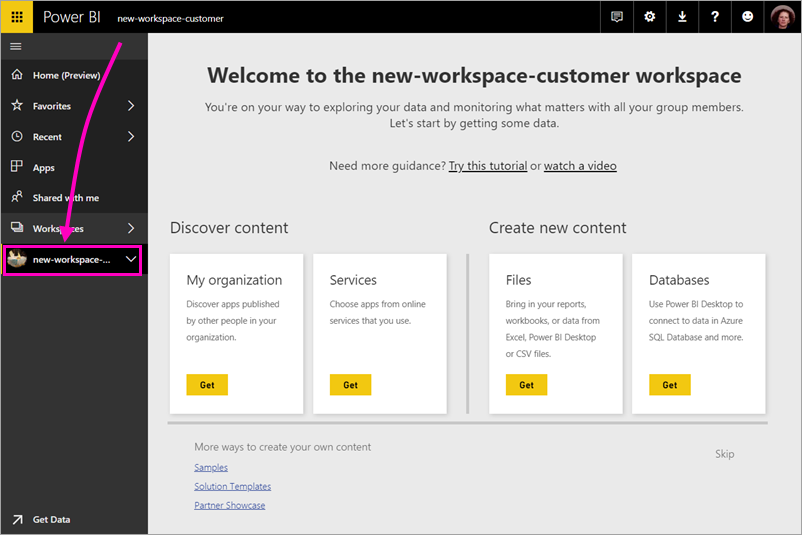
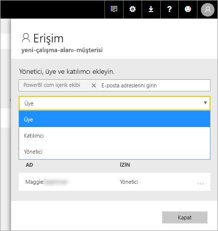

# Power BI'da yeni çalışma alanları oluşturma

Power BI, yeni bir çalışma deneyimi kullanıma sunulmuştur. Çalışma alanları hala panolar, raporlar ve sayfalandırılmış raporlar koleksiyonlarını oluşturmak için iş arkadaşlarınızla işbirliği yerdir. Bu koleksiyona gruplandırabilirsiniz sonra bir *uygulama* ve ister bütün kuruluşunuza veya belirli kişiler veya gruplara dağıtabilirsiniz. 

Farklı nedir aşağıda verilmiştir. Yeni çalışma alanlarında, şunları yapabilirsiniz:

- Çalışma alanı rollerini kullanıcı gruplarına atayabilirsiniz: güvenlik grupları, dağıtım listeleri, Office 365 grupları ve bireyler.
- Office 365 grubu oluşturmadan Power BI'da bir çalışma alanı oluşturabilirsiniz.
- Çalışma alanında daha esnek bir izin yönetimi için daha ayrıntılı çalışma alanı rolleri kullanabilirsiniz.

> [!NOTE]
> Bir çalışma alanındaki içeriği gözatma Power BI Pro kullanıcıları için satır düzeyi güvenlik (RLS) zorlamak için kullanmaya devam [Klasik çalışma alanları](service-create-workspaces.md). Seçin **üyeleri yalnızca Power BI içeriğini görüntüleme** seçeneği. Alternatif olarak, bu kullanıcılara Power BI uygulama yayımlama veya paylaşım içeriği dağıtmak için kullanın. Gelecek Görüntüleyicisi rolü Bu senaryoda gelecekte yeni çalışma alanı deneyimi çalışma alanlarını etkinleştirir.

Daha fazla arka plan bilgileri için bkz [yeni çalışma alanları](service-new-workspaces.md) makalesi.

## Yeni uygulama çalışma alanlarından birini oluşturma

1. İşe uygulama çalışma alanını oluşturarak başlayın. **Çalışma alanları** > **Uygulama çalışma alanı oluşturma**'yı seçin.
   
     

2. İçin iyileştirilmiş sürece otomatik olarak yükseltilmiş bir çalışma alanında, oluşturmakta olduğunuz **dönmek için Klasik**.
   
     
     
     Seçerseniz **dönmek için Klasik**, bir Office 365 grubunu temel alan bir çalışma alanı oluşturun. Gerekirse bu seçeneği kullanın. **üyeleri yalnızca Power BI içeriğini görüntüleme** çalışma alanı üyeleri için satır düzeyi güvenlik (RLS) zorlamak için seçeneği.

2. Çalışma alanına bir ad verin. Adı kullanılabilir değilse, onu benzersiz bir adla gelmesini düzenleyin.
   
     Uygulama çalışma alanı için çalışma alanı olarak aynı ad ve simge gerekir.
   
1. Çalışma alanınız için ayarlayabileceğiniz bazı isteğe bağlı öğeler şunlardır:

    Karşıya bir **çalışma görüntü**. Dosya .png veya .jpg biçiminde olabilir. Dosya boyutu 45 KB'tan daha az olması gerekir.
    
    [Ekleme bir **kişi listesi**](#workspace-contact-list). Varsayılan olarak, kişileri çalışma alanı yöneticileri olan. 
    
    [Belirtin bir **çalışma OneDrive** ](#workspace-onedrive) yalnızca bir var olan Office 365 grubu, URL adını yazarak. Artık bu çalışma alanı, Office 365 grubunun dosya depolama konumu kullanabilirsiniz. 

    

    Çalışma alanına atanacak bir **ayrılmış kapasitesini**, **Premium** sekmesinde **ayrılmış kapasitesini**.
     
    

1. **Kaydet**'i seçin.

    Power BI çalışma alanını oluşturur ve açar. Üyesi olduğunuz çalışma alanlarının listesinde bunu görürsünüz. 

## Çalışma alanı kişi listesi

Yeni çalışma alanı kişi listesi, hangi kullanıcıların çalışma alanında oluşan sorunlarla ilgili bildirim almak belirtmenizi sağlar. Varsayılan olarak, herhangi bir kullanıcı veya Grup yönetici bildirim, ancak liste özelleştirebileceğiniz bir çalışma alanı olarak belirtilmiş. Kişi listesi listelenen kullanıcılar veya gruplar, kullanıcılar çalışma alanına ilgili yardım alın yardımcı olmak için kullanıcı arabiriminde (UI) gösterilir.

1. Yeni erişim **kişi listesi** iki yoldan biriyle ayarlama:

    İçinde **çalışma alanı oluşturma** ilk oluşturduğunuzda bölmesi.

    Sol gezinti bölmesinde yanındaki oku seçerek **çalışma alanları**, çalışma alanı adının yanındaki üç nokta (...) seçin > **çalışma alanı ayarlarını**. **Ayarları** bölmesi açılır.

    

2. Altında **Gelişmiş** > **kişi listesi**, varsayılanı kabul **çalışma alanı yöneticileri**, ya da kendi listesine eklemek **belirli kullanıcılar veya gruplar**. 
3. **Kaydet**'i seçin.

## Çalışma alanı OneDrive

Çalışma alanı OneDrive bu özellik, SharePoint belge kitaplığına dosya depolama çalışma alanı kullanıcılara bir Office 365 grubu yapılandırmanızı sağlar. Power BI dışındaki grubu ilk oluşturun. 

Power BI, kullanıcılar veya gruplar Office 365 grup üyeliği ile çalışma alanı erişimi olacak şekilde yapılandırılmış izinlerini eşitleme değil. En iyi uygulama, aynı Office 365 grubu, bu ayarın Office 365 grubunda yapılandırın, dosya depolama vermektir [çalışma alanına erişim](#give-access-to-your-workspace). Ardından Office 365 grup üyeliğini yöneterek çalışma alanı erişimi yönetin. 

1. Yeni erişim **çalışma OneDrive** iki yoldan biriyle ayarlama:

    İçinde **çalışma alanı oluşturma** ilk oluşturduğunuzda bölmesi.

    Sol gezinti bölmesinde yanındaki oku seçerek **çalışma alanları**, çalışma alanı adının yanındaki üç nokta (...) seçin > **çalışma alanı ayarlarını**. **Ayarları** bölmesi açılır.

    

2. Altında **Gelişmiş** > **çalışma OneDrive**, daha önce oluşturduğunuz Office 365 grubu adını yazın. Power BI Grup OneDrive otomatik olarak seçer.

    

3. **Kaydet**'i seçin.

### OneDrive konumunda çalışma alanına erişim

OneDrive konumunda yapılandırdıktan sonra ona çalışma alanındaki birkaç farklı konumlardan alabilirsiniz:

- Seçin **çalışma alanları** > *çalışma alanı adı* > üç nokta simgesine ( **...** ) menüsü > **dosyaları**. 

    

- Öğesinin üç noktasını ( **...** ) çalışma alanının sağ üst köşedeki menü > **dosyaları**.

    
    
- İçinde **Veri Al** > **dosyaları** karşılaşırsınız. **OneDrive iş** girdidir kendi OneDrive iş. İkinci OneDrive eklediğiniz hesaptır.

    

## Uygulama çalışma alanınıza içerik ekleme

Yeni bir çalışma deneyimi çalışma alanı oluşturduktan sonra içeriği eklemek üzere zaman var. Yeni ve klasik çalışma alanlarında içerik ekleme benzerdir. Oluştur düğmesine veya içeriği, çalışma alanınıza eklemek için Veri Al'ı kullanın.

1. İçinde **Hoş Geldiniz** ekran için yeni çalışma alanınızda, içerik ekleyebilirsiniz. 

    

1. Örneğin, **Örnekler** > **Müşteri Kârlılığı Örneği**'ni seçin.

> [!NOTE]
> Yeni çalışma alanlarında, Kurumsal içerik paketleri veya üçüncü taraf içerik paketleri kullanamıyor. Uygulamalar, tüm üçüncü taraf içerik paketleri için kullanılabilir önceden kullanılmış. İçerik paketleri kullanmaya devam etmeniz gerekiyorsa Klasik çalışma alanlarını kullanın. İçerik paketleri kullanım dışı bırakılmıştır yerine uygulamaları kullanmak için en iyi bir uygulamadır.

Uygulama çalışma alanının içerik listesinde içeriği görüntülediğinizde, uygulama çalışma alanının adı içerik sahibi olarak listelenir.

### Yeni çalışma alanlarında üçüncü taraf hizmetlere bağlanma

Yeni çalışma alanları deneyiminde, uygulamalara *odaklanmak* için bir değişiklik yapıyoruz. Üçüncü taraf hizmetlerine yönelik uygulamalar, kullanıcıların kullandıkları Microsoft Dynamics CRM, Salesforce veya Google Analytics gibi hizmetlerden veri almasını kolaylaştırır.

Yeni çalışma alanı deneyimi oluşturamaz veya Kurumsal içerik paketleri kullanma. Bunun yerine, üçüncü taraf hizmetlere bağlanmak için sağlanan uygulamaları kullanabilir veya şirket içindeki ekiplerinizden şu anda kullandığınız tüm içerik paketleri için uygulamalar sağlamalarını isteyebilirsiniz. 

## Çalışma alanınıza erişimi verin

1. Yönetici olduğunuz için çalışma alanı içerik listesinde, yeni bir eylem gördüğünüz **erişim**.

    

1. **Erişim**'i seçin.

1. Bu çalışma alanlarına güvenlik gruplarını, dağıtım listelerini, Office 365 gruplarını veya kişileri üye, katkıda bulunan veya yönetici olarak ekleyin. Farklı rollerin açıklamaları için [Yeni çalışma alanlarındaki roller](service-new-workspaces.md#roles-in-the-new-workspaces) bölümüne bakın.

    

9. **Ekle** > **Kapat**'ı seçin.

## Uygulamayı dağıtma

Resmi içeriği kuruluşunuzdaki büyük bir kitleye dağıtmak istiyorsanız, çalışma alanınızdan bir uygulamayı yayımlayabilirsiniz.  İçerik hazır olduğunda, hangi panoları ve raporları yayımlamak istediğiniz seçin ve ardından olarak yayımlayın bir *uygulama*. Her çalışma alanından bir uygulama oluşturabilirsiniz.

Hakkında bilgi edinin [yeni çalışma alanlarından uygulama yayımlama](service-create-distribute-apps.md)

## Sonraki adımlar
* Hakkında bilgi edinin [Power bı'da yeni çalışma alanları deneyimi iş düzenleme](service-new-workspaces.md)
* [Klasik bir çalışma alanı oluşturma](service-create-workspaces.md)
* [Power BI'da yeni çalışma alanlarından uygulama yayımlama](service-create-distribute-apps.md)
* Sorularınız mı var? [Power BI Topluluğu'na sorun](http://community.powerbi.com/)
