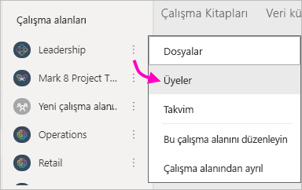
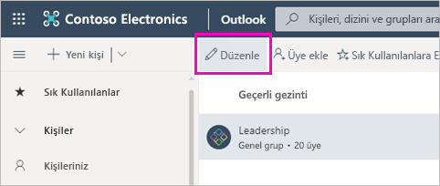
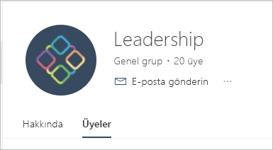

# Power BI'da klasik çalışma alanları oluşturma

Power BI'da, çalışma arkadaşlarınızla işbirliği yaparak pano koleksiyonları, raporlar ve sayfalandırılmış raporlar oluşturabildiğiniz ve bunları geliştirebildiğiniz bir yer olarak *çalışma alanları* oluşturabilirsiniz. Sonra, koleksiyonu *uygulamaların* içinde birlikte paketler ve kuruluşunuzun tamamına veya belirli kişi veya gruplara dağıtabilirsiniz. 

**Biliyor muydunuz?** Power BI, artık varsayılan olan yeni bir çalışma alanı deneyimi sunmaktadır. Yeni çalışma alanlarıyla ilgili ayrıntılar için [Yeni çalışma alanlarında çalışmayı düzenleme](service-new-workspaces.md) konusunu okuyun. 

Klasik bir çalışma alanı oluşturduğunuzda, temel, ilişkili bir Office 365 grubu oluşturmuş olursunuz. Çalışma alanı yönetiminin tamamı Office 365'tedir. Bu çalışma alanlarına iş arkadaşlarınızı üye veya yönetici olarak ekleyebilirsiniz. Çalışma alanında, hep birlikte daha geniş bir kitleye dağıtmayı planladığınız panolar, raporlar ve diğer makaleler üzerinde işbirliği yapabilirsiniz. Bir çalışma alanına eklediğiniz herkesin Power BI Pro lisansına ihtiyacı vardır. 

## Video: Uygulamalar ve çalışma alanları
<iframe width="640" height="360" src="https://www.youtube.com/embed/Ey5pyrr7Lk8?showinfo=0" frameborder="0" allowfullscreen></iframe>

## Office 365 grubu temelinde klasik çalışma alanı oluşturma

Bir çalışma alanı oluşturduğunuzda, bu çalışma alanı bir Office 365 grubu üzerinde oluşturulur.

[!INCLUDE [powerbi-service-create-app-workspace](./includes/powerbi-service-create-app-workspace.md)]

Çalışma alanını ilk oluşturduğunuzda, Office 365'e yayılması için yaklaşık bir saat beklemeniz gerekebilir. 

### Office 365 çalışma alanınıza görüntü ekleme (isteğe bağlı)
Varsayılan olarak Power BI, uygulamanız için uygulamanın baş harflerini içeren küçük ve renkli bir daire oluşturur. Ancak, bunu bir görüntüyle özelleştirmek isteyebilirsiniz. Bir görüntü eklemek için Exchange Online lisansı gerekir.

1. **Çalışma Alanları**'nı, çalışma alanı adının yanındaki **Diğer seçenekler**'i (...), sonra da **Üyeler**’i seçin. 
   
     
   
    Çalışma alanı için Office 365 Outlook hesabı yeni bir tarayıcı penceresinde açılır.
2. **Düzenleme** kalemini seçin.
   
     
3. Kamera görüntüsünü seçin ve kullanmak istediğiniz görüntüyü bulun.
   
     

     Görüntüler .png, .jpg veya .bmp dosyaları olabilir. Dosya boyutu 3 MB'a varan büyüklükte olabilir. 

4. **Tamam**'ı, sonra da **Kaydet**'i seçin.
   
    Görüntü, Office 365 Outlook penceresindeki renkli dairenin yerine geçer. 
   
     
   
    Birkaç dakika sonra Power BI'daki uygulamada da görünecektir.

## Çalışma alanınıza içerik ekleme

Çalışma alanını oluşturduktan sonra, buna içerik eklemenin zamanı gelir. Bu tıpkı Çalışma Alanım bölümünüze içerik eklemeye benzer ancak çalışma alanındaki diğer kişiler de bu içeriği görüp onunla çalışabilir. İçeriği tamamladığınızda bir uygulama olarak yayımlayabilecek olmanız büyük bir farktır. Çalışma alanının içerik listesinde içeriği görüntülediğinizde, çalışma alanının adı içerik sahibi olarak listelenir.

### Çalışma alanlarında üçüncü taraf hizmetlere bağlanma

Uygulamalar Power BI'ın desteklediği tüm üçüncü taraf hizmetler için sağlandığından, kullandığınız Microsoft Dynamics CRM, Salesforce Google Analytics gibi hizmetlerden veri almanız kolaylaşır. Kullanıcılarınıza ihtiyaçları olan verileri vermek için kurumsal uygulamalar yayımlayabilirsiniz.

Geçerli çalışma alanlarında, kurumsal içerik paketlerini ve Microsoft Dynamics CRM, Salesforce veya Google Analytics gibi üçüncü taraf içerik paketlerini kullanarak da bağlanabilirsiniz. Kurumsal içerik paketlerinizi uygulamalara geçirmeyi göz önünde bulundurun.

## Uygulamayı dağıtma

Kuruluşunuzda büyük bir hedef kitleye resmi içerik dağıtmak istiyorsanız, çalışma alanınızdan bir uygulama yayımlayabilirsiniz.  İçerik hazır olduğunda, yayımlamak istediğiniz panoları ve raporları seçer ve ardından bunu bir *uygulama* olarak yayımlarsınız. Her çalışma alanından bir uygulama oluşturabilirsiniz.

Sol gezinti bölmesinde bulunan uygulamalar listesinde, yüklediğiniz tüm uygulamalar gösterilir. İş arkadaşlarınız uygulamanızı birkaç farklı yolla alabilir. 
- Uygulamanızı Microsoft AppSource’tan da bulabilir ve yükleyebilir
- Onlara bir doğrudan bağlantı gönderebilirsiniz. 
- Power BI yöneticiniz izin verirse, uygulamayı otomatik olarak iş arkadaşlarınızın Power BI hesaplarına yükleyebilirsiniz. 

Çalışma alanınızdan bir güncelleştirme yayımladıktan sonra kullanıcılar otomatik olarak güncelleştirilmiş uygulama içeriğini görür. Çalışma alanınızdaki uygulama içeriği tarafından kullanılan veri kümelerinde yenileme zamanlamasını ayarlayarak verilerin ne sıklıkla yenilendiğini denetleyebilirsiniz. Ayrıntılar için bkz. [Power BI’da yeni çalışma alanlarından uygulama yayımlama](service-create-distribute-apps.md).

## Power BI klasik uygulamaları hakkında SSS

### Uygulamalarla kurumsal içerik paketlerinin farkı nedir?
Uygulamalar, kurumsal içerik paketlerinin gelişmiş halidir. Zaten kurumsal içerik paketleriniz varsa bu paketler, uygulamalarla yan yana çalışmaya devam ederler. Uygulamalarla içerik paketlerinde birkaç önemli farklılık vardır. 

* İş kullanıcıları bir içerik paketi yükledikten sonra paket, gruplandırılmış kimliğini kaybeder: Başka panolar ve raporlara karışmış bir pano ve rapor listesinden ibaret olur. Buna karşın uygulamalar, gruplandırılmış halleri ve kimliklerini yüklemeden sonra bile korur. Bu gruplandırma sayesinde iş kullanıcıları zaman geçtikten sonra bile uygulamalara kolayca gidebilir.
* Herhangi bir çalışma alanında birden çok içerik paketi oluşturabilirsiniz ancak bir uygulamanın çalışma alanıyla bire bir ilişkisi vardır. 
* Zaman içinde kurumsal içerik paketlerini kullanımdan kaldırmayı planlıyoruz. Bu nedenle bundan sonra uygulama oluşturmanızı öneririz.  
* Yeni çalışma alanı deneyimiyle, kurumsal içerik paketlerinin kullanımdan kaldırılması yönünde ilk adımları atıyoruz. Yeni çalışma alanlarında bunları kullanamaz veya oluşturamazsınız.

İkisini karşılaştırmak için bkz. [Yeni çalışma alanlarıyla var olan çalışma alanları arasında ne fark vardır?](service-new-workspaces.md#how-the-new-workspaces-are-different) 

## Sonraki adımlar
* [Power BI'da uygulamaları yükleme ve kullanma](service-create-distribute-apps.md)
- [Yeni çalışma alanlarını oluşturma](service-create-the-new-workspaces.md)
* Sorularınız mı var? [Power BI Topluluğu'na sorun](http://community.powerbi.com/)
