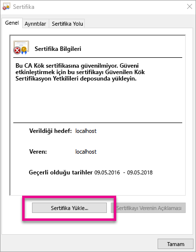
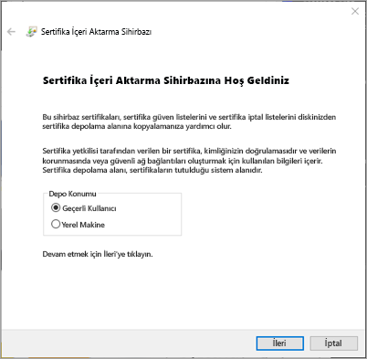
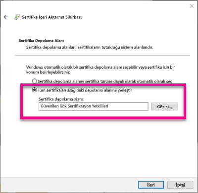
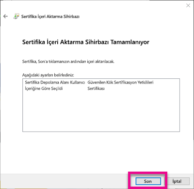
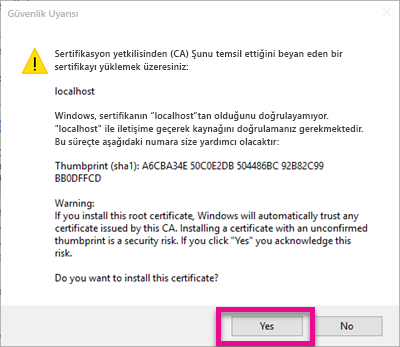
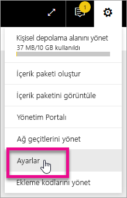
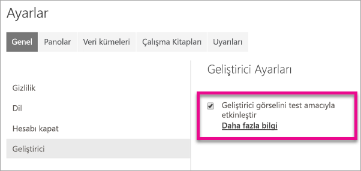
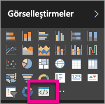

# <a name="use-developer-tools-to-create-custom-visuals"></a>Özel görseller oluşturmak için geliştirici araçları kullanma
Özel görseller, kullanıcılarınızın ihtiyaçlarını karşılamanıza ve uygulamanızın tasarımını uyumlu hale getirmenize olanak sağlar. Geliştirme araçlarını kullanarak Power BI için özel görsel oluşturmayı öğrenin.

> [!NOTE]
> Çalışmaya başlamak için bu belgeyi kullanın. Daha ayrıntılı bilgi için [Power BI Visuals adlı git deposundaki](https://github.com/Microsoft/PowerBI-visuals) başvuru bilgilerine bakın.
> 
> 

## <a name="requirements"></a>Gereksinimler
* NodeJS 4.0 veya sonraki bir sürümü gerekir (5.0 ya da sonraki bir sürümü önerilir) [NodeJS'yi indirin](https://nodejs.org)

## <a name="install-nodejs-and-the-power-bi-tools"></a>NodeJS'yi ve Power BI araçlarını yükleme
Özel bir görsel oluşturmak için NodeJS'yi yüklemeniz gerekir. NodeJS, komut satırı araçlarını çalıştırmak için gereklidir.

1. [NodeJS](https://nodejs.org)'yi indirin ve yükleyin. 4.0 veya sonraki bir sürüm gereklidir ancak 5.0 veya sonraki bir sürümünün kullanılması önerilir.
2. Komut satırı araçlarını yükleyin. Bir komut isteminde aşağıdaki komutu çalıştırın.

        npm install -g powerbi-visuals-tools
3. Herhangi bir parametre olmadan aşağıdaki komutu çalıştırarak araçların yüklendiğini doğrulayabilirsiniz.

        pbiviz

    Yardım çıktısını görmeniz gerekir.

    <pre><code>
         +syyso+/
    oms/+osyhdhyso/
    ym/       /+oshddhys+/
    ym/              /+oyhddhyo+/
    ym/                     /osyhdho
    ym/                           sm+
    ym/               yddy        om+
    ym/         shho /mmmm/       om+
     /    oys/ +mmmm /mmmm/       om+
    oso  ommmh +mmmm /mmmm/       om+
   ymmmy smmmh +mmmm /mmmm/       om+
   ymmmy smmmh +mmmm /mmmm/       om+
   ymmmy smmmh +mmmm /mmmm/       om+
   +dmd+ smmmh +mmmm /mmmm/       om+
         /hmdo +mmmm /mmmm/ /so+//ym/
               /dmmh /mmmm/ /osyhhy/
                 //   dmmd
                       ++

       PowerBI Custom Visual Tool

    Usage: pbiviz [options] [command]

    Commands:

    new [name]        Create a new visual
    info              Display info about the current visual
    start             Start the current visual
    package           Package the current visual into a pbiviz file
    update [version]  Updates the api definitions and schemas in the current visual. Changes the version if specified
    help [cmd]        display help for [cmd]

    Options:

    -h, --help      output usage information
    -V, --version   output the version number
    --install-cert  Install localhost certificate
    </code></pre>

<a name="ssl-setup"></a>

### <a name="server-certificate-setup"></a>Sunucusu Sertifikası kurulumu
Görselinizin canlı olarak önizlenebilmesini sağlamak için, güvenilen bir HTTPS sunucusu gerekir. Başlayabilmek için, görsel varlıkların tarayıcınızda yüklenmesine olanak sağlayan bir SSL sertifikası yüklemeniz gerekir. 

> [!NOTE]
> Bu kurulum, geliştirici çalışma alanınız için bir kez gerçekleştirilir.
> 
> 

Bir sertifika *oluşturmak* için aşağıdaki komutu çalıştırın.

    pbiviz --create-cert

> [!NOTE]
> Sertifikanın konum yolunu ve yeni oluşturulmuş bir Parola bulabileceğiniz bir ileti görürsünüz.
> 
> 


Sertifikayı *yüklemek* için aşağıdaki komutu çalıştırın.

    pbiviz --install-cert

> [!NOTE]
> PFX sertifikasını yüklemek için yeni oluşturulan Parolanızı kullanmanızı söyleyen bir ileti görürsünüz.
> 
> 

**Windows İşletim Sistemi**

1. **Sertifika Yükle...** seçeneğini belirleyin.

    
2. **Geçerli Kullanıcı**'yı ve ardından **İleri**'yi seçin.

    
3. **Tüm sertifikaları aşağıdaki depolama alanına yerleştir** ve **Gözat...** seçeneklerini belirleyin.
4. **Güvenilen Kök Sertifika Yetkilileri**'ni ve ardından **Tamam**'ı seçin. **İleri**'yi seçin.

    
5. **Son**'u seçin.

    
6. Güvenlik uyarısı iletişim kutusundaki **Evet** seçeneğini belirleyin.

    
7. Açık tüm tarayıcıları kapatın.

> [!NOTE]
> Sertifika tanınmıyorsa bilgisayarınızı yeniden başlatmanız gerekebilir.
> 
> 

**OSX**

1. Sol üstteki kilit kapalıysa açmak için kilidi seçin. *localhost* sertifikasını bulup bu sertifikaya çift tıklayın.

    
2. **Her Zaman Güven** seçeneğini belirleyip pencereyi kapatın.

    
3. Kullanıcı adınızı ve parolanızı girin. **Ayarları Güncelle**'yi seçin.

    
4. Açık tüm tarayıcıları kapatın.

> [!NOTE]
> Sertifika tanınmıyorsa bilgisayarınızı yeniden başlatmanız gerekebilir.
> 
> 

## <a name="enable-live-preview-of-developer-visual"></a>Geliştirici görselinin canlı olarak önizlenebilmesini sağlama
Özel görselinizin canlı olarak önizlenebilmesini sağlamak için bu adımları uygulayın. Bu, görselin Power BI hizmetinde rapor düzenlerken kullanılabilmesini sağlar.

1. [app.powerbi.com](https://app.powerbi.com) adresine gidip burada oturum açın.
2. **Dişli simgesini**ve ardından **Ayarlar**'ı seçin.

    
3. **Geliştirici**'yi seçin ve ardından **Geliştirici görselini test amacıyla etkinleştir** seçeneğini belirleyin.

    
4. **Görsel Öğeler** bölmesinde **Geliştirici Görseli**'ni seçin.

    

   > [!NOTE]
   > Bunun için, geliştirme yaptığınız makinedeki görsel klasöründe `pbiviz start` komutunu çalıştırmanız gerekir. Görselinizi oluşturma ile ilgili daha fazla bilgi için bu makaledeki [Yeni görsel oluşturma](#create-a-new-visual) bölümüne bakın.
   > 
   > 
5. Rapor tuvalinde görseli seçin. Verileri, tıpkı diğer görseller için yaptığınız gibi bağlayabilirsiniz.

Artık görselinizi geliştirmeye başlayabilirsiniz.

## <a name="create-a-new-visual"></a>Yeni görsel oluşturma
Aşağıdaki komutu çalıştırarak yeni bir görsel projesi oluşturabilirsiniz.

```
pbiviz new MyVisualName
```

*MyVisualName* ifadesini görsele vermek istediğiniz adla değiştirebilirsiniz. Bu, oluşturulan `pbiviz.json` dosyasındaki `name` ve `displayName` alanları düzenlenerek daha sonra değiştirilebilir.

Bu komut, çalıştırıldığı dizinde yeni bir klasör oluşturur. Görseliniz için basit bir başangıç şablonu ortaya çıkarır. Komut çalışmayı tamamladığında dizini açabilir ve yeni görseliniz üzerinde çalışmaya başlamak üzere, sık kullandığınız düzenleyicinizi kullanabilirsiniz.

## <a name="testing-your-visual-in-power-bi"></a>Power BI'da görselinizi test etme
Görselinizi Power BI hizmetindeki raporlarda ve panolarda test edebilirsiniz.

<a name="running-your-visual"></a>

### <a name="running-your-visual"></a>Görselinizi çalıştırma
Aşağıdakileri gerçekleştirerek görselinizi çalıştırabilirsiniz.

1. Bir istem açın.
2. Dizininizi görsel klasörünüz olarak ayarlayın. Bu, `pbiviz.json` dosyasını içeren klasördür.
3. Aşağıdaki komutu çalıştırın.

    ```
    pbiviz start
    ```

    

Yanlış konumdaysanız aşağıdakine benzer bir hata ile karşılaşırsınız.

```
    error  LOAD ERROR Error: pbiviz.json not found. You must be in the root of a visual project to run this command.
        at e (C:\Users\[user]\AppData\Roaming\npm\node_modules\powerbi-visuals-tools\lib\VisualPackage.js:67:35)
        at Function.loadVisualPackage (C:\Users\[user]\AppData\Roaming\npm\node_modules\powerbi-visuals-tools\lib\VisualPackage.js:62:16)
        at Object.<anonymous> (C:\Users\[user]\AppData\Roaming\npm\node_modules\powerbi-visuals-tools\bin\pbiviz-start.js:43:15)
        at Module._compile (module.js:556:32)
        at Object.Module._extensions..js (module.js:565:10)
        at Module.load (module.js:473:32)
        at tryModuleLoad (module.js:432:12)
        at Function.Module._load (module.js:424:3)
        at Module.runMain (module.js:590:10)
        at run (bootstrap_node.js:394:7)
```

### <a name="viewing-your-visual-in-power-bi"></a>Power BI'da görselinizi görüntüleme
Görselinizi bir raporda görüntülemek için söz konusu rapora gidin ve **Görsel Öğeler** bölmesinden görseli seçin.

> [!NOTE]
> Bunu gerçekleştirmeden önce, [Görselinizi çalıştırma](#running-your-visual) bölümünde açıklandığı gibi `pbiviz start` komutunu çalıştırmanız gerekir.
> 
> 


Bu işlemin ardından görsele yönelik başlangıç şablonunu görürsünüz.


| Araç çubuğu öğesi | Açıklama |
| --- | --- |
| Görseli yenile |Otomatik yeniden yükleme devre dışıysa görseli elle yenileyin. |
| Otomatik yeniden yüklemeyi aç/kapat |Etkinleştirildiğinde, görsel dosyanızı her kaydettiğinizde görsel otomatik olarak güncelleştirilir. |
| Veri görünümünü göster |Hata ayıklama için görselin temel alınan veri görünümünü gösterir |
| Yardım alın |GitHub'daki belgeler |
| Geri bildirim gönder |Deneyimi nasıl iyileştirebileceğimizi bildirin. (GitHub hesabı gerekir) |

## <a name="package-your-visual-for-use-in-power-bi-desktop-and-distribution"></a>Görselinizi Power BI Desktop'ta ve dağıtımda kullanım için paketleme
Görselinizi [Power BI Desktop](https://powerbi.microsoft.com/desktop/)'a yükleyebilmek veya [Power BI görsel galerisinde](https://visuals.powerbi.com) toplulukla paylaşabilmek için bir `pbiviz` dosyası oluşturmanız gerekir.

Aşağıdakileri gerçekleştirerek görselinizi paketleyebilirsiniz.

1. Bir istem açın.
2. Dizininizi görsel klasörünüz olarak ayarlayın. Bu, `pbiviz.json` dosyasını içeren klasördür.
3. Aşağıdaki komutu çalıştırın.

    ```
    pbiviz package
    ```

Bu komut, görsel projenizin `dist/` dizininde bir `pbiviz` oluşturur. Bir `pbiviz` dosyası zaten varsa bunun üzerine yazılır.

## <a name="updating-the-visuals-api-version"></a>Görsellerin API sürümlerini güncelleştirme
`pbiviz new` kullanarak bir görsel oluşturduğunuzda, uygun API türü tanımlarının ve JSON şemalarının bir kopyası, görselinizin dizinine kopyalanır. Gerektiğinde, bu dosyaları güncelleştirmek için `pbiviz update` komutunu kullanabilirsiniz. Bu, geçmiş bir API sürümüne yönelik bir düzeltme yayımlamamız veya en yeni API sürümüne güncelleştirme yapmak istemeniz halinde kullanışlı olabilir.

### <a name="updating-your-existing-api-version"></a>Mevcut API sürümünüzü güncelleştirme
Mevcut bir API'ye ilişkin bir güncelleştirme yayımlamamız halinde aşağıdaki komutu çalıştırarak en son sürümü edinebilirsiniz.

```
#Update your version of pbiviz
npm install -g powerbi-visuals-tools

#Run update from the root of your visual project, where pbiviz.json is located
pbiviz update
```

Böylece, güncelleştirilmiş tür tanımlarını ve şemaları içeren npm'deki en son araçlar indirilir. `pbiviz update` komutunun kullanılmasıyla, *pbiviz.json* dosyanızdaki `apiVersion` özelliğinin üzerine yazılarak bu özellik en son sürümle değiştirilir.

### <a name="upgrading-to-a-different-api-version"></a>Farklı bir API sürümüne yükseltme yapma
Yukarıda bahsedilenlerle aynı adımları uygulayarak farklı bir API sürümüne güncelleştirme yapabilirsiniz. Kullanmak istediğiniz API sürümünü açık bir şekilde belirtebilirsiniz.

```
#Update your version of pbiviz
npm install -g powerbi-visuals-tools

#Run update from the root of your visual project, where pbiviz.json is located
pbiviz update 1.2.0
```

Böylece görselinizin API sürümü 1.2.0 olarak güncelleştirilir. `1.2.0` sürümünü, kullanmak istediğiniz herhangi bir sürümle değiştirebilirsiniz.

> [!WARNING]
> Araçlar, varsayılan API sürümü olarak API'nin kararlı sürümünü kullanılır. Varsayılan API sürümünden sonraki tüm sürümler kararsızdır ve değiştirilebilir. Bu sürümler beklenmedik davranışlar gösterebilir ve Power BI hizmeti ile Power BI Desktop'ta farklı davranışlara neden olabilir. Geçerli olarak sunulan kararlı API sürümü için [değişiklik günlüğüne](https://github.com/Microsoft/PowerBI-visuals/blob/master/ChangeLog.md) bakın. Yayım öncesi sürümler ile ilgili daha fazla bilgi için [yol haritasına](https://github.com/Microsoft/PowerBI-visuals/blob/master/Roadmap/README.md) bakın.
> 
> 

## <a name="inside-the-visual-project"></a>Görsel projesinin iç yapısı
Görsel projeniz, `pbiviz new` komutunu çalıştırdığınızda oluşturulan klasördür. 

### <a name="file-structure"></a>Dosya yapısı

| Öğe | Açıklama |
| --- | --- |
| assets/ |Görsel varlıkları (simge, ekran görüntüsü vb.) depolamak için kullanılır. |
| dist/ |`pbiviz package` komutunu çalıştırdığınızda pbiviz dosyası burada oluşturulur. |
| src/ |Görselinize ilişkin TypeScript kodu. |
| style/ |Görselinize yönelik LESS stilleri. |
| .gitignore |Git'e depoda izlenmemesi gereken dosyaları yok saymasını bildirir. |
| capabilities.json |Görselinizin [özelliklerini](https://github.com/Microsoft/PowerBI-visuals/blob/master/Capabilities/Capabilities.md) tanımlamak için kullanılır. |
| package.json |[npm](https://www.npmjs.com/) tarafından modül yönetimi için kullanılır. |
| pbiviz.json |Ana yapılandırma dosyası. |
| tsconfig.json |TypeScript derleyicisi ayarları. [tsconfig.json](https://www.typescriptlang.org/docs/handbook/tsconfig-json.html) hakkında daha fazla bilgi edinin. |

### <a name="pbivizjson"></a>pbiviz.json
Bu dosya, görselinize ilişkin ana yapılandırma dosyasıdır. Görselinizin oluşturulması için gereken meta verilerin yanı sıra dosyalarınızla ilgili bilgileri içerir.

```
{
    "visual": {
        "name": "myVisual", // internal visual name (should not contain spaces)
        "displayName": "My Visual!", // visual name displayed to user (used in gallery)
        "guid": "PBI_CV_xxxxxxx", // a unique id for this visual MUST BE UNIQUE
        "visualClassName": "Visual" // the entry class for your visual
        "version": "1.0.0", // visual version. Should be semantic version (increment if you update the visual)
        "description": "", // description used in gallery
        "supportUrl": "", // url to where users can get support for this visual
        "gitHubUrl": "" // url to the source in github (if applicable)
    },
    "apiVersion": "1.0.0", //API version this visual was created with
    "author": {
        "name": "", // your name
        "email": "" // your e-mail
    },
    "assets": {
        "icon": "assets/icon.png" // relative path to your icon file (20x20 png)
    },
    "style": "style/visual.less", // relative path to your less file
    "capabilities": "capabilities.json" // relative path to your capabilities definition 
}
```

### <a name="visual-source-typescript"></a>Görsel kaynağı (TypeScript)
Görsel kodunun, daha gelişmiş özellikleri ve ES6/ES7 işlevlerine erken erişimi destekleyen TypeScript (JavaScript'in bir üst kümesi) dilinde yazılması gerekir.

Tüm TypeScript dosyalarının `src/` dizininde depolanması ve `tsconfig.json` dosyasındaki `files` dizisine eklenmesi gerekir. Bu, TypeScript derleyicisinin dosyaları doğru sırayla yüklemesini sağlar.

Görseliniz oluşturulduğunda, Tüm TypeScript dosyaları tek bir JavaScript dosyasında derlenir. Bu, diğer dosyalardan aktardığınız öğelere, bu öğeler için `require` komutu çalıştırma ihtiyacı duymadan başvurabilmenize olanak sağlar. (Bunun için her iki dosyanın da tsconfig'de belirtilmesi gerekir.)

Görselinizi oluşturmak için gerektiği kadar dosya ve sınıf oluşturabilirsiniz.

[TypeScript](http://www.typescriptlang.org/) hakkında daha fazla bilgi edinin.

### <a name="visual-style-less"></a>Görsel stili (LESS)
Görsel stili, basamaklı biçim tabloları (CSS) kullanılarak işlenir. Size kolaylık sağlamak adına, iç içe geçme, değişkenler, mixin'ler, koşullar ve döngüler gibi bazı gelişmiş özellikleri destekleyen LESS ön derleyicisini kullanıyoruz. Bu özelliklerden hiçbirini kullanmak istemiyorsanız LESS dosyasında yalın CSS yazmayı da tercih edebilirsiniz.

Tüm LESS dosyalarının `style/` dizininde depolanması gerekir. `pbiviz.json` dosyanızdaki `style` alanında belirtilen dosya yüklenir. Tüm ek dosyaların `@import` komutu kullanılarak yüklenmesi gerekir.

[LESS](http://lesscss.org/) hakkında daha fazla bilgi edinin.

## <a name="debugging"></a>Hata ayıklama
Özel görseliniz için hata ayıklamaya yönelik ipuçlarına, [hata ayıklama kılavuzuna](https://github.com/Microsoft/PowerBI-visuals/blob/master/tools/debugging.md) giderek göz atabilirsiniz.

## <a name="submit-your-visual-to-appsource"></a>Görselinizi AppSource'a gönderme
Görselinizi AppSource'a göndererek başka kullanıcıların kullanımına sunabilirsiniz. Bu işlem ile ilgili daha fazla bilgi için bkz. [Publish custom visuals to the AppSource (AppSource'ta özel görseller yayımlama)](developer/office-store.md).

## <a name="troubleshooting"></a>Sorun giderme
**Pbiviz komutunun bulanamaması (veya benzer hatalar)**

Terminalinizde/komut satırınızda `pbiviz` komutunu çalıştırdığınızda yardım ekranını görmeniz gerekir. Aksi halde bu, yüklemenin düzgün bir şekilde gerçekleştirilmediği anlamına gelir. NodeJS 4.0 veya sonraki bir sürümünün yüklendiğinden emin olun.

Daha fazla bilgi için bkz. [NodeJS'yi ve Power BI araçlarını yükleme](#install-nodejs-and-the-power-bi-tools)...

**Hata ayıklama görselinin Görsel Öğeler sekmesinde bulunamaması**

**Görsel Öğeler** sekmesindeki hata ayıklama görseli bir istem simgesi gibi görünür.


Bu simgeyi görmüyorsanız görselin Power BI ayarlarında etkinleştirildiğinden emin olun. 

> [!NOTE]
> Hata ayıklama görseli şu anda yalnızca Power BI hizmetinde kullanılabilir ve Power BI Desktop'ta veya mobil uygulamada kullanılamaz. Paketlenmiş görsel yine de her yerde çalışır.
> 
> 

Daha fazla bilgi için bkz. [Geliştirici görselinin canlı olarak önizlenebilmesini sağlama](#enable-live-preview-of-developer-visual).

**Görsel sunucuyla bağlantı kurulamıyor**

Görsel projenizin kökünde, terminalinize/komut satırınıza `pbiviz start` komutunu girerek görsel sunucuyu çalıştırın. Sunucu çalışıyorsa SSL sertifikaları düzgün bir şekilde yüklenmemiş olabilir.

Daha fazla bilgi için [Görselinizi çalıştırma](#running-your-visual) veya [Sunucu sertifikası kurulumu](#ssl-setup) başlıklı bölümlere bakın.

## <a name="next-steps"></a>Sonraki adımlar
[Power BI'daki görselleştirmeler](power-bi-report-visualizations.md)  
[Power BI'daki Özel Görselleştirmeler](power-bi-custom-visuals.md)  
[Publish custom visuals to the Office store (Office Mağazası'nda özel görseller yayımlama)](developer/office-store.md)  
[TypeScript](http://www.typescriptlang.org/)  
[LESS CSS](http://lesscss.org/)  

Başka bir sorunuz mu var? [Power BI Topluluğu'na sorun](http://community.powerbi.com/)

