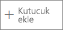
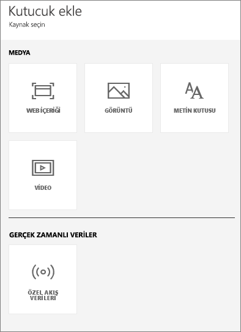
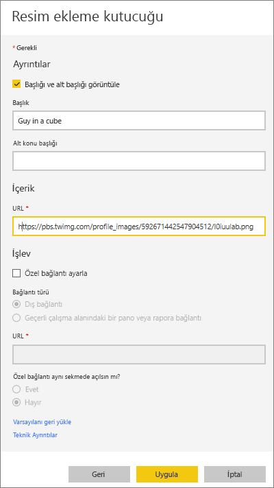
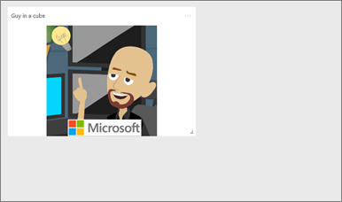
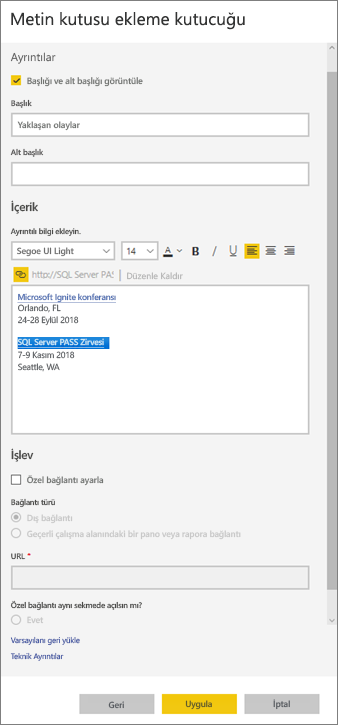
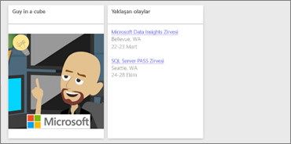
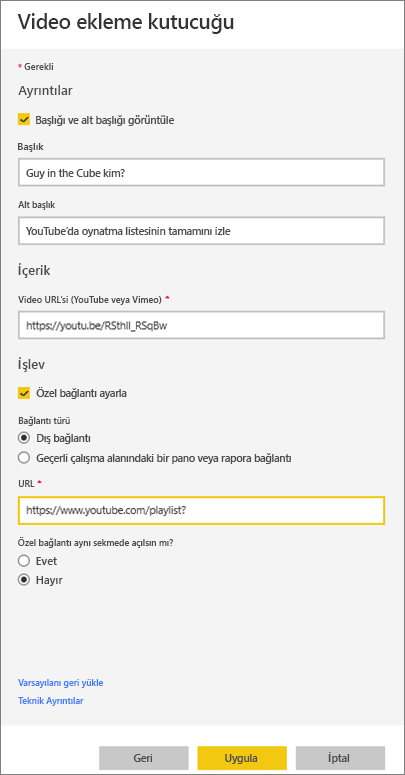
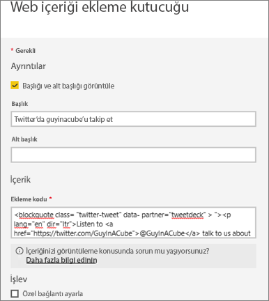
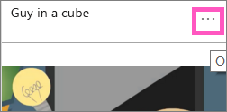
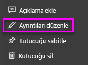

# <a name="add-images-videos-and-more-to-your-dashboard"></a>Panonuza resim, metin, video ve daha fazlasını ekleme

Panonuza bir kutucuk ekleyerek panoya görüntü, metin kutusu, video, akış verileri veya web kodu yerleştirebilirsiniz. 

Amanda’nın panoya nasıl kutucuk eklediğini izleyin.

   
<iframe width="560" height="315" src="https://www.youtube.com/embed/e2PD8m1Q0vU" frameborder="0" allowfullscreen></iframe>


## <a name="add-an-image-video-or-other-tile"></a>Görüntü, video veya diğer kutucukları ekleyin
Panonuza doğrudan bir resim, metin kutusu, video, akış verileri veya web kodu ekleyebilirsiniz.

1. Panonuzun üst menü çubuğundan **kutucuk ekle** seçeneğini belirleyin. Kullanılabilir alana bağlı olarak yalnızca artı  de görüntülenebilir.
   
    
2. Eklenecek kutucuk türünü seçin: 

    **[Web içeriği](#add-web-content)**

    **[Görüntü](#add-an-image)**

    **[Metin kutusu](#add-a-text-box-or-dashboard-heading)**

    **[Video](#add-a-video)**

    **[Özel akış verileri](#add-streaming-data)**
   
    

## <a name="add-an-image"></a>Resim ekleme
Panonuza şirket logonuzu veya farklı bir görüntüyü eklemek istiyorsanız, görüntü dosyasını çevrimiçi olarak kaydedip buna bağlamanız gerekir. Resim dosyasına erişmek için güvenlik kimlik bilgilerine gerek duyulmadığından emin olun. Örneğin, OneDrive ve SharePoint için kimlik doğrulaması gerektiği için bu hesaplarda depolanan görüntüler panoya bu yöntemle eklenemez.  

1. **Kutucuk ekle** penceresinden **Görüntü**’yü seçip  > **İleri** seçeneğini belirleyin.

2. **Resim kutucuğu ekle** penceresine görüntü bilgilerini ekleyin:   
   
   a. Görüntünün üzerine başlık yerleştirmek için **Başlığı ve alt konu başlığını görüntüle**’yi seçip bir **Başlık** ve isteğe bağlı bir **Alt Konu Başlığı** girin.

   b. Resim **URL**'sini girin.

   c. Kutucuğu köprü haline getirmek için **Özel bağlantı ayarlayın**'ı seçip **URL**'yi girin. 

      İş arkadaşlarınız resme veya başlığa tıkladığında bu URL açılır.

   d. **Apply** (Uygula) seçeneğini belirleyin. 

      

3. Panoda resmi gereken şekilde yeniden boyutlandırabilir ve taşıyabilirsiniz.
     
     

## <a name="add-a-text-box-or-dashboard-heading"></a>Metin kutusu veya pano başlığı ekleme

Pano başlığı eklemek için başlığı metin kutusuna yazıp yazı tipi boyutunu artırın.

1. **Kutucuk ekle** penceresinden **Metin kutusunu** >  seçip **İleri** seçeneğini belirleyin.

2. Metin kutusunu biçimlendirin:
   
   a. Metin kutusunun üzerine başlık yerleştirmek için **Başlığı ve alt konu başlığını görüntüle**’yi seçip bir **Başlık** ve isteğe bağlı bir **Alt Konu Başlığı** girin.

   b. Metin kutusu için bir **İçerik** girip bunu biçimlendirin.  

   c. İsterseniz başlık için özel bir bağlantı ayarlayabilirsiniz. Özel bağlantı dış bir siteye veya çalışma alanınızdaki bir panoya gidebilir. Ancak, bu örnekte metin kutusunun kendisine köprü eklediğimiz için **Özel bağlantı ayarlayın** kutusunu işaretlemeyeceğiz.

   d. **Apply** (Uygula) seçeneğini belirleyin. 

     
   
3. Panoda metin kutusunu gereken şekilde yeniden boyutlandırabilir ve taşıyabilirsiniz.
   
   

## <a name="add-a-video"></a>Video ekleme
Panonuza YouTube veya Vimeo videosu kutucuğu eklediğinizde video doğrudan panonuzda oynatılır.

1. **Kutucuk ekle** penceresinden **Video**’yu seçip  > **İleri** seçeneğini belirleyin.
2. **Video ekleme kutucuğu** penceresine video ile ilgili bilgileri ekleyin:   
   
   a. Video kutucuğunun üzerinde başlık ve alt konu başlığı görüntülemek için **Başlığı ve alt konu başlığını görüntüle**'yi seçip bir **Başlık** ve isteğe bağlı bir **Alt konu başlığı** girin. Bu örnekte bir **Alt konu başlığı** ekleyip bu başlığı, YouTube'daki oynatma listesinin tamamına yönlendirme yapan bir köprüye dönüştüreceğiz.

   b. Video için **Video URL**’sini girin.

   c. İş arkadaşlarınızın ekli videoyu izledikten sonra YouTube’daki oynatma listesinin tamamını görüntüleyebilmelerini sağlamak adına **Başlık** ve **Alt konu başlığı** için bir köprü ekleyin. Bunu yapmak için **İşlevsellik** bölümünün altından **Özel bağlantı ayarla** seçeneğini belirleyip oynatma listesi için bir **URL** girin.

   d. **Apply** (Uygula) seçeneğini belirleyin.  

   

3. Panoda video kutucuğunu gereken şekilde yeniden boyutlandırabilir ve taşıyabilirsiniz.
     
   
4. Videoyu oynatmak için video kutucuğunu seçin.
5. YouTube'daki oynatma listesini ziyaret etmek için alt konu başlığını seçin.

## <a name="add-streaming-data"></a>Akış verileri ekleme
Twitter akışları veya algılayıcı verileri gibi akış verilerini panonuzdaki bir kutucuğa eklemek için PubNub’ı kullanabilirsiniz. Power BI, verileri PubNub'dan almak için bir tümleştirme oluşturdu. Will, bunun nasıl çalıştığını burada açıklıyor:
   

Twitter akışları veya algılayıcı verileri gibi akış verilerini panonuzdaki bir kutucuğa eklemek için PubNub’ı kullanabilirsiniz. Power BI, verileri PubNub'dan almak için bir tümleştirme oluşturdu. Will, bunun nasıl çalıştığını burada açıklıyor: 

<iframe width="560" height="315" src="https://www.youtube.com/embed/kOuINwgkEkQ" frameborder="0" allowfullscreen></iframe>

1. **Kutucuk ekle** penceresinden **Özel Akış Verileri**’ni seçip  > **İleri**’yi belirleyin.
2. **Akış veri kümesi ekle** seçeneğini belirleyin.
3. Power BI API’sini veya PubNub’ı kullanarak **Yeni bir akış veri kümesi** oluşturun.
4. **Veri kümesi adı**, **Abonelik anahtarı**ve **Kanal adı**alanlarını doldurun. Bu güvenli bir bağlantıysa, yetkilendirme anahtarı da bulunur. Bunu denemek için PubNub’ın örnek değerlerini kullanabilirsiniz.
5. **Sonraki** seçeneğini belirleyin.
    Veri kümesinde kullanılabilir olan alanları, bunların veri türlerini ve JSON biçimini görürsünüz.
6. **Bağlan**'ı seçin.
    Bir akış veri kümesi oluşturdunuz.
7. Panoya geri dönüp **Kutucuk ekle**’yi,  > **Özel Akış Verileri**’ni ve  > **İleri**’yi belirleyin.
8. Oluşturduğunuz algılayıcı verisi veri kümesini seçip **İleri**’yi belirleyin.
9. İstediğiniz görsel türünü seçin. Bir çizgi grafiği genellikle bu veriler için iyi sonuç verir.
10. **Eksen**’i, **Gösterge**’yi, ve **Değerler**’i seçin.
11. Görüntülenmesini istediğiniz zaman miktarını (saniye, dakika veya saat cinsinden) kararlaştırın.
12. **Sonraki** seçeneğini belirleyin.
13. İsterseniz, buna bir **Başlık** veya **Alt Başlık** verin.
14. Bunu panonuza sabitleyin.


1. **Kutucuk ekle** penceresinden **Özel Akış Verileri**’ni seçip  > **İleri**’yi belirleyin.

2. **Akış veri kümesi ekle** seçeneğini belirleyin.

3. Power BI API’sini veya PubNub’ı kullanarak **Yeni bir akış veri kümesi** oluşturun.

4. **Veri kümesi adı**, **Abonelik anahtarı**ve **Kanal adı**alanlarını doldurun. Bu güvenli bir bağlantıysa, yetkilendirme anahtarı da bulunur. Bunu denemek için PubNub’ın örnek değerlerini kullanabilirsiniz.

5. **Sonraki** seçeneğini belirleyin.

   Veri kümesinde kullanılabilir olan alanları, bunların veri türlerini ve JSON biçimini görürsünüz.

6. **Bağlan**'ı seçin.

   Bir akış veri kümesi oluşturdunuz.

7. Panoya geri dönüp **Kutucuk ekle**’yi,  > **Özel Akış Verileri**’ni ve  > **İleri**’yi belirleyin.

8. Oluşturduğunuz algılayıcı verisi veri kümesini seçip **İleri**’yi belirleyin.

9. İstediğiniz görsel türünü seçin. Bir çizgi grafiği genellikle bu veriler için iyi sonuç verir.

10. **Eksen**’i, **Gösterge**’yi, ve **Değerler**’i seçin.

11. Görüntülenmesini istediğiniz zaman miktarını (saniye, dakika veya saat cinsinden) kararlaştırın.

12. **Sonraki** seçeneğini belirleyin.

13. İsteğe bağlı olarak, buna bir **Başlık** ve **Alt Konu Başlığı** verebilirsiniz.

14. Bunu panonuza sabitleyin.

## <a name="add-web-content"></a>Web içeriği ekleme
Raporunuza veya panonuza kutucuk olarak herhangi bir HTML içeriğini yapıştırabilir veya yazabilirsiniz. Ekleme kodunu el ile girin veya Twitter, YouTube, embed.ly gibi sitelerden kopyalayıp yapıştırın.

1. **Kutucuk ekle** penceresinden **Web içeriğini** seçip  > **İleri**’yi belirleyin.

2. **Web içeriği kutucuğu ekle** penceresine bilgi ekleyin:
   
   a. Kutucuğun üzerine başlık yerleştirmek için **Başlığı ve alt konu başlığını görüntüle**’yi seçip bir **Başlık** ve isteğe bağlı bir **Alt Konu Başlığı** girin.

   b. Ekleme kodunu girin. Bu örnekte bir Twitter akışını kopyalayıp yapıştıracağız.

   c. **Apply** (Uygula) seçeneğini belirleyin.

   
   

3. Panoda web içeriği kutucuğunu gereken şekilde yeniden boyutlandırabilir ve taşıyabilirsiniz.
     
   

### <a name="tips-for-embedding-web-content"></a>Web içeriği ekleme ipuçları
* iframe örnekleri için güvenli bir kaynak kullanın. iframe ekleme kodu girdiğinizde boş bir kutucukla karşılaşıyorsanız iframe kaynağında *http* kullanıp kullanmadığınızı doğrulayın. Eğer kullanıyorsanız, bunu *https* olarak değiştirin.
  
  ```html
  <iframe src="https://xyz.com">
  ```
* Genişlik ve yükseklik bilgilerini düzenleyin. Ekleme kodu bir video ekleyip video oynatıcı boyutunu 560 x 315 piksel olarak ayarlar. Kutucuğu yeniden boyutlandırdığınızda bu boyut değişmez.
  
  ```html
  <iframe width="560" height="315"
  src="https://www.youtube.com/embed/Cle_rKBpZ28" frameborder="0"
   allowfullscreen></iframe>
  ```
  
  Oynatıcının kutucuk boyutuna uyacak şekilde yeniden boyutlandırılmasını istiyorsanız genişlik ve yükseklik değerini %100 olarak ayarlayın.
  
  ```html
  <iframe width="100%" height="100%"
  src="https://www.youtube.com/embed/Cle_rKBpZ28" frameborder="0"
   allowfullscreen></iframe>
  ```
* Bu kod bir tweet ekleyip AFK pod yayınını, \@GuyInACube Twitter sayfasını, Follow, #analytics, reply, retweet ve like bağlantılarını pano üzerinde ayrı bağlantı olarak korur.  Kutucuğu seçtiğinizde Twitter üzerindeki pod yayını açılır.
  
  ```html
  <blockquote class="twitter-tweet" data-partner="tweetdeck">
  <p lang="en" dir="ltr">Listen to
  <a href="https://twitter.com/GuyInACube">@GuyInACube</a> talk to
  us about making videos about Microsoft Business Intelligence
  platform
  <a href="https://t.co/TmRgalz7tv">https://t.co/TmRgalz7tv </a>
  <a href="https://twitter.com/hashtag/analytics?src=hash">
  #analytics</a></p>&mdash; AFTK Podcast (@aftkpodcast) <a
  href="https://twitter.com/aftkpodcast/status/693465456531771392">
  January 30, 2016</a></blockquote> <script async src="//platform.twitter.com/widgets.js" charset="utf-8"></script>
  ```

## <a name="edit-a-tile"></a>Kutucukları düzenleme
Varolan bir kutucukta değişiklik yapmak için:

1. İmleci kutucuğun sağ üst köşesine getirip üç nokta simgesini (...) seçin.
   
    
2. **Kutucuk ayrıntıları** penceresini gösterip değişiklik yapmak için **Ayrıntıları düzenle** seçeneğini belirleyin.
   
    

## <a name="considerations-and-troubleshooting"></a>Önemli noktalar ve sorun giderme
* Kutucuğu panoda daha kolay taşımak için başlık ve isteğe bağlı bir alt konu başlığı ekleyin.
* Bir web sitesinde yer alan içeriği eklemek istiyorsanız ancak web sitesi kopyalayıp yapıştırabileceğiniz bir kod parçası sağlamıyorsa ekleme kodu oluşturma konusunda yardım almak için embed.ly sitesine bakın.

## <a name="next-steps"></a>Sonraki adımlar
[Power BI tasarımcıları için pano kutucuklarına giriş](service-dashboard-tiles.md)

Başka bir sorunuz mu var? [Power BI Topluluğu'na başvurun](http://community.powerbi.com/).

