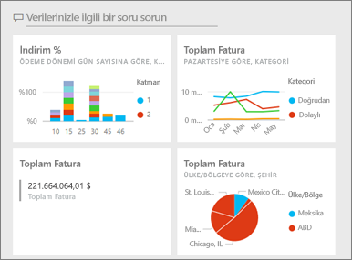
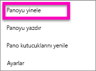
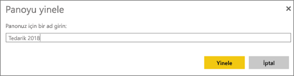
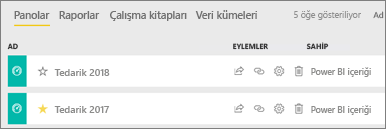

# Power BI hizmetinde bir panonun kopyasını oluşturma

 Bir panonun kopyasını oluşturmanın birçok farklı nedeni vardır. Değişiklik yapmak ve kopyanın performansını özgün panoyla karşılaştırarak test etmek isteyebilir; iş arkadaşı, bölge veya ekibe göre dağıtım yapmak için küçük farklılıklar gösteren sürümler oluşturmayı tercih edebilirsiniz. Belki de bir iş arkadaşınız pano tasarımınızı çok beğenir ve yöneticilerine raporlama yapmak için bunu kullanmak ister. Diğer bir neden olarak ise, aynı veri yapısı ile veri türlerine sahip yeni bir veritabanınızın bulunması ve oluşturmuş olduğunuz panoyu yeniden kullanmak istemeniz sunulabilir. Bu, mümkün olmakla birlikte Power BI Desktop'ta bazı işlemlerin yapılmasını gerektirir. 

Panolar, Power BI hizmeti kullanılarak oluşturulur (ve kopyalanır). Oluşturulan panoları Power BI mobil uygulamalarında ve Power BI Embedded'da görüntüleyebilirsiniz.  Panolar Power BI Desktop'ta kullanılamaz. 

Bir panonun kopyasını oluşturabilmeniz için panonun *oluşturucusu* olmanız gerekir. Sizinle uygulama olarak paylaşılan panolar yinelenemez.

1. Panoyu açın.
2. Sağ üst köşeden üç nokta (...) simgesini seçin ve **Panoyu yinele** seçeneğini belirleyin.
   
   
3. Panoya bir ad verin ve **Yinele** seçeneğini belirleyin. 
   
   
4. Yeni pano özgün panoyla aynı çalışma alanına kaydedilir. 
   
   

5.    Yeni panoyu açın ve gereken şekilde düzenleyin. Daha sonra yapmak isteyebileceğiniz bazı işlemler aşağıda verilmiştir:    
    a. [Kutucukları taşıma, yeniden adlandırma, yeniden boyutlandırma ve hatta silme](service-dashboard-edit-tile.md).  
    b. Kutucukta bulunan üç nokta (...) simgesini ve **Ayrıntıları düzenle**'yi seçerek kutucuk ayrıntılarını ve köprüleri düzenleme.  
    c. [Panodaki menü çubuğundan yeni kutucuklar ekleme](service-dashboard-add-widget.md) (**Kutucuk ekle**)  
    d. [Soru-Cevap bölümünden](service-dashboard-pin-tile-from-q-and-a.md) veya [raporlardan](service-dashboard-pin-tile-from-report.md) yeni kutucuklar sabitleme.  
    e. Panodaki Ayarlar bölmesinden panoyu yeniden adlandırma, Soru-Cevap özelliğini etkinleştirme veya devre dışı bırakma ve kutucuk akışını ayarlama.  (Panodaki üç nokta (...) açılan menüsünü ve ardından **Ayarlar**'ı seçin.)  
    f. Panonuzu doğrudan iş arkadaşlarınızla veya bir Power BI uygulamasının parçası olarak paylaşma. 

## Sonraki adımlar
* [Harika bir pano oluşturmaya yönelik ipuçları](service-dashboards-design-tips.md) 

Başka bir sorunuz mu var? [Power BI Topluluğu'na başvurun](http://community.powerbi.com/)

