# Rapordan Power BI panosu oluşturma
[Power BI'daki panolar](service-dashboards.md) başlıklı makaleyi okuduğunuza göre artık kendi panolarınızı oluşturabilirsiniz. Bir pano oluşturmanın birçok farklı yolu vardır. Bir rapordan, sıfırdan, bir veri kümesinden, mevcut bir pano yinelenerek veya başka yollarla oluşturulabilirler.  

İlk kez kullanmaya başladığınızda zor görünebilir; bu nedenle, öncelikle daha önce oluşturulmuş bir raporun görsellerini sabitleyerek hızlı ve kolay bir pano oluşturacağız. Bu hızlı başlangıcı tamamladıktan sonra, panolar ile raporlar arasındaki ilişki, rapor düzenleyicisinde Düzenleme görünümünü açma, kutucukları sabitleme ve bir pano ile rapor arasında gezinme hakkında bilgi sahibi olacaksınız. Sonra sol tarafta bulunan İçindekiler bölümündeki bağlantıları veya alt kısımdaki **Sonraki adımlar**’ı kullanarak daha gelişmiş konulara geçebilirsiniz.

## Kimler pano oluşturabilir?
Pano oluşturmak bir **oluşturan** özelliğidir ve rapor üzerinde düzenleme izinleri gerektirir. Düzenleme izinleri, rapor oluşturanlar ve oluşturanın erişim verdiği iş arkadaşları tarafından kullanılabilir. Örneğin, David workspaceABC içinde bir rapor oluşturur ve sonra sizi o çalışma alanının bir üyesi olarak eklerse, hem siz hem de David düzenleme izinlerine sahip olursunuz. Diğer yandan, bir rapor sizinle doğrudan veya bir [Power BI uygulamasının](service-create-distribute-apps.md) parçası olarak (raporu **kullanıyor** olursunuz) paylaşılırsa, bir panoya kutucukları sabitleyemezsiniz.

> **NOT**: Panolar Power BI Desktop'ın değil, Power BI hizmetinin sunduğu bir özelliktir. Panoları Power BI mobil uygulamasında oluşturamaz ancak [görüntüleyip paylaşabilirsiniz](consumer/mobile/mobile-apps-view-dashboard.md).
>
> 

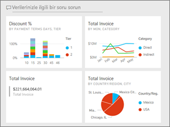

## Video: Rapordaki görselleri ve resimleri sabitleyerek pano oluşturma
Amanda'nın bir rapordaki görselleştirmeleri sabitleyerek yeni bir pano oluşturmasını izleyin. Sonra, Tedarik Analizi örneğini kullanarak kendiniz denemek için videonun altında bulunan adımları izleyin.

<iframe width="560" height="315" src="https://www.youtube.com/embed/lJKgWnvl6bQ" frameborder="0" allowfullscreen></iframe>

### Önkoşullar
Takip edebilmek için "Tedarik Analizi" örneği Excel çalışma kitabını indirmeniz ve Power BI hizmetinde (app.powerbi.com) açmanız gerekir.

## Rapor içeren bir veri kümesini içeri aktarma
Power BI örnek veri kümelerinden birini içeri aktarıp yeni panomuzu oluşturmak için kullanacağız. Kullanacağımız örnek, iki PowerView sayfası bulunan bir Excel çalışma kitabıdır. Çalışma kitabın Power BI tarafından içeri aktarıldığında, çalışma alanınıza bir veri kümesi ve bir rapor eklenir.  Rapor otomatik olarak PowerView sayfalarından oluşturulur.

1. Tedarik Analizi örneği Excel dosyasını indirip kaydetmek için [bu bağlantıyı seçin](http://go.microsoft.com/fwlink/?LinkId=529784). Dosyayı OneDrive İş hesabınıza kaydetmenizi öneririz.
2. Tarayıcınızda Power BI hizmetine (app.powerbi.com) gidin ve oturum açın.
3. **Çalışma Alanım**’ı seçin.
4. Sol gezinti bölmesinde, **Veri Al**'ı seçin.

    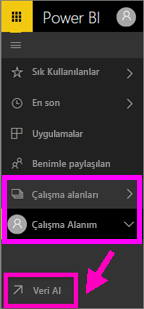
5. **Dosyalar**'ı seçin.

   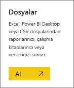
6. Tedarik Analizi örnek Excel dosyasını kaydettiğiniz konuma gidin. Dosyayı seçin ve **Bağlan** seçeneğini belirleyin.

   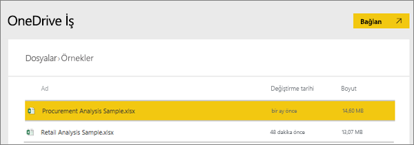
7. Bu alıştırma için **İçeri aktar** seçeneğini belirleyin.

    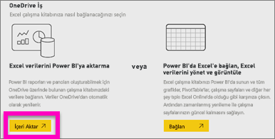
8. Başarılı iletisi göründüğünde kapatmak için **x** işaretini seçin.

   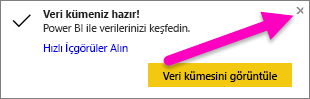

### Raporu açıp panoya bazı kutucuklar sabitleme
1. Aynı çalışma alanında, **Raporlar** sekmesini seçin. Yeni içeri aktarılan rapor sarı yıldız işaretiyle görüntülenir. Rapor adını seçerek raporu açın.

    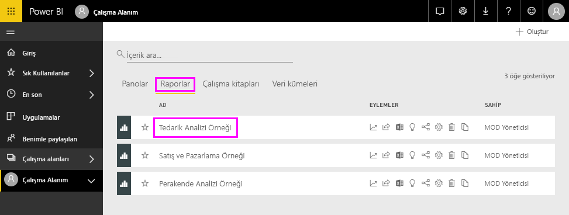
2. Rapor Okuma görünümü'nde açılır. Alt kısımda iki sekmesi olduğuna dikkat edin: İndirim Analizi ve Harcamaya Genel Bakış. Her sekme raporun bir sayfasını temsil eder.
    **Raporu düzenle**'yi seçerek raporu Düzenleme görünümünde açın.

    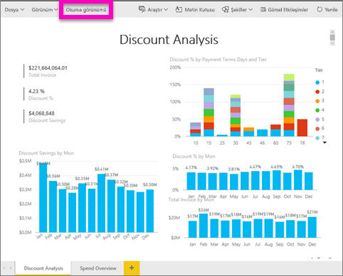
3. Kullanılabilir seçenekleri görüntülemek için bir görselleştirmenin üzerine gelin. Panoya bir görselleştirme eklemek için, raptiye  simgesini seçin.

    
4. Yeni bir pano oluşturduğumuzdan, **Yeni pano** seçeneğini belirleyin ve panoya bir ad verin.

   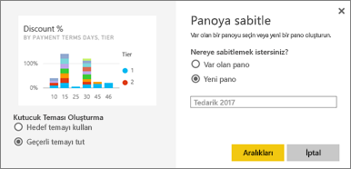
5. **Sabitle**'yi seçtiğinizde, Power BI geçerli çalışma alanında yeni bir pano oluşturur. **Panoya sabitlendi** iletisi görüntülendiğinde, **Panoya git** seçeneğini belirleyin. Raporu kaydetmeniz istenirse **Kaydet**'i seçin.

     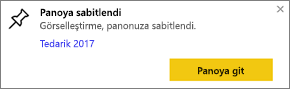
6. Power BI yeni panoyu açar ve tek bir kutucuk (biraz önce sabitlediğiniz görsel) görüntülenir.

   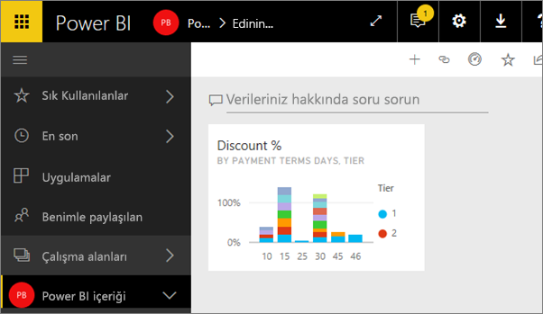
7. Rapora dönmek için kutucuğu seçin. Yeni panoya birkaç kutucuk daha sabitleyin. **Panoya sabitle** penceresi görüntülendiğinde, bu kez **Var olan pano**'yu seçin.  

   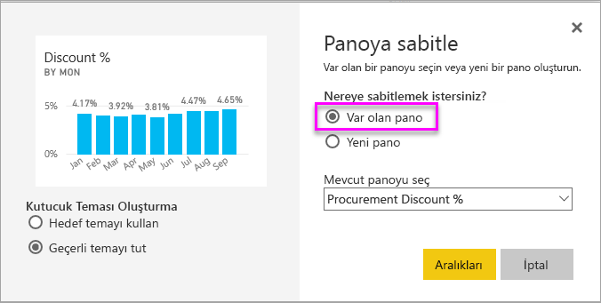

## Rapor sayfasının tamamını panoya sabitleme
Görselleri tek tek sabitlemek yerine, [bir rapor sayfasının tamamını *canlı kutucuk* olarak sabitleyebilirsiniz](service-dashboard-pin-live-tile-from-report.md). Şimdi bu işlemi yapalım.

1. Rapor düzenleyicisinde **Harcamaya Genel Bakış** sekmesini seçerek raporun 2. sayfasını açın.

   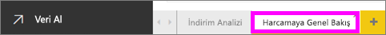

2. Bu görsellerin tümünü panonuzda görmek istiyorsunuz.  Menü çubuğunun sağ üst köşesindeki **Canlı sabitleme sayfası**’nı seçin. Sayfa her yenilendiğinde bir panodaki canlı sayfa kutucukları güncelleştirilir.

   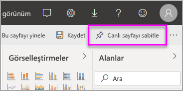

3. **Panoya sabitle** penceresi görüntülendiğinde, **Var olan pano**'yu seçin.

   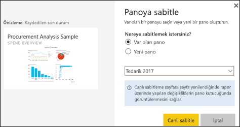

4. Başarılı iletisi göründüğünde **Panoya git**'i seçin. Orada rapordan sabitlediğiniz kutucukları göreceksiniz. Aşağıdaki örnekte, raporun 1. sayfasından 2 kutucuğu ve raporun 2. sayfası olan bir canlı kutucuğu sabitledik.

   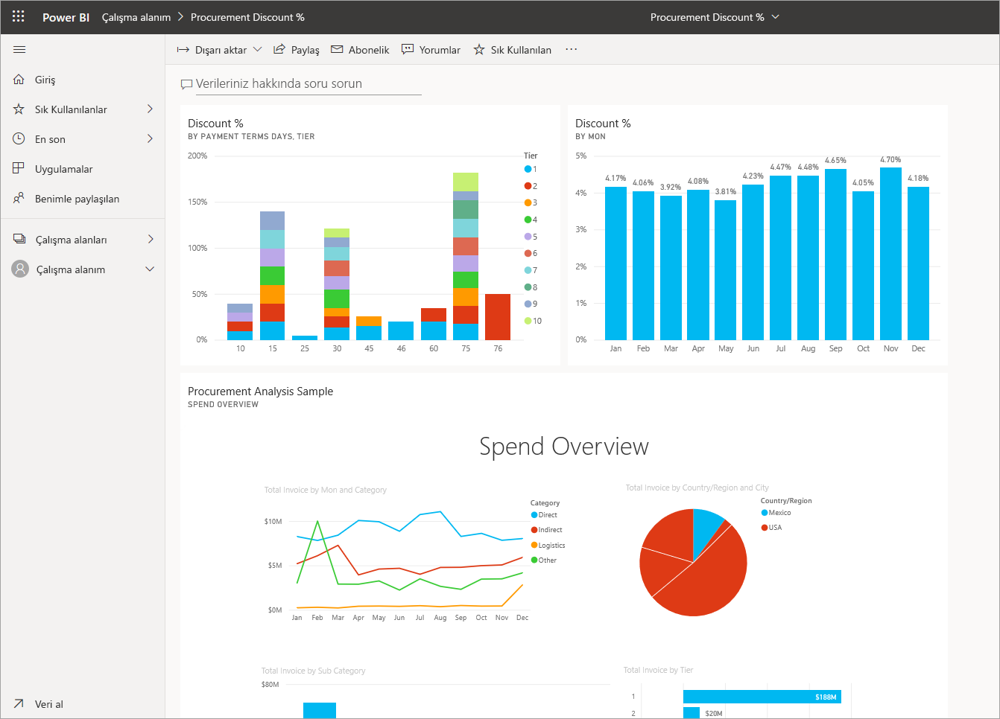

Tebrikler, ilk panonuzu oluşturdunuz! Artık bir panonuz olduğuna göre, onunla birçok şey yapabilirsiniz.  Aşağıda önerilen **Sonraki adımlardan** birini deneyin veya kendi başınıza dilediğiniz gibi keşif yapın.   

## Sonraki adımlar
* [Kutucukları yeniden boyutlandırma ve taşıma](service-dashboard-edit-tile.md)
* [Pano kutucukları hakkında tüm bilmeniz gerekenler](service-dashboard-tiles.md)
* [Uygulama oluşturarak panonuzu paylaşma](service-create-workspaces.md)
* [Power BI - Temel Kavramlar](service-basic-concepts.md)
* [Harika bir pano oluşturmaya yönelik ipuçları](service-dashboards-design-tips.md)

Başka bir sorunuz mu var? [Power BI Topluluğu'na başvurun](http://community.powerbi.com/)
