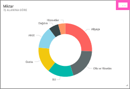
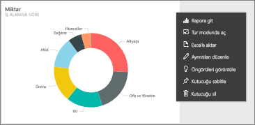
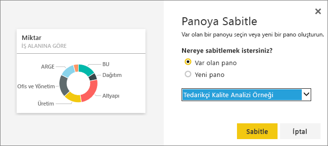

# Pano kutucuklarını düzenleme veya kaldırma
Panolardaki kutucukların görünümünü ve varsayılan davranışını değiştirebilirsiniz.

<iframe width="560" height="315" src="https://www.youtube.com/embed/lJKgWnvl6bQ" frameborder="0" allowfullscreen></iframe>

Bu makalede aşağıdaki noktalar ele alınmaktadır.

* [Kutucukları farklı bir panoya sabitleme](#different)
* [Kutucukları yeniden adlandırma](#rename)
* [Kutucukları taşıma](#move)
* [Kutucukları yeniden boyutlandırma](#resize)
* [Kutucuklara köprü ekleme](#hyperlink)
* [Kutucukları silme](#delete)
  
  > [!TIP]
  > Kutucuğun üzerinde gösterilen görselleştirmeyi değiştirmek için kutucuğu silip yeni bir [pano kutucuğu](service-dashboard-tiles.md) ekleyin.
  > 
  > 

## Başlangıç noktası
1. En az bir kutucuk içeren bir [pano](service-dashboards.md) açın. 
   
   
2. Bir pano kutucuğunun üzerine gelin ve seçenekleri görüntülemek için üç noktaya tıklayın.
   
   

## Kutucuğu bir panoya sabitleme
1. **Kutucuğu sabitle** simgesini  seçin.
2. Mevcut bir panoya mı yoksa yeni bir panoya mı sabitlemek istediğinize karar verin. 
   
   
3. **Sabitle**'yi seçin.

- - -

## Kutucuğu yeniden adlandırma ve kutucuk ayrıntılarını düzenleme
Başlığı düzenlemek ve son yenileme zamanını görüntülemek için kutucuk ayrıntıları simgesini  seçin.

- - -

## Kutucuğu taşıma
Pano tuvali üzerindeki farklı bir konuma taşımak için kutucuğu seçin ve basılı tutarak sürükleyin.

- - -

## Kutucuğu yeniden boyutlandırma
Kutucuklar için 1x1'den 5x5'e kadar birçok farklı boyut belirleyebilirsiniz. Kutucuğu yeniden boyutlandırmak için tutamacı (sağ alt köşedeki) seçin ve sürükleyin.
    

- - -

## Varsayılan köprüyü değiştirme
Bir kutucuğu seçtiğinizde varsayılan olarak oluşturulduğu rapor veya Soru-Cevap (kutucuk Soru-Cevap içinde oluşturulduysa) açılır. Bir web sayfasına, başka bir panoya veya rapora (aynı çalışma alanındaki), bir SSRS raporuna ya da farklı bir çevrimiçi içeriğe bağlantı oluşturmak için özel bağlantı ekleyin:

1. Kutucuğu düzenlemek için **Ayrıntıları düzenle** simgesini  seçin.
2. **Özel bağlantı ayarlayın** onay kutusunu işaretleyip bağlantı türünü seçin.    
   
   * Dış bağlantı için URL'yi girin.     
   * Geçerli çalışma alanındaki bir panoya veya rapora bağlantı oluşturmak için açılır menüden seçim yapın.
   
   

- - -

## Kutucuğu silme
* Kutucuğu silmek için **Kutucuğu sil** simgesini  seçin. Kutucuğu sildiğinizde bağlantılı rapor veya görselleştirme silinmez.

- - -
## Sonraki adımlar
[Power BI'daki pano kutucukları](service-dashboard-tiles.md)

[Power BI'daki panolar](service-dashboards.md)

[Power BI - Temel Kavramlar](service-basic-concepts.md)

Başka bir sorunuz mu var? [Power BI Topluluğu'na başvurun](http://community.powerbi.com/)

