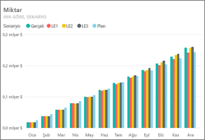
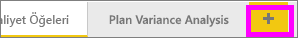
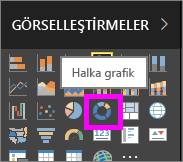
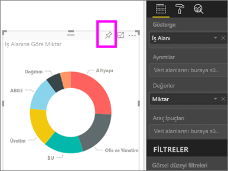
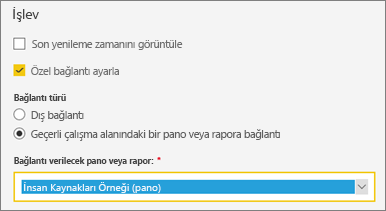
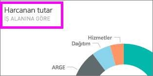

# Pano kutucuklarını düzenleme veya kaldırma

## Pano *sahipleri* ve pano *kullanıcıları*
Bir pano oluşturduğunuzda veya panonun sahibi olduğunuzda panodaki kutucukların görünümünü ve varsayılan davranışını değiştirmeye ilişkin birçok seçeneğe sahip olursunuz. İş arkadaşlarınız için pano *kullanma* deneyimini tasarlamak üzere aşağıdaki ayarları ve stratejileri kullanın.  Kutucuk seçildiğinde bağlantılı rapor mu, özel bir URL mi yoksa farklı bir pano mu açılacak? [Video veya veri akışı görüntüleyen bir kutucuk eklemek](service-dashboard-add-widget.md) ister misiniz? [Etkileşimli dilimleyicilere sahip bir kutucuk](service-dashboard-pin-live-tile-from-report.md) bile oluşturabilirsiniz. *Oluşturucu* olarak birçok seçeneği kullanabilirsiniz. 

<iframe width="560" height="315" src="https://www.youtube.com/embed/lJKgWnvl6bQ" frameborder="0" allowfullscreen></iframe>

Bu makalede aşağıdaki noktalar ele alınmaktadır.

* [Görselleştirme oluşturma ve bu görselleştirmeyi bir panoya sabitleme](#create)
* [Kutucukları taşıma](#move)
* [Kutucukları yeniden boyutlandırma](#resize)
* [Kutucukları yeniden adlandırma](#rename)
* [Kutucuklara köprü ekleme](#hyperlink)
* [Kutucukları farklı bir panoya sabitleme](#different)
* [Kutucukları silme](#delete)
  
 > [!TIP]
 > Kutucuğun üzerinde gösterilen görselleştirmeyi değiştirmek için kutucuğu silip yeni bir [pano kutucuğu](service-dashboard-tiles.md) ekleyin.
 > 

 ### Önkoşullar
 1. Birlikte ilerlemek için Power BI hizmetini (Power BI Desktop'ı değil) açın ve [BT Harcama Analizi örneğini indirin](sample-it-spend.md). "Başarılı" iletisi göründüğünde **Panoya git**'i seçin.

- - -

## Yeni bir görselleştirme oluşturma ve bu görselleştirmeyi panoya sabitleme
1. IT Spend Analysis Sample panosunda "Amount" kutucuğunu seçerek ilgili raporu açın.

    

2. Üstteki menü çubuğundan **Raporu düzenle**'yi seçerek raporu Düzenleme görünümü'nde açın.

3. Raporun alt kısmında bulunan artı işaretini (+) seçerek yeni bir rapor sayfası ekleyin.

    

4. ALANLAR bölmesinde **Fact > Amount** ve **Business Area > Business Area** seçeneklerini belirleyin.
 
5. Görselleştirmeyi bir Halka grafiğe dönüştürmek için GÖRSEL ÖĞELER bölmesinde Halka grafik simgesini seçin.

    

5. Raptiye simgesini seçin ve Halka grafiği, IT Spend Analysis Sample panosuna sabitleyin.

   

6. "Başarılı" iletisi göründüğünde **Panoya git**'i seçin. Değişikliklerinizi kaydetmeniz istenecek. **Kaydet**'i seçin.

- - -

## Kutucuğu taşıma
Panoda yeni kutucuğu bulun. Pano tuvali üzerindeki farklı bir konuma taşımak için kutucuğu seçin ve basılı tutarak sürükleyin.

- - -

## Kutucuğu yeniden boyutlandırma
Kutucuklar için 1x1'den 5x5'e kadar birçok farklı boyut belirleyebilirsiniz. Kutucuğu yeniden boyutlandırmak için tutamacı (sağ alt köşedeki) seçin ve sürükleyin.

- - -
## Üç nokta (...) menüsü

1. Kutucuğun sağ üst köşesindeki üç nokta (...) simgesini seçin. 
   
   

2. "Account" kutucuğunun üzerine gelin ve seçenekleri görüntülemek için üç nokta simgesini seçin. Kullanabileceğiniz seçenekler kutucuk türüne göre değişir.  Örneğin, canlı bir kutucuk için kullanabileceğiniz seçenekler standart bir görselleştirme kutucuğu için kullanabileceğiniz seçeneklerden farklıdır. Ayrıca, sizinle paylaşılan (sahibi olmadığınız) bir pano üzerinde çalışıyorsanız daha az seçeneğiniz olur.

   

3. "Kutucuk ayrıntıları" penceresini açmak için **Ayrıntıları düzenle** seçeneğini belirleyin. 

    Kutucuğun başlığını ve varsayılan davranışını değiştirin.  Örneğin, *kullanıcı* bir kutucuğu seçtiğinde ilgili kutucuğun oluşturulması için kullanılan raporun açılması yerine yeni bir panonun görüntülenmesini sağlayabilirsiniz.  
   
   

### Kutucuğu yeniden adlandırma
"Kutucuk ayrıntıları" penceresinin üst kısmındaki **Başlık** değerini **Amount spent** olarak değiştirin.

### Varsayılan köprüyü değiştirme
Varsayılan olarak, bir kutucuğu seçtiğinizde genellikle kutucuğun oluşturulduğu rapor veya Soru-Cevap (kutucuk Soru-Cevap bölümünde oluşturulduysa) açılır. Kutucuğu bir web sayfası, başka bir pano veya rapor (aynı çalışma alanındaki), SSRS raporu ya da farklı bir çevrimiçi içerik ile bağlantılı hale getirmek için özel bir bağlantı ekleyin.

1. İşlev başlığının altında bulunan **Özel bağlantı ayarlayın** seçeneğini belirleyin.

2. **Geçerli çalışma alanındaki bir pano veya rapora bağlantı**'yı seçin ve açılan listeden seçiminizi yapın.  Bu örnekte biz Human Resources Sample panosunu seçtik. Çalışma alanınızda bu örnek yoksa örneği ekleyip bu adımdan devam edebilir veya farklı bir pano seçebilirsiniz. 

    

3. **Uygula** seçeneğini belirleyin.

4. Kutucukta yeni başlık görüntülenir.  Kutucuğu seçtiğinizde Power BI, Human Resources Sample panosunu açar. 

    

### Kutucuğu farklı bir panoya sabitleme
1. Üç nokta açılan menüsünde **Kutucuğu sabitle**  seçeneğini belirleyin.
2. Bu kutucuğun bir kopyasını mevcut bir panoya mı yoksa yeni bir panoya mı sabitlemek istediğinize karar verin. 
   
   
3. **Sabitle**'yi seçin.

### Kutucuğu silme
1. Bir kutucuğu panodan kalıcı olarak kaldırmak için üç nokta açılan menüsünde **Kutucuğu sil**  seçeneğini belirleyin. 

2. Kutucuğu sildiğinizde bağlantılı görselleştirme silinmez. "Amount" kutucuğunu seçerek bağlantılı raporu açın. Özgün görselleştirmenin rapordan silinmediğini görmek için raporunuzdaki son sayfayı açın. 

- - -
## Sonraki adımlar
[Power BI'daki pano kutucukları](service-dashboard-tiles.md)

[Power BI'daki panolar](service-dashboards.md)

[Power BI - Temel Kavramlar](service-basic-concepts.md)

Başka bir sorunuz mu var? [Power BI Topluluğu'na başvurun](http://community.powerbi.com/)

