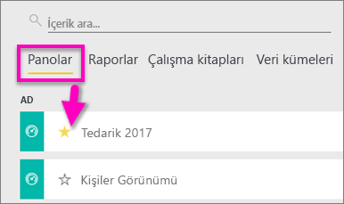
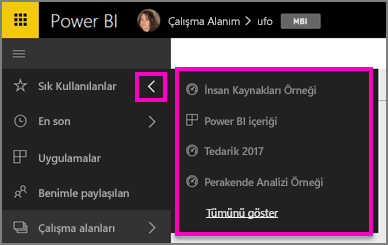
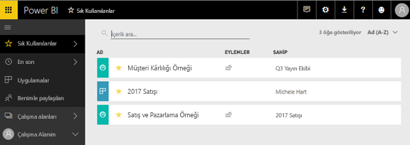
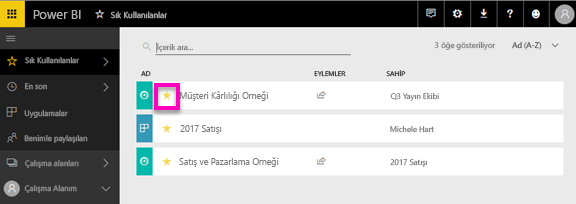

# Power BI hizmetindeki sık kullanılan panolar
Bir panoyu *sık kullanılanlara* eklediğinizde panoya tüm çalışma alanlarınızdan erişebilirsiniz.  Sık kullanılanlar, genelde en çok ziyaret ettiğiniz öğelerdir.

> [!NOTE]
> Bu konu başlığı, Power BI Desktop uygulamasına değil Power BI hizmetine yöneliktir.
> 
> 

Power BI hizmetinde tek bir panoyu [öne çıkan pano](service-dashboard-featured.md) olarak belirleyebilirsiniz.

## Bir panoyu *sık kullanılanlara* ekleme
En çok ziyaret ettiği öğeleri çalışma alanındaki sık kullanılanlar listesine ekleyen Amanda'yı izledikten sonra kendiniz denemek için videonun altındaki adım adım yönergeleri uygulayın.

<iframe width="560" height="315" src="https://www.youtube.com/embed/G26dr2PsEpk" frameborder="0" allowfullscreen></iframe>

1. Sık kullandığınız panolardan birini açın. Sizinle paylaşılan panoları da *sık kullanılanlara* ekleyebilirsiniz.
2. Power BI hizmetinin sağ üst köşesinde bulunan **Sık kullanılanlara ekle**'yi veya yıldız  simgesini seçin.
   
   
   
   Panoları çalışma alanınızın **Panolar** sekmesinden de sık kullanılanlara ekleyebilirsiniz.
   
   

## *Sık kullanılanlar*'ı kullanma
1. Sık kullanılanlara erişmek için herhangi bir çalışma alanında **Sık Kullanılanlar**'ın yanındaki oku seçin.  Burada, sık kullanılan panolarınızdan birini seçerek açabilirsiniz. Yalnızca beş sık kullanılan öğe listelenir (alfabetik sırada). Sık kullanılanlara beşten fazla öğe eklediyseniz sık kullanılanlar ekranını (aşağıdaki 2. görüntüye bakın) açmak için **Tümünü göster**'i seçin. 
   
   
2. Sık kullanılanlara eklediğiniz **tüm** panoları görmek için sol taraftaki gezinti bölmesinde bulunan **Sık Kullanılanlar**'ı veya Sık Kullanılanlar simgesini  seçin.  
   
    
   
   Buradaki panolardan birini seçerek açabilir veya iş arkadaşlarınızla paylaşabilirsiniz.

## Bir panoyu sık kullanılanlardan çıkarma
Bir panoyu artık eskisi kadar sık kullanmıyor musunuz?  Öyleyse sık kullanılanlardan çıkarabilirsiniz. Sık kullanılanlardan çıkardığınız panolar yalnızca Sık Kullanılanlar listenizden kaldırılır, Power BI'dan kaldırılmaz.

1. Sol gezinti bölmesinde **Sık Kullanılanlar**'ı seçerek **Sık Kullanılanlar** ekranını açın.
   
   
2. Sık kullanılanlardan çıkarmak istediğiniz panonun yanındaki sarı yıldızı seçin.

> **NOT**: Bir panoyu sık kullanılanlardan kaldırma işlemini söz konusu panodan da gerçekleştirebilirsiniz. Panonun sağ üst köşesinde sarı bir yıldız ile birlikte **Sık kullanılanlardan çıkar** ifadesini göreceksiniz. Panoyu sık kullanılanlar listenizden çıkarmak için ikisinden birini seçmeniz yeterlidir. 
> 
> 

## Sonraki adımlar
[Power BI ile çalışmaya başlama](service-get-started.md)

[Power BI - Temel Kavramlar](service-basic-concepts.md)

Başka bir sorunuz mu var? [Power BI Topluluğu'na başvurun](http://community.powerbi.com/)

