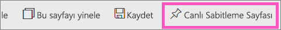
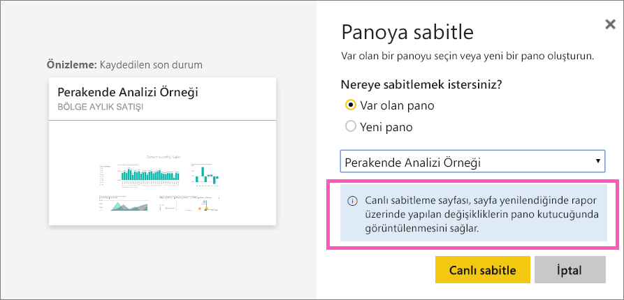
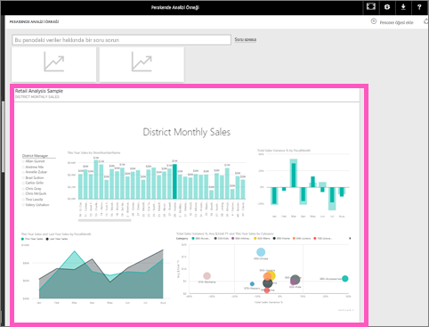

# Rapor sayfasının tamamını bir Power BI panosuna canlı kutucuk olarak sabitleme
Yeni bir [pano kutucuğu](consumer/end-user-tiles.md) eklemenin başka bir yolu da rapor sayfasının tamamını sabitlemektir. Bu, aynı anda birden fazla görselleştirme sabitlemenin kolay bir yoludur.  Ayrıca, bir sayfanın tamamını sabitlediğinizde kutucuklar *canlıdır*; kutucuklarla doğrudan pano üzerinden etkileşim kurabilirsiniz. Üstelik rapor düzenleyicisinde herhangi bir görselleştirme üzerinde yaptığınız değişiklikler (filtre ekleme veya grafikte kullanılan alanları değiştirme gibi) pano kutucuğu için de geçerli olur.  

Canlı kutucukların raporlardan panolara sabitlenmesi yalnızca Power BI hizmetinde (app.powerbi.com) mümkündür.

> [!NOTE]
> Sizinle paylaşılan raporlarda bulunan kutucukları sabitleyemezsiniz.
> 
> 

## Rapor sayfalarını sabitleme
Canlı rapor sayfasını bir panoya sabitleyen Amanda'yı izledikten sonra kendiniz denemek için videonun altındaki adım adım yönergeleri uygulayın.

<iframe width="560" height="315" src="https://www.youtube.com/embed/EzhfBpPboPA" frameborder="0" allowfullscreen></iframe>

1. Raporu [Düzenleme görünümü](service-interact-with-a-report-in-editing-view.md)'nde açın.
2. Herhangi bir görselleştirmenin seçili olmadığından emin olduktan sonra menü çubuğundan **Canlı Sabitleme Sayfası**'nı seçin.
   
    
3. Kutucuğu var olan bir panoya veya yeni bir panoya sabitleyin. Vurgulanan metne dikkat edin: *Canlı sabitleme sayfası, sayfa yenilendiğinde rapor üzerinde yapılan değişikliklerin pano kutucuğunda görüntülenmesini sağlar.*
   
   * Var olan pano: Açılan listeden pano adını seçin. Sizinle paylaşılan panolar açılan listede görünmez.
   * Yeni pano: Yeni panonun adını girin.
     
     
4. **Canlı sabitle**'yi seçin. Sağ üst köşeye yakın bir noktada çıkan Başarılı iletisi, sayfanın bir kutucuk olarak panonuza eklendiğini bildirir.

## Sabitlenmiş canlı kutucuğu görmek için panoyu açma
1. Gezinti bölmesinden yeni canlı kutucuk içeren panoyu seçin. Burada, sabitlenmiş rapor sayfasını [yeniden adlandırabilir, yeniden boyutlandırabilir, bağlantılı hale getirebilir ve taşıyabilirsiniz](service-dashboard-edit-tile.md).  
2. Canlı kutucukla etkileşim kurun.  Aşağıdaki ekran görüntüsünde, sütun grafikteki çubuklardan biri seçildiğinde kutucuktaki diğer görselleştirmeler çapraz olarak filtrelenir ve vurgulanır.
   
    

## Sonraki adımlar
[Power BI'daki panolar](consumer/end-user-dashboards.md)

Başka bir sorunuz mu var? [Power BI Topluluğu'na başvurun](https://community.powerbi.com/)

