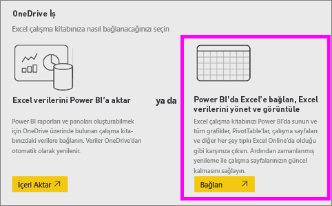
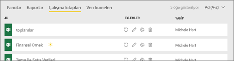
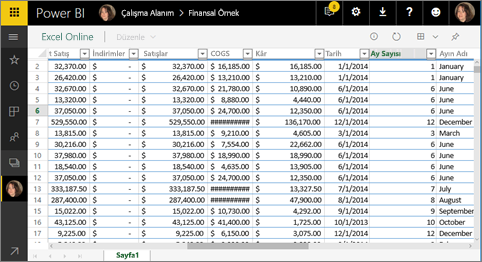
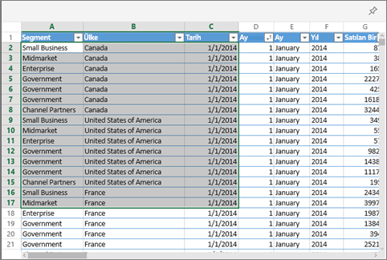
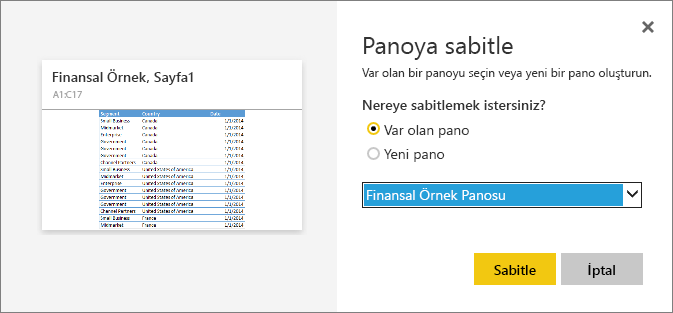
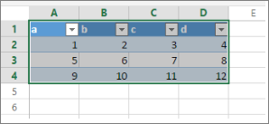

# Excel'deki kutucukları Power BI panolarına sabitleme
Excel çalışma kitabınızdaki bir kutucuğu sabitleyebilmeniz için çalışma kitabı ile Power BI hizmeti (app.powerbi.com) arasında bağlantı kurmanız gerekir. Çalışma kitabı ile hizmet arasında bağlantı kurulduğunda çalışma kitabının bağlantılı, salt okunur bir sürümü Power BI hizmetine aktarılır ve böylece aralıkları panolara sabitleyebilirsiniz. Panolara bir çalışma sayfasının tamamını bile sabitleyebilirsiniz.  
Sizinle bir çalışma kitabı paylaşılırsa, dosyanın sahibi tarafından sabitlenen kutucukları görüntüleyebilirsiniz ancak herhangi bir pano kutucuğu oluşturamazsınız. 

Excel ve Power BI'ın birlikte nasıl çalıştığı hakkında ayrıntılı bilgi için bkz. [Excel çalışma kitabı dosyalarından veri alma](https://go.microsoft.com/fwlink/?LinkID=521962).

Will bize Excel çalışma kitaplarındaki verileri içeri aktarmak ve bu verilere bağlanmak için kullanabileceğimiz birkaç yöntem gösterecek.

<iframe width="560" height="315" src="https://www.youtube.com/embed/l8JoB7w0zJA" frameborder="0" allowfullscreen></iframe>

## OneDrive İş'teki Excel çalışma kitabınızı Power BI'a bağlama
**Bağlan**'ı seçtiğinizde çalışma kitabınız, Power BI'da tıpkı Excel Online'da göründüğü gibi görünecektir. Ancak, Excel Online'dan farklı olarak çalışma sayfalarınızdaki öğeleri doğrudan panolarınıza sabitlemenize yardımcı olacak harika özellikler edineceksiniz.

Çalışma kitabınızı Power BI'da düzenleyemezsiniz. Ancak bazı değişiklikler yapmanız gerekirse çalışma alanınızın **Çalışma Kitapları** sekmesinden kalem simgesini seçip çalışma kitabınızı Excel Online'da düzenlemeyi veya bilgisayarınızdaki Excel programında açmayı seçebilirsiniz. Yaptığınız tüm değişiklikler OneDrive'daki çalışma kitabına kaydedilir.

1. Çalışma kitabınızı OneDrive İş hesabınıza yükleyin.

2. Power BI’de **Veri Al > Dosyalar > OneDrive - İş**’i seçip Excel dosyasını kaydettiğiniz konuma giderek [söz konusu çalışma kitabına bağlanın](service-excel-workbook-files.md). Dosyayı ve **Bağlan > Bağlan** öğesini seçin.

    

3. Power BI'da söz konusu çalışma kitabı çalışma alanınızın **Çalışma Kitapları** sekmesine eklenir.   simgesi bunun bir Excel çalışma kitabı olduğunu, sarı yıldız işareti ise yeni olduğunu gösterir.
    
    
4. Adını seçerek çalışma kitabını Power BI'da açın.

    Power BI'da çalışma kitabı üzerinde yaptığınız değişiklikler kaydedilmez ve OneDrive İş'teki özgün çalışma kitabı bu değişikliklerden etkilenmez. Power BI'da değerleri sıralar, filtreler veya değiştirirseniz söz konusu değişiklikler kaydedilemez ya da sabitlenemez. Kaydedilecek değişiklikler yapmanız gerekirse, sağ üst köşeden **Düzenle**’yi seçerek Excel Online'da veya Excel'de düzenlemek üzere açın. Bu şekilde yapılan değişikliklerin pano üzerindeki kutucukları güncelleştirmesi birkaç dakika sürebilir.
   
    

## Bir hücre aralığını panoya sabitleme
Yeni bir [pano kutucuğu](consumer/end-user-tiles.md) eklemenin yollarından biri, bu işlemi Power BI'daki Excel çalışma kitabında gerçekleştirmektir. OneDrive İş hesabınıza veya grup tarafından paylaşılan başka bir belge kitaplığına kaydedilen Excel çalışma kitaplarından aralık sabitleyebilirsiniz. Bu aralıklar veri, grafik, tablo, PivotTable, PivotChart ve Excel'in diğer öğelerini içerebilir.

1. Bir panoya sabitlemek istediğiniz hücreleri vurgulayın.
   
    
2. Raptiye  simgesini seçin. 
3. Kutucuğu, mevcut bir panoya veya yeni bir panoya sabitleyin. 
   
   * Var olan pano: Açılan listeden panonun adını seçin.
   * Yeni pano: Yeni panonun adını yazın.
   
     
4. **Sabitle**'yi seçin. Sağ üst köşeye yakın bir noktada çıkan Başarılı iletisi, aralığın bir kutucuk olarak panonuza eklendiğini bildirir. 
   
    
5. **Panoya git**'i seçin. Burada, sabitlenmiş görselleştirmeyi [yeniden adlandırabilir, yeniden boyutlandırabilir, bağlantılı hale getirebilir ve taşıyabilirsiniz](service-dashboard-edit-tile.md). Varsayılan olarak, sabitlenen kutucuk seçildiğinde çalışma kitabı Power BI'da açılır.

## Tam bir tabloyu veya PivotTable’ı panoya sabitleme
Yukarıdaki adımları uygulayın ancak bu kez, bir hücre aralığı seçmek yerine tablonun veya PivotTable’ın tamamını seçin.

Bir tabloyu sabitlemek için, tablonun tüm aralığını seçin ve başlıkları da eklediğinizden emin olun.  Bir PivotTable’ı sabitlemek için PivotTable’ın görünür her bir parçasını (kullanıldıysa filtreler de dahil) seçtiğinizden emin olun.

 

Tablodan veya PivotTable’dan oluşturulan bir kutucuk tablonun tamamını gösterir.  Özgün çalışma kitabında satır veya sütun ekler, kaldırır veya filtrelerseniz söz konusu satır ve sütunlar kutucukta da eklenir, kaldırılır ya da filtrelenir.

## Kutucukla bağlantılı çalışma kitabını görüntüleme
Bir çalışma kitabı kutucuğu seçildiğinde bağlantılı çalışma kitabı Power BI'da açılır. Çalışma kitabı dosyası, dosya sahibinin OneDrive İş hesabında bulunduğundan çalışma kitabını görüntüleyebilmeniz için Okuma izinlerinizin olması gerekir. İzne sahip değilseniz bir hata iletisiyle karşılaşırsınız.  

 

## Önemli noktalar ve sorun giderme
Desteklenmeyen özellikler: Power BI, çalışma kitabı kutucuklarını almak için Excel Hizmetleri'ni kullanır. Bu nedenle, Excel'in bazı özellikleri Excel Hizmetleri REST API'sinde desteklenmediğinden söz konusu özellikler Power BI'daki kutucuklarda görülmez. Örnek: Mini grafikler, simge kümesi koşullu biçimlendirme özelliği ve zaman dilimleyicileri. Desteklenmeyen özelliklerin tam listesi için bkz. [Unsupported Features in Excel Services REST API (Excel Hizmetler REST API'sinde Desteklenmeyen Özellikler)](https://msdn.microsoft.com/library/office/ff394477.aspx)

## Sonraki adımlar
[Excel çalışma kitabıyla bağlantılı bir panoyu paylaşma](service-share-dashboard-that-links-to-excel-onedrive.md)

[Excel çalışma kitaplarından veri alma](service-excel-workbook-files.md)

Başka bir sorunuz mu var? [Power BI Topluluğu'na başvurun](https://community.powerbi.com/)

