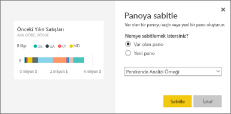

# Soru-Cevap'tan kutucukları panolara sabitleme
## Soru-Cevap'tan kutucuk sabitleme
Soru-Cevap, Power BI'daki özel raporlama aracıdır. Belirli bir öngörüyü bulmanız mı gerekiyor? Verileriniz hakkında soru sorun ve görselleştirme şeklinde yanıt alın.

Bu Nasıl yapılır makalesinde bir panoyu açmak, doğal dil kullanıp soru sorarak görselleştirme oluşturmak ve bu görselleştirmeyi bir panoya sabitlemek için Power BI hizmetini (app.powerbi.com) kullanacağız. Panolar Power BI Desktop'ta kullanılamaz. Soru-Cevap özelliğini diğer Power BI araçları ve içerikleri ile kullanma hakkında bilgi edinmek için bkz. [Power BI Soru-Cevap özelliğine genel bakış](consumer/end-user-q-and-a.md). 

Örneği takip etmek için [Retail Analysis sample panosunu](sample-retail-analysis.md) açın.

1. Raporlardan sabitlenmiş en az bir kutucuk içeren bir [panoyu](consumer/end-user-dashboards.md) açın. Soru sorduğunuzda Power BI, ilgili panoya sabitlenmiş kutucuğa sahip olan veri kümelerinde yanıt arar.  Daha fazla bilgi edinmek için bkz. [Veri alma](service-get-data.md).
2. Panonuzun en üstündeki soru kutusuna verilerinizle ilgili olarak öğrenmek istediklerinizi yazmaya başlayın.  
   
3. Örneğin, "last year sales by month and territory" (aya ve bölgeye göre geçen yılın satışları)...  
   

   yazdığınızda soru kutusunda öneriler görüntülenir.
4. Grafiği panonuza kutucuk olarak eklemek için tuvalin sağ üst kısmında bulunan raptiye  simgesini seçin. Sizinle paylaşılmış olan panolara herhangi bir görselleştirme sabitleyemezsiniz.

5. Kutucuğu, mevcut bir panoya veya yeni bir panoya sabitleyin.

   

   * Var olan pano: Açılan listeden panonun adını seçin. Seçimleriniz, geçerli çalışma alanındaki panolarla sınırlı olacaktır.
   * Yeni pano: Yeni panonun adını yazarak geçerli çalışma alanınıza eklenmesini sağlayabilirsiniz.

6. **Sabitle**'yi seçin.

   Sağ üst köşeye yakın bir noktada çıkan bir başarı iletisi, görselleştirmenin bir kutucuk olarak panonuza eklendiğini bildirir.  

   
7. Yeni kutucuğu görmek için **Panoya git**'i seçin. Ardından panonuzda [kutucuğu yeniden adlandırabilir, yeniden boyutlandırabilir, köprü ekleyebilir, kutucuğu yeniden konumlandırabilir ve daha pek çok şey yapabilirsiniz](service-dashboard-edit-tile.md).

   

## Önemli noktalar ve sorun giderme
* Soru yazmaya başladığınızda Soru-Cevap özelliği, geçerli panoyla ilişkilendirilmiş olan tüm veri kümelerinden en iyi yanıtı bulmak üzere arama yapmaya başlar.  "Geçerli pano", üst gezinti bölmesinde listelenen panodur. Örneğin, bu soru, **mihart** çalışma alanının bir parçası olan **Retail Analysis Sample** panosunda sorulmaktadır.

  
* **Soru-Cevap hangi veri kümelerinin kullanılacağına nasıl karar veriyor**?  Soru-Cevap özelliği, ilgili panoya sabitlenmiş en az bir görselleştirmeye sahip olan tüm veri kümelerine erişim sahibidir.

* **Soru kutusunu göremiyor musunuz**? Power BI yöneticinizle iletişime geçin. Yönetici Soru-Cevap özelliğini devre dışı bırakabilir.

## Sonraki adımlar
[Kutucukla ilgili yeniden adlandırma, yeniden boyutlandırma, köprü ekleme, yeniden konumlandırma ve diğer işlemleri gerçekleştirme](service-dashboard-edit-tile.md)    
[Pano kutucuğunuzu Odak modunda görüntüleme](consumer/end-user-focus.md)     
[Power BI'daki Soru-Cevap özelliği](consumer/end-user-q-and-a.md)  
Başka bir sorunuz mu var? [Power BI Topluluğu'na başvurun](https://community.powerbi.com/)
