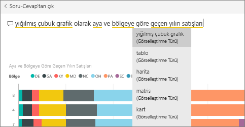
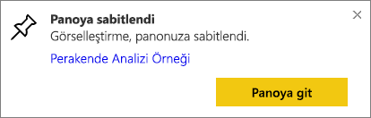
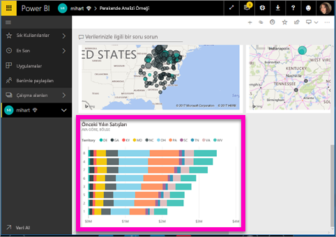
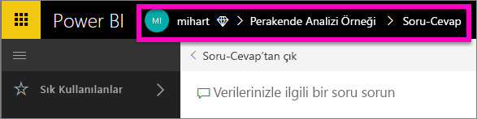

# Soru-Cevap'tan kutucukları panolara sabitleme
## Soru-Cevap'tan kutucuk sabitleme
Soru-Cevap, Power BI'daki özel raporlama aracıdır. Belirli bir öngörüyü bulmanız mı gerekiyor? Verileriniz hakkında soru sorun ve görselleştirme şeklinde yanıt alın.

> **NOT**: Örneği takip etmek için [Perakende Analizi örneğini](sample-retail-analysis.md) açın.
> 
> 

1. Raporlardan sabitlenmiş en az bir kutucuk içeren bir [panoyu](service-dashboards.md) açın. Soru sorduğunuzda Power BI, ilgili panoya sabitlenmiş kutucuğa sahip olan veri kümelerinde yanıt arar.  Daha fazla bilgi edinmek için bkz. [Veri alma](service-get-data.md).
2. Panonuzun en üstündeki soru kutusuna verilerinizle ilgili olarak öğrenmek istediklerinizi yazmaya başlayın.  
   
3. Örneğin, "last year sales by month and territory" (aya ve bölgeye göre geçen yılın satışları)...  
   
   
   yazdığınızda soru kutusunda öneriler görüntülenir.
4. Grafiği panonuza kutucuk olarak eklemek için tuvalin sağ üst kısmında bulunan raptiye  simgesini seçin.
5. Kutucuğu, var olan bir panoya veya yeni bir panoya sabitleyin. 
   
   * Var olan pano: Açılan listeden panonun adını seçin. Seçimleriniz, geçerli çalışma alanındaki panolarla sınırlı olacaktır.
   * Yeni pano: Yeni panonun adını yazarak geçerli çalışma alanınıza eklenmesini sağlayabilirsiniz.
6. **Sabitle**'yi seçin.
   
   Sağ üst köşeye yakın bir noktada çıkan bir başarı iletisi, görselleştirmenin bir kutucuk olarak panonuza eklendiğini bildirir.  
   
   
7. Yeni kutucuğu görmek için **Panoya git**'i seçin. Buradan panonuzda [kutucukla ilgili yeniden adlandırma, yeniden boyutlandırma, köprü ekleme, yeniden konumlandırma ve diğer işlemleri](service-dashboard-edit-tile.md) gerçekleştirebilirsiniz. 
   
   

## Önemli noktalar ve sorun giderme
* Soru yazmaya başladığınızda Soru-Cevap özelliği, geçerli panoyla ilişkilendirilmiş olan tüm veri kümelerinden en iyi yanıtı bulmak üzere arama yapmaya başlar.  "Geçerli pano", üst gezinti çubuğunda görünen panodur. Örneğin, bu soru, **mihart** uygulama çalışma alanının bir parçası olan **Retail Analysis Sample** panosunda sorulmaktadır.
  
  
* **Soru-Cevap hangi veri kümelerinin kullanılacağına nasıl karar veriyor**?  Soru-Cevap özelliği, ilgili panoya sabitlenmiş görselleştirmelere sahip olan tüm veri kümelerine erişim sahibidir.

## Sonraki adımlar
[Kutucukla ilgili yeniden adlandırma, yeniden boyutlandırma, köprü ekleme, yeniden konumlandırma ve diğer işlemleri gerçekleştirme](service-dashboard-edit-tile.md)    
[Pano kutucuğunuzu Odak modunda görüntüleme](service-focus-mode.md)     
[Power BI'daki Soru-Cevap özelliği](service-q-and-a.md)  
Başka bir sorunuz mu var? [Power BI Topluluğu'na başvurun](http://community.powerbi.com/)

