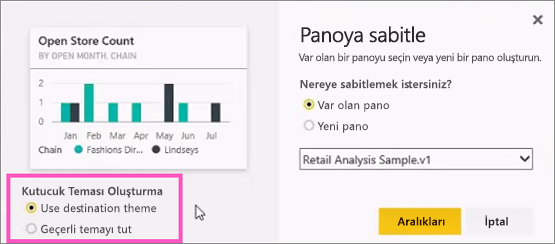
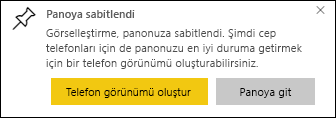

# Raporlardan Power BI panolarına kutucuk sabitleme
## Bir rapordan kutucuk sabitleme
Yeni bir [pano kutucuğu](consumer/end-user-tiles.md) eklemenin yollarından biri, bu işlemi bir [Power BI raporundan](consumer/end-user-reports.md) gerçekleştirmektir. Bir rapordan birçok yeni kutucuk ekleyebilirsiniz.  Tıklandığında, bu kutucukların her biri rapora yönelik bir bağlantı işlevi görür.

Ayrıca, rapor sayfalarının tamamı bir panoya sabitlenebilir.  Bu işlem aynı zamanda *canlı* kutucuk sabitleme olarak da bilinir.  *Canlı* olarak adlandırılmasının nedeni, panodaki kutucukla etkileşime geçebilecek olmanız ve ayrı görselleştirme kutucuklarının aksine, raporda yapılan değişikliklerin panoyla eşitlenmesidir. Aşağıda bununla ilgili daha fazla bilgi edinebilirsiniz.

Sizinle veya Power BI Desktop'tan paylaşılmış olan raporlardan kutucuk sabitleyemezsiniz. 

> **İPUCU**: Bazı görselleştirmelerde arka plan resmi kullanılır. Arka plan resmi çok büyük ise sabitleme işlemi yapılamayabilir.  Resmin boyutunu azaltın veya resmi sıkıştırın.  
> 
> 

## Bir rapordan kutucuk sabitleme
Aşağıdaki videoda Amanda, bir Power BI raporundan görseller ve resimler sabitleyerek bir pano oluşturmaktadır.

<iframe width="560" height="315" src="https://www.youtube.com/embed/lJKgWnvl6bQ" frameborder="0" allowfullscreen></iframe>

Şimdi Power BI örnek raporlarından birini kullanarak kendi panonuzu oluşturun.

1. Sabitlemek istediğiniz görselleştirmenin üzerine gelin ve raptiye  simgesini seçin. Bu işlemin ardından Power BI, **Panoya sabitle** ekranını açar.
   
     
2. Var olan bir panoya mı yoksa yeni bir panoya mı sabitlemek istediğinizi seçin.
   
   * Var olan pano: Açılan listeden panonun adını seçin. Sizinle paylaşılan panolar açılan listede görünmez.
   * Yeni pano: Yeni panonun adını girin.
3. Bazı durumlarda, sabitlediğiniz öğeye önceden bir *tema* uygulanmış olabilir.  Örneğin, bir Excel çalışma kitabından sabitlenen görseller. Bu durumda, kutucuğa uygulanacak temayı seçin.
4. **Sabitle**'yi seçin.
   
   Sağ üst köşeye yakın bir noktada çıkan Başarılı iletisi, görselleştirmenin bir kutucuk olarak panonuza eklendiğini bildirir.
   
   
5. Gezinti bölmesinde, yeni kutucuğu içeren panoyu seçin. Rapora geri gitmek için kutucuğu seçin. Alternatif olarak, [kutucuk görünümünü ve davranışını düzenleyin](service-dashboard-edit-tile.md).

## Bir rapor sayfasının tamamını sabitleme
Başka bir seçenek ise bir rapor sayfasının tamamını bir panoya sabitlemektir. Bu, aynı anda birden fazla görselleştirme sabitlemenin kolay bir yoludur.  Ayrıca, bir sayfanın tamamını sabitlediğinizde kutucuklar *canlıdır*; kutucuklarla doğrudan pano üzerinden etkileşim kurabilirsiniz. Üstelik rapor düzenleyicisinde herhangi bir görselleştirme üzerinde yaptığınız değişiklikler (filtre ekleme veya grafikte kullanılan alanları değiştirme gibi) pano kutucuğu için de geçerli olur.  

Daha fazla bilgi için bkz. [Bir rapor sayfasının tamamını sabitleme](service-dashboard-pin-live-tile-from-report.md)

## Sonraki adımlar
[Power BI'daki panolar](consumer/end-user-dashboards.md)

[Power BI'daki pano kutucukları](consumer/end-user-tiles.md)

[Power BI'daki raporlar](consumer/end-user-reports.md)

[Power BI'da veri yenileme](refresh-data.md)

[Power BI Temel Kavramları](consumer/end-user-basic-concepts.md)

Başka bir sorunuz mu var? [Power BI Topluluğu'na başvurun](http://community.powerbi.com/)

