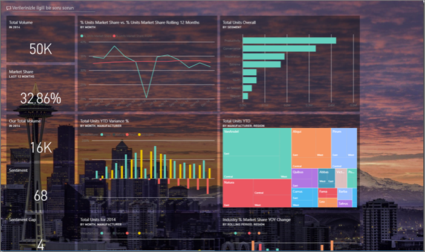
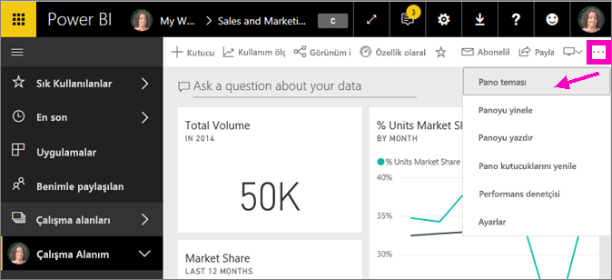
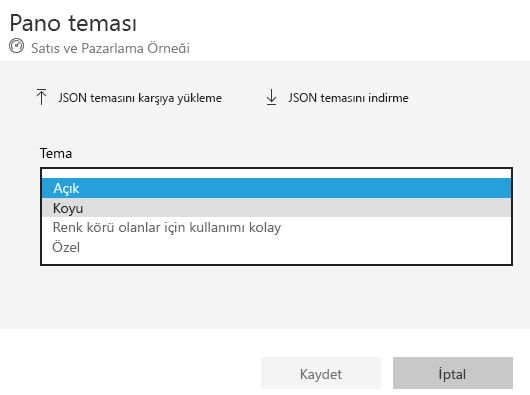
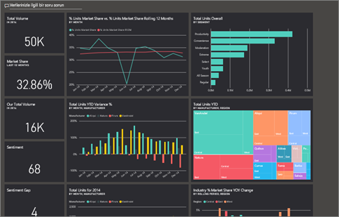
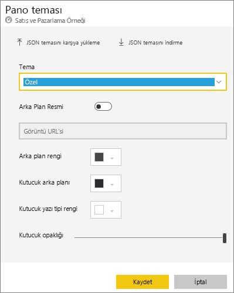
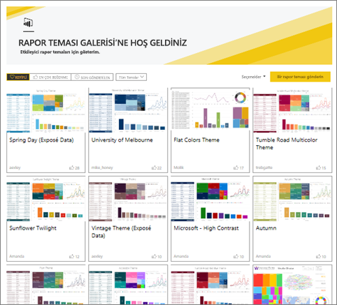
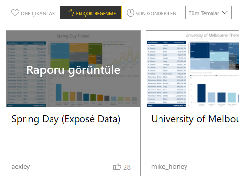
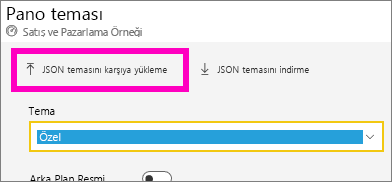
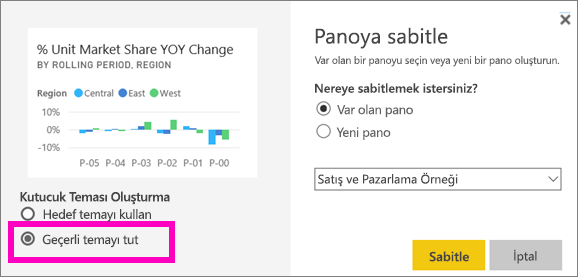
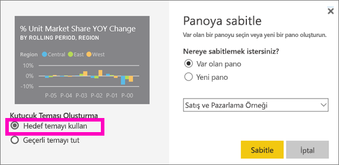

# Power BI hizmetinde Pano Temaları kullanma
**Pano Temaları** ile, bir renk temasını (kurumsal renkler, mevsim renkleri ve uygulamak isteyebileceğiniz diğer renk temaları) panonuzun tamamına uygulayabilirsiniz. Bir **Pano Teması** uyguladığınızda panonuzdaki tüm görsellerde, seçtiğiniz temanın renkleri kullanılır. (Bu makalenin devamında da açıklandığı üzere bazı özel durumlar söz konusudur.)

Panodaki rapor görsellerinin renklerini değiştirmek, rapordaki görselleri etkilemez. Ayrıca, bir raporun [rapor teması uygulanmış](desktop-report-themes.md) kutucuklarını sabitlediğinizde geçerli temayı tutma veya pano temasını kullanma seçeneği sunulur.

## Önkoşullar
* Birlikte ilerleyebilmek için, [Satış ve Pazarlama örneği panosunu](sample-datasets.md) açın.

## Pano Temalarının işleyişi
Başlamak için oluşturduğunuz (veya düzenleme iznine sahip olduğunuz) ve özelleştirmek istediğiniz bir panoyu açın. Üç nokta simgesini (...) ve **Pano teması**’nı seçin. 

Görüntülenen pano bölmesinde önceden oluşturulmuş temalardan birini seçin.  Aşağıdaki örnekte, **Koyu** seçeneğini kullandık.

## Özel tema oluşturma

Power BI panoları için varsayılan tema **Açık**’tır. Renkleri özelleştirmek veya kendi temanızı oluşturmak isterseniz, açılır listeden **Özel**’i seçin. 

Kendi pano temanızı oluşturmak için özel seçenekleri kullanın. Arka plan görüntüsü ekleyecekseniz görüntünüzün en az 1920x1080 çözünürlüğe sahip olması önerilir. Bir görüntüyü arka plan olarak kullanmak için herkese açık bir web sitesine yükleyin, URL'yi kopyalayın ve **Görüntü URL'si** alanına yapıştırın. 

### JSON temaları kullanma
Özel tema oluşturmanın başka bir yolu ise panonuz için kullanmak istediğiniz tüm renklere ilişkin ayarları olan bir JSON dosyasını karşıya yüklemektir. Power BI Desktop'ta rapor oluşturucular, [raporlar için tema oluşturmak](desktop-report-themes.md) üzere JSON dosyalarını kullanır. Aynı JSON dosyaları panolar için karşıya yüklenebilir veya JSON dosyalarını Power BI Topluluğu’ndaki [Tema galeri sayfasından](https://community.powerbi.com/t5/Themes-Gallery/bd-p/ThemesGallery) karşıya yükleyebilirsiniz 

Ayrıca, özel temanızı bir JSON dosyası olarak kaydedebilir ve sonra diğer pano oluşturucuları ile paylaşabilirsiniz. 

### Tema Galerisinden tema kullanma

Yerleşik ve özel seçeneklerde olduğu gibi, tema karşıya yüklendiğinde renkler panodaki tüm kutucuklara otomatik olarak uygulanır. 

1. Bir temanın üzerine gelin ve **Raporu görüntüle**’yi seçin.

    

2. Sayfayı aşağı kaydırın ve JSON dosyasının bağlantısını bulun.  İndirme simgesini seçin ve dosyayı kaydedin.

    

3. Power BI hizmetine geri dönerek Özel Pano tema penceresinden **JSON temasını karşıya yükle**’yi seçin.

    

4. Kayıtlı JSON tema dosyasını kaydettiğiniz konuma gidip **Aç**’ı seçin.

5. Pano teması sayfasında **Kaydet**’i seçin. Yeni tema panonuza uygulanır.

    

## Önemli noktalar ve sınırlamalar

* Raporunuzda panodan farklı bir tema kullanılıyorsa görselin geçerli temayı mı yoksa farklı kaynaklardan gelen görsellerde tutarlılığı yakalamak için pano temasını mı kullanacağını belirleyebilirsiniz. Panoya bir kutucuk sabitlerken rapor temasını tutmak için **Geçerli temayı tut**’u seçin. Panodaki görsel, şeffaflık ayarları ile birlikte rapor temasını tutar. 

    **Kutucuk Teması Oluşturma** seçeneklerini yalnızca raporu Power BI Desktop’ta oluşturduysanız, [bir rapor teması eklediyseniz](desktop-report-themes.md) ve sonra raporu Power BI hizmetinde yayımladıysanız görürsünüz. 

    

    Kutucuğu yeniden sabitlemeyi ve **Pano teması kullan**’ı seçmeyi deneyin.

    

* Pano temaları; sabitlenmiş canlı rapor sayfaları, iframe kutucukları, SSRS kutucukları, çalışma kitabı kutucukları ya da görüntülere uygulanamaz.
* Pano temaları, mobil cihazlar üzerinde görüntülenebilir ancak bir pano teması yalnızca Power BI hizmetinde oluşturulabilir. 
* Pano özel temaları yalnızca raporlardan sabitlenmiş kutucuklarla çalışır. 

