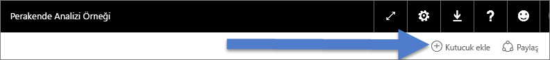
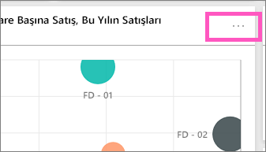
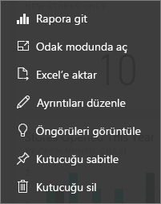
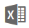

# Power BI'daki pano kutucukları
Panolar ve pano kutucukları Power BI Desktop'ın değil, Power BI hizmetinin sunduğu özelliklerdir. Pano kutucuklarını Power BI Mobil'de oluşturamaz veya sabitleyemezsiniz ancak [görüntüleyip paylaşabilirsiniz](mobile-tiles-in-the-mobile-apps.md). Ayrıca Power BI Mobil'de, [iPhone uygulamanızı kullanarak panonuza resim ekleyebilirsiniz](mobile-iphone-app-get-started.md).

## Pano kutucukları

Kutucuklar, verilerinizin panoya sabitlenmiş anlık görüntüleridir. Bir rapor, veri kümesi ve panonun yanı sıra Soru-Cevap kutusu, Excel, SQL Server Reporting Services (SSRS) ve diğer hizmetlerden kutucuk oluşturabilirsiniz.  Bu ekran görüntüsünde, bir panoya sabitlenmiş birçok farklı kutucuk gösterilmektedir.

Sabitlemenin yanı sıra, [Kutucuk ekle](service-dashboard-add-widget.md) seçeneğini kullanarak doğrudan pano üzerinde ayrı kutucuklar oluşturabilirsiniz. Ayrı kutucuklar arasında metin kutuları, resimler, videolar, akış verileri ve web içeriği bulunur.

Power BI'ın yapı taşlarını anlamak için yardıma mı ihtiyacınız var?  Bkz. [Power BI - Temel Kavramlar](service-basic-concepts.md).

> [!NOTE]
> Kutucuğu oluşturmak için kullanılan özgün görselleştirmenin değişmesi halinde kutucuk değişmez.  Örneğin, bir rapordan çizgi grafik sabitler ve ardından çizgi grafiği çubuk grafik olarak değiştirirseniz pano kutucuğunda bir çizgi grafik gösterilmeye devam eder. Veriler yenilenir ancak görselleştirme türü yenilenmez.
> 
> 

## Kutucukların sabitlenebileceği yerler
Bir panoya kutucuk eklemenin (sabitlemenin) birçok farklı yolu vardır. Kutucukların sabitlenebileceği yerler:

* [Power BI Soru-Cevap](service-dashboard-pin-tile-from-q-and-a.md)
* [bir rapor](service-dashboard-pin-tile-from-report.md)
* [başka bir pano](service-pin-tile-to-another-dashboard.md)
* [OneDrive İş'teki Excel çalışma kitabı](service-dashboard-pin-tile-from-excel.md)
* [Excel için Power BI Publisher](publisher-for-excel.md)
* [Hızlı Öngörüler](service-insights.md)
* [SSRS](https://msdn.microsoft.com/library/mt604784.aspx)

Ayrıca, [Kutucuk ekle](service-dashboard-add-widget.md) seçeneği kullanılarak doğrudan pano üzerinde resimler, metin kutuları, videolar, akış verileri ve web içeriği için ayrı kutucuklar oluşturulabilir.

  

## Bir panodaki kutucuklarla ile etkileşim kurma
### Bir kutucuğu taşıma ve yeniden boyutlandırma
Bir kutucuğu alın ve [panonun farklı yerlerinde taşıyın](service-dashboard-edit-tile.md). Kutucuğu yeniden boyutlandırmak için tutamacın üzerine gelin ve tutamacı  seçin.

### Görünümünü ve davranışını değiştirmek için bir kutucuğun üzerine gelme
1. Üç noktanın görüntülenmesi için kutucuğun üzerine gelin.
   
    
2. Kutucuk eylem menüsünü açmak için üç nokta simgesini seçin.
   
    
   
    Burada yapabilecekleriniz:
   
   * [Bu kutucuğu oluşturmak için kullanılan raporu açma ](service-reports.md)   
   
   * [Bu kutucuğu oluşturmak için kullanılan çalışma sayfasını açma ](service-reports.md)   
     
    * [Odak modunda görüntüleme ](service-focus-mode.md)   
     * [Kutucukta kullanılan verileri dışarı aktarma](visuals/power-bi-visualization-export-data.md) 
     * [Başlığı ve alt başlığı düzenleme, köprü ekleme](service-dashboard-edit-tile.md) 
     * [Öngörüleri çalıştırma ](service-insights.md) 
     * [Kutucuğu başka bir panoya sabitleme ](service-pin-tile-to-another-dashboard.md)
       
     * [Kutucuğunu kaldırma](service-dashboard-edit-tile.md)
     
3. Eylem menüsü kapatmak için tuvalde boş bir alan seçin.

### Bir kutucuğu seçme veya bir kutucuğa tıklama
Bir kutucuğu seçtiğinizde sonraki adım, kutucuğun nasıl oluşturulduğuna ve [özel bağlantı](service-dashboard-edit-tile.md) içerip içermediğine göre değişir. Kutucuk özel bir bağlantı içeriyorsa kutucuğu seçtiğinizde söz konusu bağlantıya yönlendirilirsiniz. Aksi halde, kutucuğu seçtiğinizde, kutucuğu oluşturmak için kullanılan rapora, Excel Online çalışma kitabına, şirket içi SSRS raporuna veya Soru-Cevap sorusuna yönlendirilirsiniz.

> [!NOTE]
> Bu, **Kutucuk ekle** seçeneği kullanılarak doğrudan pano üzerinde oluşturulan video kutucukları için geçerli değildir. Bu şekilde oluşturulmuş bir video kutucuğunun seçilmesi, videonun doğrudan panoda oynatılmasına neden olur.   
> 
> 

## Önemli noktalar ve sorun giderme
* Görselleştirmeyi oluşturmak için kullanılan rapor kaydedilmemişse kutucuk seçildiğinde herhangi bir işlem gerçekleşmez.
* Kutucuk Excel Online'daki bir çalışma kitabından oluşturulduysa ve bu çalışma kitabı için en azından Okuma izinlerine sahip değilseniz kutucuğu seçtiğinizde çalışma kitabı Excel Online'da açılmaz.
* **Kutucuk ekle** seçeneği kullanılarak doğrudan pano üzerinde oluşturulan kutucuklar için özel bir köprü oluşturulduysa başlığı, alt başlığı ve/veya kutucuğu seçtiğinizde söz konusu URL açılır.  Aksi halde, bir resim, web kodu veya metin kutusu için doğrudan panoda oluşturulan bu kutucukları seçtiğinizde varsayılan olarak herhangi bir işlem geçekleşmez.
* SSRS'deki rapor için izniniz yoksa SSRS'den oluşturulmuş bir kutucuğu seçtiğinizde erişiminizin olmadığını belirten bir sayfa (rsAccessDenied) görüntülenir.
* SSRS sunucusunun bulunduğu ağa erişiminiz yoksa SSRS'den oluşturulmuş bir kutucuğu seçtiğinizde sunucunun bulunamadığını belirten bir sayfa (HTTP 404) görüntülenir. Raporu görüntülemek için cihazınızın, rapor sunucusuna ilişkin ağ erişimine sahip olması gerekir.
* Kutucuğu oluşturmak için kullanılan özgün görselleştirmenin değişmesi halinde kutucuk değişmez.  Örneğin, bir rapordan çizgi grafik sabitler ve ardından çizgi grafiği çubuk grafik olarak değiştirirseniz pano kutucuğunda bir çizgi grafik gösterilmeye devam eder. Veriler yenilenir ancak görselleştirme türü yenilenmez.

## Sonraki adımlar
[Panonuz için Kart (büyük sayı kutucuğu) oluşturma](power-bi-visualization-card.md)

[Power BI'daki panolar](service-dashboards.md)  

[Veri yenileme](refresh-data.md)

[Power BI - Temel Kavramlar](service-basic-concepts.md)

[Bir kutucuğu PowerPoint'e aktarma](http://blogs.msdn.com/b/powerbidev/archive/2015/09/28/integrating-power-bi-tiles-into-office-documents.aspx)

[Reporting Services öğelerini Power BI panolarına sabitleme](https://msdn.microsoft.com/library/mt604784.aspx)

Başka bir sorunuz mu var? [Power BI Topluluğu'na başvurun](http://community.powerbi.com/)

