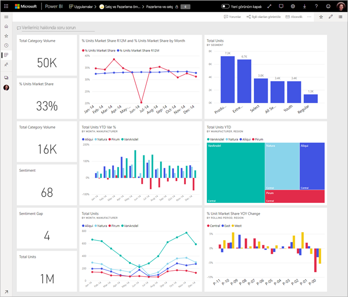

# Harika bir Power BI panosu tasarlamaya ilişkin ipuçları
Panonuzu oluşturup birkaç kutucuk eklediğinizde göre sıra panonuzu güzel göründüğü kadar işlevsel hale getirmeye geldi. Genel olarak yapmanız gereken, en önemli bilgileri öne çıkarıp panoyu temiz ve sade bir hale getirmektir.

> [!TIP]
> Bu panoyu beğendiniz mi? Panoyu ve ilgili raporları AppSource'tan indirebilirsiniz. **Veri al** > **Hizmetler**’e gidin. **Microsoft Örneği - Satış ve Pazarlama** > **Şimdi edinin**’i arayın.

Panolar için aşağıda birkaç ipucu verilmiştir.

## Pano tasarımı en iyi deneyimleri videosu

SQLBI.com sitesinden Marco Russo’nun tasarım ipuçları için [Dashboard design best practices in Power BI](https://www.youtube.com/watch?v=-tdkUYrzrio) (Power BI’da pano tasarımı en iyi deneyimleri) adlı bu videoyu izleyin.

## Hedef kitlenizi değerlendirin
Okuyucuların karar almasına yardımcı olacak ana ölçümler neler? Pano nasıl kullanılacak? Tasarım sırasında yapılacak seçimleri etkileyebilecek öğrenilen veya kültürel varsayımlar neler? Hedef kitlenizin başarılı olmasını sağlayacak bilgiler hangileri?

Panoların genel bir bakış sunan, verilerin geçerli durumunun izlenebileceği merkezler olduğunu unutmayın. Pano, raporları ve veri kümelerini temel alır ve bu öğeler genellikle bir sürü ayrıntı içerir. Okuyucularınız panonuzdaki raporların detayına gidebilir. Bu nedenle, okuyucularınızın gerçekten izlemesi gerekmeyen ayrıntıları panoya eklemeyin.

Pano nerede görüntülenecek? Büyük bir monitörde görüntülenecek panolara daha fazla içerik ekleyebilirsiniz. Ancak okuyucular bu panoyu tabletlerinde görüntülüyorsa, daha az kutucuk içeren bir pano daha okunaklı olacaktır.

## Tek ekranda hikaye anlatın
Panoların amacı önemli bilgileri bir bakışta sunmak olduğundan tüm kutucukları tek bir ekrana sığdırmak en iyisidir. Panonuzda kaydırma çubuğu kullanılmasını önleyebilir misiniz?

Panonuz çok mu kalabalık?  Kolay okunup yorumlanan temel bilgiler dışındakileri kaldırın.

## Tam ekran modunu kullanın
Bir panoyu sunarken, dikkat dağıtıcı unsurlar olmadan [tam ekran modunda](consumer/end-user-focus.md) görüntüleyin.

## En önemli bilgileri vurgulayın
Panonuzdaki tüm metinler ve görselleştirmeler aynı boyutta olursa kullanıcılarınız önemli olan bilgilere odaklanma konusunda sorun yaşayabilir. Örneğin, kart görselleştirmeleri, önemli sayıları belirgin bir şekilde görüntülemenin iyi bir yoludur:  

Ancak bağlam sunduğunuzdan emin olun.  

[Yalnızca sayı içeren bir kutucuk oluşturma](visuals/power-bi-visualization-card.md) hakkında bilgi edinin.

## En önemli bilgileri yerleştirin
Çoğu kişi yukarıdan aşağıya doğru okur. Bu nedenle, en yüksek veri düzeyini sol üst köşeye yerleştirin ve hedef kitlenizin okuma yönüne göre (soldan sağa, yukarıdan aşağıya) verileri ayrıntılandırın.

## Veriler için doğru görselleştirmeyi kullanın
Görselleştirmeleri yalnızca farklı görselleştirmeler sergilemiş olmak için kullanmaktan sakının.  Görselleştirmelerin bir resim çizmesi ve hem "okunması" hem de yorumlanması kolay olmalıdır.  Bazı veriler ve görselleştirmeler için basit bir grafik yeterli olacaktır. Ancak bazı veriler için daha karmaşık görselleştirmeler gerekebilir. Okuyucuya yardımcı olmak için başlıklara, etiketlere ve diğer özelleştirmelere yer vermeyi unutmayın.  

* 3B grafikler gibi görünümü güzel olmasına rağmen okunması zor olan görselleri kullanırken dikkatli olun. 
* Pasta grafikleri, halka grafikler, ölçekler ve diğer dairesel grafik türlerinin veri görselleştirme alanındaki en iyi deneyimlerden olmadığını öğrenmek sizde hayal kırıklığına neden olabilir. Pasta grafikleri, sekizden az kategori bulunuyorsa idealdir. İnsanlar yan yana karşılaştıramadıkları için pasta grafiğindeki değerleri karşılaştırmak çubuk ve sütun grafiklerdekinden daha zordur. Pasta grafikleri, parçaları karşılaştırmak yerine parçalarla bütün arasındaki ilişkiyi görmek için kullanılabilir. Ölçek grafikleri, bir hedef bağlamında geçerli durumu görüntülemek için idealdir.
* Eksenlerdeki grafik ölçekleri, grafik boyut sıralamaları ve grafiklerdeki boyut değerlerinde kullanılan renkler konusunda tutarlı olun.
* Nicel verileri doğru şekilde kodladığınızdan emin olun. Sayıları gösterirken üç veya dört rakamı geçmeyin. Ölçüleri ondalık ayırıcının sol tarafında bir veya iki rakam olacak şekilde görüntüleyin ve bin veya milyon değerlerini kısaltın (3.400.000 yerine 3,4 milyon gibi).
* Duyarlık ve zaman düzeylerini bir arada kullanmayın. Zaman dilimlerinin iyi anlaşıldığından emin olun. Yılın belirli bir ayındaki verileri gösteren filtrelenmiş grafiklerin yanına önceki ayın verilerini içeren bir grafik yerleştirmeyin.
* Aynı ölçek (çizgi veya çubuk grafik gibi) üzerinde büyük ve küçük ölçüleri birlikte kullanmayın. Örneğin, bir ölçeğin milyon, diğerinin ise bin seviyesinde olmaması gerekir. Bu büyüklükteki bir ölçekte bin seviyesindeki ölçüde gözlemlenen farkları algılamak zor olacaktır. Bir arada görmeniz gerekiyorsa ikinci bir eksen kullanımına izin veren bir görselleştirme seçin.
* Gerekli olmayan veri etiketleriyle grafiklerinizi karmaşık hale getirmeyin. Çubuk grafiklerdeki değerler, genellikle gerçek sayı görüntülenmeden de anlaşılabilir.
* [Grafiklerin sıralanma şekline](consumer/end-user-change-sort.md) dikkat edin. En yüksek veya en düşük sayıya dikkat çekmek istiyorsanız ölçüye göre sıralayın. Okuyucuların birden fazla kategori arasından belirli bir kategoriyi hemen bulmasını istiyorsanız eksene göre sıralayın.  

Görselleştirmelere özgü bilgiler için bkz. [Power BI'daki görselleştirme türleri](visuals/power-bi-visualization-types-for-reports-and-q-and-a.md).  

## Pano tasarımı hakkında daha fazla bilgi edinin
Pano tasarımı konusunda uzmanlaşmak için bağlam içinde eyleme dönüştürülebilecek bilgileri net bir şekilde vermeyi ve temel Gestalt görsel algı ilkelerini öğrenin. Neyse ki bu konuda genel kullanıma açık ve blog gönderilerimizde de yer verdiğimiz birçok kaynak mevcut. Favori kitaplarımızdan bazıları:

* *Information Dashboard Design* (Bilgi Panosu Tasarımı), Stephen Few  
* *Show Me the Numbers* (Bana Sayıları Göster), Stephen Few  
* *Now You See It* (Şimdi Görüyorsunuz), Stephen Few  
* *Envisioning Information* (Bilgileri Görselleştirme), Edward Tufte  
* *Advanced Presentations* (Gelişmiş Sunumlar), Andrew Abela   

## Sonraki adımlar
[Rapordan pano oluşturma](service-dashboard-create.md)  
[Power BI hizmetinde tasarımcılar için temel kavramlar](service-basic-concepts.md)  
Başka bir sorunuz mu var? [Power BI Topluluğu'na başvurun](https://community.powerbi.com/)
