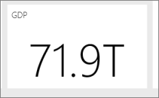

# Harika bir Power BI panosu tasarlamaya ilişkin ipuçları
Panonuzu oluşturup birkaç kutucuk eklediğinizde göre sıra panonuzu güzel göründüğü kadar işlevsel hale getirmeye geldi. Genel olarak yapmanız gereken, en önemli bilgileri öne çıkarıp panoyu temiz ve sade bir hale getirmektir.

Burada birkaç ipucu verilmiştir.

> [!TIP]
> Bunların çoğu raporlara ilişkin tasarım ilkeleridir ancak panolar için de geçerlidir.  [Raporlar ve görselleştirmeler için en iyi tasarım ilkeleri](visuals/power-bi-visualization-best-practices.md) teknik incelememizi okuyun.
>
>

## [Dashboard Makeover (Panoları Baştan Yaratma) web seminerini](https://info.microsoft.com/CO-PowerBI-WBNR-FY16-05May-12-Dashboard-Makeover-Registration.html) izleyin
Microsoft Program Yöneticisi Sorumlusu ve Power BI pano uzmanı olarak görev yapan Marc Reguera'nın [pano görünümü değiştirme işlemleri gerçekleştirmesini](https://info.microsoft.com/CO-PowerBI-WBNR-FY16-05May-12-Dashboard-Makeover-Registration.html) izleyin.

## Hedef kitlenizi değerlendirin
Okuyucuların karar almasına yardımcı olacak ana ölçümler neler? Pano nasıl kullanılacak? Tasarım sırasında yapılacak seçimleri etkileyebilecek öğrenilen veya kültürel varsayımlar neler? Hedef kitlenizin başarılı olmasını sağlayacak bilgiler hangileri?

Panoların genel bir bakış sunan, verilerin geçerli durumunun izlenebileceği merkezler olduğunu unutmayın. Pano, önemli ölçüde ayrıntıya sahip olabilen raporları ve veri kümelerini temel alır. Okuyucularınız panonuzdaki raporların detayına gidebilir. Bu nedenle, okuyucularınızın gerçekten izlemesi gerekmeyen ayrıntıları panoya eklememeniz gerekir.

Pano nerede görüntülenecek? Büyük bir monitörde görüntülenecek panolara daha fazla içerik ekleyebilirsiniz. Okuyucular panoyu tablette görüntüleyecekse daha az sayıda kutucuk daha okunabilir olacaktır.

## Bir hikaye anlatın ve tek bir ekranla sınırlı tutun
Panoların amacı önemli bilgileri bir bakışta sunmak olduğundan tüm kutucukları tek bir ekrana sığdırmak en iyisidir. Panonuzda kaydırma çubuğu kullanılmasını önleyebilir misiniz?

Panonuz çok mu kalabalık?  Kolay okunup yorumlanacak temel bilgiler dışındakileri kaldırın.

## Tam ekran modunu kullanın
Panonuzu [tam ekran](consumer/end-user-focus.md) modunda, dikkati dağıtacak öğeler olmadan görüntüleyin.

## En önemli bilgiler için en büyük boyutları kullanın
Panonuzdaki tüm metinler ve görselleştirmeler aynı boyutta olursa kullanıcılarınız önemli olan bilgilere odaklanma konusunda sorun yaşayabilir. Örneğin, kart görselleştirmeleri, önemli sayıları belirgin bir şekilde görüntülemenin iyi bir yoludur:  

Ancak bağlam sunduğunuzdan emin olun.  

[Yalnızca sayı içeren bir kutucuk oluşturma](visuals/power-bi-visualization-card.md) hakkında bilgi edinin.

## En önemli bilgileri üst köşeye yerleştirin
Çoğu kişi içeriği yukarıdan aşağıya doğru okuduğu için en yüksek ayrıntıya sahip olan öğeyi en üste yerleştirin ve hedef kitlenizin okuma yönüne göre (soldan sağa, sağdan sola) verileri ayrıntılandırın.

## Verilere uygun görselleştirmeleri kullanın ve okunaklı olacak şekilde biçimlendirin.
Görselleştirmeleri yalnızca farklı görselleştirmeler sergilemiş olmak için kullanmaktan sakının.  Görselleştirmelerin bir resim çizmesi ve hem "okunması" hem de yorumlanması kolay olmalıdır.  Bazı veriler ve görselleştirmeler için basit bir grafik yeterli olacaktır. Ancak bazı veriler için daha karmaşık görselleştirmeler gerekebilir. Okuyucuya yardımcı olmak için başlıklara, etiketlere ve diğer özelleştirmelere yer vermeyi unutmayın.  

* [Uygun veri görselleştirmeleri seçin](https://www.youtube.com/watch?v=-tdkUYrzrio). 3B grafikler gibi gerçeği çarpıtan grafikleri kullanmaktan kaçının. İnsan beyninin dairesel şekilleri yorumlamakta zorlandığını unutmayın. Pasta grafikleri, halka grafikler, ölçekler ve diğer dairesel grafik türleri güzel görünebilir ancak veri görselleştirme alanındaki en iyi uygulamalardan değildir.
* Eksenlerdeki grafik ölçekleri, grafik boyut sıralamaları ve grafiklerdeki boyut değerlerinde kullanılan renkler konusunda tutarlı olun.
* Nicel verileri doğru şekilde kodladığınızdan emin olun. Sayıları gösterirken üç veya dört rakamı geçmeyin. Ölçüleri ondalık ayırıcının sol tarafında bir veya iki rakam olacak şekilde görüntüleyin ve bin veya milyon değerlerini kısaltın (3.400.000 yerine 3,4 milyon gibi).
* Duyarlık ve zaman düzeylerini bir arada kullanmayın. Zaman dilimlerinin iyi anlaşıldığından emin olun.  Yılın belirli bir ayındaki verileri gösteren filtrelenmiş grafiklerin yanına önceki ayın verilerini içeren bir grafik yerleştirmeyin.
* Aynı ölçek (çizgi veya çubuk grafik gibi) üzerinde büyük ve küçük ölçüleri birlikte kullanmayın.  Örneğin, bir ölçeğin milyon, diğerinin ise bin seviyesinde olmaması gerekir.  Bu büyüklükteki bir ölçekte bin seviyesindeki ölçüde gözlemlenen farkları algılamak zor olacaktır.  Bir arada görmeniz gerekiyorsa ikinci bir eksen kullanımına izin veren bir görselleştirme seçin.
* Gerekli olmayan veri etiketleriyle grafiklerinizi karmaşık hale getirmeyin. Çubuk grafiklerdeki değerler, genellikle gerçek sayı görüntülenmeden de anlaşılabilir.
* [Grafiklerin sıralanma şekline](consumer/end-user-change-sort.md) dikkat edin.  En yüksek veya en düşük sayıya dikkat çekmek istiyorsanız ölçüye göre sıralayın.  Okuyucuların birden fazla kategori arasından belirli bir kategoriyi hemen bulabilmesini istiyorsanız eksene göre sıralayın.  
* Pasta grafikleri, sekizden az kategori bulunuyorsa idealdir. Yan yana göremediğiniz için pasta grafiğindeki değerleri karşılaştırmak çubuk grafiklerdeki ve sütun grafiklerindeki değerlere kıyasla daha zordur. Pasta grafikleri, parçaları karşılaştırmak yerine parçalarla bütün arasındaki ilişkiyi görmek için kullanılabilir. Ölçek grafikleri, bir hedef bağlamında geçerli durumu görüntülemek için idealdir.

Görselleştirmelere özgü bilgiler için bkz. [Power BI'daki görselleştirme türleri](visuals/power-bi-visualization-types-for-reports-and-q-and-a.md).  

## Pano Tasarımındaki En İyi Uygulamalar Hakkında Daha Fazla Bilgi Edinin
Pano tasarımı konusunda uzmanlaşmak için bağlam içinde eyleme dönüştürülebilecek bilgileri net bir şekilde vermeyi ve temel Gestalt görsel algı ilkelerini öğrenin. Neyse ki bu konuda genel kullanıma açık ve blog gönderilerimizde de yer verdiğimiz birçok kaynak mevcut. Favori kitaplarımızdan bazıları:

* *Information Dashboard Design* (Bilgi Panosu Tasarımı), Stephen Few  
* *Show Me the Numbers* (Bana Sayıları Göster), Stephen Few  
* *Now You See It* (Şimdi Görüyorsunuz), Stephen Few  
* *Envisioning Information* (Bilgileri Görselleştirme), Edward Tufte  
* *Advanced Presentations* (Gelişmiş Sunumlar), Andrew Abela   

## Sonraki adımlar
[Rapordan pano oluşturma](service-dashboard-create.md)  
[Power BI hizmetinde tasarımcılar için temel kavramlar](service-basic-concepts.md)  
Başka bir sorunuz mu var? [Power BI Topluluğu'na başvurun](http://community.powerbi.com/)
