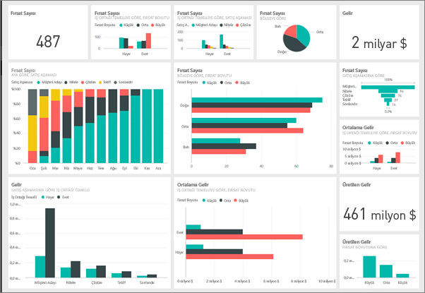
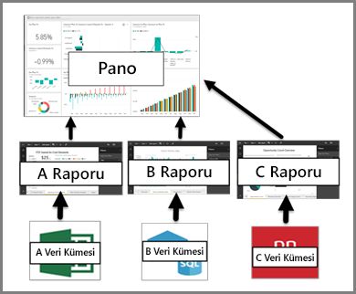

# Power BI hizmetindeki panolar

Power BI ***panosu***, görselleştirmeler kullanarak bir hikaye anlatan ve genellikle tuval olarak adlandırılan tek bir sayfadır. Tek sayfayla sınırlı olduğundan, iyi tasarlanmış bir panoda yalnızca hikayenin en önemli parçaları yer alır.

Panoda gördüğünüz görselleştirmeler, *kutucuk* olarak adlandırılır ve panolara raporlardan *sabitlenir*. Power BI'ı kullanmaya yeni başladıysanız [Power BI temel kavramlarını](service-basic-concepts.md) okuyarak sağlam bir temel oluşturabilirsiniz.

> [!NOTE]
> Panolar Power BI hizmetinin özelliklerinden biridir ve Power BI Desktop ile kullanılamaz. Panolar mobil cihazlarda oluşturulamaz ancak [görüntülenebilir ve paylaşılabilir](mobile-apps-view-dashboard.md).
> 
> 

Panodaki görselleştirmeler raporlardan gelir ve her rapor bir veri kümesini temel alır. Panoları, bağlantılı raporlara ve temel alınan veri kümelerine giriş noktası olarak düşünebilirsiniz. Görselleştirmelerden birini seçtiğinizde bunu oluşturmak için kullanılan rapor (ve veri kümesi) açılır.

## Panoların avantajları
Panolar işlerinizi izlemek, yanıtlar aramak ve en önemli ölçümlerinizi bir bakışta görmek için harikadır. Panolardaki görselleştirmeler, bir veya daha fazla temel alınan veri kümesinden ve bağlantılı rapordan oluşabilir. Bir panoda şirket içi ve bulut kaynaklı veriler bir arada kullanılarak verilerin konumundan bağımsız tümleşik bir görünüm oluşturulabilir.

Panolar yalnızca güzel görünen resimlerden ibaret değildir. Bu nesneler büyük ölçüde etkileşimli ve özelleştirilebilirdir. Ayrıca temel alınan veriler değiştikçe kutucuklar da güncelleştirilir.

## Panolarla raporları karşılaştırma
[Raporlar](service-reports.md) da görselleştirmelerle dolu tuvaller olduklarından genellikle panolarla karıştırılır. Ancak bazı önemli farklılıklar bulunur.

| **Özellik** | **Panolar** | **Raporlar** |
| --- | --- | --- |
| Sayfalar |Bir sayfa |Bir veya daha fazla sayfa |
| Veri kaynakları |Pano başına bir veya daha fazla rapor ve bir veya daha fazla veri kümesi |Rapor başına tek bir veri kümesi |
| Power BI Desktop'ta kullanılabilirlik |Hayır |Evet, Desktop'ta rapor oluşturabilir ve bunları görüntüleyebilirsiniz |
| Sabitleme |Var olan görselleştirmeleri (kutucukları) yalnızca geçerli panodan diğer panolarınıza sabitleyebilirsiniz |Görselleştirmeleri (kutucuklar olarak) herhangi bir panonuza sabitleyebilirsiniz. Rapor sayfalarının tamamını herhangi bir panonuza sabitleyebilirsiniz. |
| Abonelik |Bir panoya abone olamazsınız |Rapor sayfalarına abone olabilirsiniz |
| Filtreleme |Filtreleme veya dilimleme yapamazsınız |Filtreleme, vurgulama ve dilimleme için birçok farklı yol vardır |
| Uyarı ayarlama |Belirli koşullar karşılandığında size e-posta gönderilmesini sağlamak üzere uyarılar oluşturabilirsiniz |Hayır |
| Öne çıkan özelliği |Bir panoyu "öne çıkan" panonuz olarak ayarlayabilirsiniz |Öne çıkan bir rapor oluşturamazsınız |
| Doğal dil sorguları |Panodan kullanılabilir |Raporlardan kullanılamaz |
| Görselleştirme türünü değiştirme |Hayır. Hatta bir rapor sahibi rapordaki görselleştirme türünü değiştirirse panodaki sabitlenen görselleştirme güncelleştirilmez |Evet |
| Temel alınan veri kümesi tablolarını ve alanlarını görme |Hayır. Verileri dışarı aktarabilir ancak tabloları ve alanları panonun kendisinde göremezsiniz. |Evet. Veri kümesi tablolarını, alanlarını ve değerlerini görebilirsiniz. |
| Görselleştirmeler oluşturma |"Kutucuk ekle"yi kullanarak panoya pencere öğeleri eklemekle sınırlıdır |Düzenleme izinleriyle birçok farklı türde görsel oluşturabilir, özel görseller ekleyebilir, görselleri düzenleyebilir ve daha fazlasını yapabilirsiniz |
| Özelleştirme |Görselleştirmelerde (kutucuklarla) taşıma ve düzenleme, yeniden boyutlandırma, bağlantılar ekleme, yeniden adlandırma, silme ve tam ekranda görüntüleme gibi işlemler yapabilirsiniz. Ancak, veriler ve görselleştirmelerin kendisi salt okunurdur. |Okuma görünümü'nde yayımlama, ekleme, filtreleme, dışarı aktarma, .pbix olarak indirme, ilişkili içeriği görüntüleme, QR kodları oluşturma, Excel'de çözümleme ve daha fazla işlemi yapabilirsiniz.  Düzenleme görünümü'nde şu ana kadar bahsedilen her şeyi ve çok daha fazlasını yapabilirsiniz. |

## Pano oluşturucuları ve kullanıcıları
İş rolünüze bağlı olarak, kendi kullanımınız veya iş arkadaşlarınızla paylaşmak için pano oluşturan biri olabilirsiniz. Bu durumda panoları nasıl oluşturacağınızı ve paylaşacağınızı öğrenmek istersiniz. Başkalarının panolar gönderdiği biri de olabilirsiniz. Bu durumda panoları nasıl anlayacağınızı ve raporlarla nasıl etkileşim kuracağınızı öğrenmek istersiniz.

Rolünüze göre, başlamanıza yardımcı olacak bazı konu başlıkları aşağıdadır.

Hem pano paylaşmak hem de paylaşılan bir panoyu görüntülemek için Power BI Pro gerekir.

### Panoları oluşturacak ve paylaşacaksanız
* Örneklerimizden birini kullanarak [rapordan pano oluşturun](service-dashboard-create.md).
* [Pano kutucukları](service-dashboard-tiles.md) ve bunları panoya sabitleme yöntemleri hakkında bilgi edinin.
* [Soru-Cevap doğal dil sorgularıyla iyi çalışan](service-prepare-data-for-q-and-a.md) ve [Hızlı Öngörüler](service-insights-optimize.md) içeren panolar oluşturarak, panolarınızın kullanıcılarına yardımcı olun.
* [Bir panoyu iş arkadaşlarınızla paylaşmak](service-how-to-collaborate-distribute-dashboards-reports.md) için izleyebileceğiniz tüm farklı yolları keşfedin.

### Pano alacak ve kullanacaksanız
* Panoları daha rahat kullanmak için [örnek panolarımızdan](sample-tutorial-connect-to-the-samples.md) birine ilişkin tura katılın.
* [Pano kutucukları](service-dashboard-tiles.md) ve bunlardan birini seçtiğinizde gerçekleşecekler hakkında bilgi edinin.
* Bir panonun görünümünü beğenmediniz mi?  [Kutucukları yeniden boyutlandırabilir, taşıyabilir ve yeniden adlandırabilirsiniz](service-dashboard-edit-tile.md).
* Tek bir pano kutucuğunu izlemek ve belirli bir eşiğe ulaştığında e-posta almak mı istiyorsunuz? [Kutucuklar için uyarılar oluşturun](service-set-data-alerts.md).
* Panolarınıza sorular sormanın keyfini çıkarın. Verileriniz hakkında soru sormak ve görselleştirme şeklinde yanıt almak için [Power BI Soru-Cevap](power-bi-tutorial-q-and-a.md) özelliğini kullanmayı öğrenin.

> [!TIP]
> Aradığınızı burada bulamadıysanız sol taraftaki İçindekiler bölümünü kullanın.
> 
> 

## Sonraki adımlar
[Power BI ile çalışmaya başlama](service-get-started.md)  
[Power BI - Temel Kavramlar](service-basic-concepts.md)  
[Power BI Premium nedir?](service-premium.md)  

Başka bir sorunuz mu var? [Power BI Topluluğu'na sorun](http://community.powerbi.com/)

