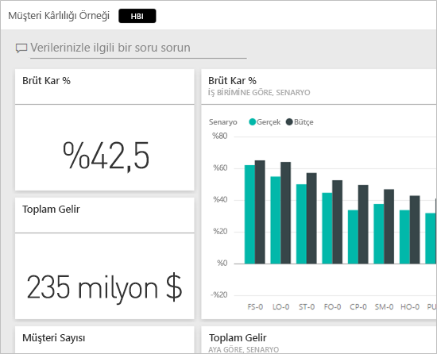
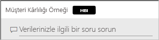
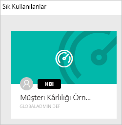
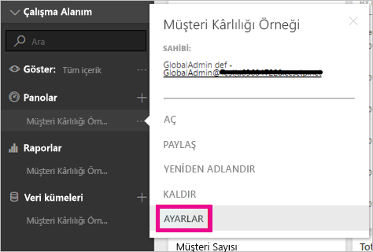
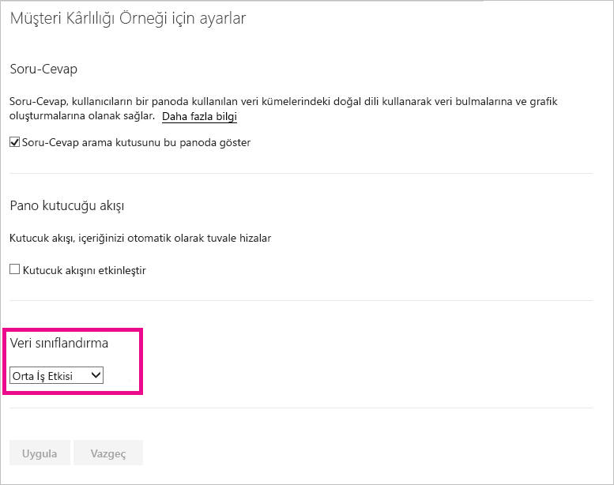
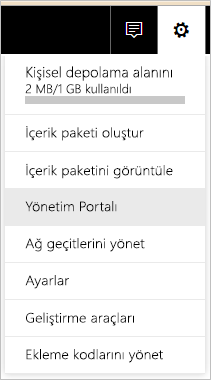
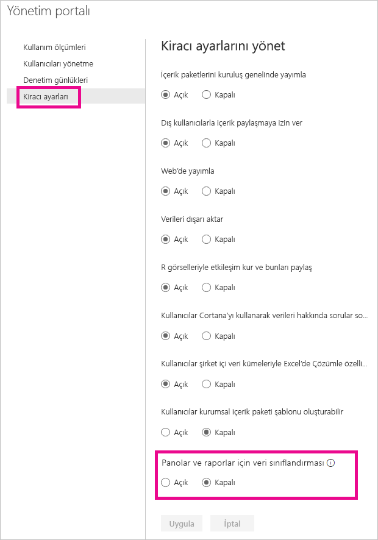
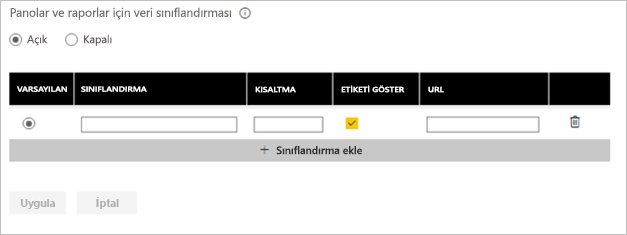
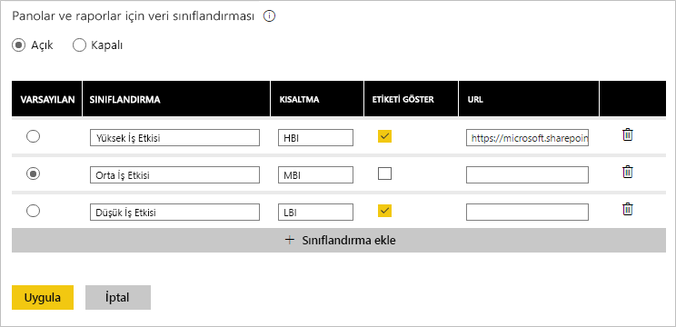

# Pano veri sınıflandırması
Her pano farklıdır. Bağlandığınız veri kaynağına bağlı olarak, sizin ve panoyu paylaştığınız iş arkadaşlarınızın, verilerin gizlilik durumuna göre farklı önlemler alması gerekebilir. Bazı panoların hiçbir zaman şirket dışındaki kişilerle paylaşılmaması veya yazdırılmaması gerekir, bazılarının paylaşılmasında ise bir sakınca yoktur. Pano veri sınıflandırmasını kullanarak, panolarınızı görüntüleyen kişilerin, hangi güvenlik düzeyinin kullanılması gerektiğine dair farkındalığını artırabilirsiniz. Panolarınızı şirketinizin BT departmanı tarafından tanımlanan sınıflandırmalar ile etiketleyebilir ve içeriği görüntüleyen herkesin, verilerin gizliliği konusunda ortak bir bilince sahip olmasını sağlayabilirsiniz.

## Veri sınıflandırma etiketleri
Pano adının yanında görünen veri sınıflandırma etiketleri, panoyu görüntüleyen kişilerin, pano ve içerdiği veriler için uygulanması gereken güvenlik düzeyinin bilincinde olmasına olanak sağlar.

Ayrıca söz konusu etiketler, Sık Kullanılanlar listenizdeki pano kutucuğunun yanında da görünür.

Etiketin üzerine geldiğinizde sınıflandırmanın tam adını görürsünüz.

Yöneticiler, ek bilgi sağlamak amacıyla etiket için bir URL de ayarlayabilir.

> [!NOTE]
> Yöneticiniz tarafından belirlenen sınıflandırma ayarlarına bağlı olarak bazı sınıflandırma türleri, panoda bir etiket olarak gösterilmeyebilir. Bir pano sahibiyseniz pano sınıflandırma türünüzü pano ayarlarından denetleyebilirsiniz.
> 
> 

## Pano sınıflandırmasını ayarlama
Şirketiniz için veri sınıflandırma etkinleştirilmişse başlangıçta tüm panolar varsayılan bir sınıflandırma türüne sahip olur ancak pano sahibi olarak sınıflandırmayı, panolarınızın güvenlik düzeyi ile eşleşecek şekilde değiştirebilirsiniz.

Sınıflandırma türünü değiştirmek için aşağıdaki adımları uygulayın.

1. Pano adının yanındaki **üç nokta** simgesini seçip **Ayarlar** seçeneğini belirleyerek pano ayarlarına gidin.
   
    
2. Pano ayarları bölümünde panonuzun geçerli sınıflandırmasını görebilir ve açılan listeyi kullanarak sınıflandırma türünü değiştirebilirsiniz.
   
    
3. Değiştirme işlemini tamamladıktan sonra **Uygula** düğmesini seçin.

Değişiklik uygulandıktan sonra, panoyu paylaştığınız kişiler panoyu yeniden yüklediğinde güncelleştirmeyi görür.

## Yönetici olarak sınıflandırma etiketleri ile çalışma
Veri sınıflandırma, kuruluşunuzun genel yöneticisi tarafından ayarlanır. Veri sınıflandırmayı etkinleştirmek için aşağıdaki adımları uygulayın.

1. Ayarlar dişli simgesini ve ardından **Yönetici portalı**'nı seçin.
   
    
2. **Kiracı ayarları** sekmesindeki **Panolar ve raporlar için veri sınıflandırma** ayarını *Açık* olarak değiştirin.
   
    

Sınıflandırma etkinleştirildikten sonra, kuruluşunuz için çeşitli sınıflandırmalar oluşturabileceğiniz bir form açılır.

Her sınıflandırmanın panoda görünecek bir **adı** ve **kısaltması** vardır. **Etiketi göster**'i seçerek her sınıflandırma için kısaltma etiketinin panoda görünüp görünmeyeceğini belirleyebilirsiniz. Sınıflandırma türünün panoda gösterilmemesini tercih etmeniz durumunda pano sahibi yine de pano ayarlarını denetleyerek sınıflandırma türünü görebilir. Ayrıca dilerseniz kuruluşunuzun sınıflandırma yönergeleri ve kullanım gereksinimleri ile ilgili daha fazla bilgi içeren bir **URL** de ekleyebilirsiniz.  

Son olarak, varsayılan sınıflandırma türünün hangisi olacağına karar vermeniz gerekir.  

Forma sınıflandırma türlerini girdikten sonra değişiklikleri kaydetmek için **Uygula** düğmesini seçin.

Bu noktada, tüm panolara varsayılan sınıflandırma atanır ve pano sahipleri artık, sınıflandırma türünü içeriklerine uygun bir tür ile güncelleştirebilir. Daha sonra buraya geri dönerek sınıflandırma türü ekleyip kaldırabilir veya varsayılan sınıflandırma türünü değiştirebilirsiniz.  

> [!NOTE]
> Değişiklik yapmak için geri döndüğünüzde hatırlamanız gereken birkaç önemli nokta vardır:
> 
> * Veri sınıflandırmayı devre dışı bırakırsanız etiketlerin hiçbiri anımsanmaz. Daha sonra yeniden etkinleştirmeye karar verirseniz baştan başlamanız gerekir.  
> * Bir sınıflandırma türünü kaldırırsanız, söz konusu sınıflandırma türünün atandığı tüm panolara varsayılan sınıflandırma türü tekrar atanır ve pano sahibi yeni bir tür atayana kadar bu tür geçerli olur.  
> * Varsayılan türü değiştirirseniz pano sahibi tarafından bir sınıflandırma türü atanmamış olan tüm panolara yeni varsayılan tür atanır.
> 
> 

