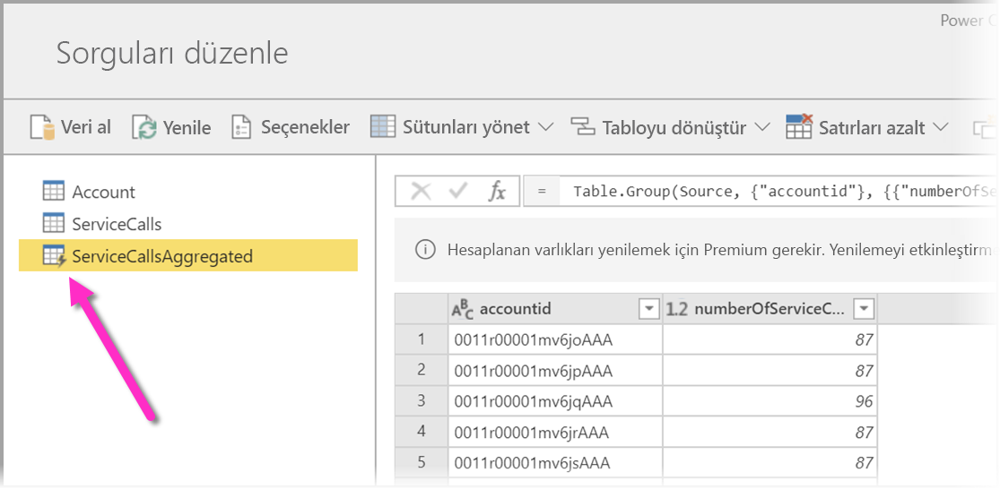
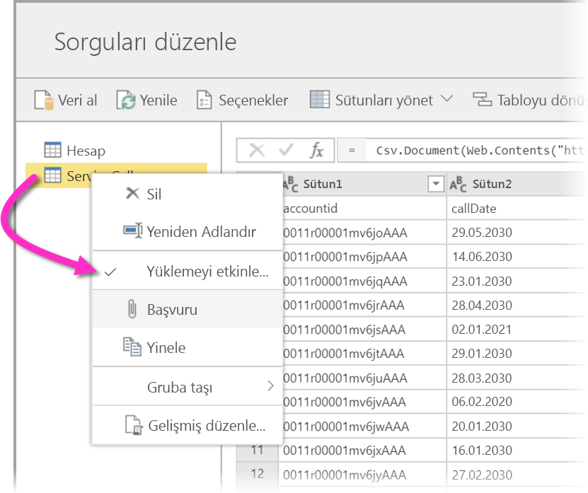
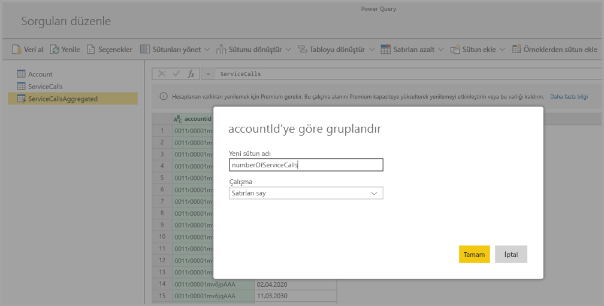
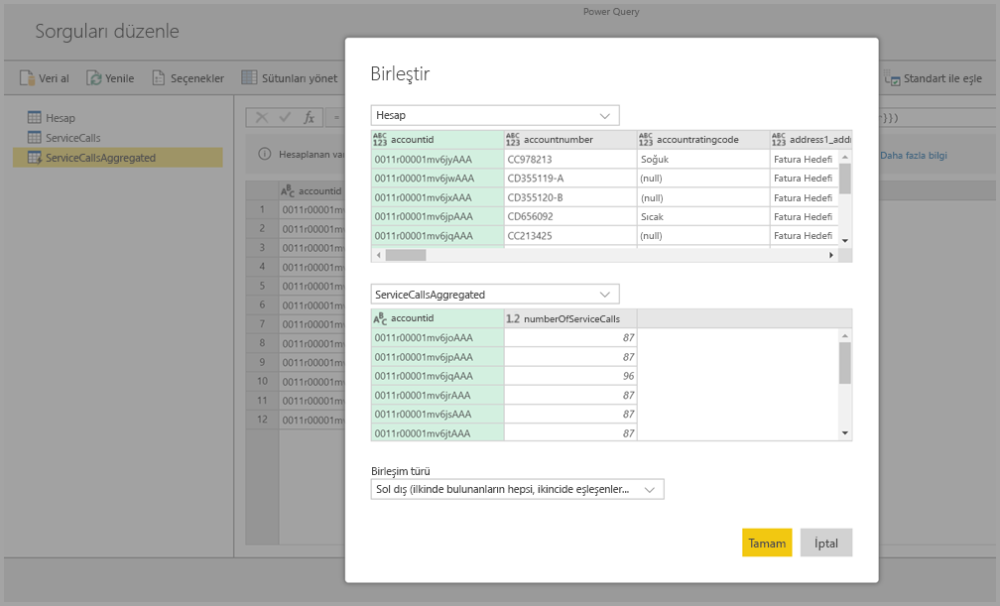
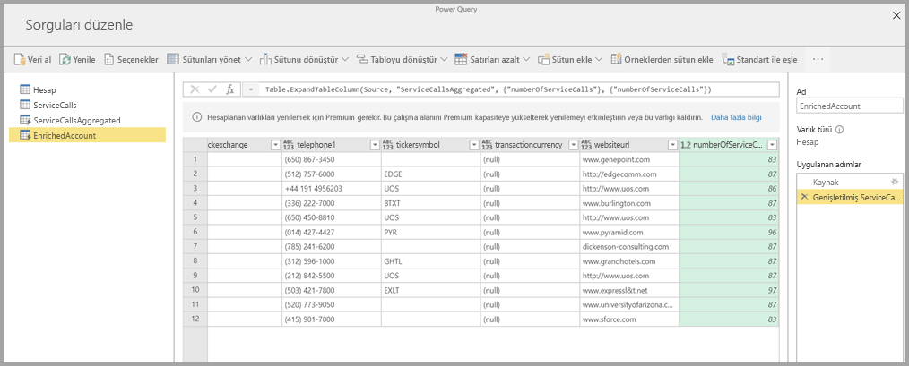

# Power BI Premium’da hesaplanan varlıkları kullanma (Önizleme)

Bir Power BI Premium aboneliği ile **veri akışlarını** kullanırken **depolama içi hesaplamalar** yapabilirsiniz. Bu özellik, mevcut veri akışlarınızda hesaplamalar yapmanıza ve rapor oluşturma ve analizine odaklanmanızı sağlayan sonuçlar döndürmenize olanak sağlar. 

**Depolama içi hesaplamalar** yapmak için ilk olarak veri akışını oluşturmanız ve verileri Power BI veri akışı depolama alanına getirmeniz gerekir. Veri içeren bir veri akışı elde ettikten sonra, depolama içi hesaplamalar yapan varlıklar olan **hesaplanan varlıklar** oluşturabilirsiniz. 

Veri akışı verilerini Power BI'a iki yolla bağlayabilirsiniz:

* [Veri akışının self servis yazma özelliğini kullanarak](service-dataflows-create-use.md)
* Dış veri akışı kullanarak

Aşağıdaki bölümlerde, veri akışı verileriniz üzerinde hesaplanan varlıkların nasıl oluşturulacağı açıklanmaktadır.

> [!NOTE]
> Veri akışları işlevselliği önizleme aşamasındadır ve genel kullanıma sunulmadan önce değiştirilip güncelleştirilebilir.

## Hesaplanan varlık oluşturma 

Varlık listesini içeren bir veri akışı oluşturduktan sonra, bu varlıklar üzerinde hesaplamalar yapabilirsiniz.

Power BI hizmetindeki veri akışı yazma aracında **Varlıkları düzenle**’yi seçin, ardından hesaplanmış varlığınızın temeli olarak kullanmak ve üzerinde hesaplamalar yapmak istediğiniz varlığa sağ tıklayın. Bağlam menüsünde **Başvuru**’yu seçin.

Varlığın hesaplanan varlık olarak kabul edilmesi için, aşağıdaki görüntüde gösterildiği gibi **Yükü etkinleştir** seçiminin işaretlenmesi gerekir. Bu bağlam menüsünü görüntülemek için varlığa sağ tıklayın.

**Yükü etkinleştir**’i seçerek, kaynağı başvurulan varlık olan yeni bir varlık oluşturursunuz. Simge değişir ve aşağıdaki görüntüde gösterildiği gibi **hesaplanan** simgesini gösterir.

Bu yeni oluşturulan varlık üzerinde gerçekleştirdiğiniz tüm dönüşümler, Power BI veri akışı deposunda zaten mevcut olan veriler üzerinde çalıştırılır. Bunun anlamı, sorgunun verilerin içeri aktarıldığı dış veri kaynağına göre çalıştırılmayacağı (örneğin, verilerin çekildiği SQL veritabanı), bunun yerine veri akışı depolama alanında bulunan veriler üzerinde gerçekleştirileceğidir.

### Kullanım örnekleri
Hesaplanan varlıklarla ne tür dönüşümler gerçekleştirilebilir? Depolama içi hesaplama yaparken Power BI’daki dönüşüm kullanıcı arabirimini veya M düzenleyicisini kullanarak genellikle belirttiğiniz tüm dönüşümler desteklenir. 

Şu örneği düşünün: Dynamics 365 aboneliğinizdeki tüm müşteriler için ham verileri içeren bir *Account* varlığınız var. Ayrıca, yılın her gününde farklı hesaptan gerçekleştirilen destek çağrılarının verileri ile birlikte Hizmet Merkezi’nden *ServiceCalls* ham verilerine sahipsiniz.

*Account* varlığını *ServiceCalls* verileri ile zenginleştirmek istediğinizi hayal edin. 

İlk olarak her hesap için önceki yıl içinde yapılan destek aramalarının sayısını hesaplamak için ServiceCalls’dan gelen verileri toplamanız gerekir. 

Sonra, zenginleştirilmiş **Hesap** tablosunu hesaplamak için *Account* varlığını *ServiceCallsAggregated* varlığı ile birleştirmek istersiniz.

Bundan sonra, aşağıdaki görüntüde *EnrichedAccount* olarak gösterilen sonuçları görebilirsiniz.

İşte bu kadar. Dönüşüm kaynak verileriniz üzerinde değil Power BI Premium aboneliğinizde bulunan veri akışındaki veriler üzerinde gerçekleştirilir.

## Önemli noktalar ve sınırlamalar

Çalışma alanını Power BI Premium kapasitesinden çıkarırsanız ilişkili veri akışının da artık yenilenmeyeceği unutulmamalıdır. 

Özellikle bir kuruluşun Azure Data Lake Storage 2. Nesil hesabında oluşturulan veri akışlarıyla çalışırken bağlantılı varlıklar ve hesaplanan varlıklar yalnızca varlıklar aynı depolama hesabında bulunduğunda düzgün şekilde çalışır. Daha fazla bilgi için bkz. [Azure Data Lake Storage 2. Nesil’i veri akışı depolamasına bağlama (Önizleme)](service-dataflows-connect-azure-data-lake-storage-gen2.md).

Ayrıca CDM klasörlerinden oluşturulan veri akışları için bağlantılı varlıklar kullanılamaz. Bkz. [Power BI’a veri akışı olarak bir CDM klasörü ekleme (Önizleme)](service-dataflows-add-cdm-folder.md).

## Sonraki Adımlar

Bu makalede, Power BI hizmetinde kullanılabilen hesaplanan varlıklar ve veri akışları açıklanmıştır. Yararlı olabilecek diğer makalelerden bazıları ise aşağıda verilmiştir.

* [Veri akışları ile self servis veri hazırlığı](service-dataflows-overview.md)
* [Power BI’da veri akışları oluşturma ve kullanma](service-dataflows-create-use.md)
* [Şirket içi veri kaynakları ile veri akışlarını kullanma (Önizleme)](service-dataflows-on-premises-gateways.md)
* [Power BI veri akışları için geliştirici kaynakları (Önizleme)](service-dataflows-developer-resources.md)
* [Çalışma alanı veri akışı ayarlarını yapılandırma (Önizleme)](service-dataflows-configure-workspace-storage-settings.md)
* [Power BI’a veri akışı olarak bir CDM klasörü ekleme (Önizleme)](service-dataflows-add-cdm-folder.md)
* [Azure Data Lake Storage 2. Nesil'i veri akışı depolamasına bağlama (Önizleme)](service-dataflows-connect-azure-data-lake-storage-gen2.md)

Power Query ve zamanlanmış yenileme hakkında daha fazla bilgi için şu makaleleri okuyabilirsiniz:
* [Power BI Desktop'ta sorgulara genel bakış](desktop-query-overview.md)
* [Zamanlanmış yenileme yapılandırma](refresh-scheduled-refresh.md)

Ortak Veri Modeli hakkında daha fazla bilgi için genel bakış makalesini okuyabilirsiniz:
* [Ortak Veri Modeli - genel bakış ](https://docs.microsoft.com/powerapps/common-data-model/overview)

