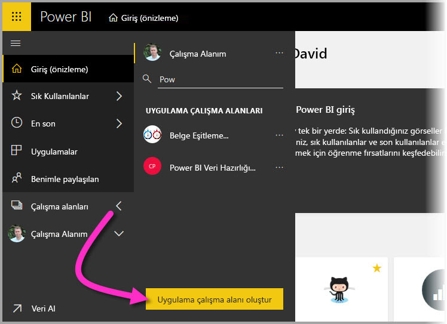
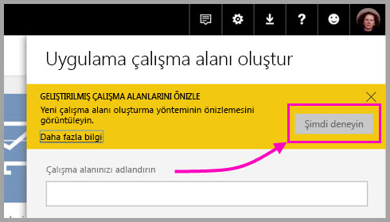
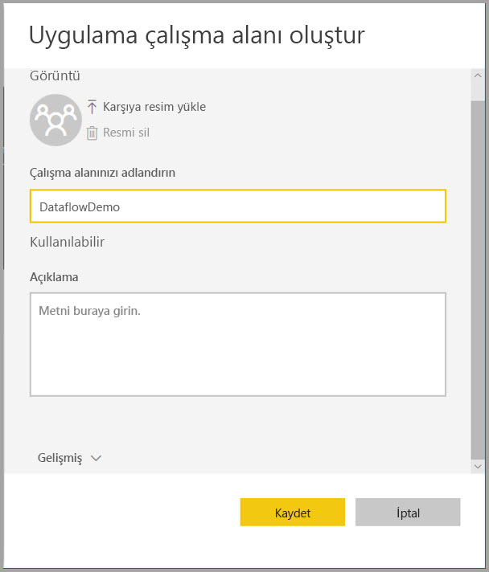
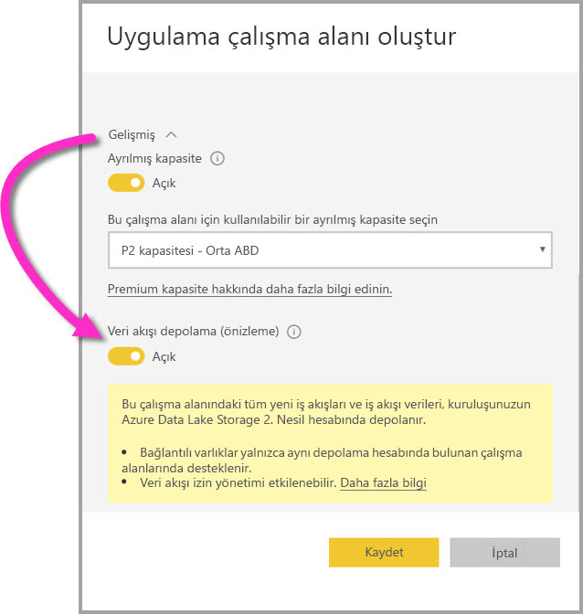
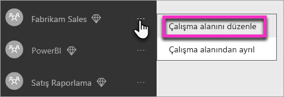
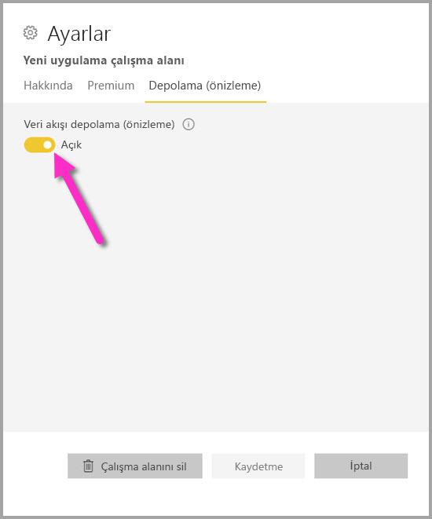
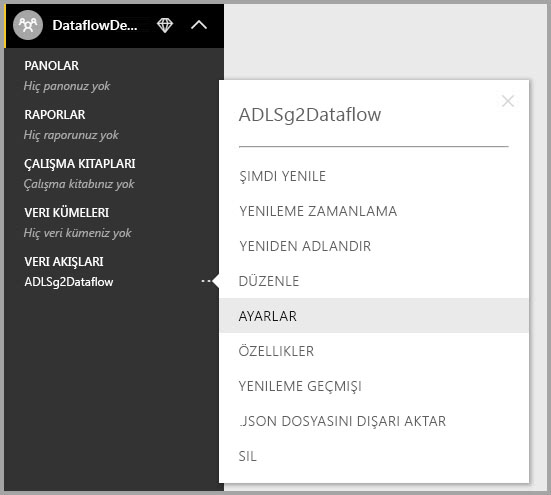
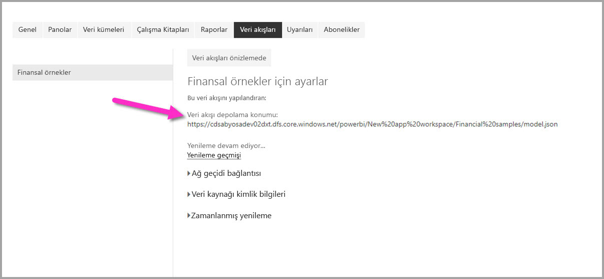

# Çalışma alanı veri akışı ayarlarını yapılandırma (Önizleme)

Power BI ve veri akışları ile, bir çalışma alanının veri akışı tanım dosyasını ve veri dosyalarını Azure Data Lake Storage 2. Nesil hesabınızda depolayabilirsiniz. Çalışma alanı yöneticileri, Power BI’ı bunu yapacak şekilde yapılandırabilir ve bu makalede, gerekli adımlar için size yol gösterilmektedir. 

Bir çalışma alanının veri akışı depolama konumunu yapılandırabilmeniz için önce şirketinizin genel yöneticisinin, kuruluşunuzun depolama hesabını Power BI’a bağlaması ve o depolama hesabına yönelik depolama atama izinlerini etkinleştirmesi gerekir. * [Azure Data Lake Storage 2. Nesil'i veri akışı depolamasına bağlama (Önizleme)](service-dataflows-connect-azure-data-lake-storage-gen2.md) 

Çalışma alanı veri akışı depolama ayarlarını yapılandırmanın iki yolu vardır: 

* Çalışma alanı oluşturma sırasında
* Mevcut bir çalışma alanını düzenleme

Aşağıdaki bölümlerde her birine göz atacağız. 

> [!IMPORTANT]
> Yalnızca çalışma alanı herhangi bir veri akışı içermiyorsa çalışma alanı veri akışı depolama ayarı değiştirilebilir. Bu özellik ayrıca, yalnızca yeni çalışma alanı deneyiminde de mevcuttur. [Power BI’da yeni çalışma alanları (önizleme) oluşturma](service-create-the-new-workspaces.md) makalesinde yeni çalışma alanı hakkında daha fazla bilgi edinebilirsiniz.

## Yeni bir çalışma alanı oluşturma, veri akışı depolamasını yapılandırma

Power BI hizmetinde yeni bir uygulama çalışma alanı oluşturmak için **Çalışma Alanları > Uygulama çalışma alanı oluştur** seçeneğini belirleyin.

Uygulama çalışma alanı oluştur iletişim kutusunda, **Geliştirilmiş çalışma alanlarını önizle** başlıklı sarı bir kutu görüntülenebilir. Bu alanda **Şimdi deneyin**’i seçin.

Görüntülenen iletişim kutusunda yeni çalışma alanınıza benzersiz bir ad verebilirsiniz. Gelişmiş ayarlar yapmanız gerektiğinden henüz **Kaydet**’i seçmeyin.

Daha sonra, **Uygulama çalışma alanı oluştur** iletişim kutusunun **Gelişmiş** alanını genişletin; burada **Veri akışı depolama (önizleme)** ayarını etkinleştirebilirsiniz.

Yeni çalışma alanınızı oluşturmak için **Kaydet**’i seçin. Bu çalışma alanı alanında oluşturulan yeni veri akışları artık tanım dosyasını (Model.json dosyasını) ve verilerini kuruluşunuzun Azure Data Lake Storage 2. Nesil hesabında depolar. 

> [!NOTE]
> Veri akışları işlevselliği önizleme aşamasındadır ve genel kullanıma sunulmadan önce değiştirilip güncelleştirilebilir.

## Mevcut bir çalışma alanı için veri akışı depolamayı güncelleştirme

Yeni bir çalışma alanı oluşturmaya alternatif olarak, tanım dosyasını ve verileri kuruluşunuzun Azure Data Lake Storage 2. Nesil hesabında depolamak için mevcut bir çalışma alanını güncelleştirebilirsiniz. Yalnızca çalışma alanı önceden bir veri akışı içermiyorsa veri akışı depolama ayarının değiştirilebileceğini unutmayın.

Bir uygulama çalışma alanını düzenlemek için üç nokta **(...)** simgesini ve **Çalışma alanını düzenle**’yi seçin. 

Görüntülenen **Çalışma alanını düzenle** penceresinde, **Gelişmiş**’i genişletin ve sonra **Veri akışı depolama (önizleme)** ayarını **Açık** durumuna getirin. 

Daha sonra **Kaydet**’i seçin, böylece o çalışma alanında oluşturulan yeni veri akışları, tanım dosyasını ve verilerini kuruluşunuzun Azure Data Lake Storage 2. Nesil hesabında depolar.

## Depolanan veri akışı dosyalarının URI’sini alma

Kuruluşunuzun Azure Data Lake Storage 2. Nesil hesabına atanan çalışma alanında bir veri akışı oluşturduktan sonra bunun tanım ve veri dosyalarına doğrudan erişebilirsiniz. Konumları **Veri akışı ayarları** sayfasında mevcuttur. Bu sayfaya ulaşmak için şu adımları izleyin:

Çalışma alanında **Veri Akışları** bölümünde listelenen bir veri akışının yanındaki üç nokta **(...)** simgesini seçin. Görüntülenen menüde **Ayarlar**’ı seçin.

Görüntülenen bilgilerde veri akışının CDM klasörü konumu, aşağıdaki görüntüde gösterildiği gibi **Veri Akışı Depolama konumu** altında görüntülenir.

> [!NOTE]
> Power BI, veri akışı dosyalarının depolandığı CDM klasörüne yönelik okuyucu izinleri ile veri akışı sahibini yapılandırır. Diğer kişi veya hizmetlere, veri akışı depolama konumuna erişme izni verilmesi için depolama hesabı sahibinin Azure’da erişim izni vermesi gerekir.

## Önemli noktalar ve sınırlamalar

Veri akışı depolama, Azure Data Lake Storage 2. Nesil’de olduğunda, belirli veri akışı özellikleri desteklenmez: 

Power BI Pro, Premium ve Embedded çalışma alanları:
* **Bağlantılı varlıklar** özelliği yalnızca aynı depolama hesabında bulunan çalışma alanları arasında desteklenir
* Çalışma alanı izinleri, Azure Data Lake Storage 2. Nesil’de depolanan veri akışları için geçerli değildir; yalnızca veri akışının sahibi buna erişebilir.
* Aksi takdirde, tüm veri hazırlığı özellikleri, Power BI depolamada depolanan veri akışları için de aynıdır

Aşağıdaki listede açıklandığı gibi, dikkate alınacak bazı ek unsurlar da vardır:

* Bir veri akışı depolama konumu yapılandırıldıktan sonra değiştirilemez.
* Yalnızca Azure Data Lake Storage 2. Nesil’de depolanan bir veri akışının sahibi onun verilerine erişebilir.
* Power BI Paylaşılan kapasitelerinde şirket içi veri kaynakları, kuruluşunuzun Azure Data Lake Storage 2. Nesil hesabında depolanan veri akışlarında desteklenmez.

**Power BI Desktop** müşterileri, veri akışının sahibi olmadığı sürece, Azure Data Lake Storage 2. Nesil hesabında depolanan veri akışlarına erişemez. Aşağıdaki durumu dikkate alın:

1.  Ayşe yeni bir uygulama çalışma alanı oluşturur ve veri akışları, kuruluşun veri gölünde depolanacak şekilde bu çalışma alanını yapılandırır.
2.  Ayşe’nin oluşturduğu çalışma alanının da üyesi olan Berk, Ayşe’nin oluşturduğu veri akışından veri almak için Power BI Desktop ve veri akışı bağlayıcısını kullanmak ister.
3.  Berk, veri gölünde veri akışının CDM klasörüne yetkili bir kullanıcı olarak eklenmediğinden bir hata alır.

    

## Sonraki adımlar

Bu makalede, veri akışları için çalışma alanı depolamanın nasıl yapılandırılacağına ilişkin yönergeler sağlanmıştır. Ek bilgi için aşağıdaki makalelere göz atın:

Veri akışları, CDM ve Azure Data Lake Storage 2. Nesil hakkında daha fazla bilgi için aşağıdaki makalelere göz atın:

* [Veri akışları ve Azure Data Lake tümleştirmesi (Önizleme)](service-dataflows-azure-data-lake-integration.md)
* [Power BI’a veri akışı olarak bir CDM klasörü ekleme (Önizleme)](service-dataflows-add-cdm-folder.md)
* [Azure Data Lake Storage 2. Nesil'i veri akışı depolamasına bağlama (Önizleme)](service-dataflows-connect-azure-data-lake-storage-gen2.md)

Genel veri akışları hakkında bilgi için şu makalelere göz atın:

* [Power BI’da veri akışları oluşturma ve kullanma](service-dataflows-create-use.md)
* [Power BI Premium’da hesaplanan varlıkları kullanma (Önizleme)](service-dataflows-computed-entities-premium.md)
* [Şirket içi veri kaynakları ile veri akışlarını kullanma (Önizleme)](service-dataflows-on-premises-gateways.md)
* [Power BI veri akışları için geliştirici kaynakları (Önizleme)](service-dataflows-developer-resources.md)

Azure depolama hakkında daha fazla bilgi için şu makaleleri okuyabilirsiniz:

* [Azure Depolama güvenlik kılavuzu](https://docs.microsoft.com/azure/storage/common/storage-security-guide)
* [Azure Veri Hizmetleri’nden github örneklerini kullanmaya başlama](https://aka.ms/cdmadstutorial)

Ortak Veri Modeli hakkında daha fazla bilgi için genel bakış makalesini okuyabilirsiniz:

* [Ortak Veri Modeli - genel bakış ](https://docs.microsoft.com/powerapps/common-data-model/overview)
* [CDM klasörleri](https://go.microsoft.com/fwlink/?linkid=2045304)
* [CDM model dosyası tanımı](https://go.microsoft.com/fwlink/?linkid=2045521)

Ayrıca her zaman [Power BI Topluluğuna soru sormayı](http://community.powerbi.com/) deneyebilirsiniz.
