# Azure Data Lake Storage 2. Nesil'i veri akışı depolamasına bağlama (Önizleme)

Veri akışlarını kuruluşunuzun Azure Data Lake Storage 2. Nesil hesabında depolayacak şekilde depolamak için Power BI çalışma alanlarını yapılandırabilirsiniz. Bu makalede, bunu yapmak için gerekli genel adımlar açıklanmakta ve bu süreçteki en iyi uygulamalar ve yönergeler sağlanmaktadır. Çalışma alanlarını, veri akışı tanımlarını ve veri dosyalarını veri gölünüzde depolayacak şekilde yapılandırmanın bazı avantajları vardır. Bu avantajlardan bazıları şunlardır:

* Azure Data Lake Storage 2. Nesil, veriler için büyük ölçüde ölçeklenebilir depolama olanağı sağlar
* Veri akışı veri ve tanım dosyaları, Azure veri yararlanmak için BT departmanınızın geliştiriciler tarafından yararlanılabilir ve yapay zeka (AI) hizmetlerini gösterildiği şekilde [Azure veri hizmetlerinden GitHub örnekleri](https://aka.ms/cdmadstutorial)
* Geliştiricilerin iç uygulamaları ve iş kolu satır çözümleri, veri akışlarını ve Azure için geliştirici kaynaklarını kullanarak veri akışı verileri tümleştirin, kuruluşunuzdaki sağlar

Veri akışları için Azure Data Lake Storage 2. Nesil’i kullanmak için aşağıdakiler gerekir:

* **Power BI kiracısı**: Azure Active Directory (AAD) kiracınızdaki hesaplardan en az birinin Power BI hizmetine kaydolmuş olması gerekir
* **Genel Yönetici hesabı**: Veri akışı tanımını ve verileri Azure Data Lake Storage 2. Nesil hesabınızda depolamak amacıyla Power BI’a bağlanmak ve Power BI’ı yapılandırmak için bu hesap gerekir
* **Bir Azure aboneliğine** -Azure Data Lake depolama Gen2 kullanmak için bir Azure aboneliği gerekir
* **Kaynak grubu**: Sahip olduğunuz bir kaynak grubunu kullanabilir veya yeni bir tane oluşturabilirsiniz
* **Data Lake depolama Gen2 özelliği etkin olan bir Azure depolama hesabı** 

> [!TIP]
> Azure aboneliğiniz yoksa başlamadan önce [ücretsiz bir hesap](https://azure.microsoft.com/free/) oluşturun.

> [!WARNING]
> Bir veri akışı depolama konumu yapılandırıldıktan sonra değiştirilemez. Bkz: [önemli noktalar ve sınırlamalar](#considerations-and-limitations) dikkate alınması gereken diğer önemli öğeleri için bu makalenin sonlarında bölümü.

## Power BI için Azure Data Lake Storage 2. Nesil hesabınızı hazırlama

Azure Data Lake Storage 2. Nesil hesabıyla Power BI’ı yapılandırabilmeniz için önce bir depolama hesabı oluşturup yapılandırmanız gerekir. Power BI için gereksinimlere göz atalım:

1. Depolama hesabı, Power BI kiracınızla aynı AAD kiracısında oluşturulmalıdır.
2. Depolama hesabı, Power BI kiracınızla aynı bölgede oluşturulmalıdır. Power BI kiracınızın bulunduğu yeri belirlemek için [Power BI kiracım nerede bulunur?](service-admin-where-is-my-tenant-located.md) makalesine bakın.
3. Depolama hesabı için *Hiyerarşik Ad Alanı* özelliği etkinleştirilmiş olmalıdır.
4. Power BI hizmetine, depolama hesabında bir *Okuyucu* rolü verilmelidir.
5. **powerbi** adlı bir Dosya sistemi oluşturulmalıdır.
6. Power BI hizmetleri, oluşturduğunuz **powerbi** dosya sistemi için yetkilendirilmiş olmalıdır.

Aşağıdaki bölümlerde, Azure Data Lake Storage 2. Nesil hesabınızı ayrıntılı şekilde yapılandırmak için gerekli adımlar açıklanmaktadır.

### Depolama hesabı oluşturma

[Azure Data Lake Storage 2. Nesil depolama hesabı oluştur](https://docs.microsoft.com/azure/storage/blobs/data-lake-storage-quickstart-create-account) makalesindeki adımları izleyin.

1. Power BI kiracınızla aynı konumu seçtiğinizden ve depolama alanınızı **StorageV2 (general purpose v2)** olarak ayarladığınızdan emin olun
2. Hiyerarşik ad alanı özelliğini etkinleştirdiğinizden emin olun
3. Çoğaltma ayarının **Read-access geo-redundant storage (RA-GRS)** olarak belirlenmesi önerilir

### Power BI hizmetine okuyucu rolü verme

Daha sonra Power BI hizmetine, oluşturduğunuz depolama hesabında okuyucu rolü vermeniz gerekir. Bu yerleşik bir roldür, bu nedenle adımlar basittir. 

[Yerleşik RBAC rolü atama](https://docs.microsoft.com/azure/storage/common/storage-auth-aad-rbac#assign-a-built-in-rbac-role) adımlarını izleyin.

**Rol ataması ekle** penceresinde, Power BI hizmetine atanacak **Okuyucu** rolünü seçin. Daha sonra **Power BI Hizmeti**’ni arayıp bulup. Aşağıdaki görüntüde, Power BI hizmetine atanan **Okuyucu** rolü gösterilmektedir.

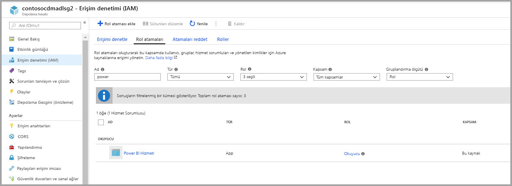

> [!NOTE]
> En az 30 dakika boyunca izin Power BI'a portaldan yayılmasına izin verin. Portalında, izinleri değiştirmek istediğiniz zaman Power BI'da yansıtılması bu izinleri 30 dakika bekleyin. 

### Power BI için bir dosya sistemi oluşturma

Depolama hesabınızın Power BI’a eklenebilmesi için önce *powerbi* adlı bir dosya sistemi oluşturmanız gerekir. Azure Databricks, HDInsight, AZCopy veya Azure Depolama Gezgini kullanımı da dahil olmak üzere, böyle bir dosya sistemi oluşturmanın birçok yolu vardır. Bu bölümde, Azure Depolama Gezgini kullanılarak dosya sistemi oluşturmanın basit bir yolu gösterilmektedir.

Bu adım, Azure Depolama Gezgini sürüm 1.6.2'yi veya üstünü yüklemenizi gerektirir. Windows, Macintosh veya Linux için Azure Depolama Gezgini’ni yükleme ile ilgili bkz. [Azure Depolama Gezgini](https://azure.microsoft.com/features/storage-explorer/).

1. Azure Depolama Gezgini’ni başarıyla yüklemenizin ardından ilk başlatmanızda Microsoft Azure Depolama Gezgini - Bağlan penceresi gösterilir. Depolama Gezgini, depolama hesaplarına bağlanmanın birçok yolunu sağlarken, gerekli kurulum için şu anda yalnızca bir yol desteklenmektedir. 

2. Sol bölmede, yukarıda oluşturduğunuz depolama hesabını bulup genişletin.

3. Blob Kapsayıcıları’na tıklayın ve bağlam menüsünden Blob Kapsayıcısı Oluştur’u seçin.

   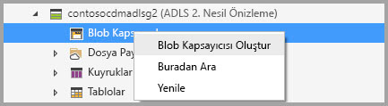

4. Blob Kapsayıcıları klasörünün altında bir metin kutusu görüntülenir. *powerbi* adını girin 

   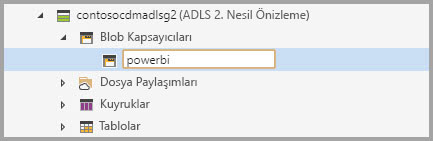

5. Blob kapsayıcısı oluşturma işleminiz bittiğinde Enter tuşuna basın

   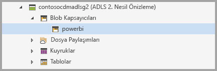

Sonraki bölümde, Power BI hizmet ailesine, oluşturduğunuz dosya sistemi için tam erişim izni verirsiniz. 

### Dosya sistemine Power BI izinleri verme

Dosya sistemine yönelik izin vermek için, Power BI hizmet erişimi veren Erişim Denetimi Listesi (ACL) ayarlarını uygularsınız. Bunun için ilk adım, kiracınızda Power BI hizmetleri kimliğini almaktır. Azure portalının **Kurumsal uygulamalar** bölümünde Azure Active Directory (AAD) uygulamalarınızı görüntüleyebilirsiniz.

Kiracı uygulamalarınızı bulmak için şu adımları izleyin:

1. [Azure portalında](https://portal.azure.com/), sol panelden **Azure Active Directory**’yi seçin.
2. Azure **Active Directory** dikey penceresinde **Kurumsal uygulamalar**’ı seçin.
3. **Uygulama Türü** açılan menüsünden **Tüm Uygulamalar**’ı ve sonra **Uygula**’yı seçin. Aşağıdaki görüntüye benzer şekilde, kiracı uygulamalarınızın bir örneği görüntülenir.

    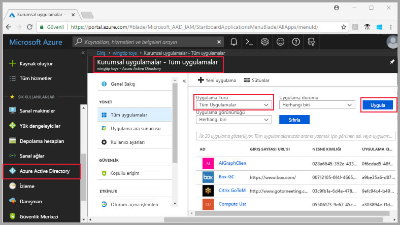

4. Arama çubuğuna *Power* yazın; böylece Power BI ve Power Query uygulamaları için Nesne Kimliklerinin koleksiyonu görüntülenir. Sonraki adımlarda üç değere de ihtiyacınız olacaktır.  

    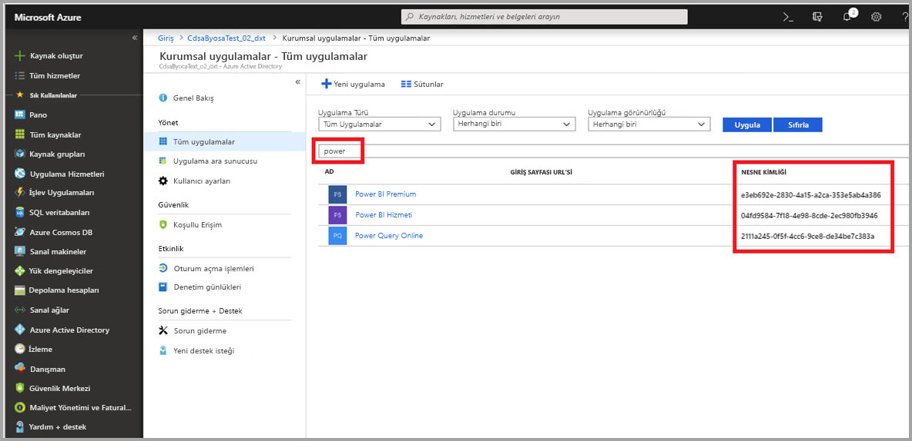

5. Seçin ve iki nesne kimlikleri Power BI hizmetinde ve Power Query çevrimiçi aramanızın sonuçlarını kopyalayın. Sonraki adımlarda bu değerleri yapıştırmaya hazır olun.

7. Daha sonra, önceki bölümde oluşturduğunuz *powerbi* dosya sistemine gitmek için **Azure Depolama Gezgini**’ni kullanın. [Azure Depolama gezginini kullanarak dosya ve dizin düzeyinde izinleri ayarlama](https://docs.microsoft.com/azure/storage/blobs/data-lake-storage-how-to-set-permissions-storage-explorer) makalesinin [Erişimi yönetme](https://docs.microsoft.com/azure/storage/blobs/data-lake-storage-how-to-set-permissions-storage-explorer#managing-access) bölümündeki yönergeleri izleyin.

8. 5. adımda toplanan iki Power BI Nesne Kimliğinin her biri için, *powerbi* dosya sisteminize **Okuma**, **Yazma**, **Yürütme** Erişimini ve Varsayılan ACL’leri atayın.

   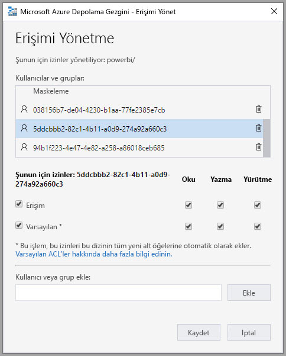

9. Dördüncü adımda toplanan Power Query Çevrimiçi Nesne Kimliği için, *powerbi* dosya sisteminize **Yazma**, **Yürütme** Erişimini ve Varsayılan ACL’leri atayın.

   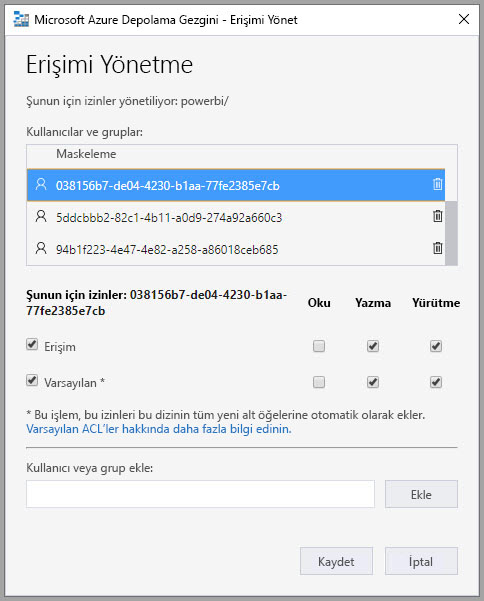

10. Ayrıca **Diğer** için, **Yürütme** Erişimini ve Varsayılan ACL’leri de atayın.

    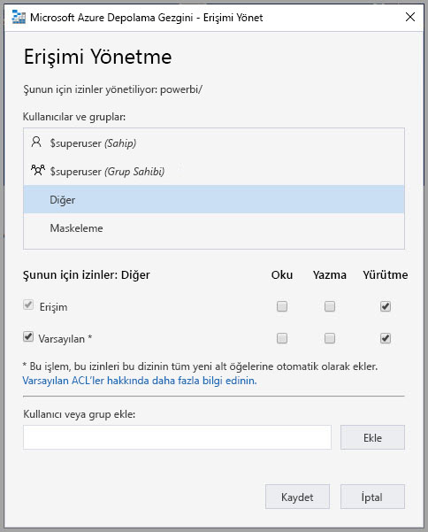

## Azure Data Lake Storage 2. Nesil’inizi Power BI’a bağlama

Azure Data Lake depolama Gen2 hesabınızı Azure portalında ayarladıktan sonra Power BI'da bağlama **Power BI Yönetici portalına**. Ayrıca Power BI veri akışı depolamada yönettiğiniz **veri akışı depolama** Ayarlar bölümünde Power BI yönetici portalının. Başlatma ve temel kullanım ile ilgili yönergeler için [Yönetici portalına ulaşma](service-admin-portal.md) bölümünden ayrıntılı bilgi edinebilirsiniz.

Aşağıdaki adımlarla **Azure Data Lake Storage 2. Nesil** hesabınızın bağlantısını oluşturursunuz:

1. Gidin **veri akışı ayarları** sekmesinde **Power BI Yönetici portalı**

    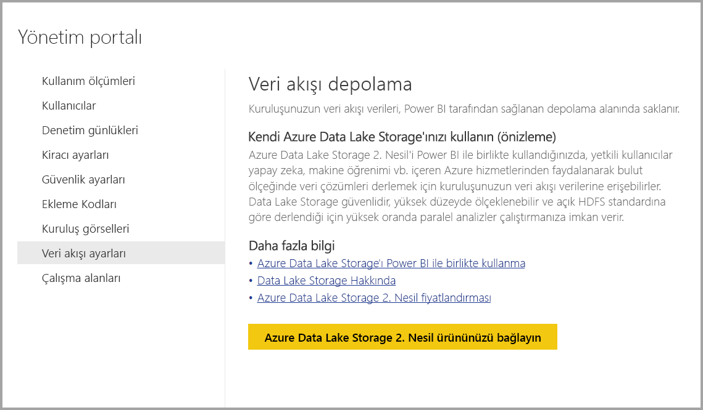 

2. Seçin **, Azure Data Lake depolama Gen2'ye bağlanmak** düğmesi. Aşağıdaki pencere görünür.

    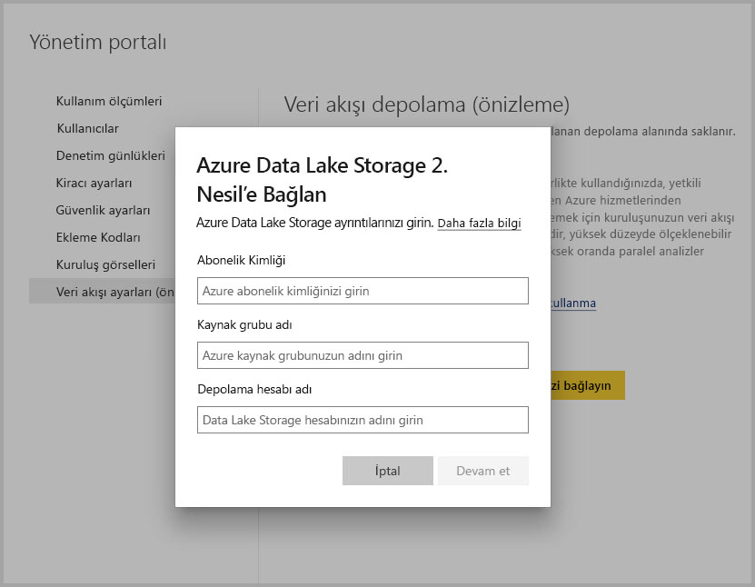 

3. Depolama Hesabının **Abonelik Kimliği**’ni belirtin.
4. İçinde depolama hesabının oluşturulduğu **Kaynak Grubu adını** belirtin.
5. **Depolama Hesabı adını** belirtin.
6. **Bağlan**'ı seçin.

Bu adımlar başarıyla tamamlandıktan sonra Azure Data Lake Storage 2. Nesil hesabınız Power BI’a bağlanır. 

> [!NOTE]
> Power BI yönetim portalında Azure Data Lake Storage 2. Nesil'e bağlantı yapılandırmak için Genel Yönetici izinlerinizin olması gerekir. Öte yandan, Genel Yöneticiler yönetim portalında dış depolamaya bağlanamaz.  

Daha sonra kuruluşunuzdaki kişilerin kendi çalışma alanlarını yapılandırmasını sağlamanız gerekir; böylece bu kişilerin veri akışı tanımı ve veri depolama alanı için bu depolama hesabını kullanmalarına olanak sağlarsınız. Sonraki bölümde bunu yapalım. 

## Yöneticilerin çalışma alanı atamasını sağlama

Varsayılan olarak veri akışı tanımı ve veri dosyaları, Power BI tarafından sağlanan depolama alanında depolanır. Kendi depolama hesabınızdaki veri akışı dosyalarına erişmek için çalışma alanı yöneticilerinin ilk olarak yeni depolama hesabında veri akışlarının atama ve depolamasına izin verecek şekilde çalışma alanını yapılandırması gerekir. Bir çalışma alanı yöneticisinin veri akışı depolama alanı ayarlarını yapılandırabilmesi için önce yöneticiye, **Power BI yönetici portalında** depolama atama izinleri verilmesi gerekir.

Depolama atama izinleri vermek için Git **veri akışı ayarları** sekmesinde **Power BI Yönetici portalına**. *Çalışma alanı yöneticilerinin bu depolama hesabına çalışma alanı atamasına izin ver* radyo düğmesi vardır ve bu düğme **izin ver** olarak ayarlanmalıdır. Kaydırıcıyı etkinleştirdikten sonra, değişikliğin geçerli olması için **Uygula** düğmesini seçin. 

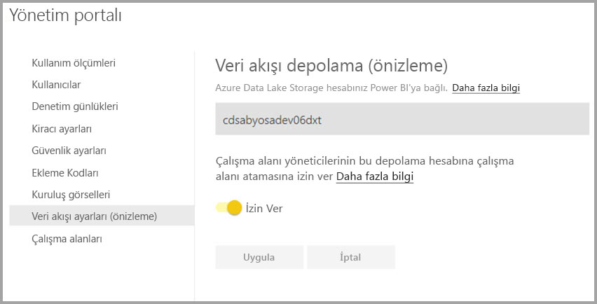 

İşte bu kadar. Power BI çalışma alanı yöneticileri artık oluşturduğunuz dosya sistemine iş akışları atayabilir.

## Önemli noktalar ve sınırlamalar

Bu özellik bir önizleme özelliği olup, sürüm zamanı yaklaştıkça davranışı değişebilir. Veri akışı depolama alanınızla çalışırken dikkat edilmesi gereken bazı önemli noktalar ve sınırlamalar vardır:

* Bir veri akışı depolama konumu yapılandırıldıktan sonra değiştirilemez.
* Yalnızca Azure Data Lake Storage 2. Nesil’de depolanan bir veri akışının sahipleri varsayılan olarak bunun verilerine erişebilir. Azure’da depolanan veri akışları için ek kişileri yetkilendirmek istiyorsanız, veri akışının CDM klasörüne bunları eklemeniz gerekir 
* Bağlantılı varlıklar ile veri akışları oluşturmak yalnızca bu varlıklar aynı depolama hesabında depolandığında mümkündür
* Power BI paylaşılan kapasitelerinde şirket içi veri kaynakları, kuruluşunuzun veri gölünde depolanan veri akışlarında desteklenmez

Bu bölümde açıklandığı gibi bilinen birkaç sorun vardır.

Power BI Desktop müşterileri, veri akışının sahibi olmadığı veya göldeki CDM klasörüne yönelik açıkça yetkilendirilmediği sürece, **Azure Data Lake Storage Hesabında** depolanan veri akışlarına erişemez. Senaryo aşağıdaki gibidir:

1. Ayşe yeni bir uygulama çalışma alanı oluşturdu ve veri akışları, kuruluşun veri gölünde depolanacak şekilde bu çalışma alanını yapılandırdı. 
2. Ayşe’nin oluşturduğu çalışma alanının da üyesi olan Berk, Ayşe’nin oluşturduğu Veri Akışından veri almak için Power BI Desktop ve veri akışı bağlayıcısını kullanmak ister.
3. He lake veri akışı'nın CDM klasörüne yetkilendirilmedi çünkü Ben benzer bir hata alır.

Sık sorulan sorular ve cevaplar arasında şunlar yer alır:

**Soru:** Bir çalışma alanında önceden veri akışları oluşturduysam ve bunların depolama konumunu değiştirmek istiyorsam ne olur?

**Cevap:** Bir veri akışının depolama konumunu oluşturulduktan sonra değiştiremezsiniz. 

**Soru:** Bir çalışma alanının veri akışı depolama konumunu ne zaman değiştirebilirim?

**Cevap:** Yalnızca çalışma alanı herhangi bir veri akışı içermiyorsa bir çalışma alanının veri akışı depolama konumunun değiştirilmesine izin verilir.

## Sonraki adımlar

Bu makalede, veri akışı depolama alanı için bir Azure Data Lake 2. Nesil’e nasıl bağlanılacağına ilişkin yönergeler sağlanmıştır. Ek bilgi için aşağıdaki makalelere göz atın:

Veri akışları, CDM ve Azure Data Lake Storage 2. Nesil hakkında daha fazla bilgi için aşağıdaki makalelere göz atın:

* [Veri akışları ve Azure Data Lake tümleştirmesi (Önizleme)](service-dataflows-azure-data-lake-integration.md)
* [Çalışma alanı veri akışı ayarlarını yapılandırma (Önizleme)](service-dataflows-configure-workspace-storage-settings.md)
* [Power BI’a veri akışı olarak bir CDM klasörü ekleme (Önizleme)](service-dataflows-add-cdm-folder.md)

Genel veri akışları hakkında bilgi için şu makalelere göz atın:

* [Power BI’da veri akışları oluşturma ve kullanma](service-dataflows-create-use.md)
* [Hesaplanan varlıkları üzerinde Power BI Premium kullanma](service-dataflows-computed-entities-premium.md)
* [Şirket içi veri kaynakları ile veri akışlarını kullanma](service-dataflows-on-premises-gateways.md)
* [Power BI veri akışı için geliştirici kaynaklar](service-dataflows-developer-resources.md)

Azure depolama hakkında daha fazla bilgi için şu makaleleri okuyabilirsiniz:
* [Azure Depolama güvenlik kılavuzu](https://docs.microsoft.com/azure/storage/common/storage-security-guide)

Ortak Veri Modeli hakkında daha fazla bilgi için genel bakış makalesini okuyabilirsiniz:
* [Ortak Veri Modeli - genel bakış ](https://docs.microsoft.com/powerapps/common-data-model/overview)
* [CDM klasörleri](https://go.microsoft.com/fwlink/?linkid=2045304)
* [CDM model dosyası tanımı](https://go.microsoft.com/fwlink/?linkid=2045521)

Ayrıca her zaman [Power BI Topluluğuna soru sormayı](http://community.powerbi.com/) deneyebilirsiniz.
