# Power BI'da veri akışlarını oluşturma ve kullanma

**Power BI**'da sağlanan gelişmiş veri hazırlama olanağıyla, veri akışı olarak adlandırılan bir veri koleksiyonu oluşturabilir ve bunu kullanarak çeşitli kaynaklardan iş verilerine bağlanabilir, verileri temizleyebilir, dönüştürebilir ve ardından bu veri akışını Power BI depolama alanına yükleyebilirsiniz.

**Veri akışı**, Power BI hizmetindeki çalışma alanlarında oluşturulan ve yönetilen bir *varlık* koleksiyonudur (varlıklar, tablolara benzer). Veri akışınızda varlıkları ekleyip düzenleyebilir, ayrıca doğrudan veri akışınızı oluşturduğunuz çalışma alanından veri yenileme zamanlamalarını yönetebilirsiniz.

Veri akışını oluşturduktan sonra, **Power BI Desktop**'ı veya **Power BI hizmetini** kullanarak Power BI veri akışlarına yerleştirdiğiniz verileri temel alan veri kümeleri, raporlar, panolar ve uygulamalar oluşturabilir, bu yolla iş etkinliklerinizle ilgili içgörüler kazanabilirsiniz.

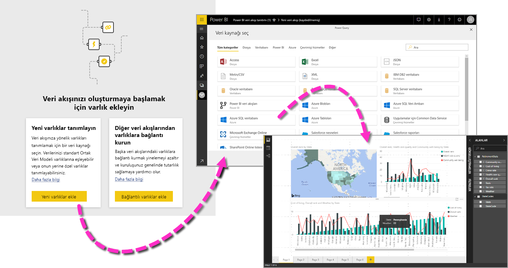

Veri akışını kullanmanın başlıca üç adımı vardır:

1. Bu işlemi rahatça yapacak şekilde tasarlanmış Microsoft araçlarını kullanarak veri akışını yazma
2. Veri akışınıza getirmek istediğiniz verilerin yenileme sıklığını zamanlama
3. Power BI Desktop kullanıp veri akışınızdan yararlanarak veri kümesini oluşturma 

Aşağıdaki bölümlerde, bu adımlardan her birini gözden geçirecek ve her adımı tamamlamak için sağlanan araçları tanıyacağız. Haydi başlayalım.

## Veri akışı oluşturma
Veri akışı oluşturmak için, tarayıcıda Power BI hizmetini başlatın ve ardından aşağıdaki ekranda gösterildiği gibi sol taraftaki gezinti bölmesinden **çalışma alanını** (veri akışları Power BI hizmetindeki *my-workspace* içinde kullanılamaz) seçin. İçinde yeni veri akışı oluşturmak üzere yeni bir çalışma alanı da oluşturabilirsiniz. 

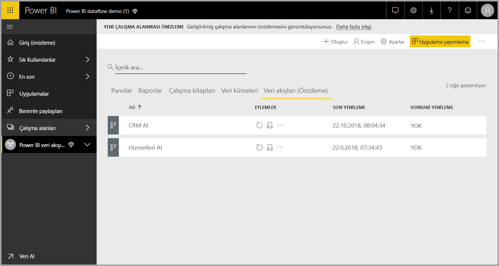

Veri akışı oluşturabileceğiniz bir **çalışma alanındayken**, tuvalin sağ üst kısmında **+ Oluştur** düğmesi görüntülenir. **+ Oluştur** düğmesini seçin ve sonra açılan listeden **Veri Akışı**'nı seçin. 

Her veri akışının *tek bir sahibi* olduğunu ve bu sahibin, veri akışını oluşturan kişi olduğunu bilmeniz önemlidir. Veri akışını yalnızca sahibi düzenleyebilir. Veri akışının oluşturulduğu çalışma alanı üzerinde okuma ve yazma izinleri olan tüm **çalışma alanı** üyeleri, bu makalenin devamında açıklandığı gibi **Power BI Desktop**'ın içinden veri akışına bağlanabilir.

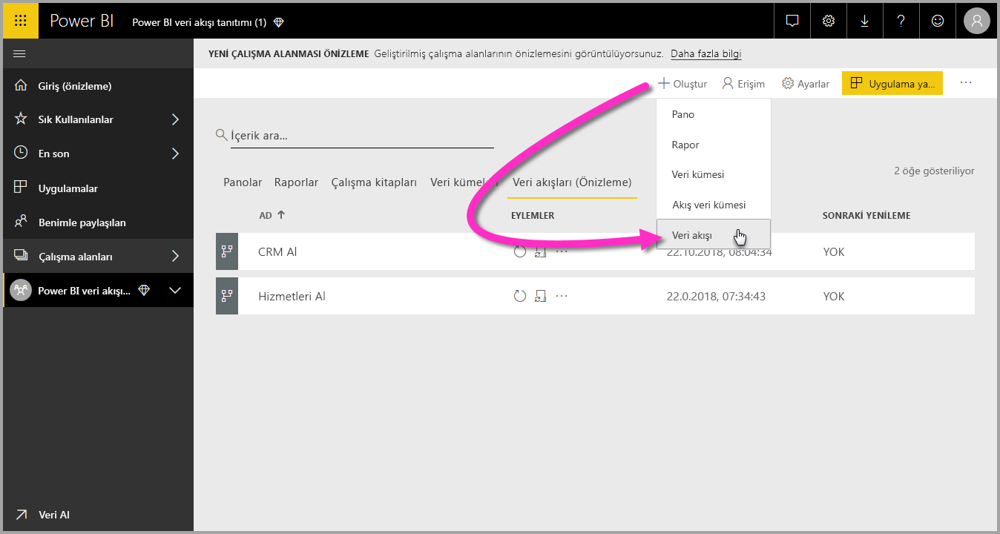

Buradan, sonraki bölümde daha ayrıntılı açıkladığımız **Varlıklar** ekleyebilirsiniz.

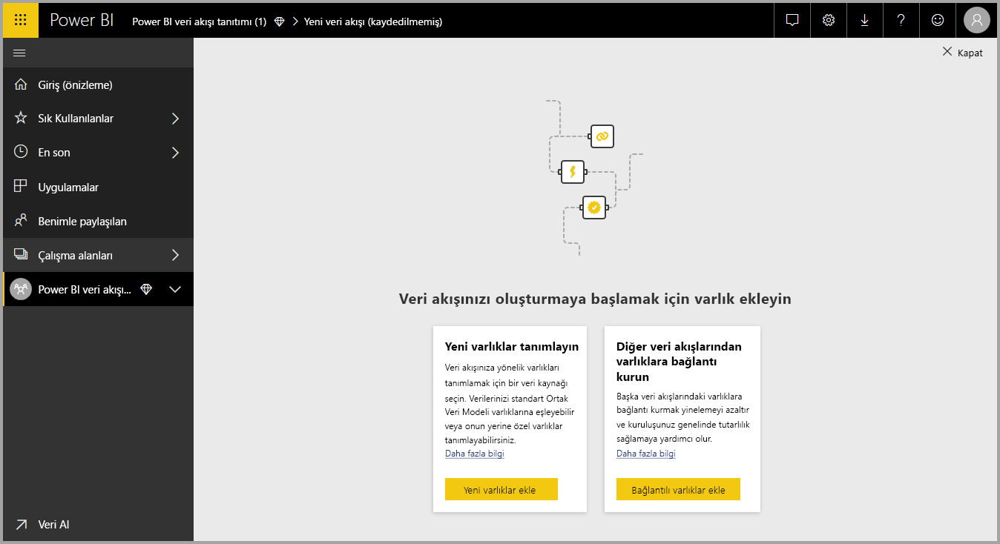

### Varlıkları ekleme

**Varlık**, veritabanlarındaki tablolara çok benzeyen ve verileri depolamak için kullanılan bir alan kümesidir. Aşağıdaki resimde, Power BI'a veri alabileceğiniz veri kaynaklarından bazıları gösterilmiştir.

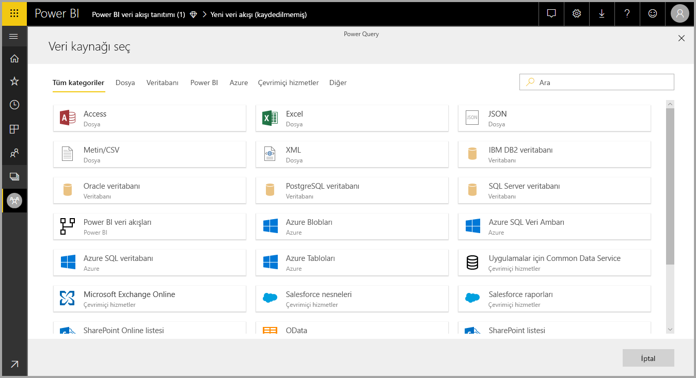

Veri kaynağı seçtiğinizde, aşağıdaki resimde gösterildiği gibi veri kaynağına bağlanırken kullanılacak hesap da dahil olmak üzere bağlantı ayarlarını sağlamanız istenir.

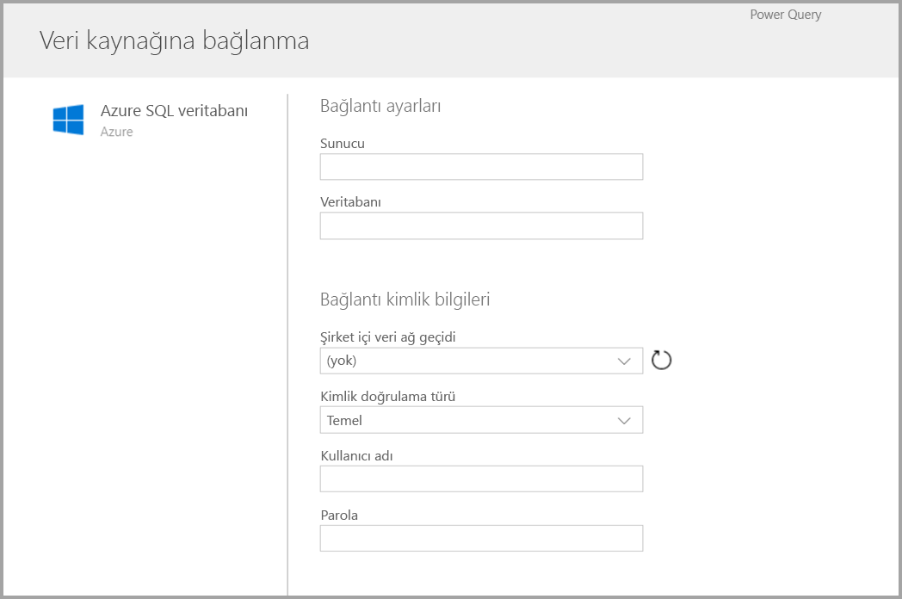

Bağlantı kurulduktan sonra, varlığınız için hangi verilerin kullanılacağını seçebilirsiniz. Veriler ve kaynak seçildikten sonra, Power BI veri akışınızdaki verileri yenilenmiş durumda tutmak için veri kaynağına art arda yeniden bağlanır. Bu bağlanmaların sıklığını bu kurulum işleminin sonraki adımlarında siz seçersiniz.

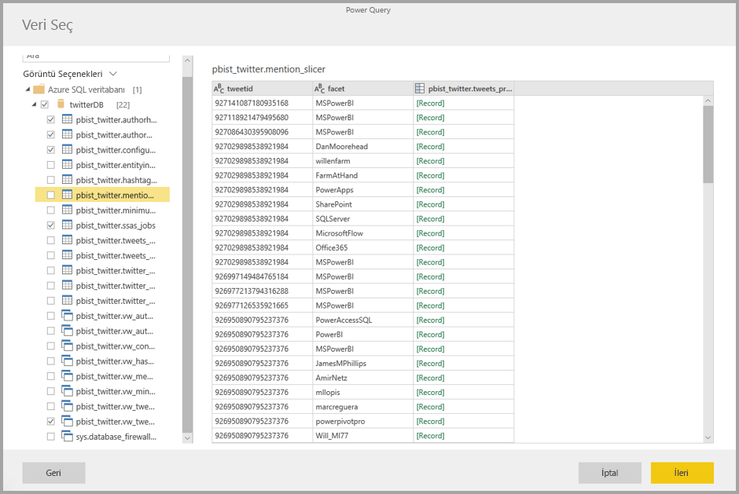

Varlıkta kullanılacak verileri seçtikten sonra, veri akışı düzenleyicisini kullanarak bu verileri veri akışınızda kullanılırken gereken biçime getirebilir veya dönüştürebilirsiniz.

### Veri akışı düzenleyicisini kullanma

Veri kaynağınızdan varlığınız için kullanılacak verileri seçtikten sonra, veri seçiminizi varlığınız için en uygun biçimde şekillendirebilirsiniz. Bunun için, **Power BI Desktop**'taki **Power Query Düzenleyicisi**'ne benzeyen Power Query düzenleme deneyimini kullanırsınız. Power BI Desktop için [Sorguya genel bakış](desktop-query-overview.md) makalesinde, Power Query hakkında daha fazla bilgi edinebilirsiniz (Power Query, Power BI Desktop'a Power Query Düzenleyicisi olarak eklenmiştir). 

Sorgu Düzenleyicisi'nin her adımda oluşturduğu kodu görmek veya kendi şekillendirme kodunuzu oluşturmak isterseniz **Gelişmiş Düzenleyici**'yi kullanabilirsiniz. 

### Veri akışları ve Ortak Veri Modeli (CDM)

Veri akışı varlıkları, iş verilerinizi Common Data Model ile (Microsoft’un standartlaştırılmış şeması) kolayca eşlemenizi, bunu Microsoft ve üçüncü taraf verileriyle zenginleştirmenizi, makine öğrenmesine basitleştirilmiş erişim elde etmenizi sağlayan yeni araçlar içerir. İş verilerinize zeka ve eyleme dönüştürülebilir içgörüler getirmek için bu yeni özelliklerden yararlanılabilir. Sorguları Düzenleme adımındaki tüm dönüştürmeleri tamamladıktan sonra, veri kaynağı tablolarınızdaki sütunları Common Data Model ile de tanımlanan standart varlık alanlarına eşleyebilirsiniz. Standart varlıkların ortak veri modeliyle tanımlanan, bilinen bir şeması vardır.

[Ortak Veri Modeli nedir?](https://docs.microsoft.com/powerapps/common-data-model/overview) makalesinde, bu yaklaşım hakkında ve Ortak Veri Modeli hakkında daha fazla bilgi bulabilirsiniz.

Veri akışınızla Ortak Veri Modeli'nden yararlanmak için, **Sorguları Düzenle** iletişim kutusunda **Standart ile Eşle**'ye tıklayın. Görüntülenen **Varlıkları Eşle** ekranında, eşlemek istediğiniz standart varlığı seçebilirsiniz.

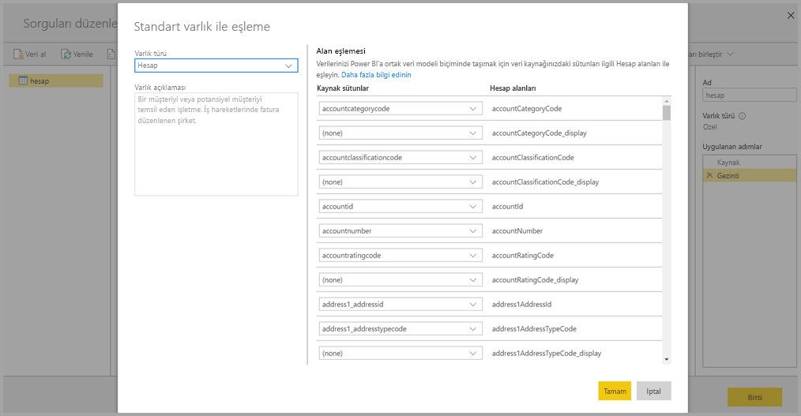

Kaynak sütunu standart alana eşlediğinizde aşağıdakiler gerçekleşir:

1. Kaynak sütun standart alanın adını alır (adlar farklıysa sütun yeniden adlandırılır)
2. Kaynak sütun standart alanın veri türünü alır

Ortak Veri Modeli standart varlığını korumak için, eşlenmeyen tüm standart alanlar *Null* değeri alır.

Eşlemenin sonucunda özel alanlar içeren bir standart varlık elde etmeyi güvence altına almak için, eşlenmeyen tüm kaynak sütunlar olduğu gibi kalır.

Seçimlerinizi tamamladıktan sonra, varlığınız ile onun veri ayarları kaydedilmeye hazır olduğunda menüden **Kaydet**’i seçebilirsiniz. **Varlık ekle** düğmesini seçerek birden çok varlık oluşturabileceğinizi ve oluşturduğunuz sorgularla varlıkları geliştirmek için varlıkları düzenleyebileceğinizi unutmayın.

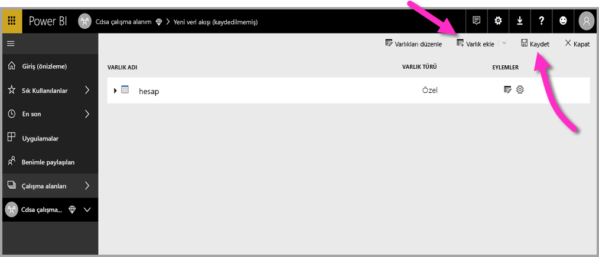

**Kaydet**'i seçtiğinizde, veri akışınızı adlandırmanız ve bir açıklama sağlamanız istenir.

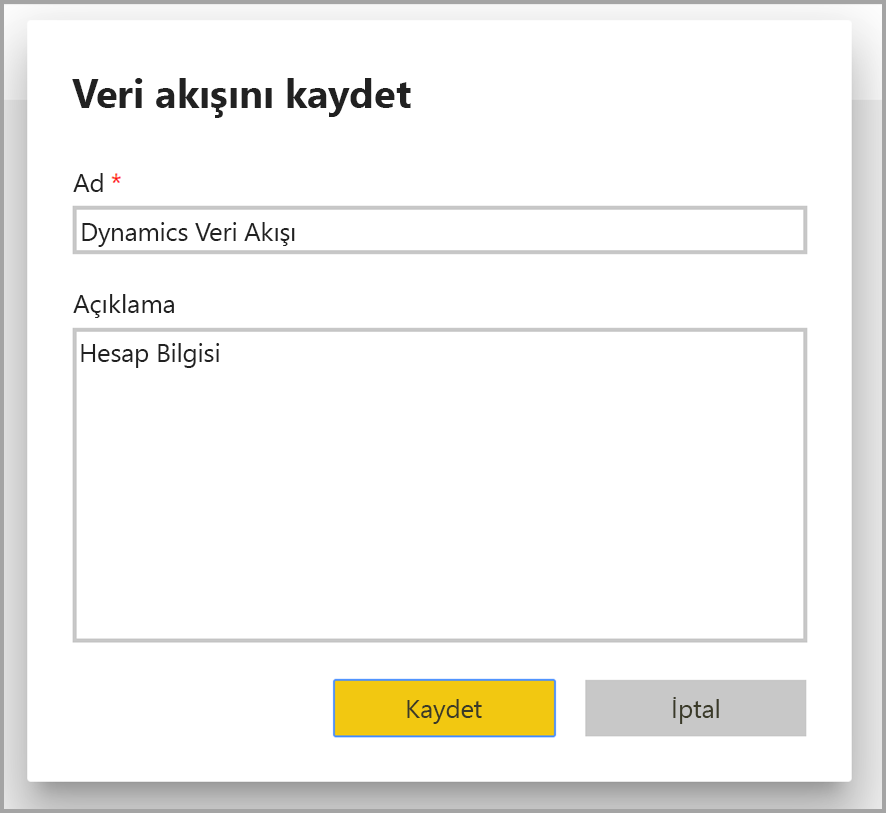

Hazır olduğunuzda ve **Kaydet** düğmesini seçtiğinizde, **veri akışınızın** oluşturulduğunu bildiren bir pencere gösterilir. 

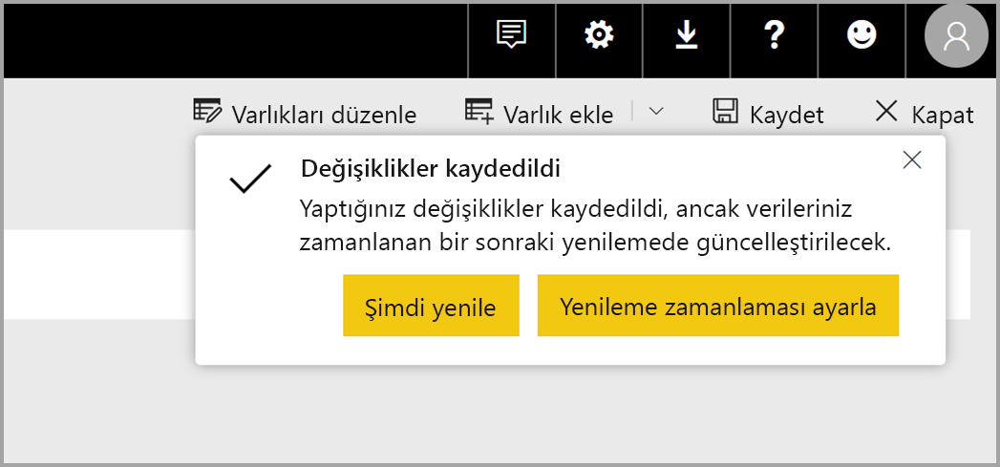

Harika! Artık bir sonraki adım olan veri kaynaklarınızın yenileme sıklığını zamanlama adımına hazırsınız.

## Yenileme sıklığını zamanlama

Veri akışınız kaydedildikten sonra, bağlantılı veri kaynaklarınızdan her biri için yenileme sıklığını zamanlamak istersiniz.

Power BI veri akışlarında, verilerinizin güncelliğini korumak için Power BI veri yenileme işlemi kullanılır. **Power BI hizmetindeki** **çalışma alanı** bölümünde, aşağıdaki resimde gösterildiği gibi veri akışlarınız da dahil olmak üzere bilgilerinizin listelendiği bir alan koleksiyonu vardır.

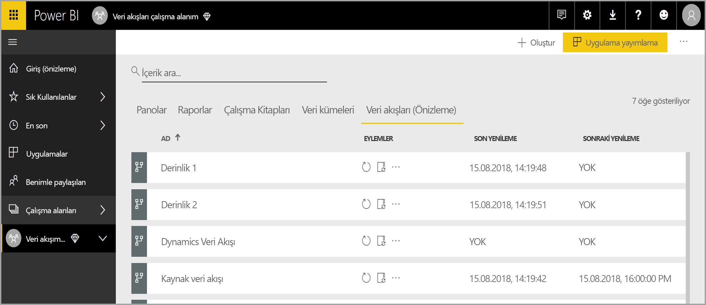

Önceki resimde yer alan *Dynamics veri akışı* girdisi, önceki bölümde oluşturduğunuz veri akışıdır. Yenilemeyi zamanlamak için, aşağıdaki resimde gösterildiği gibi **Eylemler** bölümünün altında **Yenilemeyi zamanla** simgesini seçin. 

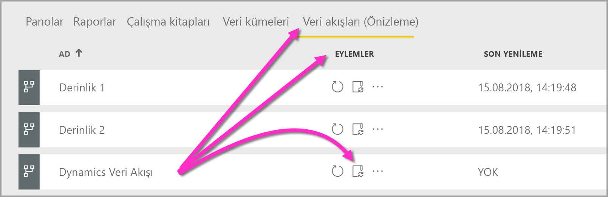

**Yenilemeyi zamanla** simgesini seçtiğinizde **Yenilemeyi zamanla** bölmesine ulaşırsınız. Bu bölme veri akışı yenileme sıklığını ve zamanını ayarlamanıza olanak tanır.

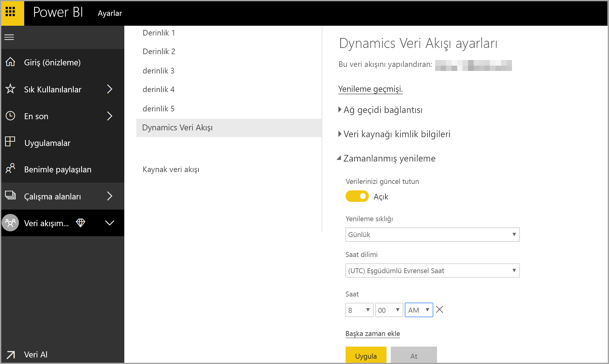

Yenilemeyi zamanlama hakkında daha fazla bilgi için, Power BI veri kümelerinin yenileme davranışının açıklandığı [zamanlanmış yenilemeyi yapılandırma](refresh-scheduled-refresh.md) hakkındaki makaleye bakın. Veri akışları, yenileme ayarları açısından Power BI veri kümeleriyle aynı davranışlara sahiptir. 

## Power BI Desktop’taki veri akışınıza bağlanma

Veri akışınızın oluşturduktan ve modeli dolduracak her veri kaynağının yenileme sıklığını zamanladıktan sonra, **Power BI Desktop** içinden veri akışınıza bağlanma adımı olan üçüncü ve son adıma hazırsınız. 

Veri akışına bağlanmak için, aşağıdaki resimde gösterildiği gibi Power BI Desktop'ta **Veri Al > Power BI > Power BI veri akışları (Beta)** öğesini seçin.

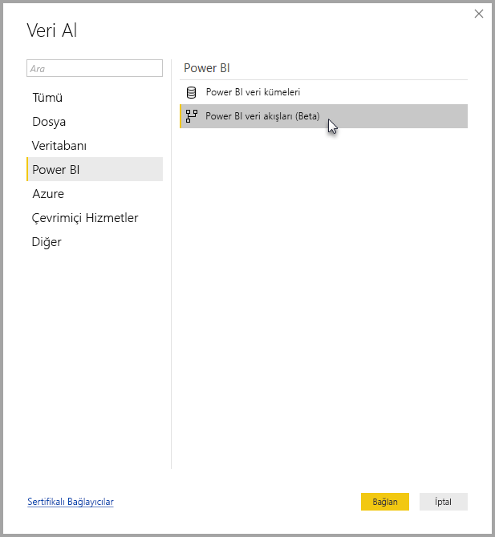

Buradan, veri akışınızı kaydettiğiniz **çalışma alanına** gidin, veri akışını seçin ve sonra oluşturduğunuz varlıkları listeden seçin.

Ayrıca, veri akışınızın adını ve diğer birçok veri akışı varlığı içinde varlıklarınızı hızla bulmak için, pencerenin üst kısmındaki **arama çubuğunu** da kullanabilirsiniz.

Varlığı ve ardından **Yükle** düğmesini seçtiğinizde, varlıklar **Power BI Desktop**'taki **Alanlar** bölmesinde gösterilir ve bunlar diğer herhangi bir veri kümesindeki **tablolarla** aynı şekilde görünür ve davranır.

## Azure Data Lake Storage 2. Nesil’de depolanan veri akışlarını kullanma

Bazı kuruluşlar, veri akışlarının oluşturma ve yönetimi için kendi depolama alanını kullanmayı isteyebilir. Gereksinimleri izleyip izinleri düzgün şekilde yönetirseniz Azure Data Lake Storage 2. Nesil ile veri akışlarını tümleştirebilirsiniz. Bu yaklaşımın tüm gereksinimlerinin belgelerine, [Veri akışları ve Azure Data Lake tümleştirmesi (Önizleme)](service-dataflows-azure-data-lake-integration.md) adlı genel bakış belgesinden itibaren erişilebilir.

## Veri bağlantısı sorunlarını giderme

Bazı durumlarda veri akışlarının veri kaynaklarına bağlanırken sorunlarla karşılaşılabilir. Bu bölümde bu tür sorunların çıkması durumunda sorun giderme ipuçları sağlanır. 

* **Salesforce bağlayıcısı** - Veri akışlarıyla Salesforce için deneme hesabı kullanıldığında, bağlantı hatası oluşur ve hiçbir bilgi sağlanmaz. Bu sorunu çözmek için, test ederken üretim Salesforce hesabı veya geliştirici hesabı kullanın.

* **SharePoint bağlayıcısı** - Alt klasör veya belge eklemeden SharePoint sitesinin kök adresini sağladığınızdan emin olun. Örneğin, şuna benzer bir bağlantı kullanın: `https://microsoft.sharepoint.com/teams/ObjectModel/` 

* **JSON Dosya bağlayıcısı**: Şu anda bir JSON dosyasına yalnızca temel kimlik doğrulaması kullanarak bağlanabilirsiniz.  Bir JSON dosyasına URL içinden kimlik bilgileri sağlayarak bağlanma işlemi (ör. `https://XXXXX.blob.core.windows.net/path/file.json?sv=2019-01-01&si=something&sr=c&sig=123456abcdefg`. ) şu anda **desteklenmiyor**.  

* **Azure SQL Veri Ambarı**: Veri akışları şu anda Azure SQL Veri Ambarı için Azure Active Directory (AAD) kimlik doğrulamasını desteklemiyor. Bu senaryoda Temel kimlik doğrulaması kullanın.

## Önemli noktalar ve sınırlamalar

Veri akışlarıyla ilgili bilinen birkaç sınırlama vardır ve bunlar aşağıdaki listede açıklanmaktadır.

* Veri akışının çıkışı şu türlerden birinde olmalıdır: *Tarih/Saat, Ondalık Sayı, Metin, Tamsayı, Tarih/Saat/Bölge, Doğru/Yanlış, Tarih, Saat*
* Şu anda veri akışlarının içinde dinamik işlevler desteklenmemektedir

## Sonraki Adımlar

Bu makalede kendi **veri akışınızı** oluşturma ve bundan yararlanmak için **Power BI Desktop**'ta veri kümesi ve rapor oluşturma işlemleri açıklanmıştır. Aşağıdaki makaleler, veri akışlarını kullanırken gerekecek diğer bilgiler ve senaryolar açısından yararlıdır:

* [Veri akışları ile self servis veri hazırlığı](service-dataflows-overview.md)
* [Power BI Premium'da hesaplanan varlıkları kullanma](service-dataflows-computed-entities-premium.md)
* [Şirket içi veri kaynakları ile veri akışlarını kullanma](service-dataflows-on-premises-gateways.md)
* [Power BI veri akışları için geliştirici kaynakları](service-dataflows-developer-resources.md)
* [Veri akışları ve Azure Data Lake tümleştirmesi (Önizleme)](service-dataflows-azure-data-lake-integration.md)

Ortak Veri Modeli hakkında daha fazla bilgi için genel bakış makalesini okuyabilirsiniz:
* [Ortak Veri Modeli - genel bakış ](https://docs.microsoft.com/powerapps/common-data-model/overview)
* [GitHub'da Ortak Veri Modeli şeması ve varlıkları hakkında daha fazla bilgi edinin](https://github.com/Microsoft/CDM)

İlgili Power BI Desktop makaleleri:

* [Power BI Desktop'tan Power BI hizmetindeki veri kümelerine bağlanma](desktop-report-lifecycle-datasets.md)
* [Power BI Desktop'ta sorgulara genel bakış](desktop-query-overview.md)

İlgili Power BI hizmeti makaleleri:
* [Zamanlanmış yenileme yapılandırma](refresh-scheduled-refresh.md)
