# Power BI veri akışları için veri kaynaklarına bağlanma

Power BI veri akışlarıyla birçok farklı veri kaynağına bağlanarak yeni veri akışları oluşturabilir veya mevcut veri akışına yeni varlıklar ekleyebilirsiniz.

Bu makalede oluşturulabilecek veya veri akışlarına eklenebilecek birçok veri kaynağı listelenir ve bu veri kaynaklarını kullanarak söz konusu veri akışlarının nasıl oluşturulacağı açıklanır.

Veri akışlarını oluşturma ve kullanma işlemlerine genel bir bakış için, bkz. [Power BI'da veri akışlarını oluşturma ve kullanma](service-dataflows-create-use.md).

## Veri kaynağından veri akışı oluşturma

Verilere bağlanmak için, **Power BI hizmeti**'nde **+ Oluştur** menü öğesini seçin ve sonra da görüntülenen menüde **veri akışı** öğesini seçin. Bu seçildiğinde, Power BI hizmetinin tuvalinde aşağıdaki görüntü gösterilir. 

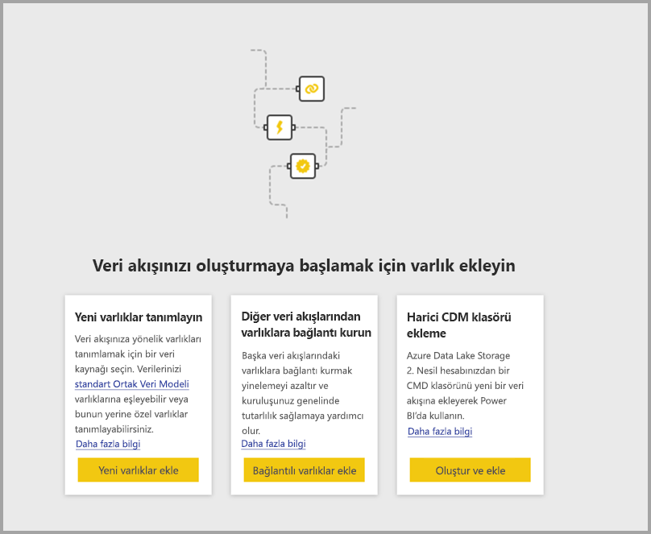

Zaten veri akışınız varsa, aşağıda gösterildiği gibi **Varlık ekle**'yi seçerek veya veri akışı yazma aracında **Veri al**'ı seçerek veri akışınıza yeni varlıklar ekleyebilirsiniz.

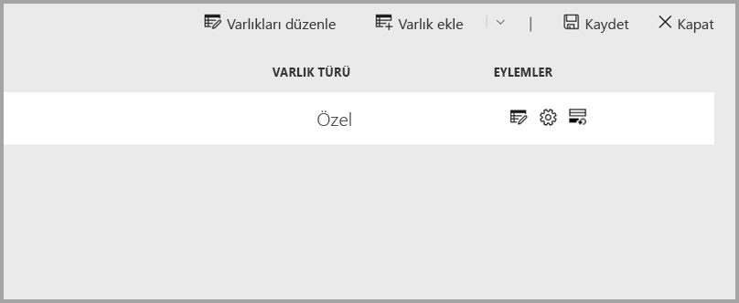

Aşağıdaki görüntüde, veri akışı yazma aracının **Veri al** düğmesi gösterilir. 

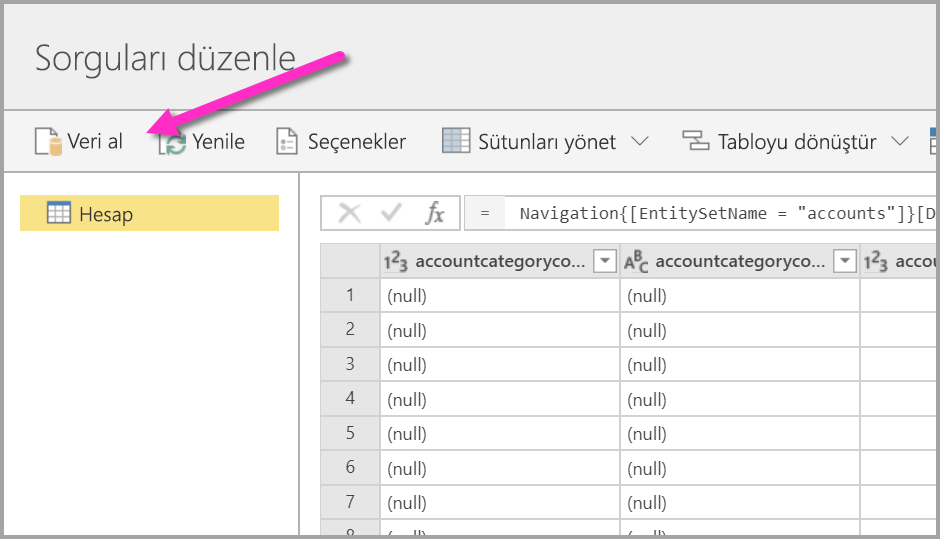

## Veri akışları için veri kaynakları

Veri akışı yazma aracında **Veri Al**'ı seçerek kullanılabilir veri kaynaklarını görüntüleyebilirsiniz. Bu, aşağıdaki görüntüde gösterildiği gibi kategorileri ve veri kaynaklarını seçmeniz için bir iletişim kutusu görüntüler.

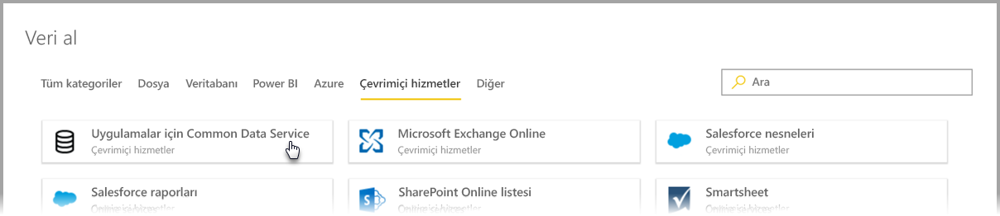

Veri akışlarının veri kaynakları, **Veri al** iletişim kutusunun üst kısmında gösterilen aşağıdaki kategoriler altında düzenlenmiştir:

* Tüm kategoriler
* Dosya
* Veritabanı
* Power BI
* Azure
* Çevrimiçi Hizmetler
* Diğer

**Tüm kategoriler** kategorisi, tüm kategorilerin tüm veri kaynaklarını içerir. 

**Dosya** kategorisi, veri akışları için aşağıdaki kullanılabilir veri bağlantılarını içerir:

* Erişim
* Excel
* JSON
* Metin/CSV
* XML

**Veritabanı** kategorisi, veri akışları için aşağıdaki kullanılabilir veri bağlantılarını içerir:

* IBM DB2 Veritabanı
* MySQL Veritabanı
* Oracle Database
* PostgreSQL Veritabanı
* SQL Server Veritabanı
* Sybase Veritabanı
* Teradata
* Vertica

**Power BI** kategorisi, veri akışları için aşağıdaki kullanılabilir veri bağlantılarını içerir:

* Power BI veri akışları

**Azure** kategorisi, veri akışları için aşağıdaki kullanılabilir veri bağlantılarını içerir:

* Azure Blobları
* Azure Veri Gezgini
* Azure SQL Veri Ambarı
* Azure SQL Veritabanı
* Azure Tabloları

**Çevrimiçi Hizmetler** kategorisi, veri akışları için aşağıdaki kullanılabilir veri bağlantılarını içerir:

* Amazon Redshift
* Uygulamalar için Common Data Service
* Microsoft Exchange Online
* Salesforce Nesneleri
* Salesforce Raporları
* SharePoint Online Listesi
* Smartsheet

**Diğer** kategorisi, veri akışları için aşağıdaki kullanılabilir veri bağlantılarını içerir:

* Active Directory
* OData
* SharePoint Listesi
* Web API'si
* Web sayfası
* Boş tablo
* Boş Sorgu

## Veri kaynağına bağlanma

Bir veri kaynağına bağlanmak için, veri kaynağını seçin. İşlemin nasıl çalıştığını tek bir örnekle göstereceğiz ama veri akışları için tüm veri bağlantılarının işlemleri birbirine benzer. Farklı bağlayıcılar belirli kimlik bilgileri veya başka bilgiler gerektirebilir, ama akış benzer olur. Bizim örneğimizde, aşağıdaki görüntüde gösterildiği gibi **Çevrimiçi hizmetler** veri bağlantısı kategorisinden **Uygulamalar için Common Data Service** seçilir.

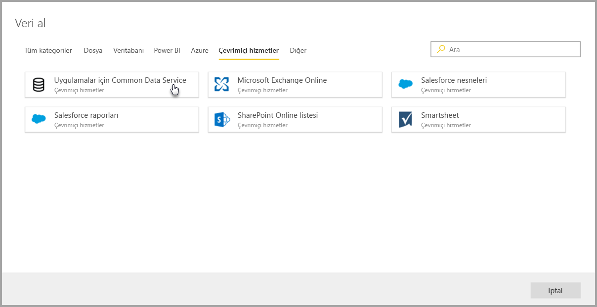

Seçilen veri bağlantısı için bir bağlantı penceresi görüntülenir. Gerekli olması halinde kimlik bilgilerinizi sağlamanız istenir. Aşağıdaki görüntüde, Uygulamalar için Common Data Service sunucusuna bağlanmak için bir Sunucu URL'sinin girildiği gösterilir.

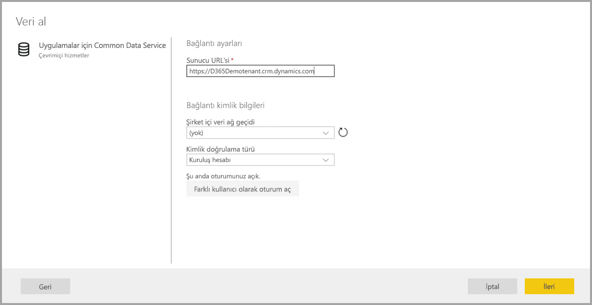

Sunucu URL'si veya kaynak bağlantısı bilgileri sağlandıktan sonra, **Oturum aç**'ı seçerek veri erişiminde kullanılacak kimlik bilgilerini girin ve **İleri**'yi seçin.

**Power Query Online** başlatılır, veri kaynağıyla bağlantı kurar ve ardından aşağıdaki görüntüde gösterildiği gibi **Gezgin** penceresinde bu veri kaynağındaki kullanılabilir tabloları gösterir.

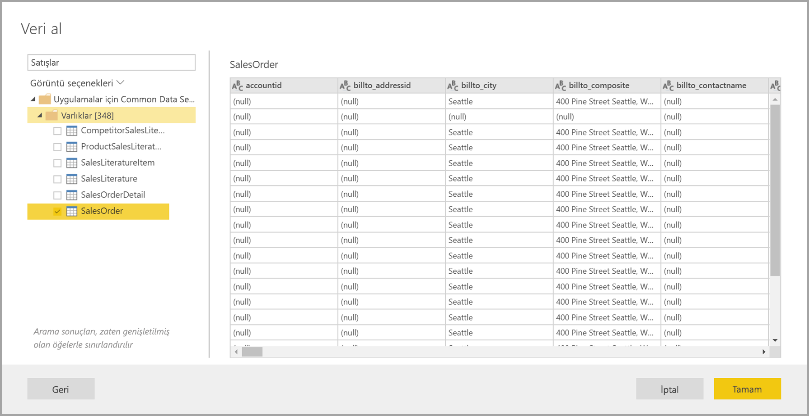

Sol bölmede her öğenin yanındaki onay kutusunu işaretleyerek yüklenecek tabloları ve verileri seçebilirsiniz. Verileri yüklemek için, **Gezgin** bölmesinin alt kısmındaki **Tamam** düğmesini seçin. Sorguları düzenleyebileceğiniz ve seçilen veriler üzerinde istediğiniz diğer dönüştürmeleri gerçekleştirebileceğiniz bir Power Query Online iletişim kutusu görüntülenir.

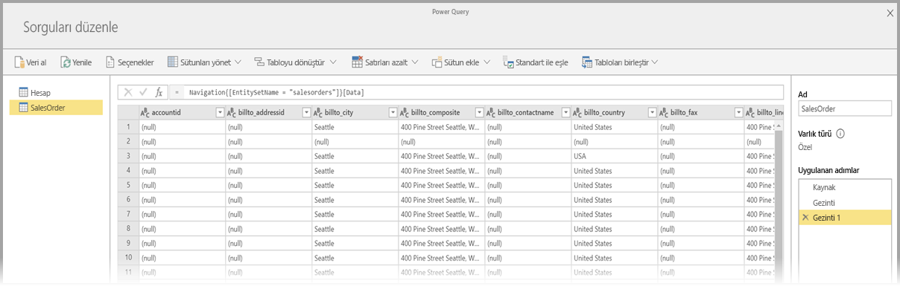

İşte bu kadar kolay. Diğer veri kaynakları da benzer akışlara sahiptir ve veri akışınıza getirdiğiniz verileri düzenlemek ve dönüştürmek için Power Query Online'ı kullanır.

## Ek veri kaynaklarına bağlanma

Power BI veri akışları kullanıcı arabiriminde gösterilmeyen ama birkaç ek adımla desteklenen başka veri bağlayıcıları da vardır. 

Aşağıdaki adımları izleyerek, kullanıcı arabiriminde gösterilmeyen bir bağlayıcıya yönelik bağlantı oluşturabilirsiniz:

1. **Power BI Desktop**'ı açın ve **Veri Al**'ı seçin.
2. Aşağıdaki görüntüde gösterildiği gibi Power BI Desktop'ta **Power Query Düzenleyicisi**'ni açın, ilgili sorguya sağ tıklayın ve **Gelişmiş Düzenleyici**'yi açın. Burada, Gelişmiş Düzenleyici'de gösterilen M betiğini kopyalayabilirsiniz.

    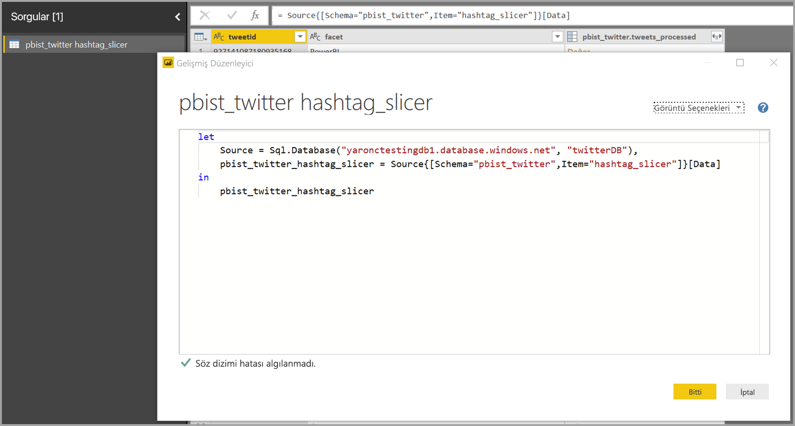 

3. Power BI veri akışını açın ve aşağıdaki görüntüde gösterildiği gibi boş sorgu için **Veri al**'ı seçin.

    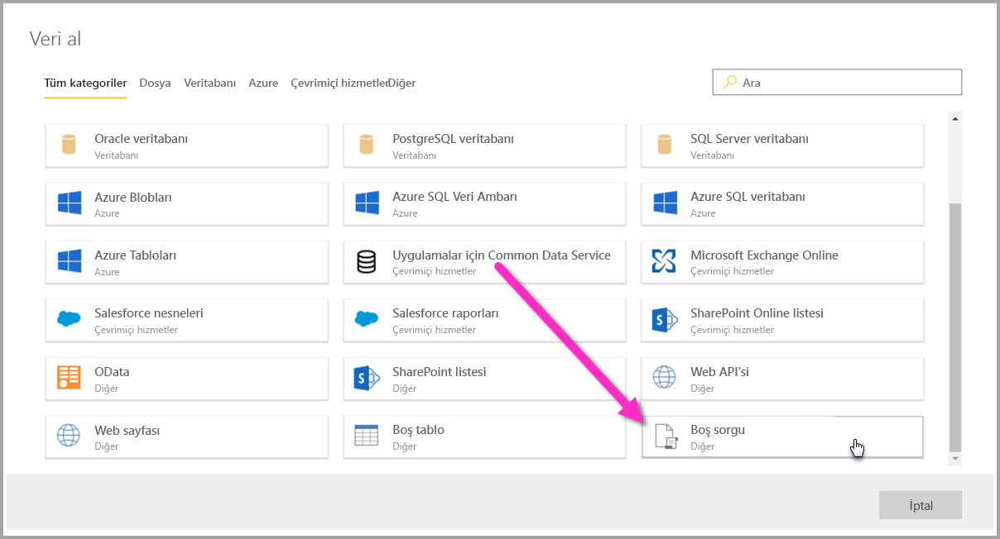 

4. Kopyalanan sorguyu veri akışı için boş sorguya yapıştırın.

    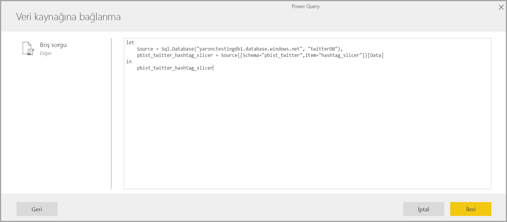 

Bundan sonra, betiğiniz belirttiğiniz veri kaynağına bağlanır. 

Aşağıdaki listede, şu anda M sorgusunu kopyalayıp boş sorguya yapıştırarak kullanabileceğiniz bağlayıcılar gösterilir:

* Azure Analysis Services
* Adobe Analytics
* ODBC
* OLE DB
* Klasör
* SharePoint Online klasörü
* SharePoint klasörü
* Hadoop HDFS
* Azure HDInsight (HDFS)
* Hadoop dosyası HDFS
* Informix (beta)

Power BI veri akışlarında veri kaynaklarına bağlanmak için tüm yapmanız gereken bu.

## Sonraki Adımlar

Bu makalede veri akışları için hangi veri kaynaklarına bağlanabileceğiniz gösterildi. Aşağıdaki makalelerde, veri akışlarının yaygın kullanım senaryoları daha ayrıntılı olarak ele alınır. 

* [Power BI’da self servis veri hazırlığı](service-dataflows-overview.md)
* [Power BI’da veri akışları oluşturma ve kullanma](service-dataflows-create-use.md)
* [Power BI Premium'da hesaplanan varlıkları kullanma](service-dataflows-computed-entities-premium.md)
* [Şirket içi veri kaynakları ile veri akışlarını kullanma](service-dataflows-on-premises-gateways.md)
* [Power BI veri akışları için geliştirici kaynakları](service-dataflows-developer-resources.md)
* [Veri akışları ve Azure Data Lake tümleştirmesi (Önizleme)](service-dataflows-azure-data-lake-integration.md)

Power Query ve zamanlanmış yenileme hakkında daha fazla bilgi için şu makaleleri okuyabilirsiniz:
* [Power BI Desktop'ta sorgulara genel bakış](desktop-query-overview.md)
* [Zamanlanmış yenileme yapılandırma](refresh-scheduled-refresh.md)

Ortak Veri Modeli hakkında daha fazla bilgi için genel bakış makalesini okuyabilirsiniz:
* [Ortak Veri Modeli - genel bakış ](https://docs.microsoft.com/powerapps/common-data-model/overview)

