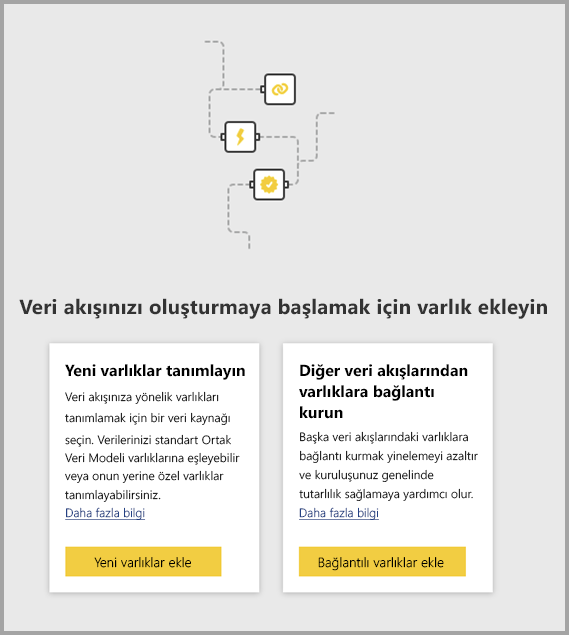
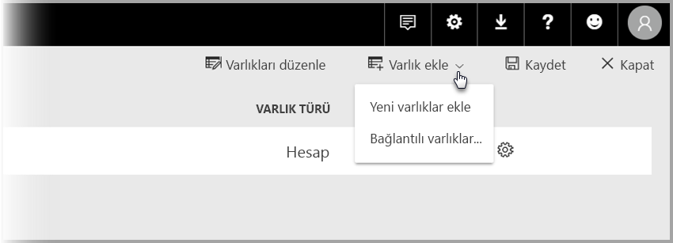

# Power BI’da veri akışları arasındaki varlıkları ilişkilendirme

Power BI’daki veri akışları sayesinde, iş analizi uzmanlarının verileri bir kez hazırlayıp yönetebileceği ve sonra kuruluştaki farklı analiz uygulamaları arasında yeniden kullanabildiği tek bir kurumsal veri depolama kaynağına sahip olabilirsiniz. 

Veri akışları arasındaki varlıkları ilişkilendirdiğinizde, bu verileri sürdürme gereksinimi olmadan, başkalarının sahip olduğu diğer veri akışları tarafından zaten alınmış, temizlenmiş ve dönüştürülmüş varlıkları yeniden kullanabilirsiniz. Bağlantılı varlıklar diğer veri akışlarındaki varlıkları işaret eder ve verileri *kopyalamaz* veya yinelemez.

Bağlantılı varlıklar **salt okunur** özelliktedir. Bağlantılı bir varlık için dönüşümler oluşturmak istiyorsanız, bağlantılı varlığa başvuru ile birlikte yeni bir hesaplanmış varlık oluşturmanız gerekir.

## Bağlantılı varlığın kullanılabilirliği

Bağlantılı varlıkların yenilenmesi için bir [Power BI Premium](service-premium-what-is.md) aboneliği gerekir. Bağlantılı varlıklar, Power BI Premium kapasitesinde barındırılan bir çalışma alanı üzerindeki herhangi bir veri akışında kullanılabilir. Kaynak veri akışı ile ilgili bir sınırlama yoktur.

Bağlantılı varlıklar yalnızca yeni Power BI çalışma alanlarında düzgün çalışır. [Yeni Power BI çalışma alanları](service-create-the-new-workspaces.md) hakkında daha fazla bilgi edinebilirsiniz. Tüm bağlı veri akışlarının düzgün çalışması için yeni çalışma alanlarına yerleştirilmesi gerekir.

> [!NOTE]
> Varlıklar, standart varlıklar mı hesaplanan varlıklar mı olduğuna göre farklılık gösterir. Standart varlıklar (genellikle yalnızca varlıklar olarak adlandırılır), SQL veritabanı gibi bir dış veri kaynağını sorgular. Hesaplanan varlıklar, Power BI’da Premium kapasite gerektirir ve Power BI depolamada bulunmakta olan veriler üzerinde dönüştürmeler çalıştırır. 
>
>Veri akışınız Premium kapasite çalışma alanında değilse, yine de tek bir sorguya başvurabilir veya depolama dönüştürmelerinde dönüştürmeler tanımlanmadığı sürece iki ya da daha fazla sorguyu birleştirebilirsiniz. Böyle başvurular standart varlıklar olarak değerlendirilir. Bunu yapmak için **Yüklemeyi etkinleştir** seçeneğini kapatarak, başvurulan sorguların verilerin gerçekleştirilmesini ve depolama alanına alınmasını engellemesini sağlayın. Buradan, **Yüklemeyi etkinleştir = false** sorgularına başvurabilir ve yalnızca gerçekleştirmek istediğiniz sonuçta elde edilen sorgular için **Yüklemeyi etkinleştir** seçeneğini **Açık** olarak ayarlayın.

## Veri akışları arasındaki varlıkları ilişkilendirme

Power BI’da veri akışları arasındaki varlıkları birkaç şekilde ilişkilendirebilirsiniz. Aşağıdaki görüntüde gösterildiği gibi Veri Akışları yazma aracından **Bağlantılı varlıkları ekle**’yi seçebilirsiniz. 

Ayrıca, Power BI hizmetindeki **Varlık ekle** menü öğesinden **Bağlantılı varlıkları ekle**’yi seçebilirsiniz.

Varlıkları ilişkilendirmek için Power BI kimlik bilgilerinizle oturum açmanız gerekir.

Bir **Gezgin** penceresi açılır ve bağlanabileceğiniz bir varlık kümesi seçmenize olanak tanır. Görüntülenen varlıklar, Power BI kiracınızdaki tüm çalışma alanlarında izinlerine sahip olduğunuz varlıklardır. 

Bağlantılı varlıklarınız seçildikten sonra, onları Bağlantılı varlık olarak tanımlayan özel bir simge ile birlikte yazma aracında veri akışınızın varlık listesinde görünür.

Kaynak veri akışını, bağlantılı varlığınızın veri akışı ayarlarından da görüntüleyebilirsiniz.

## Bağlantılı varlıkların yenileme mantığı
Bağlantılı varlıkların varsayılan yenileme mantığı, kaynak veri akışının hedef veri akışı ile aynı çalışma alanında bulunup bulunmadığına bağlı olarak değişir. Aşağıdaki bölümlerde her birinin davranışı açıklanmıştır.

### Çalışma alanları arasındaki bağlantılar

Farklı çalışma alanlarındaki varlıkların bağlantıları için yenileme işlemi, bir dış veri kaynağı gibi davranır. Veri akışı yenilendiğinde kaynak veri akışından varlığın en son verilerini alır. Kaynak veri akışı yenilenirse hedef veri akışındaki verileri otomatik olarak etkilemez.

### Aynı çalışma alanındaki bağlantılar

Bir kaynak veri akışının verileri yenilendiğinde, bu olay aynı çalışma alanındaki tüm hedef veri akışlarında bağımlı varlıklar ve bunları temel alan tüm hesaplanmış varlıklar için bir yenileme işlemini tetikler. Hedef veri akışındaki diğer tüm varlıklar, veri akışı zamanlamasına göre yenilenir. Birden fazla kaynağa bağlı olan varlıklar, kaynakları başarıyla güncelleştirildiğinde verilerini güncelleştirir.

Tüm yenileme işleminin tek seferde yürütülmesinin yararlı olduğunu unutmayın. Bu nedenle, hedef veri akışı yenilenemezse kaynak veri akışında da yenileme işlemi başarısız olur.

## Veri akışlarından raporları görüntülerken gereken izinler

Kullanıcılar, bir veri akışını temel alan veriler içeren Power BI raporu oluştururken yalnızca kullanıcının kaynak veri akışına erişimi olması durumunda bağlantılı varlıkları görebilir.

## Sınırlamalar ve önemli noktalar

Bağlantılı varlıklarla çalışırken göz önünde bulundurulması gereken birkaç sınırlama vardır:

* En fazla beş başvuran atlama vardır
* Bağlantılı varlıkların döngüsel bağımlılıklarına izin verilmez
* Veri akışı [yeni bir Power BI çalışma alanı](service-create-the-new-workspaces.md) içinde bulunmalıdır
* Bağlantılı bir varlık, verilerinin şirket içi veri kaynağından alan normal bir varlıkla birleştirilemez

## Sonraki Adımlar

Veri akışı oluştururken veya veri akışları ile çalışırken aşağıdaki makaleler yararlı olabilir. 

* [Power BI'da Self Servis veri hazırlama](service-dataflows-overview.md)
* [Power BI’da veri akışları oluşturma ve kullanma](service-dataflows-create-use.md)
* [Hesaplanan varlıkları üzerinde Power BI Premium kullanma](service-dataflows-computed-entities-premium.md)
* [Şirket içi veri kaynakları ile veri akışlarını kullanma](service-dataflows-on-premises-gateways.md)
* [Power BI veri akışı için geliştirici kaynaklar](service-dataflows-developer-resources.md)

Power Query ve zamanlanmış yenileme hakkında daha fazla bilgi için şu makaleleri okuyabilirsiniz:
* [Power BI Desktop'ta sorgulara genel bakış](desktop-query-overview.md)
* [Zamanlanmış yenileme yapılandırma](refresh-scheduled-refresh.md)

Ortak Veri Modeli hakkında daha fazla bilgi için genel bakış makalesini okuyabilirsiniz:
* [Ortak Veri Modeli - genel bakış ](https://docs.microsoft.com/powerapps/common-data-model/overview)

