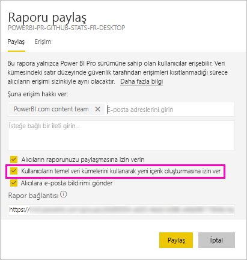

# Veri kümelerini oluşturma ve paylaşma (Önizleme)

Power BI Desktop’ta *veri modeli* oluşturucusu olarak bunları Power BI hizmetinde *veri kümeleri* olarak paylaşabilirsiniz. Ardından, rapor oluşturucuları paylaştığınız veri kümelerini kolayca keşfedip yeniden kullanabilir. Oluşturma iznini kullanarak bunları paylaşmayı ve verilere kimin erişimi olduğunu denetlemeyi öğrenin.

## Veri kümenizi paylaşmaya yönelik adımlar

1. Power BI Desktop’taki bir veri modelinde .pbix dosyası oluşturarak başlayın. Bu veri kümesini diğerlerinin rapor oluşturması için sunmayı planlıyorsanız .pbix dosyasında rapor tasarlamasanız da olur.

    .pbix dosyasını bir Office 365 grubuna kaydetmek en iyi yöntemlerden biridir.

1. .pbix dosyasını Power BI hizmetindeki bir [yeni deneyim çalışma alanında](service-create-the-new-workspaces.md) yayımlayın.
    
    Bu çalışma alanının diğer üyeleri, zaten bu veri kümesini temel alarak diğer çalışma alanlarında rapor oluşturabiliyor.

1. Artık bu çalışma alanından [bir uygulama oluşturabilirsiniz](service-create-distribute-apps.md). Bunu yaptığınızda, kimlerin izinleri olduğunu ve neler yapabileceklerini **İzinler** sayfasından siz belirlersiniz.

    > [!NOTE]
    > **Tüm kuruluş** seçeneğini belirlerseniz kuruluştaki kimsenin Oluşturma izni olmaz. Bu sorun zaten biliniyor. Bunun yerine, **Belirli bireyler ve gruplardaki** e-posta adreslerini belirtin.  Kuruluşunuzdaki herkesin Oluşturma izni olmasını istiyorsanız, tüm kuruluş için bir e-posta diğer adı belirtin.

    

1. **Uygulamayı yayımla**seçeneğini belirleyin. Uygulama zaten yayımlandıysa, **Uygulamayı güncelleştir**’i seçin.

## Paylaşılan veri kümeleri için oluşturma izinleri

Oluşturma izni türü sadece veri kümeleri için geçerlidir. Kullanıcılar bununla bir veri kümesi üzerinde, raporlar, panolar, Soru-Cevap bölmesinden sabitlenmiş kutucuklar ve Insights Discovery gibi içerikler derleyebilir. Excel’de Çözümleme aracılığıyla Excel sayfaları, XMLA ve dışarı aktarma gibi Power BI dışındaki veri kümesinde de yeni içerik derleyebilirler.

Kullanıcılar farklı şekillerde Oluşturma izni alır:

- Veri kümesinin bulunduğu çalışma alanının bir üyesi, izin merkezindeki belirli kullanıcılara veya güvenlik gruplarına izni atayabilir. Veri kümesinin yanındaki üç nokta (...) simgesini seçin > **İzinleri Yönet** seçeneğini belirleyin.

    

    Bu, izinleri ayarlayabildiğiniz ve değiştirebildiğiniz İzin merkezini o veri kümesi için açar.

    

- Veri kümesinin bulunduğu iş alanının yöneticisi veya üyesi, uygulama için izni olan kullanıcıların temel alınan veri kümeleri için de izni olup olmayacağına uygulamanın yayımlanması esnasında karar verebilir. Daha fazla ayrıntı için bkz. [Veri kümenizi paylaşmaya yönelik adımlar](#steps-to-sharing-your-dataset).

- Bir veri kümesinde Yeniden Paylaşma ve Oluşturma izinlerinizin olduğunu varsayalım. Bu veri kümesinin üzerinde derlenmiş bir raporu veya panoyu paylaştığınızda, alıcıların temel olarak alınan veri kümesi için de Oluşturma izni aldıklarını belirtebilirsiniz.

    

Kişilerin bir veri kümesi için Oluşturma izinlerini kaldırabilirsiniz. Bunu yaparsanız, paylaşılan veri kümesinde derlenen raporu görebilirler ancak bunu artık düzenleyemezler.

## Daha ayrıntılı izinler

Power BI, mevcut izinler olan Okuma ve Yeniden paylaşma izinlerini tamamlayan Oluşturma iznini Haziran 2019’da sundu. O zamanda uygulama izinleri, paylaşım veya çalışma alanı erişimi aracılığıyla veri kümeleri için Okuma iznine sahip olan tüm kullanıcılar aynı veri kümeleri için Oluşturma iznine de sahip oldu. Okuma izni, Excel’de Çözümleme veya Dışarı aktarma kullanarak veri kümesinde yeni içerik oluşturma hakkını onlara zaten tanıdığı için Oluşturma iznine otomatik olarak sahip oldular.

Daha ayrıntılı bu Oluşturma izni ile mevcut rapor veya panodaki içeriği kimlerin görüntüleyebileceğini ve temel alınan veri kümelerine bağlı olan içerikleri kimlerin oluşturabileceğini seçebilirsiniz.

Veri kümeniz veri kümesi çalışma alanının dışındaki bir rapor tarafından kullanılıyorsa o veri kümesini silemezsiniz. Bunun yerine bir hata iletisi görürsünüz.

Oluşturma izinlerini kaldırabilirsiniz. Bunu yaparsanız, izinlerini iptal ettiğiniz kişiler raporu görmeye devam eder ancak raporu artık düzenleyemez.

## Veri kümesi kullanımınızı izleme

Çalışma alanınızda bir paylaşılan veri kümesi bulunduğunda, diğer çalışma alanlarındaki hangi raporların bunu temel aldığını bilmeniz gerekebilir.

1. Veri kümeleri liste görünümünde **İlgili olanları görüntüle** seçeneğini belirleyin.

    

1. **İlgili içerik** iletişim kutusu tüm ilgili öğeleri gösterir. Bu çalışma alanı ve **Diğer çalışma alanlarındaki** ilgili öğeleri bu listede görürsünüz.
 
    

## Sonraki adımlar

- [Çalışma alanları genelinde veri kümeleri kullanma (Önizleme)](service-datasets-across-workspaces.md)
- Sorularınız mı var? [Power BI Topluluğu'na sorun](http://community.powerbi.com/)
