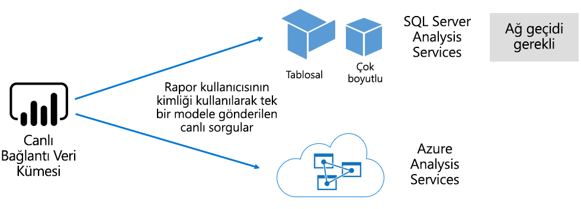

# Power BI hizmetindeki veri kümeleri

Bu makalede Power BI veri kümelerinin teknik açıklaması sağlanır.

## Veri kümesi türleri

Power BI veri kümeleri raporlama ve görselleştirme için hazır olan bir veri kaynağını temsil eder. Aşağıdaki yollarla oluşturulan beş farklı veri kümesi türü vardır:

- Power BI kapasitesinde barındırılmayan mevcut veri modeline bağlanma
- Model içeren bir Power BI Desktop dosyasını karşıya yükleme
- Excel çalışma kitabını (bir veya birden çok Excel tablosu ve/veya bir çalışma kitabı veri modeli içeren) karşıya yükleme veya bir CSV (virgülle ayrılmış değerler) dosyasını karşıya yükleme
- Power BI hizmetini [gönderme veri kümesi](developer/automation/walkthrough-push-data.md) oluşturmak için kullanma
- Power BI hizmetini [akış veya karma akış veri kümesi](service-real-time-streaming.md) oluşturmak için kullanma

Akış veri kümeleri dışında, veri kümesi [Analysis Services](/analysis-services/analysis-services-overview)'in olgun modelleme teknolojilerinden yararlanan bir veri modelini temsil eder.

> [!NOTE]
> Belgelerimizde bazen _veri kümesi_ ile _model_ terimleri birbirinin yerine kullanılır. Genel olarak Power BI hizmetinin perspektifinden **veri kümesi** terimi kullanılırken geliştirme perspektifinden **model** terimi kullanılır. Belgelerimiz bağlamında bunlar büyük ölçüde aynı anlama gelir.

### Dışarıda barındırılan modeller

Dışarıda barındırılan üç tür model vardır: SQL Server Analysis Services ve [Azure Analysis Services](/azure/analysis-services/analysis-services-overview).

İster şirket içi isterse VM'de barındırılan hizmet olarak altyapı (IaaS) olsun SQL Server Analysis Services modeline bağlanmak için [şirket içi veri ağ geçidi](service-gateway-onprem.md) yüklenmelidir. Azure Analysis Services ağ geçidi gerektirmez.

Analysis Services'e bağlanmak genellikle mevcut model yatırımları olduğunda ve bir kurumsal veri ambarının (EDW) bir parçasını oluşturduğunda anlamlı olur. Power BI Analysis Services'e _canlı bağlantı_ kurabilir ve Power BI rapor kullanıcısının kimliğini kullanarak veri izinlerini zorlayabilir. SQL Server Analysis Services için hem çok boyutlu modeller (küpler) hem de tablolu modeller desteklenir. Aşağıdaki resimde gösterildiği gibi canlı bağlantı veri kümesi sorguları dışarıda barındırılan modellere geçirir.

### Power BI Desktop'ta geliştirilmiş modeller

Power BI geliştirme amaçlı istemci uygulaması Power BI Desktop, model geliştirmek için kullanılabilir. Model etkin bir şekilde Analysis Services tablolu modelidir. Modeller verileri veri akışlarından içeri aktararak oluşturulabilir ve ardından bunlar dış veri kaynaklarıyla tümleştirilebilir. Modellemenin nasıl başarılacağı bu makalenin kapsamı dışında kalsa da, Power BI Desktop kullanılarak geliştirilebilecek üç farklı türde veya _modda_ model olduğunu anlamak önemlidir. Bu modlar verilerin modele içeri mi aktarıldığını yoksa veri kaynağında mı kaldığını belirler. Üç mod şunlardır: İçeri Aktarma, DirectQuery ve Bileşik. Her mod hakkında daha fazla bilgi için [Power BI hizmetindeki veri kümesi modları](service-dataset-modes-understand.md) makalesine bakın.

Dışarıda barındırılan modeller ve Power BI Desktop modelleri, belirli bir kullanıcı için alınan veri miktarını sınırlamak üzere satır düzeyi güvenliği (RLS) zorunlu tutabilir. Örneğin **Satış Elemanları** güvenlik grubuna atanan kullanıcılar, atandıkları satış bölgelerinin rapor verilerini yalnızca görüntüleyebilir. RLS rolleri _dinamik_ veya _statik_ olur. Dinamik roller rapor kullanıcısına göre filtre uygularken, statik roller aynı filtreleri role atanmış tüm kullanıcılara uygular. Daha fazla bilgi için bkz. [Power BI ile satır düzeyi güvenlik (RLS)](service-admin-rls.md).

### Excel çalışma kitabı modelleri

[Excel çalışma kitapları](service-excel-workbook-files.md) veya [CSV dosyaları](service-comma-separated-value-files.md) temelinde veri kümeleri oluşturmak, modelin otomatik olarak oluşturulması sonucunu verir. Model tablolarını oluşturmak için Excel tabloları ve CSV verileri içeri aktarılır, öte yandan Power BI modeli oluşturmak için Excel çalışma kitabı veri modelinin sırası değiştirilir. Her durumda dosya verileri modelde içeri aktarılır.

## Özet

Modelleri temsil eden Power BI veri kümeleriyle ilgili ayrımlar yapılabilir:

- Bunlar Power BI hizmetinde barındırılır veya Analysis Services tarafından dışta barındırılır.
- Bunlar içeri aktarılan verileri depolayabilir, temel veri kaynaklarına doğrudan sorgu istekleri gönderebilir veya bu ikisinin bir bileşimini kullanabilir.

Burada modelleri temsil eden Power BI veri kümeleri hakkındaki önemli olguların özeti verilmiştir:

- SQL Server Analysis Services'te barındırılan modellere canlı bağlantı sorguları gerçekleştirmek için bir ağ geçidi gerekir.
- Power BI'da barındırılan ve verileri içeri aktaran modeller:
  - Sorgulanabilmeleri için tümüyle belleğe tamamen yüklenmeleri gerekir.
  - Verilerin güncelliğini korumak için yenilenmeleri gerekir ve kaynak verilere doğrudan İnternet üzerinden bağlanılamıyorsa ağ geçitleri olmalıdır.
- Power BI'da barındırılan ve [DirectQuery](desktop-directquery-about.md) depolama modunu kullanan modeller kaynak verilere bağlantı gerektirir. Model sorgulandığında Power BI geçerli verileri almak için kaynak verilere sorgular gönderir. Kaynak verilere doğrudan İnternet üzerinden bağlanılamıyorsa, bu modun ağ geçitleri olmalıdır.
- Modeller veri erişimini bazı kullanıcılarla sınırlamaya yönelik filtreleri zorlayarak RLS kurallarını zorunlu tutabilir.

## Önemli noktalar

Power BI'ı başarılı bir şekilde dağıtmak ve yönetmek için modellerin barındırıldığı yeri, depolama modlarını, ağ geçitleri üzerindeki bağımlılıkları, içeri aktarılan verilerin boyutunu ve yineleme türüyle sıklığını anlamak önemlidir. Bu yapılandırmaların tümü Power BI kapasite kaynakları üzerinde önemli bir etkiye sahiptir. Bunlara ek olarak model tasarımının kendisi, veri hazırlama sorguları, ilişkileri ve hesaplamalarıyla birlikte dikkate alınacak noktalar bileşimine eklenir.

Power BI'da barındırılan İçeri Aktarma modellerinin zamanlamaya göre yenilenebileceğini veya Power BI hizmetinde bir kullanıcı tarafından isteğe bağlı olarak tetikleneceğini anlamak da önemlidir.

## Sonraki adımlar

- [Power BI hizmetindeki veri kümesi modları](service-dataset-modes-understand.md)
- Başka bir sorunuz mu var? [Power BI Topluluğu'na sorun](https://community.powerbi.com/)
